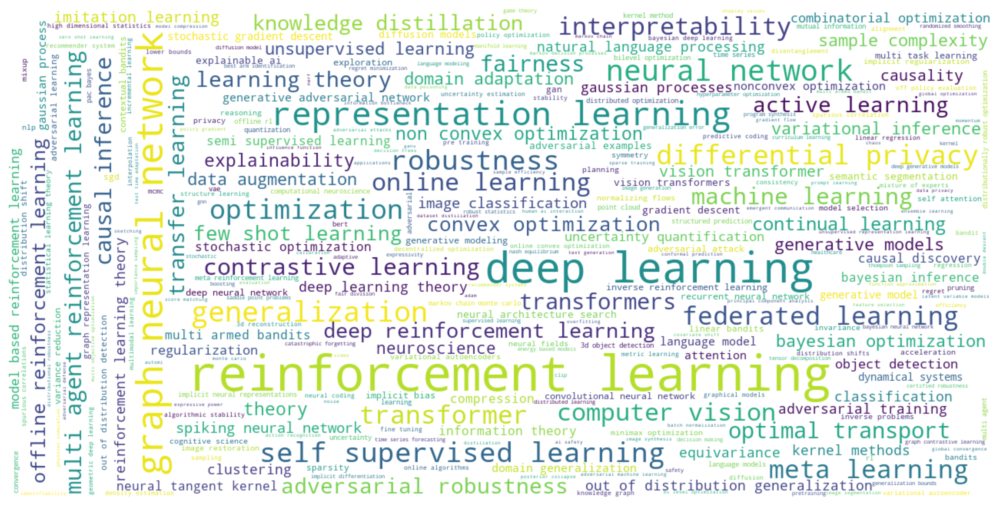
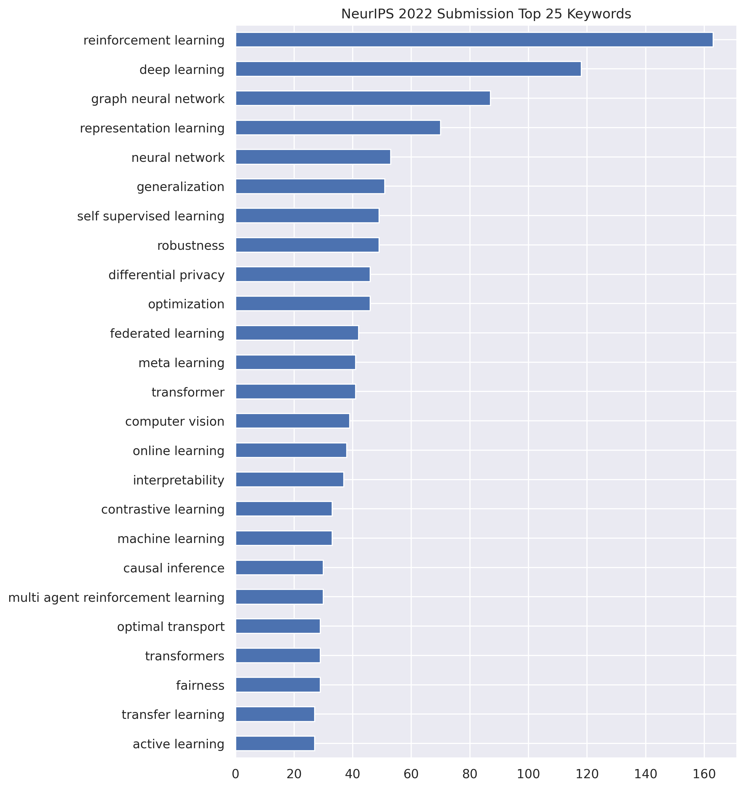
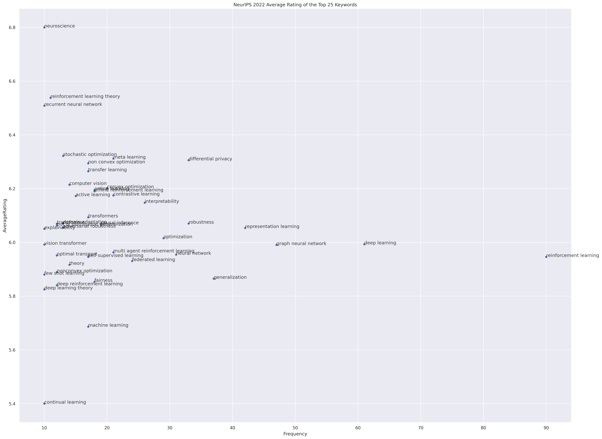
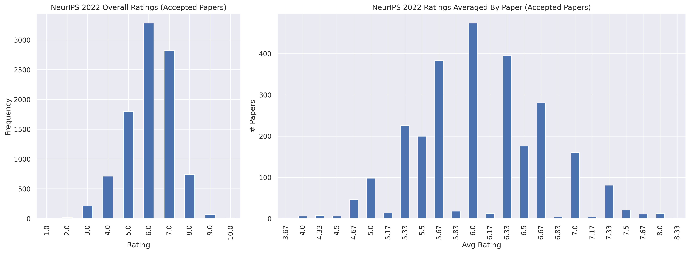
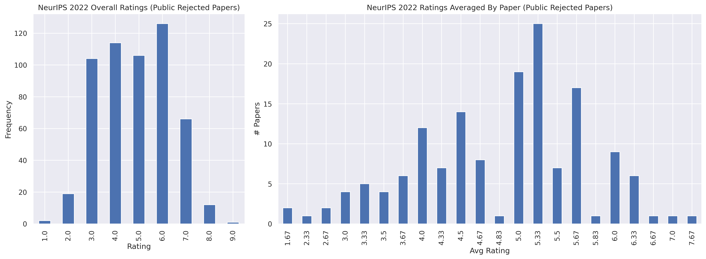

# Crawl and Visualize NeurIPS 2022 OpenReview Data
This data includes all accepted papers and the rejected papers that opted in for public release from NeurIPS 2022.

## NeurIPS Accepted Papers Statistics

| Mean | Std | Min | Max | 25th Pctl | Median | 75th Pctl |
|:-:|:-:|:-:|:-:|:-:|:-:|:-:|
| 6.07 |0.64 |3.67|8.25|5.67 | 6.0 | 6.5|

## Keywords
### Wordcloud

    

### Top 25 Keywords' ratings

    

### Top 25 Keywords' ratings vs. frequency

    

## Rating Distribution

### Accepted Papers' distribution

    

### Public Rejected Papers' distribution

    

## Top 10 Accepted Papers with Lowest Average Rating
|Title|Average|Ratings|
|--|--|--|
[Learning to Compare Nodes in Branch and Bound with Graph Neural Networks](https://openreview.net/forum?id=0VhrZPJXcTU)|3.67|5, 3, 3
[Root Cause Analysis of Failures in Microservices through Causal Discovery](https://openreview.net/forum?id=weoLjoYFvXY)|4.0|4, 4, 4
[Harmonizing the object recognition strategies of deep neural networks with humans](https://openreview.net/forum?id=ZYKWi6Ylfg)|4.0|7, 4, 3, 2
[Active Learning with Safety Constraints](https://openreview.net/forum?id=fdyxLGHE6bU)|4.0|5, 4, 3
[Proppo: a Message Passing Framework for Customizable and Composable Learning Algorithms](https://openreview.net/forum?id=uOJZ_zU9qZm)|4.0|7, 3, 2
[SIREN: Shaping Representations for Detecting Out-of-Distribution Objects](https://openreview.net/forum?id=8E8tgnYlmN)|4.0|5, 5, 2
[SemiFL: Semi-Supervised Federated Learning for Unlabeled Clients with Alternate Training](https://openreview.net/forum?id=1GAjC_FauE)|4.0|5, 5, 3, 3
[LST: Ladder Side-Tuning for Parameter and Memory Efficient Transfer Learning](https://openreview.net/forum?id=isPnnaTZaP5)|4.25|6, 4, 4, 3
[Stimulative Training of Residual Networks: A Social Psychology Perspective of Loafing](https://openreview.net/forum?id=NpeHeIkbfYU)|4.25|6, 4, 4, 3
[Phase Transition from Clean Training to Adversarial Training](https://openreview.net/forum?id=gwsnBjNcVEe)|4.25|6, 4, 4, 3

## Top 10 Public Rejected Papers with Highest Average Rating
|Title|Average|Ratings|
|--|--|--|
[Undersampling is a Minimax Optimal Robustness Intervention in Nonparametric Classification](https://openreview.net/forum?id=CT5KJGfX4s-)|7.67|8, 8, 7
[Ultra-marginal Feature Importance](https://openreview.net/forum?id=8ow4YReXH9j)|7.0|8, 7, 7, 6
[Prompt Learning with Optimal Transport for Vision-Language Models](https://openreview.net/forum?id=b9APFSTylGT)|6.67|7, 7, 6
[On the Word Boundaries of Emergent Languages Based on Harris's Articulation Scheme](https://openreview.net/forum?id=pOEN7dDC0d)|6.33|8, 6, 5
[Prompt Injection: Parameterization of Fixed Inputs](https://openreview.net/forum?id=FjqBs4XKe87)|6.33|7, 7, 5
[Estimating individual treatment effects under unobserved confounding using binary instruments](https://openreview.net/forum?id=BlF6CWzWKT7)|6.33|7, 6, 6
[Bilinear Exponential Family of MDPs: Frequentist Regret Bound with Tractable Exploration $\&$ Planning](https://openreview.net/forum?id=LT6-Mxgb3QB)|6.33|7, 6, 6
[Securing Secure Aggregation: Mitigating Multi-Round Privacy Leakage in Federated Learning](https://openreview.net/forum?id=nVV6S2sb_UL)|6.25|8, 7, 6, 4
[Bridging Implicit and Explicit Geometric Transformations for Single-Image View Synthesis](https://openreview.net/forum?id=x4JZ3xX5mtv)|6.25|7, 6, 6, 6
[Seeing Differently, Acting Similarly: Heterogeneously Observable Imitation Learning](https://openreview.net/forum?id=4WgqjmYacAf)|6.0|6, 6, 6

## NeurIPS Public Papers 
|Rank|Title|Average|Ratings|Decision|
|--|--|--|--|--|
1|[Holomorphic Equilibrium Propagation Computes Exact Gradients Through Finite Size Oscillations](https://openreview.net/forum?id=7JqqnRrZfz6)|8.25|9, 8, 8, 8|Accept
2|[Causal Identification under Markov equivalence: Calculus, Algorithm, and Completeness](https://openreview.net/forum?id=OxHn1Yz_Kl3)|8.0|9, 9, 7, 7|Accept
2|[Using natural language and program abstractions to instill human inductive biases in machines](https://openreview.net/forum?id=buXZ7nIqiwE)|8.0|8, 8, 8|Accept
2|[Video PreTraining (VPT): Learning to Act by Watching Unlabeled Online Videos](https://openreview.net/forum?id=AXDNM76T1nc)|8.0|9, 9, 8, 6|Accept
2|[Adversarially Robust Learning: A Generic Minimax Optimal Learner and Characterization](https://openreview.net/forum?id=03Qml_SaPqV)|8.0|9, 8, 7|Accept
2|[Uni[MASK]: Unified Inference in Sequential Decision Problems](https://openreview.net/forum?id=GisHNaleWiA)|8.0|9, 8, 7|Accept
2|[Is Out-of-Distribution Detection Learnable?](https://openreview.net/forum?id=sde_7ZzGXOE)|8.0|8, 8, 8, 8|Accept
2|[Universal Rates for Interactive Learning](https://openreview.net/forum?id=dTTKMy00PTJ)|8.0|9, 8, 7|Accept
2|[Structural Analysis of Branch-and-Cut and the Learnability of Gomory Mixed Integer Cuts](https://openreview.net/forum?id=e2gRdexoTZf)|8.0|8, 8, 8, 8|Accept
2|[Elucidating the Design Space of Diffusion-Based Generative Models](https://openreview.net/forum?id=k7FuTOWMOc7)|8.0|9, 8, 8, 7|Accept
2|[Uncoupled Learning Dynamics with $O(\log T)$ Swap Regret in Multiplayer Games](https://openreview.net/forum?id=CZwh1XdAhNv)|8.0|8, 8, 8|Accept
2|[Beyond neural scaling laws: beating power law scaling via data pruning](https://openreview.net/forum?id=UmvSlP-PyV)|8.0|9, 8, 8, 7|Accept
2|[Bayesian inference via sparse Hamiltonian flows](https://openreview.net/forum?id=B4OTsjq63T5)|8.0|9, 8, 7|Accept
2|[SIXO: Smoothing Inference with Twisted Objectives](https://openreview.net/forum?id=bDyLgfvZ0qJ)|8.0|8, 8, 8|Accept
15|[Sparse Probabilistic Circuits via Pruning and Growing](https://openreview.net/forum?id=KieCChVB6mN)|7.75|9, 8, 7, 7|Accept
15|[An empirical analysis of compute-optimal large language model training](https://openreview.net/forum?id=iBBcRUlOAPR)|7.75|8, 8, 8, 7|Accept
15|[Exploring the Whole Rashomon Set of Sparse Decision Trees](https://openreview.net/forum?id=WHqVVk3UHr)|7.75|9, 9, 7, 6|Accept
18|[Faster Linear Algebra for Distance Matrices](https://openreview.net/forum?id=y--ZUTfbNB)|7.67|8, 8, 7|Accept
18|[Robust Learning against Relational Adversaries](https://openreview.net/forum?id=WBp4dli3No6)|7.67|9, 8, 6|Accept
18|[Posterior Collapse of a Linear Latent Variable Model](https://openreview.net/forum?id=zAc2a6_0aHb)|7.67|8, 8, 7|Accept
18|[DPM-Solver: A Fast ODE Solver for Diffusion Probabilistic Model Sampling in Around 10 Steps](https://openreview.net/forum?id=2uAaGwlP_V)|7.67|8, 8, 7|Accept
18|[Experimental Design for Linear Functionals in Reproducing Kernel Hilbert Spaces](https://openreview.net/forum?id=V5hy17mwu3R)|7.67|8, 8, 7|Accept
18|[Decentralized Training of Foundation Models in Heterogeneous Environments](https://openreview.net/forum?id=UHoGOaGjEq)|7.67|8, 8, 7|Accept
18|[List-Decodable Sparse Mean Estimation via Difference-of-Pairs Filtering](https://openreview.net/forum?id=LJdUUOmWjX)|7.67|8, 8, 7|Accept
18|[The Minority Matters: A Diversity-Promoting Collaborative Metric Learning Algorithm](https://openreview.net/forum?id=xubxAVbOsw)|7.67|8, 8, 7|Accept
18|[Undersampling is a Minimax Optimal Robustness Intervention in Nonparametric Classification](https://openreview.net/forum?id=CT5KJGfX4s-)|7.67|8, 8, 7|Reject
27|[Riemannian Score-Based Generative Modelling](https://openreview.net/forum?id=oDRQGo8I7P)|7.5|9, 7, 7, 7|Accept
27|[Linear Label Ranking with Bounded Noise](https://openreview.net/forum?id=dgWo-UyVEsa)|7.5|8, 8, 7, 7|Accept
27|[The least-control principle for local learning at equilibrium](https://openreview.net/forum?id=ttQ_3CiZqd3)|7.5|8, 8, 8, 6|Accept
27|[Oracle-Efficient Online Learning for Smoothed Adversaries](https://openreview.net/forum?id=SbHxPRHPc2u)|7.5|9, 8, 7, 6|Accept
27|[Confident Adaptive Language Modeling](https://openreview.net/forum?id=uLYc4L3C81A)|7.5|8, 8, 7, 7|Accept
27|[Near-Optimal Private and Scalable $k$-Clustering](https://openreview.net/forum?id=9lQmaKMxIUD)|7.5|8, 8, 7, 7|Accept
27|[A gradient sampling method with complexity guarantees for Lipschitz functions in high and low dimensions](https://openreview.net/forum?id=slKVqAflN5)|7.5|9, 7, 7, 7|Accept
27|[Optimal Rates for Regularized Conditional Mean Embedding Learning](https://openreview.net/forum?id=KwwBBSzQgRX)|7.5|9, 7, 7, 7|Accept
27|[Robust Rent Division](https://openreview.net/forum?id=eRBVi61Vct1)|7.5|8, 8, 8, 6|Accept
27|[Agreement-on-the-line: Predicting the Performance of Neural Networks under Distribution Shift](https://openreview.net/forum?id=EZZsnke1kt)|7.5|8, 8, 7, 7|Accept
27|[projUNN: efficient method for training deep networks with unitary matrices](https://openreview.net/forum?id=nEJMdZd8cIi)|7.5|9, 8, 7, 6|Accept
27|[One Positive Label is Sufficient: Single-Positive Multi-Label Learning with Label Enhancement](https://openreview.net/forum?id=WrZZcwxMNhT)|7.5|8, 8, 8, 6|Accept
27|[Single-phase deep learning in cortico-cortical networks](https://openreview.net/forum?id=szt95rn-ql)|7.5|8, 8, 7, 7|Accept
27|[Model-Based Offline Reinforcement Learning with Pessimism-Modulated Dynamics Belief](https://openreview.net/forum?id=oDWyVsHBzNT)|7.5|8, 8, 7, 7|Accept
27|[Dynamic Inverse Reinforcement Learning for Characterizing Animal Behavior](https://openreview.net/forum?id=nosngu5XwY9)|7.5|10, 8, 6, 6|Accept
27|[Modeling Human Exploration Through Resource-Rational Reinforcement Learning](https://openreview.net/forum?id=W1MUJv5zaXP)|7.5|9, 7, 7, 7|Accept
27|[Non-identifiability and the Blessings of Misspecification in Models of Molecular Fitness](https://openreview.net/forum?id=CwG-o0ind6t)|7.5|9, 7, 7, 7|Accept
27|[On the difficulty of learning chaotic dynamics with RNNs](https://openreview.net/forum?id=-_AMpmyV0Ll)|7.5|9, 7, 7, 7|Accept
27|[Beyond Adult and COMPAS: Fair Multi-Class Prediction via Information Projection](https://openreview.net/forum?id=0e0es11XAIM)|7.5|8, 8, 7, 7|Accept
27|[Inception Transformer](https://openreview.net/forum?id=qf12cWVSksq)|7.5|8, 8, 7, 7|Accept
27|[QUARK: Controllable Text Generation with Reinforced Unlearning](https://openreview.net/forum?id=5HaIds3ux5O)|7.5|9, 8, 7, 6|Accept
48|[Online Minimax Multiobjective Optimization: Multicalibeating and Other Applications](https://openreview.net/forum?id=Epk1RQUpOj0)|7.33|9, 8, 5|Accept
48|[Precise Regret Bounds for Log-loss via a Truncated Bayesian Algorithm](https://openreview.net/forum?id=9s3CbJh4vRP)|7.33|8, 7, 7|Accept
48|[Towards Consistency in Adversarial Classification](https://openreview.net/forum?id=2_AZxVpFlGP)|7.33|9, 7, 6|Accept
48|[DGD^2: A Linearly Convergent Distributed Algorithm For High-dimensional Statistical Recovery](https://openreview.net/forum?id=QEODRZ7j3L_)|7.33|8, 7, 7|Accept
48|[Minimax Optimal Online Imitation Learning via Replay Estimation](https://openreview.net/forum?id=1mFfKXYMg5a)|7.33|8, 7, 7|Accept
48|[Efficient Phi-Regret Minimization in Extensive-Form Games via Online Mirror Descent](https://openreview.net/forum?id=xILbvAsHEV)|7.33|8, 7, 7|Accept
48|[Deep Model Reassembly](https://openreview.net/forum?id=gtCPWaY5bNh)|7.33|8, 8, 6|Accept
48|[Masked Autoencoding for Scalable and Generalizable Decision Making](https://openreview.net/forum?id=lNokkSaUbfV)|7.33|8, 7, 7|Accept
48|[The Franz-Parisi Criterion and Computational Trade-offs in High Dimensional Statistics](https://openreview.net/forum?id=mzze3bubjk)|7.33|8, 7, 7|Accept
48|[Exploring the Algorithm-Dependent Generalization of AUPRC Optimization with List Stability](https://openreview.net/forum?id=csr9uRmTC3f)|7.33|8, 7, 7|Accept
48|[Giving Feedback on Interactive Student Programs with Meta-Exploration](https://openreview.net/forum?id=_AsEqoBu3s)|7.33|8, 8, 6|Accept
48|[UViM: A Unified Modeling Approach for Vision with Learned Guiding Codes](https://openreview.net/forum?id=lxsL16YeE2w)|7.33|8, 7, 7|Accept
48|[Sharper Convergence Guarantees for Asynchronous SGD for Distributed and Federated Learning](https://openreview.net/forum?id=4_oCZgBIVI)|7.33|8, 7, 7|Accept
48|[Learning to Scaffold: Optimizing Model Explanations for Teaching](https://openreview.net/forum?id=V5rlSPsHpkf)|7.33|8, 8, 6|Accept
48|[Deep Compression of Pre-trained Transformer Models](https://openreview.net/forum?id=EZQnauHn-77)|7.33|8, 7, 7|Accept
48|[High-dimensional Asymptotics of Feature Learning: How One Gradient Step Improves the Representation](https://openreview.net/forum?id=akddwRG6EGi)|7.33|8, 7, 7|Accept
48|[Bi-directional Weakly Supervised Knowledge Distillation for Whole Slide Image Classification](https://openreview.net/forum?id=JoZyVgp1hm)|7.33|8, 8, 6|Accept
48|[Few-Shot Fast-Adaptive Anomaly Detection](https://openreview.net/forum?id=bAE1y8wG-ng)|7.33|8, 7, 7|Accept
48|[Operator Splitting Value Iteration](https://openreview.net/forum?id=VeXBywV9FV)|7.33|8, 7, 7|Accept
48|[VoiceBlock: Privacy through Real-Time Adversarial Attacks with Audio-to-Audio Models](https://openreview.net/forum?id=8gQEmEgWAkc)|7.33|8, 7, 7|Accept
48|[Masked Autoencoders As Spatiotemporal Learners](https://openreview.net/forum?id=UaXD4Al3mdb)|7.33|8, 7, 7|Accept
48|[Instance-Dependent Policy Learning for Linear MDPs via Online Experiment Design](https://openreview.net/forum?id=-76EsjcHnbj)|7.33|8, 8, 6|Accept
48|[ACIL: Analytic Class-Incremental Learning with Absolute Memorization and Privacy Protection](https://openreview.net/forum?id=Vc4QUfqr4do)|7.33|8, 7, 7|Accept
48|[Improved Imaging by Invex Regularizers with Global Optima Guarantees](https://openreview.net/forum?id=VpHFHz57fT)|7.33|8, 7, 7|Accept
48|[Contrastive Learning as Goal-Conditioned Reinforcement Learning](https://openreview.net/forum?id=vGQiU5sqUe3)|7.33|8, 7, 7|Accept
48|[Self-Consistent Dynamical Field Theory of Kernel Evolution in Wide Neural Networks](https://openreview.net/forum?id=sipwrPCrIS)|7.33|8, 7, 7|Accept
48|[High-dimensional limit theorems for SGD: Effective dynamics and critical scaling](https://openreview.net/forum?id=Q38D6xxrKHe)|7.33|8, 7, 7|Accept
48|[Data-Driven Conditional Robust Optimization](https://openreview.net/forum?id=rUb6iKYrgXQ)|7.33|8, 7, 7|Accept
48|[On the Identifiability of Nonlinear ICA: Sparsity and Beyond](https://openreview.net/forum?id=Wo1HF2wWNZb)|7.33|8, 7, 7|Accept
48|[A Theory of PAC Learnability under Transformation Invariances](https://openreview.net/forum?id=l1WlfNaRkKw)|7.33|8, 7, 7|Accept
48|[Hardness of Noise-Free Learning for Two-Hidden-Layer Neural Networks](https://openreview.net/forum?id=GzESlaXaN04)|7.33|8, 7, 7|Accept
48|[Redeeming intrinsic rewards via constrained policy optimization](https://openreview.net/forum?id=36Yz37cEN_Q)|7.33|8, 7, 7|Accept
48|[Thor: Wielding Hammers to Integrate Language Models and Automated Theorem Provers](https://openreview.net/forum?id=fUeOyt-2EOp)|7.33|8, 8, 6|Accept
48|[NeuForm: Adaptive Overfitting for Neural Shape Editing](https://openreview.net/forum?id=RnjDFZmGqli)|7.33|8, 7, 7|Accept
48|[Few-Shot Non-Parametric Learning with Deep Latent Variable Model](https://openreview.net/forum?id=24fiAU_9vT)|7.33|9, 7, 6|Accept
48|[Meta-Learning Dynamics Forecasting Using Task Inference](https://openreview.net/forum?id=BsSP7pZGFQO)|7.33|8, 7, 7|Accept
84|[Scalable Sensitivity and Uncertainty Analyses for Causal-Effect Estimates of Continuous-Valued Interventions](https://openreview.net/forum?id=PzI4ow094E)|7.25|8, 8, 7, 6|Accept
84|[Torsional Diffusion for Molecular Conformer Generation](https://openreview.net/forum?id=w6fj2r62r_H)|7.25|8, 7, 7, 7|Accept
84|[Characterizing Datapoints via Second-Split Forgetting](https://openreview.net/forum?id=yKDKNzjHg8N)|7.25|8, 8, 7, 6|Accept
84|[SPD domain-specific batch normalization to crack interpretable unsupervised domain adaptation in EEG](https://openreview.net/forum?id=pp7onaiM4VB)|7.25|8, 7, 7, 7|Accept
84|[Accelerated Primal-Dual Gradient Method for Smooth and Convex-Concave Saddle-Point Problems with Bilinear Coupling](https://openreview.net/forum?id=FncDhRcRYiN)|7.25|9, 7, 7, 6|Accept
84|[Joint Model-Policy Optimization of a Lower Bound for Model-Based RL](https://openreview.net/forum?id=LYfFj-Vk6lt)|7.25|8, 8, 7, 6|Accept
84|[Cryptographic Hardness of Learning Halfspaces with Massart Noise](https://openreview.net/forum?id=p-56bnzZhQ7)|7.25|8, 8, 7, 6|Accept
84|[On Robust Multiclass Learnability](https://openreview.net/forum?id=KCN0ZRqxcDm)|7.25|9, 8, 7, 5|Accept
84|[Test Time Adaptation via Conjugate Pseudo-labels](https://openreview.net/forum?id=2yvUYc-YNUH)|7.25|8, 7, 7, 7|Accept
84|[GENIE: Higher-Order Denoising Diffusion Solvers](https://openreview.net/forum?id=LKEYuYNOqx)|7.25|10, 7, 6, 6|Accept
84|[Learning Neural Acoustic Fields](https://openreview.net/forum?id=D21DRzkZbSB)|7.25|8, 8, 8, 5|Accept
84|[ZIN: When and How to Learn Invariance Without Environment Partition?](https://openreview.net/forum?id=pUPFRSxfACD)|7.25|8, 8, 7, 6|Accept
84|[Inference and Sampling for Archimax Copulas](https://openreview.net/forum?id=8cC2JeUyz9)|7.25|8, 7, 7, 7|Accept
84|[Sampling from Log-Concave Distributions with Infinity-Distance Guarantees](https://openreview.net/forum?id=nP6e73uxd1)|7.25|8, 7, 7, 7|Accept
84|[Attention-based Neural Cellular Automata](https://openreview.net/forum?id=9t24EBSlZOa)|7.25|8, 7, 7, 7|Accept
84|[The Neural Covariance SDE: Shaped Infinite Depth-and-Width Networks at Initialization](https://openreview.net/forum?id=WG3vmsteqR_)|7.25|8, 8, 7, 6|Accept
84|[VaiPhy: a Variational Inference Based Algorithm for Phylogeny](https://openreview.net/forum?id=TIXwBZB3Jl6)|7.25|8, 8, 7, 6|Accept
84|[Adaptively Exploiting d-Separators with Causal Bandits](https://openreview.net/forum?id=-e2SBzFDE8x)|7.25|8, 7, 7, 7|Accept
84|[Rethinking Variational Inference for Probabilistic Programs with Stochastic Support](https://openreview.net/forum?id=wjClgX-muzB)|7.25|8, 7, 7, 7|Accept
84|[DataMUX: Data Multiplexing for Neural Networks](https://openreview.net/forum?id=UdgtTVTdswg)|7.25|8, 7, 7, 7|Accept
84|[Efficient Sampling on Riemannian Manifolds via Langevin MCMC](https://openreview.net/forum?id=MRpRKU8haea)|7.25|8, 8, 7, 6|Accept
84|[NeMF: Neural Motion Fields for Kinematic Animation](https://openreview.net/forum?id=jwGa6cEUFRn)|7.25|8, 8, 7, 6|Accept
84|[Trajectory balance: Improved credit assignment in GFlowNets](https://openreview.net/forum?id=5btWTw1vcw1)|7.25|8, 7, 7, 7|Accept
84|[Rethinking Lipschitz Neural Networks and Certified Robustness: A Boolean Function Perspective](https://openreview.net/forum?id=xaWO6bAY0xM)|7.25|8, 8, 8, 5|Accept
84|[Exponential Separations in Symmetric Neural Networks](https://openreview.net/forum?id=jjlQkcHxkp0)|7.25|8, 7, 7, 7|Accept
84|[A Closer Look at Weakly-Supervised Audio-Visual Source Localization](https://openreview.net/forum?id=pn5trhFskOt)|7.25|8, 7, 7, 7|Accept
84|[Polynomial time guarantees for the Burer-Monteiro method](https://openreview.net/forum?id=lhLEGeBC-ru)|7.25|8, 7, 7, 7|Accept
84|[Deep Ensembles Work, But Are They Necessary?](https://openreview.net/forum?id=Wl1ZIgMqLlq)|7.25|8, 7, 7, 7|Accept
84|[Nearly Optimal Best-of-Both-Worlds Algorithms for Online Learning with Feedback Graphs](https://openreview.net/forum?id=rF6zwkyMABn)|7.25|8, 7, 7, 7|Accept
84|[Theseus: A Library for Differentiable Nonlinear Optimization](https://openreview.net/forum?id=K48UYo0glaJ)|7.25|8, 8, 7, 6|Accept
84|[Dataset Distillation using Neural Feature Regression](https://openreview.net/forum?id=2clwrA2tfik)|7.25|8, 7, 7, 7|Accept
84|[Fast Bayesian Coresets via Subsampling and Quasi-Newton Refinement](https://openreview.net/forum?id=M3WW7TqoMvc)|7.25|8, 7, 7, 7|Accept
84|[Learning Generalized Policy Automata for Relational Stochastic Shortest Path Problems](https://openreview.net/forum?id=ANkIj-WI2XA)|7.25|8, 7, 7, 7|Accept
84|[Nearly-Tight Bounds for Testing Histogram Distributions](https://openreview.net/forum?id=1X5zpwWoHwu)|7.25|8, 8, 7, 6|Accept
84|[Weakly-Supervised Multi-Granularity Map Learning for Vision-and-Language Navigation](https://openreview.net/forum?id=gyZMZBiI9Cw)|7.25|8, 7, 7, 7|Accept
84|[COLD Decoding: Energy-based Constrained Text Generation with Langevin Dynamics](https://openreview.net/forum?id=TiZYrQ-mPup)|7.25|8, 8, 7, 6|Accept
84|[Gradient Estimation with Discrete Stein Operators](https://openreview.net/forum?id=I1mkUkaguP)|7.25|8, 7, 7, 7|Accept
84|[Uncovering the Structural Fairness in Graph Contrastive Learning](https://openreview.net/forum?id=RJemsN3V_kt)|7.25|8, 7, 7, 7|Accept
84|[What Can Transformers Learn In-Context? A Case Study of Simple Function Classes](https://openreview.net/forum?id=flNZJ2eOet)|7.25|8, 8, 7, 6|Accept
84|[Label-Aware Global Consistency for Multi-Label Learning with Single Positive Labels](https://openreview.net/forum?id=o3HXEEBKnD)|7.25|8, 7, 7, 7|Accept
84|[Efficient and Near-Optimal Smoothed Online Learning for Generalized Linear Functions](https://openreview.net/forum?id=qYc8VnmUwbv)|7.25|8, 8, 7, 6|Accept
84|[New Definitions and Evaluations for Saliency Methods: Staying Intrinsic, Complete and Sound](https://openreview.net/forum?id=opw858PBJl6)|7.25|8, 8, 7, 6|Accept
84|[On-Demand Sampling: Learning Optimally from Multiple Distributions](https://openreview.net/forum?id=FR289LMkmxZ)|7.25|8, 7, 7, 7|Accept
84|[Finite-Time Last-Iterate Convergence for Learning in Multi-Player Games](https://openreview.net/forum?id=snUOkDdJypm)|7.25|8, 7, 7, 7|Accept
84|[Active Learning Polynomial Threshold Functions](https://openreview.net/forum?id=-uezmSLXVoE)|7.25|8, 8, 7, 6|Accept
129|[Convergence for score-based generative modeling with polynomial complexity](https://openreview.net/forum?id=dUSI4vFyMK)|7.2|9, 7, 7, 7, 6|Accept
129|[Your Transformer May Not be as Powerful as You Expect](https://openreview.net/forum?id=NQFFNdsOGD)|7.2|8, 8, 7, 7, 6|Accept
129|[FlashAttention: Fast and Memory-Efficient Exact Attention with IO-Awareness](https://openreview.net/forum?id=H4DqfPSibmx)|7.2|8, 8, 7, 7, 6|Accept
129|[Learning Neural Set Functions Under the Optimal Subset Oracle](https://openreview.net/forum?id=GXOC0zL0ZI)|7.2|8, 8, 7, 7, 6|Accept
133|[Multimodal Contrastive Learning with LIMoE: the Language-Image Mixture of Experts](https://openreview.net/forum?id=Qy1D9JyMBg0)|7.0|8, 7, 6|Accept
133|[Calibrated Data-Dependent Constraints with Exact Satisfaction Guarantees](https://openreview.net/forum?id=oWqWiazEb62)|7.0|7, 7, 7|Accept
133|[Local Spatiotemporal Representation Learning for Longitudinally-consistent Neuroimage Analysis](https://openreview.net/forum?id=1xqE9fRZch5)|7.0|7, 7, 7|Accept
133|[Reincarnating Reinforcement Learning: Reusing Prior Computation to Accelerate Progress](https://openreview.net/forum?id=t3X5yMI_4G2)|7.0|8, 7, 7, 6|Accept
133|[Identifiability of deep generative models without auxiliary information](https://openreview.net/forum?id=PGQrtAnF-h)|7.0|8, 7, 6|Accept
133|[DHRL: A Graph-Based Approach for Long-Horizon and Sparse Hierarchical Reinforcement Learning](https://openreview.net/forum?id=5JQqvQ1ujSv)|7.0|7, 7, 7, 7|Accept
133|[Quality Not Quantity: On the Interaction between Dataset Design and Robustness of CLIP](https://openreview.net/forum?id=LTCBavFWp5C)|7.0|8, 7, 6|Accept
133|[Non-Linear Coordination Graphs](https://openreview.net/forum?id=OcNoF7qA4t)|7.0|7, 7, 7, 7|Accept
133|[Amortized Proximal Optimization](https://openreview.net/forum?id=exDlhqs1Qr)|7.0|7, 7, 7|Accept
133|[Understanding Deep Contrastive Learning via Coordinate-wise Optimization](https://openreview.net/forum?id=LP0malvd4x)|7.0|8, 7, 6|Accept
133|[Mesoscopic modeling of hidden spiking neurons](https://openreview.net/forum?id=cYPja_wj9d)|7.0|8, 7, 7, 6|Accept
133|[DMAP: a Distributed Morphological Attention Policy for learning to locomote with a changing body](https://openreview.net/forum?id=uAIQymz0Qp)|7.0|7, 7, 7, 7|Accept
133|[Memorization Without Overfitting: Analyzing the Training Dynamics of Large Language Models](https://openreview.net/forum?id=u3vEuRr08MT)|7.0|8, 7, 7, 6|Accept
133|[Supervising the Multi-Fidelity Race of Hyperparameter Configurations](https://openreview.net/forum?id=0Fe7bAWmJr)|7.0|8, 7, 7, 6|Accept
133|[A Continuous Time Framework for Discrete Denoising Models](https://openreview.net/forum?id=DmT862YAieY)|7.0|7, 7, 7, 7|Accept
133|[Differentially Private Covariance Revisited](https://openreview.net/forum?id=ZVuzllOOHS)|7.0|8, 7, 7, 6|Accept
133|[Low-rank Optimal Transport: Approximation, Statistics and Debiasing](https://openreview.net/forum?id=4btNeXKFAQ)|7.0|7, 7, 7, 7|Accept
133|[Translation-equivariant Representation in Recurrent Networks with a Continuous Manifold of Attractors](https://openreview.net/forum?id=_vfyuJaXFug)|7.0|8, 7, 7, 6|Accept
133|[Trimmed Maximum Likelihood Estimation for Robust Generalized Linear Model](https://openreview.net/forum?id=VHmdFPy4U_u)|7.0|7, 7, 7|Accept
133|[Unsupervised Visual Representation Learning via Mutual Information Regularized Assignment](https://openreview.net/forum?id=W-xJXrDB8ik)|7.0|8, 7, 7, 6|Accept
133|[Foundation Posteriors for Approximate Probabilistic Inference](https://openreview.net/forum?id=DbEVhhuNjr)|7.0|8, 7, 7, 6|Accept
133|[Data Distributional Properties Drive Emergent In-Context Learning in Transformers](https://openreview.net/forum?id=lHj-q9BSRjF)|7.0|9, 8, 7, 4|Accept
133|[A Quadrature Rule combining Control Variates and Adaptive Importance Sampling](https://openreview.net/forum?id=M_WuaKoaEfQ)|7.0|7, 7, 7|Accept
133|[Learning Symmetric Rules with SATNet](https://openreview.net/forum?id=OQtY993Y4TV)|7.0|8, 7, 6|Accept
133|[Outlier Suppression: Pushing the Limit of Low-bit Transformer Language Models](https://openreview.net/forum?id=yW5zeRSFdZ)|7.0|7, 7, 7|Accept
133|[Gold-standard solutions to the Schrödinger equation using deep learning: How much physics do we need?](https://openreview.net/forum?id=nX-gReQ0OT)|7.0|7, 7, 7, 7|Accept
133|[Understanding and Extending Subgraph GNNs by Rethinking Their Symmetries](https://openreview.net/forum?id=sc7bBHAmcN)|7.0|7, 7, 7, 7|Accept
133|[Skills Regularized Task Decomposition for Multi-task Offline Reinforcement Learning](https://openreview.net/forum?id=uuaMrewU9Kk)|7.0|7, 7, 7|Accept
133|[On the inability of Gaussian process regression to optimally learn compositional functions](https://openreview.net/forum?id=fhO6vCGuuag)|7.0|7, 7, 7|Accept
133|[Characterizing the Ventral Visual Stream with Response-Optimized Neural Encoding Models](https://openreview.net/forum?id=IU3nj1tqwyY)|7.0|7, 7, 7|Accept
133|[Implications of Model Indeterminacy for Explanations of Automated Decisions](https://openreview.net/forum?id=LzbrVf-l0Xq)|7.0|8, 7, 6|Accept
133|[Hierarchical Lattice Layer for Partially Monotone Neural Networks](https://openreview.net/forum?id=zAuiZpZ478l)|7.0|7, 7, 7|Accept
133|[Practical Adversarial Multivalid Conformal Prediction](https://openreview.net/forum?id=QNjyrDBx6tz)|7.0|7, 7, 7|Accept
133|[Exploiting the Relationship Between Kendall's Rank Correlation and Cosine Similarity for Attribution Protection](https://openreview.net/forum?id=QPg5TTAdizy)|7.0|7, 7, 7|Accept
133|[Finding and Listing Front-door Adjustment Sets](https://openreview.net/forum?id=b8fgqTCBJe)|7.0|8, 7, 7, 6|Accept
133|[Diffusion-LM Improves Controllable Text Generation](https://openreview.net/forum?id=3s9IrEsjLyk)|7.0|8, 7, 7, 6|Accept
133|[🏘️ ProcTHOR: Large-Scale Embodied AI Using Procedural Generation](https://openreview.net/forum?id=4-bV1bi74M)|7.0|9, 8, 4|Accept
133|[When are Offline Two-Player Zero-Sum Markov Games Solvable?](https://openreview.net/forum?id=S-Vig7pTRXq)|7.0|8, 7, 7, 6|Accept
133|[Lower Bounds and Nearly Optimal Algorithms in Distributed Learning with Communication Compression](https://openreview.net/forum?id=Xm9iN3UsdpH)|7.0|8, 7, 6|Accept
133|[Left Heavy Tails and the Effectiveness of the Policy and Value Networks in DNN-based best-first search for Sokoban Planning](https://openreview.net/forum?id=b6to5kfFhQh)|7.0|8, 8, 7, 5|Accept
133|[Faster Deep Reinforcement Learning with Slower Online Network](https://openreview.net/forum?id=Cl9dcH6Xkcj)|7.0|8, 7, 6|Accept
133|[Template based Graph Neural Network with Optimal Transport Distances](https://openreview.net/forum?id=seYcx6CqPe)|7.0|8, 7, 6|Accept
133|[Active Bayesian Causal Inference](https://openreview.net/forum?id=r0bjBULkyz)|7.0|9, 7, 6, 6|Accept
133|[Invertible Monotone Operators for Normalizing Flows](https://openreview.net/forum?id=USoYIT4IQz)|7.0|7, 7, 7, 7|Accept
133|[Offline Goal-Conditioned Reinforcement Learning via $f$-Advantage Regression](https://openreview.net/forum?id=_h29VprPHD)|7.0|8, 8, 7, 5|Accept
133|[Shield Decentralization for Safe Multi-Agent Reinforcement Learning](https://openreview.net/forum?id=JO9o3DgV9l2)|7.0|8, 8, 5|Accept
133|[Minimax-Optimal Multi-Agent RL in Markov Games With a Generative Model](https://openreview.net/forum?id=W8nyVJruVg)|7.0|7, 7, 7|Accept
133|[Asymptotic Behaviors of Projected Stochastic Approximation: A Jump Diffusion Perspective](https://openreview.net/forum?id=wo-a8Ji6s3A)|7.0|8, 7, 6|Accept
133|[Training Spiking Neural Networks with Local Tandem Learning](https://openreview.net/forum?id=nC8VC8gVGPo)|7.0|8, 8, 6, 6|Accept
133|[Automatic differentiation of nonsmooth iterative algorithms](https://openreview.net/forum?id=WUMH5xloWn)|7.0|7, 7, 7, 7|Accept
133|[Additive MIL: Intrinsically Interpretable Multiple Instance Learning for Pathology](https://openreview.net/forum?id=5dHQyEcYDgA)|7.0|8, 7, 6|Accept
133|[Faster and Scalable Algorithms for Densest Subgraph and Decomposition](https://openreview.net/forum?id=QMrs1nggaL)|7.0|7, 7, 7, 7|Accept
133|[VTC-LFC: Vision Transformer Compression with Low-Frequency Components](https://openreview.net/forum?id=HuiLIB6EaOk)|7.0|7, 7, 7|Accept
133|[Policy Gradient With Serial Markov Chain Reasoning](https://openreview.net/forum?id=5VHK0q6Oo4M)|7.0|8, 7, 7, 6|Accept
133|[Rapidly Mixing Multiple-try Metropolis Algorithms for Model Selection Problems](https://openreview.net/forum?id=APQY2WZFZkd)|7.0|7, 7, 7|Accept
133|[Learning (Very) Simple Generative Models Is Hard](https://openreview.net/forum?id=UnygcA2BVzW)|7.0|8, 7, 7, 6|Accept
133|[Efficient Methods for Non-stationary Online Learning](https://openreview.net/forum?id=5Ap96waLr8A)|7.0|8, 7, 7, 6|Accept
133|[Continuous MDP Homomorphisms and Homomorphic Policy Gradient](https://openreview.net/forum?id=Adl-fs-8OzL)|7.0|7, 7, 7|Accept
133|[Rate-Optimal Online Convex Optimization in Adaptive Linear Control](https://openreview.net/forum?id=Zh21fp1B0vv)|7.0|7, 7, 7, 7|Accept
133|[Neural Sheaf Diffusion: A Topological Perspective on Heterophily and Oversmoothing in GNNs](https://openreview.net/forum?id=vbPsD-BhOZ)|7.0|9, 7, 6, 6|Accept
133|[Subquadratic Kronecker Regression with Applications to Tensor Decomposition](https://openreview.net/forum?id=lbQTJN42uea)|7.0|7, 7, 7, 7|Accept
133|[Private Isotonic Regression](https://openreview.net/forum?id=jOYdlD4oYrn)|7.0|7, 7, 7, 7|Accept
133|[Real-Valued Backpropagation is Unsuitable for Complex-Valued Neural Networks](https://openreview.net/forum?id=Jd2RfKd4Mjz)|7.0|8, 8, 5|Accept
133|[Global Convergence of Direct Policy Search for State-Feedback $\mathcal{H}_\infty$ Robust Control: A Revisit of Nonsmooth Synthesis with Goldstein Subdifferential](https://openreview.net/forum?id=NtwEUZE6VcL)|7.0|7, 7, 7, 7|Accept
133|[Learning and Covering Sums of Independent Random Variables with Unbounded Support](https://openreview.net/forum?id=2Bus7sfjZh8)|7.0|8, 7, 6|Accept
133|[Stability Analysis and Generalization Bounds of Adversarial Training](https://openreview.net/forum?id=78aj7sPX4s-)|7.0|7, 7, 7, 7|Accept
133|[Ordered Subgraph Aggregation Networks](https://openreview.net/forum?id=w0QoqmUT9vJ)|7.0|7, 7, 7, 7|Accept
133|[Lottery Tickets on a Data Diet: Finding Initializations with Sparse Trainable Networks](https://openreview.net/forum?id=QLPzCpu756J)|7.0|9, 7, 6, 6|Accept
133|[Moment Distributionally Robust Tree Structured Prediction](https://openreview.net/forum?id=Tq2XqINV1Jz)|7.0|7, 7, 7|Accept
133|[Minimax Regret for Cascading Bandits](https://openreview.net/forum?id=EgMbj9yWrMI)|7.0|8, 7, 7, 6|Accept
133|[Blessing of Depth in Linear Regression: Deeper Models Have Flatter Landscape Around the True Solution](https://openreview.net/forum?id=YODI3TcLX)|7.0|9, 8, 7, 6, 5|Accept
133|[CyCLIP: Cyclic Contrastive Language-Image Pretraining](https://openreview.net/forum?id=I-6yh2-dkyD)|7.0|7, 7, 7|Accept
133|[Diverse Weight Averaging for Out-of-Distribution Generalization](https://openreview.net/forum?id=tq_J_MqB3UB)|7.0|8, 7, 7, 6|Accept
133|[Optimal Weak to Strong Learning](https://openreview.net/forum?id=6OLBVpoxrbW)|7.0|8, 7, 6|Accept
133|[Chain of Thought Prompting Elicits Reasoning in Large Language Models](https://openreview.net/forum?id=_VjQlMeSB_J)|7.0|9, 6, 6|Accept
133|[Increasing the Scope as You Learn: Adaptive Bayesian Optimization in Nested Subspaces](https://openreview.net/forum?id=e4Wf6112DI)|7.0|7, 7, 7|Accept
133|[Asymptotics of smoothed Wasserstein distances in the small noise regime](https://openreview.net/forum?id=z2cG3k8xa3C)|7.0|7, 7, 7, 7|Accept
133|[Adaptive Multi-stage Density Ratio Estimation for Learning Latent Space Energy-based Model](https://openreview.net/forum?id=kS5KG3mpSY)|7.0|7, 7, 7|Accept
133|[Active Exploration for Inverse Reinforcement Learning](https://openreview.net/forum?id=TPOJzwv2pc)|7.0|7, 7, 7, 7|Accept
133|[The First Optimal Algorithm for Smooth and Strongly-Convex-Strongly-Concave Minimax Optimization](https://openreview.net/forum?id=pD5Pl5hen_g)|7.0|7, 7, 7, 7|Accept
133|[Emergent Communication: Generalization and Overfitting in Lewis Games](https://openreview.net/forum?id=qqHMvHbfu6)|7.0|8, 8, 5|Accept
133|[Optimal and Adaptive Monteiro-Svaiter Acceleration](https://openreview.net/forum?id=n3lr7GdcbyD)|7.0|8, 8, 7, 5|Accept
133|[Optimal Query Complexities for Dynamic Trace Estimation](https://openreview.net/forum?id=1wz-ksUupt2)|7.0|7, 7, 7|Accept
133|[Public Wisdom Matters! Discourse-Aware Hyperbolic Fourier Co-Attention for Social Text Classification](https://openreview.net/forum?id=xbhsFMxORxV)|7.0|8, 7, 7, 6|Accept
133|[Disentangling the Predictive Variance of Deep Ensembles through the Neural Tangent Kernel](https://openreview.net/forum?id=dbigt69sBqe)|7.0|7, 7, 7, 7, 7|Accept
133|[Scalable Representation Learning in Linear Contextual Bandits with Constant Regret Guarantees](https://openreview.net/forum?id=6Nh0D44tRAz)|7.0|7, 7, 7|Accept
133|[A permutation-free kernel two-sample test](https://openreview.net/forum?id=PbKa0yApPq5)|7.0|7, 7, 7, 7|Accept
133|[A Boosting Approach to Reinforcement Learning](https://openreview.net/forum?id=GNHyNOR8Sn)|7.0|8, 6|Accept
133|[Understanding Hyperdimensional Computing for Parallel Single-Pass Learning](https://openreview.net/forum?id=8ON84BdnSn)|7.0|7, 7, 7, 7|Accept
133|[Curious Exploration via Structured World Models Yields Zero-Shot Object Manipulation](https://openreview.net/forum?id=NnuYZ1el24C)|7.0|8, 7, 6|Accept
133|[Bellman Residual Orthogonalization for Offline Reinforcement Learning](https://openreview.net/forum?id=x26Mpsf45P3)|7.0|8, 7, 7, 6|Accept
133|[A Single-timescale Analysis for Stochastic Approximation with Multiple Coupled Sequences](https://openreview.net/forum?id=fDDTJakJKR7)|7.0|8, 8, 6, 6|Accept
133|[NaturalProver: Grounded Mathematical Proof Generation with Language Models](https://openreview.net/forum?id=rhdfTOiXBng)|7.0|7, 7, 7|Accept
133|[Data-Efficient Pipeline for Offline Reinforcement Learning with Limited Data](https://openreview.net/forum?id=klElp42K9U0)|7.0|8, 7, 7, 7, 6|Accept
133|[Diversity vs. Recognizability: Human-like generalization in one-shot generative models](https://openreview.net/forum?id=DVfZKXSFW5m)|7.0|8, 7, 6|Accept
133|[Globally Gated Deep Linear Networks](https://openreview.net/forum?id=hqRwcqzegr7)|7.0|7, 7, 7|Accept
133|[Concentration of Data Encoding in Parameterized Quantum Circuits](https://openreview.net/forum?id=XlIUm7Obm6)|7.0|7, 7, 7|Accept
133|[Pre-Trained Language Models for Interactive Decision-Making](https://openreview.net/forum?id=FWMQYjFso-a)|7.0|7, 7, 7|Accept
133|[MACE: Higher Order Equivariant Message Passing Neural Networks for Fast and Accurate Force Fields](https://openreview.net/forum?id=YPpSngE-ZU)|7.0|8, 7, 6|Accept
133|[Predictive Querying for Autoregressive Neural Sequence Models](https://openreview.net/forum?id=mhe2C2VWwCW)|7.0|8, 7, 6|Accept
133|[Learning in Observable POMDPs, without Computationally Intractable Oracles](https://openreview.net/forum?id=A3DCaxhxBfl)|7.0|7, 7, 7|Accept
133|[No-regret learning in games with noisy feedback: Faster rates and adaptivity via learning rate separation](https://openreview.net/forum?id=dpYhDYjl4O)|7.0|8, 7, 7, 6|Accept
133|[Reproducibility in Optimization: Theoretical Framework and Limits](https://openreview.net/forum?id=3LMI8CHDb0g)|7.0|8, 7, 6|Accept
133|[DP-PCA: Statistically Optimal and Differentially Private PCA](https://openreview.net/forum?id=rZalM6vZ2J)|7.0|7, 7, 7, 7|Accept
133|[Markovian Interference in Experiments](https://openreview.net/forum?id=AOSIbSmQJr)|7.0|8, 7, 7, 6|Accept
133|[A Solver-free Framework for Scalable Learning in Neural ILP Architectures](https://openreview.net/forum?id=EqZuN4V_FLF)|7.0|7, 7, 7|Accept
133|[Controllable Text Generation with Neurally-Decomposed Oracle](https://openreview.net/forum?id=yI7i9yc3Upr)|7.0|7, 7, 7|Accept
133|[ConfounderGAN: Protecting Image Data Privacy with Causal Confounder](https://openreview.net/forum?id=XxmOKCt8dO9)|7.0|8, 7, 6|Accept
133|[On the Effective Number of Linear Regions in Shallow Univariate ReLU Networks: Convergence Guarantees and Implicit Bias](https://openreview.net/forum?id=F8UV5CItyRG)|7.0|8, 8, 7, 5|Accept
133|[Embed and Emulate: Learning to estimate parameters of dynamical systems with uncertainty quantification](https://openreview.net/forum?id=6scShPCpdDu)|7.0|8, 7, 6|Accept
133|[Two-Stream Network for Sign Language Recognition and Translation](https://openreview.net/forum?id=hSxK-4KGLbI)|7.0|9, 7, 5|Accept
133|[Risk-Driven Design of Perception Systems](https://openreview.net/forum?id=kI_kL5vq6Oa)|7.0|9, 6, 6|Accept
133|[Variational Model Perturbation for Source-Free Domain Adaptation](https://openreview.net/forum?id=yTJze_xm-u6)|7.0|8, 7, 7, 6|Accept
133|[Follow-the-Perturbed-Leader for Adversarial Markov Decision Processes with Bandit Feedback](https://openreview.net/forum?id=25XwID3wKsi)|7.0|8, 7, 7, 6|Accept
133|[Zeroth-Order Hard-Thresholding: Gradient Error vs. Expansivity](https://openreview.net/forum?id=2ZNPedOfwB)|7.0|8, 7, 6|Accept
133|[Learning single-index models with shallow neural networks](https://openreview.net/forum?id=wt7cd9m2cz2)|7.0|8, 7, 7, 7, 6|Accept
133|[Iso-Dream: Isolating Noncontrollable Visual Dynamics in World Models](https://openreview.net/forum?id=6LBfSduVg0N)|7.0|7, 7, 7|Accept
133|[A Unified Analysis of Federated Learning with Arbitrary Client Participation](https://openreview.net/forum?id=qSs7C7c4G8D)|7.0|7, 7, 7|Accept
133|[TVLT: Textless Vision-Language Transformer](https://openreview.net/forum?id=2DZ9R7GXLY)|7.0|8, 7, 6|Accept
133|[Learning from a Sample in Online Algorithms](https://openreview.net/forum?id=KMaI40_UaGw)|7.0|7, 7, 7|Accept
133|[Semi-Discrete Normalizing Flows through Differentiable Tessellation](https://openreview.net/forum?id=NMTSIY6ykw7)|7.0|8, 8, 7, 5|Accept
133|[Performative Power](https://openreview.net/forum?id=NqDXfe2oC_1)|7.0|8, 7, 6|Accept
133|[Local Bayesian optimization via maximizing probability of descent](https://openreview.net/forum?id=YRDXX4IIA9)|7.0|8, 7, 7, 6|Accept
133|[TransTab: Learning Transferable Tabular Transformers Across Tables](https://openreview.net/forum?id=A1yGs_SWiIi)|7.0|7, 7, 7|Accept
133|[Implicit Warping for Animation with Image Sets](https://openreview.net/forum?id=TrsAkAbC96)|7.0|7, 7, 7|Accept
133|[SCONE: Surface Coverage Optimization in Unknown Environments by Volumetric Integration](https://openreview.net/forum?id=foNVYPnQbhk)|7.0|8, 7, 6|Accept
133|[GET3D: A Generative Model of High Quality 3D Textured Shapes Learned from Images](https://openreview.net/forum?id=GAUwreODU5L)|7.0|8, 7, 7, 6|Accept
133|[Turbocharging Solution Concepts: Solving NEs, CEs and CCEs with Neural Equilibrium Solvers](https://openreview.net/forum?id=RczPtvlaXPH)|7.0|8, 7, 6|Accept
133|[Reinforcement Learning with a Terminator](https://openreview.net/forum?id=bIlUqzwObX)|7.0|7, 7, 7|Accept
133|[Exploring Length Generalization in Large Language Models](https://openreview.net/forum?id=zSkYVeX7bC4)|7.0|7, 7, 7, 7|Accept
133|[Q-ViT: Accurate and Fully Quantized Low-bit Vision Transformer](https://openreview.net/forum?id=fU-m9kQe0ke)|7.0|8, 7, 7, 6|Accept
133|[Hybrid Neural Autoencoders for Stimulus Encoding in Visual and Other Sensory Neuroprostheses](https://openreview.net/forum?id=9xVWIHFSyfl)|7.0|7, 7, 7|Accept
133|[Robust Model Selection and Nearly-Proper Learning for GMMs](https://openreview.net/forum?id=JCbLxJ1E6SO)|7.0|8, 8, 7, 5|Accept
133|[Linear tree shap](https://openreview.net/forum?id=OzbkiUo24g)|7.0|7, 7, 7, 7, 7|Accept
133|[A Policy-Guided Imitation Approach for Offline Reinforcement Learning](https://openreview.net/forum?id=CKbqDtZnSc)|7.0|8, 7, 7, 6|Accept
133|[CATER: Intellectual Property Protection on Text Generation APIs via Conditional Watermarks](https://openreview.net/forum?id=L7P3IvsoUXY)|7.0|8, 8, 6, 6|Accept
133|[Neural Set Function Extensions: Learning with Discrete Functions in High Dimensions](https://openreview.net/forum?id=39XK7VJ0sKG)|7.0|8, 6|Accept
133|[Muffliato: Peer-to-Peer Privacy Amplification for Decentralized Optimization and Averaging](https://openreview.net/forum?id=QotmVXC-8T)|7.0|7, 7, 7, 7|Accept
133|[On Margins and Generalisation for Voting Classifiers](https://openreview.net/forum?id=xvLWypz8p8)|7.0|7, 7, 7|Accept
133|[Variational inference via Wasserstein gradient flows](https://openreview.net/forum?id=K2PTuvVTF1L)|7.0|8, 7, 6|Accept
133|[Multi-Game Decision Transformers](https://openreview.net/forum?id=0gouO5saq6K)|7.0|8, 7, 7, 6|Accept
133|[Cross Aggregation Transformer for Image Restoration](https://openreview.net/forum?id=wQ2QNNP8GtM)|7.0|8, 8, 8, 4|Accept
133|[Scaling & Shifting Your Features: A New Baseline for Efficient Model Tuning](https://openreview.net/forum?id=XtyeppctGgc)|7.0|7, 7, 7, 7|Accept
133|[Statistical, Robustness, and Computational Guarantees for Sliced Wasserstein Distances](https://openreview.net/forum?id=lArVAWWpY3)|7.0|7, 7, 7, 7|Accept
133|[Unpacking Reward Shaping: Understanding the Benefits of Reward Engineering on Sample Complexity](https://openreview.net/forum?id=D-X3kH-BkpN)|7.0|8, 8, 7, 5|Accept
133|[On Learning and Refutation in Noninteractive Local Differential Privacy](https://openreview.net/forum?id=w-Aq4vmnTOP)|7.0|8, 7, 7, 6|Accept
133|[A framework for bilevel optimization that enables stochastic and global variance reduction algorithms](https://openreview.net/forum?id=wlEOsQ917F)|7.0|8, 7, 6|Accept
133|[Operative dimensions in unconstrained connectivity of recurrent neural networks](https://openreview.net/forum?id=xOK40an4ag1)|7.0|8, 7, 7, 6|Accept
133|[Structural Kernel Search via Bayesian Optimization and Symbolical Optimal Transport](https://openreview.net/forum?id=-bLLVk-WRPy)|7.0|7, 7, 7, 7|Accept
133|[Multi-Scale Adaptive Network for Single Image Denoising](https://openreview.net/forum?id=HFm7AxNa9Wo)|7.0|7, 7, 7, 7, 7|Accept
133|[Self-Supervised Contrastive Pre-Training For Time Series via Time-Frequency Consistency](https://openreview.net/forum?id=OJ4mMfGKLN)|7.0|8, 8, 6, 6|Accept
133|[S4ND: Modeling Images and Videos as Multidimensional Signals with State Spaces](https://openreview.net/forum?id=5WuQNQwy56M)|7.0|8, 7, 7, 6|Accept
133|[OpenAUC: Towards AUC-Oriented Open-Set Recognition](https://openreview.net/forum?id=Ddd6FqHXmHA)|7.0|9, 6, 6|Accept
133|[Efficient and Modular Implicit Differentiation](https://openreview.net/forum?id=Q-HOv_zn6G)|7.0|9, 6, 6|Accept
133|[Concept Activation Regions: A Generalized Framework For Concept-Based Explanations](https://openreview.net/forum?id=8AB7AXaLIX5)|7.0|7, 7, 7|Accept
133|[Ultra-marginal Feature Importance](https://openreview.net/forum?id=8ow4YReXH9j)|7.0|8, 7, 7, 6|Reject
133|[Hilbert Distillation for Cross-Dimensionality Networks](https://openreview.net/forum?id=kZnGYt-3f_X)|7.0|8, 7, 7, 6|Accept
133|[When Does Differentially Private Learning Not Suffer in High Dimensions?](https://openreview.net/forum?id=FR--mkQu0dw)|7.0|8, 7, 6|Accept
133|[Singular Value Fine-tuning: Few-shot Segmentation requires Few-parameters Fine-tuning](https://openreview.net/forum?id=LEqYZz7cZOI)|7.0|8, 7, 7, 6|Accept
133|[Task Discovery: Finding the Tasks that Neural Networks Generalize on](https://openreview.net/forum?id=hw-n6BUmiyI)|7.0|8, 7, 7, 6|Accept
133|[Maximizing and Satisficing in Multi-armed Bandits with Graph Information](https://openreview.net/forum?id=KQYodS0W0j)|7.0|7, 7|Accept
294|[Monte Carlo Tree Search based Variable Selection for High Dimensional Bayesian Optimization](https://openreview.net/forum?id=SUzPos_pUC)|6.8|8, 7, 7, 6, 6|Accept
294|[Flamingo: a Visual Language Model for Few-Shot Learning](https://openreview.net/forum?id=EbMuimAbPbs)|6.8|8, 8, 8, 7, 3|Accept
294|[Imbalance Trouble: Revisiting Neural-Collapse Geometry](https://openreview.net/forum?id=utahaTbcHdP)|6.8|8, 7, 7, 6, 6|Accept
294|[Globally Convergent Policy Search for Output Estimation](https://openreview.net/forum?id=WuJfPCoj7pT)|6.8|7, 7, 7, 7, 6|Accept
298|[Neural Surface Reconstruction of Dynamic Scenes with Monocular RGB-D Camera](https://openreview.net/forum?id=8RKJj1YDBJT)|6.75|7, 7, 7, 6|Accept
298|[Semantic Probabilistic Layers for Neuro-Symbolic Learning](https://openreview.net/forum?id=o-mxIWAY1T8)|6.75|8, 7, 7, 5|Accept
298|[The Pitfalls of Regularization in Off-Policy TD Learning](https://openreview.net/forum?id=vK53GLZJes8)|6.75|7, 7, 7, 6|Accept
298|[Error Correction Code Transformer](https://openreview.net/forum?id=4F0Pd2Wjl0)|6.75|7, 7, 7, 6|Accept
298|[K-LITE: Learning Transferable Visual Models with External Knowledge](https://openreview.net/forum?id=gERv_uy69IA)|6.75|7, 7, 7, 6|Accept
298|[Spectral Bias Outside the Training Set for Deep Networks in the Kernel Regime](https://openreview.net/forum?id=a01PL2gb7W5)|6.75|8, 7, 6, 6|Accept
298|[Near-Optimal Correlation Clustering with Privacy](https://openreview.net/forum?id=wQVjGP5NbP9)|6.75|7, 7, 7, 6|Accept
298|[A Conditional Randomization Test for Sparse Logistic Regression in High-Dimension](https://openreview.net/forum?id=HxZpawUrv9Q)|6.75|7, 7, 7, 6|Accept
298|[MinVIS: A Minimal Video Instance Segmentation Framework without Video-based Training](https://openreview.net/forum?id=Ho_zIH4LA90)|6.75|8, 7, 7, 5|Accept
298|[Fair Ranking with Noisy Protected Attributes](https://openreview.net/forum?id=mTra5BIUyRV)|6.75|8, 7, 6, 6|Accept
298|[Biological Learning of Irreducible Representations of Commuting Transformations](https://openreview.net/forum?id=48TmED6BvGZ)|6.75|8, 7, 6, 6|Accept
298|[Towards Safe Reinforcement Learning with a Safety Editor Policy](https://openreview.net/forum?id=U1m_93ansV)|6.75|7, 7, 7, 6|Accept
298|[Model-based RL with Optimistic Posterior Sampling: Structural Conditions and Sample Complexity](https://openreview.net/forum?id=bEMrmaw8gOB)|6.75|7, 7, 7, 6|Accept
298|[Pitfalls of Epistemic Uncertainty Quantification through Loss Minimisation](https://openreview.net/forum?id=epjxT_ARZW5)|6.75|7, 7, 7, 6|Accept
298|[Maximum Class Separation as Inductive Bias in One Matrix](https://openreview.net/forum?id=MbVS6BuJ3ql)|6.75|8, 7, 7, 5|Accept
298|[Paraphrasing Is All You Need for Novel Object Captioning](https://openreview.net/forum?id=0zHXmOXwkIf)|6.75|7, 7, 7, 6|Accept
298|[Combinatorial Bandits with Linear Constraints: Beyond Knapsacks and Fairness](https://openreview.net/forum?id=F5TbbyTgbC)|6.75|8, 7, 6, 6|Accept
298|[A Unified Analysis of Mixed Sample Data Augmentation: A Loss Function Perspective](https://openreview.net/forum?id=SLdfxFdIFeN)|6.75|8, 7, 7, 5|Accept
298|[Provably expressive temporal graph networks](https://openreview.net/forum?id=MwSXgQSxL5s)|6.75|8, 7, 7, 5|Accept
298|[Graphein - a Python Library for Geometric Deep Learning and Network Analysis on Biomolecular Structures and Interaction Networks](https://openreview.net/forum?id=9xRZlV6GfOX)|6.75|8, 7, 6, 6|Accept
298|[Distinguishing Learning Rules with Brain Machine Interfaces](https://openreview.net/forum?id=UDmPRm-P1nL)|6.75|7, 7, 7, 6|Accept
298|[Fine-Tuning Pre-Trained Language Models Effectively by Optimizing Subnetworks Adaptively](https://openreview.net/forum?id=-r6-WNKfyhW)|6.75|7, 7, 7, 6|Accept
298|[Generalizing Consistent Multi-Class Classification with Rejection to be Compatible with Arbitrary Losses](https://openreview.net/forum?id=DwHIcEyias)|6.75|7, 7, 7, 6|Accept
298|[Multi-layer State Evolution Under Random Convolutional Design](https://openreview.net/forum?id=DTD9BRDWtkn)|6.75|7, 7, 7, 6|Accept
298|[On Batch Teaching with Sample Complexity Bounded by VCD](https://openreview.net/forum?id=wKf5dRSartn)|6.75|8, 7, 7, 5|Accept
298|[Video Diffusion Models](https://openreview.net/forum?id=f3zNgKga_ep)|6.75|9, 7, 6, 5|Accept
298|[A Spectral Approach to Item Response Theory](https://openreview.net/forum?id=1ItkxrZP0rg)|6.75|8, 7, 6, 6|Accept
298|[Learn to Match with No Regret: Reinforcement Learning in Markov Matching Markets](https://openreview.net/forum?id=R3JMyR4MvoU)|6.75|8, 7, 6, 6|Accept
298|[Asymptotically Unbiased Instance-wise Regularized Partial AUC Optimization: Theory and Algorithm](https://openreview.net/forum?id=er4GR0wHWQO)|6.75|8, 8, 6, 5|Accept
298|[Gradient flow dynamics of shallow ReLU networks for square loss and orthogonal inputs](https://openreview.net/forum?id=L74c-iUxQ1I)|6.75|7, 7, 7, 6|Accept
298|[Training and Inference on Any-Order Autoregressive Models the Right Way](https://openreview.net/forum?id=VMU-hMsonit)|6.75|8, 7, 6, 6|Accept
298|[VITA: Video Instance Segmentation via Object Token Association](https://openreview.net/forum?id=xnuN2vGmZA0)|6.75|7, 7, 7, 6|Accept
298|[Perfect Sampling from Pairwise Comparisons](https://openreview.net/forum?id=7fdVZR_cl7)|6.75|8, 8, 7, 4|Accept
298|[Where to Pay Attention in Sparse Training for Feature Selection?](https://openreview.net/forum?id=xWvI9z37Xd)|6.75|8, 7, 6, 6|Accept
298|[Temporally-Consistent Survival Analysis](https://openreview.net/forum?id=r-CsquKaHvk)|6.75|7, 7, 7, 6|Accept
298|[Anonymous Bandits for Multi-User Systems](https://openreview.net/forum?id=00jwOr7UA4P)|6.75|7, 7, 7, 6|Accept
298|[Parameter-Efficient Masking Networks](https://openreview.net/forum?id=7rcuQ_V2GFg)|6.75|8, 7, 6, 6|Accept
298|[Adversarial Training with Complementary Labels: On the Benefit of Gradually Informative Attacks](https://openreview.net/forum?id=s7SukMH7ie9)|6.75|8, 7, 6, 6|Accept
298|[STaR: Bootstrapping Reasoning With Reasoning](https://openreview.net/forum?id=_3ELRdg2sgI)|6.75|7, 7, 7, 6|Accept
298|[Learning to Generate Inversion-Resistant Model Explanations](https://openreview.net/forum?id=iy2G-yLGuku)|6.75|8, 7, 6, 6|Accept
298|[Distributionally Robust Optimization with Data Geometry](https://openreview.net/forum?id=caH1x1ZBLDR)|6.75|8, 7, 7, 5|Accept
298|[Where do Models go Wrong? Parameter-Space Saliency Maps for Explainability](https://openreview.net/forum?id=Nf_XI3uVGaZ)|6.75|9, 7, 6, 5|Accept
298|[BYOL-Explore: Exploration by Bootstrapped Prediction](https://openreview.net/forum?id=qHGCH75usg)|6.75|7, 7, 7, 6|Accept
298|[Efficient Adversarial Training without Attacking: Worst-Case-Aware Robust Reinforcement Learning](https://openreview.net/forum?id=y-E1htoQl-n)|6.75|7, 7, 7, 6|Accept
298|[Effective Backdoor Defense by Exploiting Sensitivity of Poisoned Samples](https://openreview.net/forum?id=AsH-Tx2U0Ug)|6.75|8, 7, 7, 5|Accept
298|[FedAvg with Fine Tuning: Local Updates Lead to Representation Learning](https://openreview.net/forum?id=G3fswMh9P8y)|6.75|7, 7, 7, 6|Accept
298|[A Differentially Private Linear-Time fPTAS for the Minimum Enclosing Ball Problem](https://openreview.net/forum?id=KAIyxWrP9-)|6.75|7, 7, 7, 6|Accept
298|[Motion Transformer with Global Intention Localization and Local Movement Refinement](https://openreview.net/forum?id=9t-j3xDm7_Q)|6.75|8, 7, 7, 5|Accept
298|[Cache-Augmented Inbatch Importance Resampling for Training Recommender Retriever](https://openreview.net/forum?id=vt516zga8m)|6.75|8, 7, 6, 6|Accept
298|[Tight Mutual Information Estimation With Contrastive Fenchel-Legendre Optimization](https://openreview.net/forum?id=M-seILmeISn)|6.75|8, 8, 6, 5|Accept
298|[DAGMA: Learning DAGs via M-matrices and a Log-Determinant Acyclicity Characterization](https://openreview.net/forum?id=8rZYMpFUgK)|6.75|8, 7, 7, 5|Accept
298|[Multi-agent Dynamic Algorithm Configuration](https://openreview.net/forum?id=h3jZCLjhtmV)|6.75|8, 8, 6, 5|Accept
298|[On Uncertainty, Tempering, and Data Augmentation in Bayesian Classification](https://openreview.net/forum?id=pBJe5yu41Pq)|6.75|7, 7, 7, 6|Accept
298|[Exact learning dynamics of deep linear networks with prior knowledge](https://openreview.net/forum?id=lJx2vng-KiC)|6.75|7, 7, 7, 6|Accept
298|[Discovering Design Concepts for CAD Sketches](https://openreview.net/forum?id=R7qthqYx3V1)|6.75|8, 7, 6, 6|Accept
298|[No Free Lunch from Deep Learning in Neuroscience: A Case Study through Models of the Entorhinal-Hippocampal Circuit](https://openreview.net/forum?id=syU-XvinTI1)|6.75|8, 7, 6, 6|Accept
298|[Reconstruction on Trees and Low-Degree Polynomials](https://openreview.net/forum?id=h1IHI5sV4UQ)|6.75|8, 7, 7, 5|Accept
298|[Increasing Confidence in Adversarial Robustness Evaluations](https://openreview.net/forum?id=NkK4i91VWp)|6.75|8, 7, 6, 6|Accept
298|[Toward Equation of Motion for Deep Neural Networks: Continuous-time Gradient Descent and Discretization Error Analysis](https://openreview.net/forum?id=qq84D17BPu)|6.75|8, 7, 6, 6|Accept
298|[Zero-shot Transfer Learning within a Heterogeneous Graph via Knowledge Transfer Networks](https://openreview.net/forum?id=u8FDFtoMKp2)|6.75|8, 7, 6, 6|Accept
298|[MoCoDA: Model-based Counterfactual Data Augmentation](https://openreview.net/forum?id=w6tBOjPCrIO)|6.75|7, 7, 7, 6|Accept
298|[PlasticityNet: Learning to Simulate Metal, Sand, and Snow for Optimization Time Integration](https://openreview.net/forum?id=_WqHmwoE7Ud)|6.75|8, 7, 6, 6|Accept
298|[Incrementality Bidding via Reinforcement Learning under Mixed and Delayed Rewards](https://openreview.net/forum?id=Haj8_Rwqq_H)|6.75|7, 7, 7, 6|Accept
298|[Mean Estimation with User-level Privacy under Data Heterogeneity](https://openreview.net/forum?id=dYhB_alLyCO)|6.75|7, 7, 7, 6|Accept
298|[Few-Shot Audio-Visual Learning of Environment Acoustics](https://openreview.net/forum?id=PIXGY1WgU-S)|6.75|8, 8, 6, 5|Accept
298|[Biologically-Plausible Determinant Maximization Neural Networks for Blind Separation of Correlated Sources](https://openreview.net/forum?id=espX_4CLr46)|6.75|8, 7, 6, 6|Accept
298|[FasterRisk: Fast and Accurate Interpretable Risk Scores](https://openreview.net/forum?id=xTYL1J6Xt-z)|6.75|7, 7, 7, 6|Accept
298|[Mixture-of-Experts with Expert Choice Routing](https://openreview.net/forum?id=jdJo1HIVinI)|6.75|7, 7, 7, 6|Accept
298|[Scalable Distributional Robustness in a Class of Non-Convex Optimization with Guarantees](https://openreview.net/forum?id=62GLWUoOLb5)|6.75|7, 7, 7, 6|Accept
298|[A Variational Edge Partition Model for Supervised Graph Representation Learning](https://openreview.net/forum?id=PfStAhJ2t1g)|6.75|7, 7, 7, 6|Accept
298|[Pessimism for Offline Linear Contextual Bandits using $\ell_p$ Confidence Sets](https://openreview.net/forum?id=jcIIVkbCaHO)|6.75|8, 7, 6, 6|Accept
298|[A contrastive rule for meta-learning](https://openreview.net/forum?id=NIJFp_n4MXt)|6.75|8, 7, 6, 6|Accept
298|[Out-of-Distribution Detection with An Adaptive Likelihood Ratio on Informative Hierarchical VAE](https://openreview.net/forum?id=vMQ1V_z0TxU)|6.75|7, 7, 7, 6|Accept
298|[Autoregressive Search Engines: Generating Substrings as Document Identifiers](https://openreview.net/forum?id=Z4kZxAjg8Y)|6.75|8, 7, 6, 6|Accept
298|[You Never Stop Dancing: Non-freezing Dance Generation via Bank-constrained Manifold Projection](https://openreview.net/forum?id=88ubVLwWvGD)|6.75|8, 7, 6, 6|Accept
298|[Mirror Descent with Relative Smoothness in Measure Spaces, with application to Sinkhorn and EM](https://openreview.net/forum?id=kCU2pUrmMih)|6.75|9, 6, 6, 6|Accept
298|[Vision GNN: An Image is Worth Graph of Nodes](https://openreview.net/forum?id=htM1WJZVB2I)|6.75|8, 8, 7, 4|Accept
298|[Polynomial Neural Fields for Subband Decomposition and Manipulation](https://openreview.net/forum?id=juE5ErmZB61)|6.75|8, 7, 7, 5|Accept
298|[Rethinking Alignment in Video Super-Resolution Transformers](https://openreview.net/forum?id=NgIf3FpcHie)|6.75|8, 7, 6, 6|Accept
298|[Is a Modular Architecture Enough?](https://openreview.net/forum?id=3-3XMModtrx)|6.75|8, 7, 6, 6|Accept
298|[Statistically Meaningful Approximation: a Case Study on Approximating Turing Machines with Transformers](https://openreview.net/forum?id=VOyYhoN_yg)|6.75|7, 7, 7, 6|Accept
298|[Coresets for Relational Data and The Applications](https://openreview.net/forum?id=tPiE70y40cv)|6.75|7, 7, 7, 6|Accept
298|[Compositional generalization through abstract representations in human and artificial neural networks](https://openreview.net/forum?id=177GzUAds8U)|6.75|7, 7, 7, 6|Accept
298|[Learning Options via Compression](https://openreview.net/forum?id=D4fuQ1MveDM)|6.75|7, 7, 7, 6|Accept
298|[On Convergence of FedProx: Local Dissimilarity Invariant Bounds, Non-smoothness and Beyond](https://openreview.net/forum?id=_33ynl9VgCX)|6.75|9, 6, 6, 6|Accept
298|[Posterior Matching for Arbitrary Conditioning](https://openreview.net/forum?id=EFnI8Qc--jE)|6.75|8, 7, 6, 6|Accept
298|[Sample-Efficient Learning of Correlated Equilibria in Extensive-Form Games](https://openreview.net/forum?id=SYdg8tcFgdG)|6.75|7, 7, 7, 6|Accept
298|[Behavior Transformers: Cloning $k$ modes with one stone](https://openreview.net/forum?id=agTr-vRQsa)|6.75|8, 7, 6, 6|Accept
298|[A Near-Optimal Best-of-Both-Worlds Algorithm for Online Learning with Feedback Graphs](https://openreview.net/forum?id=pbILUUf_hBN)|6.75|7, 7, 7, 6|Accept
298|[Boosting Out-of-distribution Detection with Typical Features](https://openreview.net/forum?id=4maAiUt0A4)|6.75|7, 7, 7, 6|Accept
298|[Beyond Rewards: a Hierarchical Perspective on Offline Multiagent Behavioral Analysis](https://openreview.net/forum?id=SiQAZV0yEny)|6.75|7, 7, 7, 6|Accept
298|[Improving Multi-Task Generalization via Regularizing Spurious Correlation](https://openreview.net/forum?id=HLzjd09oRx)|6.75|7, 7, 7, 6|Accept
298|[Controlled Sparsity via Constrained Optimization or: How I Learned to Stop Tuning Penalties and Love Constraints](https://openreview.net/forum?id=XUvSYc6TqDF)|6.75|8, 7, 7, 5|Accept
298|[DENSE: Data-Free One-Shot Federated Learning](https://openreview.net/forum?id=QFQoxCFYEkA)|6.75|8, 8, 7, 4|Accept
298|[Online Bipartite Matching with Advice: Tight Robustness-Consistency Tradeoffs for the Two-Stage Model](https://openreview.net/forum?id=GeT7TSy1_hL)|6.75|7, 7, 7, 6|Accept
298|[Data-Efficient Structured Pruning via Submodular Optimization](https://openreview.net/forum?id=K2QGzyLwpYG)|6.75|8, 7, 6, 6|Accept
298|[End-to-end Algorithm Synthesis with Recurrent Networks: Extrapolation without Overthinking](https://openreview.net/forum?id=PPjSKy40XUB)|6.75|7, 7, 7, 6|Accept
298|[Symmetry-induced Disentanglement on Graphs](https://openreview.net/forum?id=4tM0P_4N8D9)|6.75|8, 8, 6, 5|Accept
298|[Sequential Information Design: Learning to Persuade in the Dark](https://openreview.net/forum?id=CflSnSkH--)|6.75|7, 7, 7, 6|Accept
298|[Implicit Neural Representations with Levels-of-Experts](https://openreview.net/forum?id=St5q10aqLTO)|6.75|8, 7, 7, 5|Accept
298|[Towards Efficient 3D Object Detection with Knowledge Distillation](https://openreview.net/forum?id=1tnVNogPUz9)|6.75|8, 7, 6, 6|Accept
298|[Efficient coding, channel capacity, and the emergence of retinal mosaics](https://openreview.net/forum?id=oUigTwc7Cw5)|6.75|8, 8, 7, 4|Accept
298|[Single-pass Streaming Lower Bounds for Multi-armed Bandits Exploration with Instance-sensitive Sample Complexity](https://openreview.net/forum?id=xqYGGRt7kM)|6.75|8, 7, 6, 6|Accept
298|[Computationally Efficient Horizon-Free Reinforcement Learning for Linear Mixture MDPs](https://openreview.net/forum?id=H4GmqyYMxFP)|6.75|8, 7, 7, 5|Accept
298|[Leveraging the Hints: Adaptive Bidding in Repeated First-Price Auctions](https://openreview.net/forum?id=hjqTeP05OMB)|6.75|7, 7, 7, 6|Accept
298|[Randomized Message-Interception Smoothing: Gray-box Certificates for Graph Neural Networks](https://openreview.net/forum?id=t0VbBTw-o8)|6.75|8, 7, 6, 6|Accept
298|[Whitening Convergence Rate of Coupling-based Normalizing Flows](https://openreview.net/forum?id=TN4UpY_Qzo)|6.75|7, 7, 7, 6|Accept
298|[Robust Semi-Supervised Learning when Not All Classes have Labels](https://openreview.net/forum?id=lDohSFOHr0)|6.75|8, 8, 7, 4|Accept
298|[Efficient and Stable Fully Dynamic Facility Location](https://openreview.net/forum?id=aqALH2UAwQH)|6.75|7, 7, 7, 6|Accept
298|[Phase transitions in when feedback is useful](https://openreview.net/forum?id=hTCZbhKaDJz)|6.75|8, 7, 7, 5|Accept
298|[On Learning Fairness and Accuracy on Multiple Subgroups](https://openreview.net/forum?id=YsRH6uVcx2l)|6.75|8, 7, 7, 5|Accept
298|[Sketch-GNN: Scalable Graph Neural Networks with Sublinear Training Complexity](https://openreview.net/forum?id=4PJbcrW_7wC)|6.75|7, 7, 7, 6|Accept
410|[Antigen-Specific Antibody Design and Optimization with Diffusion-Based Generative Models for Protein Structures](https://openreview.net/forum?id=jSorGn2Tjg)|6.67|7, 7, 6|Accept
410|[A Damped Newton Method Achieves Global $\mathcal O \left(\frac{1}{k^2}\right)$ and Local Quadratic Convergence Rate](https://openreview.net/forum?id=rjDziEPQLQs)|6.67|8, 6, 6|Accept
410|[Improving Neural Ordinary Differential Equations with Nesterov's Accelerated Gradient Method](https://openreview.net/forum?id=-OfK_B9Q5hI)|6.67|7, 7, 6|Accept
410|[Do Current Multi-Task Optimization Methods in Deep Learning Even Help?](https://openreview.net/forum?id=A2Ya5aLtyuG)|6.67|7, 7, 6|Accept
410|[On Feature Learning in the Presence of Spurious Correlations](https://openreview.net/forum?id=wKhUPzqVap6)|6.67|7, 7, 6|Accept
410|[Multi-view Subspace Clustering on Topological Manifold](https://openreview.net/forum?id=ECQ-O1q0saD)|6.67|8, 7, 5|Accept
410|[Variance Reduced ProxSkip: Algorithm, Theory and Application to Federated Learning](https://openreview.net/forum?id=edkno3SvKo)|6.67|7, 7, 6|Accept
410|[Autoinverse: Uncertainty Aware Inversion of Neural Networks](https://openreview.net/forum?id=dNyCj1AbOb)|6.67|7, 7, 6|Accept
410|[Action-modulated midbrain dopamine activity arises from distributed control policies](https://openreview.net/forum?id=2gZccSOY04p)|6.67|9, 6, 5|Accept
410|[ZARTS: On Zero-order Optimization for Neural Architecture Search](https://openreview.net/forum?id=QzFJmwwBMd)|6.67|8, 7, 5|Accept
410|[Improving Transformer with an Admixture of Attention Heads](https://openreview.net/forum?id=0VFQhPGF1M3)|6.67|7, 7, 6|Accept
410|[LasUIE: Unifying Information Extraction with Latent Adaptive Structure-aware Generative Language Model](https://openreview.net/forum?id=a8qX5RG36jd)|6.67|7, 7, 6|Accept
410|[Convolutional Neural Networks on Graphs with Chebyshev Approximation, Revisited](https://openreview.net/forum?id=jxPJ4QA0KAb)|6.67|8, 6, 6|Accept
410|[Randomized Sketches for Clustering: Fast and Optimal Kernel $k$-Means](https://openreview.net/forum?id=BCnZSP-Ryyp)|6.67|9, 6, 5|Accept
410|[Scalable Infomin Learning](https://openreview.net/forum?id=Ojakr9ofova)|6.67|7, 7, 6|Accept
410|[Equivariant Graph Hierarchy-Based Neural Networks](https://openreview.net/forum?id=ywxtmG1nU_6)|6.67|7, 7, 6|Accept
410|[Differentially Private Generalized Linear Models Revisited](https://openreview.net/forum?id=agihaAKJ89X)|6.67|7, 7, 6|Accept
410|[Sustainable Online Reinforcement Learning for Auto-bidding](https://openreview.net/forum?id=zyrBT58h_J)|6.67|7, 7, 6|Accept
410|[Learning to Branch with Tree MDPs](https://openreview.net/forum?id=M4OllVd70mJ)|6.67|8, 6, 6|Accept
410|[Generalization Analysis on Learning with a Concurrent Verifier](https://openreview.net/forum?id=dFs4d0kqs2)|6.67|7, 7, 6|Accept
410|[Guaranteed Conservation of Momentum for Learning Particle-based Fluid Dynamics](https://openreview.net/forum?id=6niwHlzh10U)|6.67|7, 7, 6|Accept
410|[Untargeted Backdoor Watermark: Towards Harmless and Stealthy Dataset Copyright Protection](https://openreview.net/forum?id=kcQiIrvA_nz)|6.67|8, 7, 5|Accept
410|[Deconfounded Representation Similarity for Comparison of Neural Networks](https://openreview.net/forum?id=mMdRZipvld2)|6.67|7, 7, 6|Accept
410|[Low-Rank Modular Reinforcement Learning via Muscle Synergy](https://openreview.net/forum?id=zYc5FSxL6ar)|6.67|7, 7, 6|Accept
410|[Log-Concave and Multivariate Canonical Noise Distributions for Differential Privacy](https://openreview.net/forum?id=q-snd9xOG3b)|6.67|7, 7, 6|Accept
410|[The computational and learning benefits of Daleian neural networks](https://openreview.net/forum?id=ckQvYXizgd1)|6.67|8, 6, 6|Accept
410|[Structured Energy Network As a Loss](https://openreview.net/forum?id=F0DowhX7_x)|6.67|7, 7, 6|Accept
410|[Aligning individual brains with fused unbalanced Gromov Wasserstein](https://openreview.net/forum?id=vy7B8z0-4D)|6.67|7, 7, 6|Accept
410|[Promising or Elusive? Unsupervised Object Segmentation from Real-world Single Images](https://openreview.net/forum?id=DzPWTwfby5d)|6.67|7, 7, 6|Accept
410|[Cross-Linked Unified Embedding for cross-modality representation learning](https://openreview.net/forum?id=Tfb73TeKnJ-)|6.67|8, 7, 5|Accept
410|[Approximation with CNNs in Sobolev Space: with Applications to Classification](https://openreview.net/forum?id=ofRmFwBvvXh)|6.67|9, 7, 4|Accept
410|[Optimal Scaling for Locally Balanced Proposals in Discrete Spaces](https://openreview.net/forum?id=MZmv_B1DM3)|6.67|8, 6, 6|Accept
410|[Geodesic Graph Neural Network for Efficient Graph Representation Learning](https://openreview.net/forum?id=6pC5OtP7eBx)|6.67|7, 7, 6|Accept
410|[Learning Multi-resolution Functional Maps with Spectral Attention for Robust Shape Matching](https://openreview.net/forum?id=2EwEWrNADpT)|6.67|7, 7, 6|Accept
410|[Logical Activation Functions: Logit-space equivalents of Probabilistic Boolean Operators](https://openreview.net/forum?id=m6HNNpQO8dc)|6.67|7, 7, 6|Accept
410|[Scalable design of Error-Correcting Output Codes using Discrete Optimization with Graph Coloring](https://openreview.net/forum?id=WaKGmSI2-8g)|6.67|8, 6, 6|Accept
410|[So3krates: Equivariant attention for interactions on arbitrary length-scales in molecular systems](https://openreview.net/forum?id=tlUnxtAmcJq)|6.67|7, 7, 6|Accept
410|[Stability and Generalization of Kernel Clustering: from Single Kernel to Multiple Kernel](https://openreview.net/forum?id=QYD9bDWR3R_)|6.67|7, 7, 6|Accept
410|[Adapting to Online Label Shift with Provable Guarantees](https://openreview.net/forum?id=dC_Cho7PzT)|6.67|9, 6, 5|Accept
410|[On the Symmetries of Deep Learning Models and their Internal Representations](https://openreview.net/forum?id=8qugS9JqAxD)|6.67|7, 7, 6|Accept
410|[Recurrent Video Restoration Transformer with Guided Deformable Attention](https://openreview.net/forum?id=GKfNB4BegL)|6.67|8, 6, 6|Accept
410|[Natural Color Fool: Towards Boosting Black-box Unrestricted Attacks](https://openreview.net/forum?id=-T5seeOMnM5)|6.67|7, 7, 6|Accept
410|[End-to-End Learning to Index and Search in Large Output Spaces](https://openreview.net/forum?id=RF5Lb6NaZp)|6.67|7, 7, 6|Accept
410|[Flexible Neural Image Compression via Code Editing](https://openreview.net/forum?id=uV_VYGB3FCi)|6.67|8, 6, 6|Accept
410|[Private Set Generation with Discriminative Information](https://openreview.net/forum?id=mxnxRw8jiru)|6.67|7, 7, 6|Accept
410|[Provably tuning the ElasticNet across instances](https://openreview.net/forum?id=ZMFQtvVJr40)|6.67|8, 7, 5|Accept
410|[Energy-Based Contrastive Learning of Visual Representations](https://openreview.net/forum?id=GwwC16ECrM5)|6.67|7, 7, 6|Accept
410|[Two-layer neural network on infinite dimensional data: global optimization guarantee in the mean-field regime](https://openreview.net/forum?id=Hr8475tQGKE)|6.67|9, 6, 5|Accept
410|[On Reinforcement Learning and Distribution Matching for Fine-Tuning Language Models with no Catastrophic Forgetting](https://openreview.net/forum?id=XvI6h-s4un)|6.67|7, 7, 6|Accept
410|[Dual-Curriculum Contrastive Multi-Instance Learning for Cancer Prognosis Analysis with Whole Slide Images](https://openreview.net/forum?id=dsxuTEf01d5)|6.67|7, 7, 6|Accept
410|[Reinforcement Learning with Automated Auxiliary Loss Search](https://openreview.net/forum?id=_3XVbh6L2c)|6.67|8, 7, 5|Accept
410|[Non-Stationary Bandits under Recharging Payoffs: Improved Planning with Sublinear Regret](https://openreview.net/forum?id=4JYq_Kw4zw)|6.67|7, 7, 6|Accept
410|[Is Sortition Both Representative and Fair?](https://openreview.net/forum?id=l7aekTjF6CO)|6.67|8, 7, 5|Accept
410|[On the Complexity of Adversarial Decision Making](https://openreview.net/forum?id=pgBpQYss2ba)|6.67|7, 7, 6|Accept
410|[Fault-Aware Neural Code Rankers](https://openreview.net/forum?id=LtJMqnbslJe)|6.67|7, 7, 6|Accept
410|[Causal Discovery in Linear Latent Variable Models Subject to Measurement Error](https://openreview.net/forum?id=w0O3F4cTNfG)|6.67|7, 7, 6|Accept
410|[Off-Policy Evaluation for Episodic Partially Observable Markov Decision Processes under Non-Parametric Models](https://openreview.net/forum?id=Lz2N6UqRYqB)|6.67|7, 7, 6|Accept
410|[Prompt Learning with Optimal Transport for Vision-Language Models](https://openreview.net/forum?id=b9APFSTylGT)|6.67|7, 7, 6|Reject
410|[Few-shot Relational Reasoning via Connection Subgraph Pretraining](https://openreview.net/forum?id=LvW71lgly25)|6.67|7, 7, 6|Accept
410|[FourierNets enable the design of highly non-local optical encoders for computational imaging](https://openreview.net/forum?id=Kx1VCs1treH)|6.67|7, 7, 6|Accept
410|[TotalSelfScan: Learning Full-body Avatars from Self-Portrait Videos of Faces, Hands, and Bodies](https://openreview.net/forum?id=lgj33-O1Ely)|6.67|7, 7, 6|Accept
410|[Near-Optimal Goal-Oriented Reinforcement Learning in Non-Stationary Environments](https://openreview.net/forum?id=VgST3vrBAo8)|6.67|7, 7, 6|Accept
410|[Fairness in Federated Learning via Core-Stability](https://openreview.net/forum?id=lKULHf7oFDo)|6.67|7, 7, 6|Accept
410|[Near-Optimal Collaborative Learning in Bandits](https://openreview.net/forum?id=2xfJ26BuFP)|6.67|7, 7, 6|Accept
410|[Local Latent Space Bayesian Optimization over Structured Inputs](https://openreview.net/forum?id=nZRTRevUO-)|6.67|7, 7, 6|Accept
410|[Regret Bounds for Multilabel Classification in Sparse Label Regimes](https://openreview.net/forum?id=mamv07NQWk)|6.67|8, 7, 5|Accept
410|[The Curse of Unrolling: Rate of Differentiating Through Optimization](https://openreview.net/forum?id=b57KM4ydqpp)|6.67|8, 6, 6|Accept
410|[OTKGE: Multi-modal Knowledge Graph Embeddings via Optimal Transport](https://openreview.net/forum?id=gbXqMdxsZIP)|6.67|7, 7, 6|Accept
410|[Adversarial training for high-stakes reliability](https://openreview.net/forum?id=NtJyGXo0nF)|6.67|9, 6, 5|Accept
410|[Policy Optimization with Linear Temporal Logic Constraints](https://openreview.net/forum?id=yZcPRIZEwOG)|6.67|7, 7, 6|Accept
410|[Distinguishing discrete and continuous behavioral variability using warped autoregressive HMMs](https://openreview.net/forum?id=6Kj1wCgiUp_)|6.67|7, 7, 6|Accept
410|[A Fourier Approach to Mixture Learning](https://openreview.net/forum?id=thirVlDJ2IL)|6.67|7, 7, 6|Accept
410|[Phase diagram of Stochastic Gradient Descent in high-dimensional two-layer neural networks](https://openreview.net/forum?id=GL-3WEdNRM)|6.67|7, 7, 7, 7, 6, 6|Accept
410|[BinauralGrad: A Two-Stage Conditional Diffusion Probabilistic Model for Binaural Audio Synthesis](https://openreview.net/forum?id=_FMJmDEPLzs)|6.67|8, 7, 5|Accept
410|[AutoLink: Self-supervised Learning of Human Skeletons and Object Outlines by Linking Keypoints](https://openreview.net/forum?id=mXP-qQcYCBN)|6.67|8, 6, 6|Accept
410|[Laplacian Autoencoders for Learning Stochastic Representations](https://openreview.net/forum?id=aaar9y7qjfw)|6.67|7, 7, 6|Accept
410|[A Consistent and Differentiable Lp Canonical Calibration Error Estimator](https://openreview.net/forum?id=HMs5pxZq1If)|6.67|8, 6, 6|Accept
410|[Debiased Causal Tree: Heterogeneous Treatment Effects Estimation with Unmeasured Confounding](https://openreview.net/forum?id=B26CPuYw9VA)|6.67|9, 6, 5|Accept
410|[Are All Losses Created Equal: A Neural Collapse Perspective](https://openreview.net/forum?id=8rfYWE3nyXl)|6.67|7, 7, 6|Accept
410|[Pruning has a disparate impact on model accuracy](https://openreview.net/forum?id=11nMVZK0WYM)|6.67|7, 7, 6|Accept
410|[Deep Architecture Connectivity Matters for Its Convergence: A Fine-Grained Analysis](https://openreview.net/forum?id=edgCBcwZxgd)|6.67|7, 7, 6|Accept
410|[Exploring the Latent Space of Autoencoders with Interventional Assays](https://openreview.net/forum?id=hdZeYGNCTtN)|6.67|7, 7, 6|Accept
410|[Structuring Uncertainty for Fine-Grained Sampling in Stochastic Segmentation Networks](https://openreview.net/forum?id=odOQU9PYrkD)|6.67|7, 7, 6|Accept
410|[Revisiting Neural Scaling Laws in Language and Vision](https://openreview.net/forum?id=h3RYh6IBBS)|6.67|8, 7, 5|Accept
410|[Doubly-Asynchronous Value Iteration: Making Value Iteration Asynchronous in Actions](https://openreview.net/forum?id=6HFRBaPmp)|6.67|8, 6, 6|Accept
410|[Towards Versatile Embodied Navigation](https://openreview.net/forum?id=ZMrZ5SC2G3_)|6.67|8, 6, 6|Accept
410|[Semi-supervised Active Linear Regression](https://openreview.net/forum?id=i-UdJ6fWUFc)|6.67|7, 7, 6|Accept
410|[Best of Both Worlds Model Selection](https://openreview.net/forum?id=9-vs8BucEoo)|6.67|7, 7, 6|Accept
410|[Trajectory Inference via Mean-field Langevin in Path Space](https://openreview.net/forum?id=Mftcm8i4sL)|6.67|8, 7, 5|Accept
410|[Exploring Example Influence in Continual Learning](https://openreview.net/forum?id=u4dXcUEsN7B)|6.67|7, 7, 6|Accept
410|[Continuously Tempered PDMP samplers](https://openreview.net/forum?id=RHa77BXv6k)|6.67|8, 6, 6|Accept
410|[C2FAR: Coarse-to-Fine Autoregressive Networks for Precise Probabilistic Forecasting](https://openreview.net/forum?id=lHuPdoHBxbg)|6.67|7, 7, 6|Accept
410|[Learning Expressive Meta-Representations with Mixture of Expert Neural Processes](https://openreview.net/forum?id=ju38DG3sbg6)|6.67|7, 7, 6|Accept
410|[Post-hoc estimators for learning to defer to an expert](https://openreview.net/forum?id=_jg6Sf6tuF7)|6.67|7, 7, 6|Accept
410|[Statistical Learning and Inverse Problems: A Stochastic Gradient Approach](https://openreview.net/forum?id=09QFnDWPF8)|6.67|8, 7, 5|Accept
410|[Predicting Cellular Responses to Novel Drug Perturbations at a Single-Cell Resolution](https://openreview.net/forum?id=vRrFVHxFiXJ)|6.67|8, 7, 5|Accept
410|[Multi-Granularity Cross-modal Alignment for Generalized Medical Visual Representation Learning](https://openreview.net/forum?id=Yul402KcD5d)|6.67|8, 7, 5|Accept
410|[Distributed Influence-Augmented Local Simulators for Parallel MARL in Large Networked Systems](https://openreview.net/forum?id=lKFOwaYNQlb)|6.67|8, 7, 5|Accept
410|[CLIPDraw: Exploring Text-to-Drawing Synthesis through Language-Image Encoders](https://openreview.net/forum?id=c39zYHHgQmy)|6.67|7, 7, 6|Accept
410|[Recommender Forest for Efficient Retrieval](https://openreview.net/forum?id=Yc4MjP2Mnob)|6.67|8, 6, 6|Accept
410|[Generalized Variational Inference in Function Spaces: Gaussian Measures meet Bayesian Deep Learning](https://openreview.net/forum?id=mMT8bhVBoUa)|6.67|7, 7, 6|Accept
410|[Graph Scattering beyond Wavelet Shackles](https://openreview.net/forum?id=ptUZl8xDMMN)|6.67|7, 7, 6|Accept
410|[Gradient-Free Methods for Deterministic and Stochastic Nonsmooth Nonconvex Optimization](https://openreview.net/forum?id=A0ejsEHQu9w)|6.67|7, 7, 6|Accept
410|[Diagnosing failures of fairness transfer across distribution shift in real-world medical settings](https://openreview.net/forum?id=K-A4tDJ6HHf)|6.67|7, 7, 6|Accept
410|[Sound and Complete Causal Identification with Latent Variables Given Local Background Knowledge](https://openreview.net/forum?id=S8-duMv77W3)|6.67|7, 7, 6|Accept
410|[Outlier-Robust Sparse Estimation via Non-Convex Optimization](https://openreview.net/forum?id=7YwwfU3DqKI)|6.67|8, 6, 6|Accept
410|[Generative Neural Articulated Radiance Fields](https://openreview.net/forum?id=_keb_XuP5oI)|6.67|7, 7, 6|Accept
410|[The Gyro-Structure of Some Matrix Manifolds](https://openreview.net/forum?id=eyE9Fb2AvOT)|6.67|7, 7, 6|Accept
410|[Coresets for Vertical Federated Learning: Regularized Linear Regression and $K$-Means Clustering](https://openreview.net/forum?id=N0tKCpMhA2)|6.67|7, 7, 6|Accept
410|[Wavelet Score-Based Generative Modeling](https://openreview.net/forum?id=xZmjH3Pm2BK)|6.67|7, 7, 6|Accept
410|[What You See is What You Classify: Black Box Attributions](https://openreview.net/forum?id=I-ggHgon-Az)|6.67|8, 7, 5|Accept
410|[The alignment property of SGD noise and how it helps select flat minima: A stability analysis](https://openreview.net/forum?id=rUc8peDIM45)|6.67|7, 7, 6|Accept
410|[Contrastive Neural Ratio Estimation](https://openreview.net/forum?id=kOIaB1hzaLe)|6.67|8, 6, 6|Accept
410|[Depth is More Powerful than Width with Prediction Concatenation in Deep Forest](https://openreview.net/forum?id=sL7XH6-V21e)|6.67|8, 7, 5|Accept
410|[Photorealistic Text-to-Image Diffusion Models with Deep Language Understanding](https://openreview.net/forum?id=08Yk-n5l2Al)|6.67|8, 7, 5|Accept
410|[Local-Global MCMC kernels: the best of both worlds](https://openreview.net/forum?id=zb-xfApk4ZK)|6.67|8, 6, 6|Accept
410|[Invariance Learning in Deep Neural Networks with Differentiable Laplace Approximations](https://openreview.net/forum?id=i3ewAfTbCxJ)|6.67|7, 7, 6|Accept
410|[Handcrafted Backdoors in Deep Neural Networks](https://openreview.net/forum?id=6yuil2_tn9a)|6.67|8, 7, 5|Accept
410|[MorphTE: Injecting Morphology in Tensorized Embeddings](https://openreview.net/forum?id=7ilJhkpm1H)|6.67|8, 7, 5|Accept
410|[Towards Understanding Grokking: An Effective Theory of Representation Learning](https://openreview.net/forum?id=6at6rB3IZm)|6.67|7, 7, 6|Accept
410|[Debiased Self-Training for Semi-Supervised Learning](https://openreview.net/forum?id=NI7moUOKtc)|6.67|7, 7, 6|Accept
410|[Imitating Past Successes can be Very Suboptimal](https://openreview.net/forum?id=iqCO3jbPjYF)|6.67|7, 7, 6|Accept
410|[Estimating graphical models for count data with applications to single-cell gene network](https://openreview.net/forum?id=7k_J2kkIy3U)|6.67|7, 7, 6|Accept
410|[Learning from Few Samples: Transformation-Invariant SVMs with Composition and Locality at Multiple Scales](https://openreview.net/forum?id=SWbdhfz3lBy)|6.67|7, 7, 6|Accept
410|[Batch-Size Independent Regret Bounds for Combinatorial Semi-Bandits with Probabilistically Triggered Arms or Independent Arms](https://openreview.net/forum?id=6hzH8pohyPY)|6.67|7, 7, 6|Accept
410|[Why Robust Generalization in Deep Learning is Difficult: Perspective of Expressive Power](https://openreview.net/forum?id=Z26xiZkbjgE)|6.67|7, 7, 6|Accept
410|[Lifting Weak Supervision To Structured Prediction](https://openreview.net/forum?id=Cntmos_Ndf0)|6.67|7, 7, 6|Accept
410|[Task-Free Continual Learning via Online Discrepancy Distance Learning](https://openreview.net/forum?id=UFTcdcJrIl2)|6.67|7, 7, 6|Accept
410|[Graph Neural Networks with Adaptive Readouts](https://openreview.net/forum?id=yts7fLpWY9G)|6.67|8, 6, 6|Accept
410|[ToDD: Topological Compound Fingerprinting in Computer-Aided Drug Discovery](https://openreview.net/forum?id=8hs7qlWcnGs)|6.67|9, 7, 4|Accept
410|[Score-Based Diffusion meets Annealed Importance Sampling](https://openreview.net/forum?id=9cU2iW3bz0)|6.67|7, 7, 6|Accept
410|[Are Defenses for Graph Neural Networks Robust?](https://openreview.net/forum?id=yCJVkELVT9d)|6.67|7, 7, 6|Accept
410|[Benefits of Additive Noise in Composing Classes with Bounded Capacity](https://openreview.net/forum?id=rO6UExXrFzz)|6.67|7, 7, 6|Accept
410|[Geo-SIC: Learning Deformable Geometric Shapes in Deep Image Classifiers](https://openreview.net/forum?id=FhWQzNY2UYR)|6.67|7, 7, 6|Accept
410|[Diagonal State Spaces are as Effective as Structured State Spaces](https://openreview.net/forum?id=RjS0j6tsSrf)|6.67|7, 7, 6|Accept
410|[Fused Orthogonal Alternating Least Squares for Tensor Clustering](https://openreview.net/forum?id=y8FN4dHdxOE)|6.67|7, 7, 6|Accept
410|[Learning Modular Simulations for Homogeneous Systems](https://openreview.net/forum?id=f2MyWR-6HrQ)|6.67|8, 6, 6|Accept
410|[Squeezeformer: An Efficient Transformer for Automatic Speech Recognition](https://openreview.net/forum?id=gE_vt-w4LhL)|6.67|8, 6, 6|Accept
410|[Scalable Interpretability via Polynomials](https://openreview.net/forum?id=TwuColwZAVj)|6.67|7, 7, 6|Accept
410|[Privacy Induces Robustness: Information-Computation Gaps and Sparse Mean Estimation](https://openreview.net/forum?id=g-OkeNXPy-X)|6.67|7, 7, 6|Accept
410|[A Multi-Resolution Framework for U-Nets with Applications to Hierarchical VAEs](https://openreview.net/forum?id=PQFr7FbGbO)|6.67|8, 7, 5|Accept
410|[Enhanced Bilevel Optimization via Bregman Distance](https://openreview.net/forum?id=pBpwRkEIjR3)|6.67|7, 7, 6|Accept
410|[Adaptive Data Debiasing through Bounded Exploration](https://openreview.net/forum?id=Fm7Dt3lC_s2)|6.67|7, 7, 6|Accept
410|[Exponential Family Model-Based Reinforcement Learning via Score Matching](https://openreview.net/forum?id=G1uywu6vNZe)|6.67|7, 7, 6|Accept
410|[Better Uncertainty Calibration via Proper Scores for Classification and Beyond](https://openreview.net/forum?id=PikKk2lF6P)|6.67|8, 7, 5|Accept
410|[Meta-Reinforcement Learning with Self-Modifying Networks](https://openreview.net/forum?id=cYeYzaP-5AF)|6.67|8, 6, 6|Accept
410|[DNA: Proximal Policy Optimization with a Dual Network Architecture](https://openreview.net/forum?id=WHFgQLRdKf9)|6.67|7, 7, 6|Accept
410|[Efficient Aggregated Kernel Tests using Incomplete $U$-statistics](https://openreview.net/forum?id=pkzwYftNcqY)|6.67|7, 7, 6|Accept
410|[Robust Calibration with Multi-domain Temperature Scaling](https://openreview.net/forum?id=UZJHudsQ7d)|6.67|7, 7, 6|Accept
410|[Probabilistic Transformer: Modelling Ambiguities and Distributions for RNA Folding and Molecule Design](https://openreview.net/forum?id=RF74aWLrvBp)|6.67|8, 7, 5|Accept
410|[Active Ranking without Strong Stochastic Transitivity](https://openreview.net/forum?id=Vhd-jh9B8Hc)|6.67|7, 7, 6|Accept
410|[Contrastive Adapters for Foundation Model Group Robustness](https://openreview.net/forum?id=uPdS_7pdA9p)|6.67|7, 7, 6|Accept
410|[A Theoretical Framework for Inference Learning](https://openreview.net/forum?id=7yJMZwhIC2k)|6.67|7, 7, 6|Accept
410|[Why neural networks find simple solutions: The many regularizers of geometric complexity](https://openreview.net/forum?id=-ZPeUAJlkEu)|6.67|7, 7, 6|Accept
410|[Finite Sample Analysis Of Dynamic Regression Parameter Learning](https://openreview.net/forum?id=tJBYkwVDv5)|6.67|7, 7, 6|Accept
410|[Multiclass Learnability Beyond the PAC Framework: Universal Rates and Partial Concept Classes](https://openreview.net/forum?id=-N-OYK2cY7)|6.67|7, 7, 6|Accept
410|[Expected Frequency Matrices of Elections: Computation, Geometry, and Preference Learning](https://openreview.net/forum?id=X3RuacCx1R)|6.67|8, 7, 5|Accept
410|[PopArt: Efficient Sparse Regression and Experimental Design for Optimal Sparse Linear Bandits](https://openreview.net/forum?id=GWcdXz0M6a)|6.67|7, 7, 6|Accept
410|[Improved Utility Analysis of Private CountSketch](https://openreview.net/forum?id=XFCirHGr4Cs)|6.67|7, 7, 6|Accept
410|[Deep Learning Methods for Proximal Inference via Maximum Moment Restriction](https://openreview.net/forum?id=fRWwcgfXXZ)|6.67|8, 6, 6|Accept
410|[Gradient Descent: The Ultimate Optimizer](https://openreview.net/forum?id=-Qp-3L-5ZdI)|6.67|7, 7, 6|Accept
410|[Data Augmentation for Compositional Data: Advancing Predictive Models of the Microbiome](https://openreview.net/forum?id=L3uTDctm3s9)|6.67|7, 7, 6|Accept
572|[Learning Robust Rule Representations for Abstract Reasoning via Internal Inferences](https://openreview.net/forum?id=UwzrP-B38jK)|6.6|8, 7, 7, 6, 5|Accept
572|[MCMAE: Masked Convolution Meets Masked Autoencoders](https://openreview.net/forum?id=qm5LpHyyOUO)|6.6|8, 8, 6, 6, 5|Accept
572|[On Deep Generative Models for Approximation and Estimation of Distributions on Manifolds](https://openreview.net/forum?id=4n1PS9WvdYv)|6.6|7, 7, 7, 6, 6|Accept
572|[Improving Diffusion Models for Inverse Problems using Manifold Constraints](https://openreview.net/forum?id=nJJjv0JDJju)|6.6|8, 7, 6, 6, 6|Accept
572|[Generalization Bounds for Stochastic Gradient Descent via Localized $\varepsilon$-Covers](https://openreview.net/forum?id=msBC-W9Elaa)|6.6|8, 8, 7, 7, 3|Accept
572|[How to talk so AI will learn: Instructions, descriptions, and autonomy](https://openreview.net/forum?id=ZLsZmNe1RDb)|6.6|7, 7, 7, 6, 6|Accept
572|[Sub-exponential time Sum-of-Squares lower bounds for Principal Components Analysis](https://openreview.net/forum?id=D45iCWZYcff)|6.6|7, 7, 7, 7, 5|Accept
572|[Multiview Human Body Reconstruction from Uncalibrated Cameras](https://openreview.net/forum?id=7vlIVOBKarp)|6.6|7, 7, 7, 6, 6|Accept
580|[Challenging Common Assumptions in Convex Reinforcement Learning](https://openreview.net/forum?id=13S0tUMqynI)|6.5|8, 7, 7, 4|Accept
580|[Extra-Newton: A First Approach to Noise-Adaptive Accelerated Second-Order Methods](https://openreview.net/forum?id=wVc4Qg5Bhah)|6.5|8, 7, 7, 4|Accept
580|[Test-Time Training with Masked Autoencoders](https://openreview.net/forum?id=SHMi1b7sjXk)|6.5|8, 6, 6, 6|Accept
580|[The Burer-Monteiro SDP method can fail even above the Barvinok-Pataki bound](https://openreview.net/forum?id=C2Mikd2WpOc)|6.5|8, 8, 7, 3|Accept
580|[Weisfeiler and Leman Go Walking: Random Walk Kernels Revisited](https://openreview.net/forum?id=Inj9ed0mzQb)|6.5|9, 7, 5, 5|Accept
580|[On-Device Training Under 256KB Memory](https://openreview.net/forum?id=zGvRdBW06F5)|6.5|8, 6, 6, 6|Accept
580|[Fairness Transferability Subject to Bounded Distribution Shift](https://openreview.net/forum?id=U3gobB4oKv)|6.5|8, 8, 5, 5|Accept
580|[WT-MVSNet: Window-based Transformers for Multi-view Stereo](https://openreview.net/forum?id=EeCdsAj80Wr)|6.5|7, 7, 6, 6|Accept
580|[Anchor-Changing Regularized Natural Policy Gradient for Multi-Objective Reinforcement Learning](https://openreview.net/forum?id=kY1RbKE7DWE)|6.5|7, 7, 7, 5|Accept
580|[Learning Structure from the Ground up---Hierarchical Representation Learning by Chunking](https://openreview.net/forum?id=LceHl9wKmoQ)|6.5|8, 7, 6, 5|Accept
580|[Self-Explaining Deviations for Coordination](https://openreview.net/forum?id=8gL4It6zjsh)|6.5|8, 6, 6, 6|Accept
580|[Theoretically Better and Numerically Faster Distributed Optimization with Smoothness-Aware Quantization Techniques](https://openreview.net/forum?id=BejkSpqao_N)|6.5|7, 7, 6, 6|Accept
580|[Approaching Quartic Convergence Rates for Quasi-Stochastic Approximation with Application to Gradient-Free Optimization](https://openreview.net/forum?id=Tocn9vYMU-o)|6.5|7, 7, 7, 5|Accept
580|[Regret Bounds for Risk-Sensitive Reinforcement Learning](https://openreview.net/forum?id=yJEUDfzsTX7)|6.5|7, 7, 7, 5|Accept
580|[Hypothesis Testing for Differentially Private Linear Regression](https://openreview.net/forum?id=Y11PmIjgyO)|6.5|7, 7, 6, 6|Accept
580|[Visual Prompting via Image Inpainting](https://openreview.net/forum?id=o4uFFg9_TpV)|6.5|7, 7, 6, 6|Accept
580|[The Privacy Onion Effect: Memorization is Relative](https://openreview.net/forum?id=ErUlLrGaVEU)|6.5|7, 7, 6, 6|Accept
580|[A Stochastic Linearized Augmented Lagrangian Method for Decentralized Bilevel Optimization](https://openreview.net/forum?id=0RMDK39mGg)|6.5|8, 7, 6, 5|Accept
580|[Structural Knowledge Distillation for Object Detection](https://openreview.net/forum?id=O3My0RK9s_R)|6.5|8, 7, 6, 5|Accept
580|[Acceleration in Distributed Sparse Regression](https://openreview.net/forum?id=SL4SwMNnwIe)|6.5|7, 7, 7, 5|Accept
580|[A New Family of Generalization Bounds Using Samplewise Evaluated CMI](https://openreview.net/forum?id=GRd5UCkkXcV)|6.5|7, 7, 7, 5|Accept
580|[Seeing the forest and the tree: Building representations of both individual and collective dynamics with transformers](https://openreview.net/forum?id=5aZ8umizItU)|6.5|8, 8, 5, 5|Accept
580|[Teacher Forcing Recovers Reward Functions for Text Generation](https://openreview.net/forum?id=1_gypPuWUC3)|6.5|7, 7, 6, 6|Accept
580|[Recruitment Strategies That Take a Chance](https://openreview.net/forum?id=tadPkBL2gHa)|6.5|8, 7, 6, 5|Accept
580|[Regret Bounds for Information-Directed Reinforcement Learning](https://openreview.net/forum?id=1pHC-yZfaTK)|6.5|7, 7, 6, 6|Accept
580|[Learning Two-Player Markov Games: Neural Function Approximation and Correlated Equilibrium](https://openreview.net/forum?id=3PAIKtWQsc)|6.5|7, 7, 6, 6|Accept
580|[Neur2SP: Neural Two-Stage Stochastic Programming](https://openreview.net/forum?id=HQDvPsdXS-F)|6.5|8, 7, 7, 4|Accept
580|[GULP: a prediction-based metric between representations](https://openreview.net/forum?id=TERVhuQVTe)|6.5|7, 7, 6, 6|Accept
580|[Triangulation candidates for Bayesian optimization](https://openreview.net/forum?id=OFJSAMwskM)|6.5|8, 7, 6, 5|Accept
580|[Trajectory of Mini-Batch Momentum: Batch Size Saturation and Convergence in High Dimensions](https://openreview.net/forum?id=z9poo2GhOh6)|6.5|8, 6, 6, 6|Accept
580|[Unifying and Boosting Gradient-Based Training-Free Neural Architecture Search](https://openreview.net/forum?id=TC42kAO8XLS)|6.5|8, 6, 6, 6|Accept
580|[On the SDEs and Scaling Rules for Adaptive Gradient Algorithms](https://openreview.net/forum?id=F2mhzjHkQP)|6.5|8, 7, 6, 5|Accept
580|[Understanding Benign Overfitting in Gradient-Based Meta Learning](https://openreview.net/forum?id=oW4Zz0zlbFF)|6.5|7, 7, 6, 6|Accept
580|[GAGA: Deciphering Age-path of Generalized Self-paced Regularizer](https://openreview.net/forum?id=1Xb3eVZdWp7)|6.5|8, 6, 6, 6|Accept
580|[The Implicit Delta Method](https://openreview.net/forum?id=etY_XXnPkoC)|6.5|8, 7, 6, 5|Accept
580|[Provably Feedback-Efficient Reinforcement Learning via Active Reward Learning](https://openreview.net/forum?id=B2rqx0w63U)|6.5|7, 7, 6, 6|Accept
580|[Transformer Memory as a Differentiable Search Index](https://openreview.net/forum?id=Vu-B0clPfq)|6.5|7, 7, 6, 6|Accept
580|[Near-Optimal No-Regret Learning Dynamics for General Convex Games](https://openreview.net/forum?id=SiSv_XDMksL)|6.5|7, 7, 6, 6|Accept
580|[Using Embeddings for Causal Estimation of Peer Influence in Social Networks](https://openreview.net/forum?id=CHMJSfuIX8)|6.5|7, 7, 7, 5|Accept
580|[On Leave-One-Out Conditional Mutual Information For Generalization](https://openreview.net/forum?id=vfCd1Vt8BGq)|6.5|8, 7, 6, 5|Accept
580|[Audio-Driven Co-Speech Gesture Video Generation](https://openreview.net/forum?id=VhgC3SMTiy)|6.5|7, 7, 6, 6|Accept
580|[On the Convergence Theory for Hessian-Free Bilevel Algorithms](https://openreview.net/forum?id=suHUJr7dV5n)|6.5|7, 7, 7, 5|Accept
580|[Fast Vision Transformers with HiLo Attention](https://openreview.net/forum?id=Pyd6Rh9r1OT)|6.5|9, 6, 6, 5|Accept
580|[Optimizing Relevance Maps of Vision Transformers Improves Robustness](https://openreview.net/forum?id=upuYKQiyxa_)|6.5|7, 7, 6, 6|Accept
580|[Biologically-plausible backpropagation through arbitrary timespans via local neuromodulators](https://openreview.net/forum?id=jPx7vYUNUCt)|6.5|7, 7, 7, 5|Accept
580|[Provable Subspace Identification Under Post-Nonlinear Mixtures](https://openreview.net/forum?id=gE1zBYKaEWW)|6.5|8, 7, 6, 5|Accept
580|[Multi-block Min-max Bilevel Optimization with Applications in Multi-task Deep AUC Maximization](https://openreview.net/forum?id=71ICQGB92Yz)|6.5|8, 7, 7, 4|Accept
580|[Beyond accuracy: generalization properties of bio-plausible temporal credit assignment rules](https://openreview.net/forum?id=_4xg5moXVg)|6.5|8, 7, 6, 5|Accept
580|[Private Graph All-Pairwise-Shortest-Path Distance Release with Improved Error Rate](https://openreview.net/forum?id=R2XFXfK0SVe)|6.5|7, 7, 6, 6|Accept
580|[Unsupervised Learning under Latent Label Shift](https://openreview.net/forum?id=uzqUp0GjKDu)|6.5|7, 7, 7, 5|Accept
580|[Decentralized, Communication- and Coordination-free Learning in Structured Matching Markets](https://openreview.net/forum?id=5Ce7l5e_aGl)|6.5|7, 7, 7, 5|Accept
580|[Fast Neural Kernel Embeddings for General Activations](https://openreview.net/forum?id=yLilJ1vZgMe)|6.5|7, 7, 6, 6|Accept
580|[On the consistent estimation of optimal Receiver Operating Characteristic (ROC) curve](https://openreview.net/forum?id=Ijq1_a6DESm)|6.5|7, 7, 6, 6|Accept
580|[Bayesian Optimization over Discrete and Mixed Spaces via Probabilistic Reparameterization](https://openreview.net/forum?id=WV1ZXTH0OIn)|6.5|9, 7, 5, 5|Accept
580|[A Simple Approach to Automated Spectral Clustering](https://openreview.net/forum?id=avJW5-PRzV)|6.5|8, 7, 6, 5|Accept
580|[Gradient Descent Is Optimal Under Lower Restricted Secant Inequality And Upper Error Bound](https://openreview.net/forum?id=s1yaWFDLxVG)|6.5|7, 7, 7, 5|Accept
580|[Emergence of Hierarchical Layers in a Single Sheet of Self-Organizing Spiking Neurons](https://openreview.net/forum?id=cPVuuk1lZb3)|6.5|8, 7, 6, 5|Accept
580|[Fine-Grained Analysis of Stability and Generalization for Modern Meta Learning Algorithms](https://openreview.net/forum?id=aAs8KTbZvc9)|6.5|7, 7, 6, 6|Accept
580|[Provably Efficient Model-Free Constrained RL with Linear Function Approximation](https://openreview.net/forum?id=Gf5DxrgD2cT)|6.5|7, 7, 7, 5|Accept
580|[Integral Probability Metrics PAC-Bayes Bounds](https://openreview.net/forum?id=H547BtAyOJ4)|6.5|7, 7, 6, 6|Accept
580|[Adaptive Interest for Emphatic Reinforcement Learning](https://openreview.net/forum?id=QTjJMy-UNO)|6.5|7, 7, 6, 6|Accept
580|[Differentially Private Learning Needs Hidden State (Or Much Faster Convergence)](https://openreview.net/forum?id=ipAz7H8pPnI)|6.5|8, 7, 7, 4|Accept
580|[A Lagrangian Duality Approach to Active Learning](https://openreview.net/forum?id=uxWr9vEdsBh)|6.5|7, 7, 7, 5|Accept
580|[Adaptation Accelerating Sampling-based Bayesian Inference in Attractor Neural Networks](https://openreview.net/forum?id=Y0Bm5tL92lg)|6.5|7, 7, 7, 5|Accept
580|[Risk Bounds of Multi-Pass SGD for Least Squares in the Interpolation Regime](https://openreview.net/forum?id=f966GJIEF9)|6.5|8, 6, 6, 6|Accept
580|[Collaborative Linear Bandits with Adversarial Agents: Near-Optimal Regret Bounds](https://openreview.net/forum?id=xz-2eyIh7u)|6.5|7, 7, 6, 6|Accept
580|[On Efficient Online Imitation Learning via Classification](https://openreview.net/forum?id=h2imPVlCCyN)|6.5|7, 7, 6, 6|Accept
580|[Active Learning with Neural Networks: Insights from Nonparametric Statistics](https://openreview.net/forum?id=LRMmgkcoCnW)|6.5|7, 7, 6, 6|Accept
580|[An In-depth Study of Stochastic Backpropagation](https://openreview.net/forum?id=v9pljSdlUNP)|6.5|8, 7, 6, 5|Accept
580|[Emergent Graphical Conventions in a Visual Communication Game](https://openreview.net/forum?id=qPb0m0NXt4j)|6.5|8, 6, 6, 6|Accept
580|[A Simple and Optimal Policy Design for Online Learning with Safety against Heavy-tailed Risk](https://openreview.net/forum?id=VK9jfSPnnb)|6.5|7, 7, 6, 6|Accept
580|[Plan To Predict: Learning an Uncertainty-Foreseeing Model For Model-Based Reinforcement Learning](https://openreview.net/forum?id=L9YayWPcHA_)|6.5|7, 7, 6, 6|Accept
580|[Score-based Generative Modeling Secretly Minimizes the Wasserstein Distance](https://openreview.net/forum?id=oPzICxVFqVM)|6.5|8, 7, 6, 5|Accept
580|[Markov Chain Score Ascent: A Unifying Framework of Variational Inference with Markovian Gradients](https://openreview.net/forum?id=ADfBF9PoTvw)|6.5|7, 7, 6, 6|Accept
580|[Kernel Interpolation with Sparse Grids](https://openreview.net/forum?id=ACThGJBOctg)|6.5|8, 7, 6, 5|Accept
580|[Stochastic Adaptive Activation Function](https://openreview.net/forum?id=wtuYr8_KhyM)|6.5|9, 7, 7, 3|Accept
580|[Detection and Localization of Changes in Conditional Distributions](https://openreview.net/forum?id=G2kkDEujOw)|6.5|7, 7, 6, 6|Accept
580|[Set-based Meta-Interpolation for Few-Task Meta-Learning](https://openreview.net/forum?id=78T4K99jvbE)|6.5|7, 7, 6, 6|Accept
580|[Spherization Layer: Representation Using Only Angles](https://openreview.net/forum?id=OXourTLd9UO)|6.5|7, 7, 7, 5|Accept
580|[Truncated proposals for scalable and hassle-free simulation-based inference](https://openreview.net/forum?id=QW98XBAqNRa)|6.5|7, 7, 7, 5|Accept
580|[Object Representations as Fixed Points: Training Iterative Refinement Algorithms with Implicit Differentiation](https://openreview.net/forum?id=-5rFUTO2NWe)|6.5|8, 7, 6, 5|Accept
580|[Neurosymbolic Deep Generative Models for Sequence Data with Relational Constraints](https://openreview.net/forum?id=giOus054WOy)|6.5|8, 7, 6, 5|Accept
580|[Conformal Prediction with Temporal Quantile Adjustments](https://openreview.net/forum?id=PM5gVmG2Jj)|6.5|8, 7, 6, 5|Accept
580|[MGNNI: Multiscale Graph Neural Networks with Implicit Layers](https://openreview.net/forum?id=sZAbXH4ezvg)|6.5|7, 7, 6, 6|Accept
580|[Global Normalization for Streaming Speech Recognition in a Modular Framework](https://openreview.net/forum?id=monPF76G5Uv)|6.5|7, 7, 6, 6|Accept
580|[ALIFE: Adaptive Logit Regularizer and Feature Replay for Incremental Semantic Segmentation](https://openreview.net/forum?id=_2-r5UurHp)|6.5|8, 6, 6, 6|Accept
580|[Learning sparse features can lead to overfitting in neural networks](https://openreview.net/forum?id=dZEZu7zxJBF)|6.5|7, 7, 6, 6|Accept
580|[A Neural Corpus Indexer for Document Retrieval](https://openreview.net/forum?id=fSfcEYQP_qc)|6.5|8, 7, 7, 4|Accept
580|[When Privacy Meets Partial Information: A Refined Analysis of Differentially Private Bandits](https://openreview.net/forum?id=TjVU5Lipt8F)|6.5|8, 7, 6, 5|Accept
580|[If Influence Functions are the Answer, Then What is the Question?](https://openreview.net/forum?id=hzbguA9zMJ)|6.5|7, 7, 6, 6|Accept
580|[Training Subset Selection for Weak Supervision](https://openreview.net/forum?id=DpxXyntc12v)|6.5|8, 7, 6, 5|Accept
580|[Expected Improvement for Contextual Bandits](https://openreview.net/forum?id=uzn0WLCfuC_)|6.5|8, 6, 6, 6|Accept
580|[Counterfactual harm](https://openreview.net/forum?id=zkQho-Jxky9)|6.5|7, 7, 6, 6|Accept
580|[Zeroth-Order Negative Curvature Finding: Escaping Saddle Points without Gradients](https://openreview.net/forum?id=Setj8nJ-YB8)|6.5|7, 7, 6, 6|Accept
580|[A Variant of Anderson Mixing with Minimal Memory Size](https://openreview.net/forum?id=ob8tk9Q_2tN)|6.5|7, 7, 7, 5|Accept
580|[On the Parameterization and Initialization of Diagonal State Space Models](https://openreview.net/forum?id=yJE7iQSAep)|6.5|8, 7, 6, 5|Accept
580|[Dual-discriminative Graph Neural Network for Imbalanced Graph-level Anomaly Detection](https://openreview.net/forum?id=d6mf9AFoR-O)|6.5|8, 7, 6, 5|Accept
580|[Lower Bounds on Randomly Preconditioned Lasso via Robust Sparse Designs](https://openreview.net/forum?id=45p8yDYVr5)|6.5|8, 7, 6, 5|Accept
580|[Multi-block-Single-probe Variance Reduced Estimator for Coupled Compositional Optimization](https://openreview.net/forum?id=16nVkS8Twxo)|6.5|7, 7, 6, 6|Accept
580|[On the Spectral Bias of Convolutional Neural Tangent and Gaussian Process Kernels](https://openreview.net/forum?id=gthKzdymDu2)|6.5|7, 7, 7, 5|Accept
580|[Learning on the Edge: Online Learning with Stochastic Feedback Graphs](https://openreview.net/forum?id=5XtsqM57-Zb)|6.5|7, 7, 6, 6|Accept
580|[On the convergence of policy gradient methods to Nash equilibria in general stochastic games](https://openreview.net/forum?id=QedyATtQ1H)|6.5|8, 6, 6, 6|Accept
580|[A Reparametrization-Invariant Sharpness Measure Based on Information Geometry](https://openreview.net/forum?id=AVh_HTC76u)|6.5|7, 7, 6, 6|Accept
580|[Discovery of Single Independent Latent Variable](https://openreview.net/forum?id=Owz3dDKM32p)|6.5|8, 7, 6, 5|Accept
580|[Sample-Then-Optimize Batch Neural Thompson Sampling](https://openreview.net/forum?id=oiztwzmM9l)|6.5|7, 7, 6, 6|Accept
580|[Semi-Supervised Learning with Decision Trees: Graph Laplacian Tree Alternating Optimization](https://openreview.net/forum?id=cZ41U927n8m)|6.5|8, 6, 6, 6|Accept
580|[ClimbQ: Class Imbalanced Quantization Enabling Robustness on Efficient Inferences](https://openreview.net/forum?id=F7NQzsl334D)|6.5|7, 7, 7, 5|Accept
580|[A Fast Scale-Invariant Algorithm for Non-negative Least Squares with Non-negative Data](https://openreview.net/forum?id=8xccCiF9JQ6)|6.5|7, 7, 6, 6|Accept
580|[Reconstructing Training Data From Trained Neural Networks](https://openreview.net/forum?id=Sxk8Bse3RKO)|6.5|8, 7, 6, 5|Accept
580|[Archimedes Meets Privacy: On Privately Estimating Quantiles in High Dimensions Under Minimal Assumptions](https://openreview.net/forum?id=ArZWGF0Ifl7)|6.5|7, 7, 6, 6|Accept
580|[Adversarial Unlearning: Reducing Confidence Along Adversarial Directions](https://openreview.net/forum?id=cJ006qBE8Uv)|6.5|7, 7, 6, 6|Accept
580|[Smoothed Online Convex Optimization Based on Discounted-Normal-Predictor](https://openreview.net/forum?id=PtbGae6Eauy)|6.5|7, 7, 7, 5|Accept
580|[Automatic Differentiation of Programs with Discrete Randomness](https://openreview.net/forum?id=V22VeIZ9QU)|6.5|7, 7, 6, 6|Accept
580|[On Optimal Learning Under Targeted Data Poisoning](https://openreview.net/forum?id=6PpLxPPTPd)|6.5|7, 7, 6, 6|Accept
580|[A Unified Convergence Theorem for Stochastic Optimization Methods](https://openreview.net/forum?id=muvlhVKvd4)|6.5|7, 7, 6, 6|Accept
580|[Decentralized Gossip-Based Stochastic Bilevel Optimization over Communication Networks](https://openreview.net/forum?id=Vj-jYs47cx)|6.5|7, 7, 6, 6|Accept
580|[Posterior and Computational Uncertainty in Gaussian Processes](https://openreview.net/forum?id=Zzi8Od19DSU)|6.5|7, 7, 6, 6|Accept
580|[A Characterization of Semi-Supervised Adversarially Robust PAC Learnability](https://openreview.net/forum?id=B7Q2mbIFa6Q)|6.5|8, 7, 6, 5|Accept
580|[Accelerated Projected Gradient Algorithms for Sparsity Constrained Optimization Problems](https://openreview.net/forum?id=0Z0xltoU1q)|6.5|7, 7, 6, 6|Accept
580|[Provably sample-efficient RL with side information about latent dynamics](https://openreview.net/forum?id=67NpH8-_h94)|6.5|7, 7, 6, 6|Accept
580|[Rethinking Knowledge Graph Evaluation Under the Open-World Assumption](https://openreview.net/forum?id=5xiLuNutzJG)|6.5|8, 7, 7, 4|Accept
580|[Extrapolation and Spectral Bias of Neural Nets with Hadamard Product: a Polynomial Net Study](https://openreview.net/forum?id=_cXUMAnWJJj)|6.5|7, 7, 7, 5|Accept
580|[NodeFormer: A Scalable Graph Structure Learning Transformer for Node Classification](https://openreview.net/forum?id=sMezXGG5So)|6.5|7, 7, 7, 5|Accept
580|[CascadeXML: Rethinking Transformers for End-to-end Multi-resolution Training in Extreme Multi-label Classification](https://openreview.net/forum?id=jxezD-1XYr)|6.5|7, 7, 7, 5|Accept
580|[The Sample Complexity of One-Hidden-Layer Neural Networks](https://openreview.net/forum?id=DI3hGYPwfT)|6.5|7, 7, 6, 6|Accept
580|[Regularized Molecular Conformation Fields](https://openreview.net/forum?id=7XCFxnG8nGS)|6.5|7, 7, 6, 6|Accept
580|[Training Scale-Invariant Neural Networks on the Sphere Can Happen in Three Regimes](https://openreview.net/forum?id=edffTbw0Sws)|6.5|8, 7, 6, 5|Accept
580|[OGC: Unsupervised 3D Object Segmentation from Rigid Dynamics of Point Clouds](https://openreview.net/forum?id=ecNbEOOtqBU)|6.5|8, 6, 6, 6|Accept
580|[Factored Adaptation for Non-Stationary Reinforcement Learning](https://openreview.net/forum?id=VQ9fogN1q6e)|6.5|7, 7, 6, 6|Accept
580|[MaskTune: Mitigating Spurious Correlations by Forcing to Explore](https://openreview.net/forum?id=hMGSz9PNQes)|6.5|7, 7, 6, 6|Accept
580|[LOG: Active Model Adaptation for Label-Efficient OOD Generalization](https://openreview.net/forum?id=VdQWVdT_8v)|6.5|8, 8, 5, 5|Accept
580|[Gradient Methods Provably Converge to Non-Robust Networks](https://openreview.net/forum?id=XDZhagjfMP)|6.5|7, 7, 6, 6|Accept
580|[Learning Consistency-Aware Unsigned Distance Functions Progressively from Raw Point Clouds](https://openreview.net/forum?id=KqI-bX-TfT)|6.5|8, 7, 6, 5|Accept
580|[Brownian Noise Reduction: Maximizing Privacy Subject to Accuracy Constraints](https://openreview.net/forum?id=J-IZQLQZdYu)|6.5|7, 7, 6, 6|Accept
580|[SwinTrack: A Simple and Strong Baseline for Transformer Tracking](https://openreview.net/forum?id=9h3KsOVXhLZ)|6.5|9, 7, 6, 4|Accept
580|[Self-supervised Amodal Video Object Segmentation](https://openreview.net/forum?id=wlqb_RfSrKh)|6.5|7, 7, 6, 6|Accept
580|[Active Surrogate Estimators: An Active Learning Approach to Label-Efficient Model Evaluation](https://openreview.net/forum?id=uIXyp4Ip9fG)|6.5|8, 6, 6, 6|Accept
580|[AgraSSt: Approximate Graph Stein Statistics for Interpretable Assessment of Implicit Graph Generators](https://openreview.net/forum?id=_7bphw9JosH)|6.5|7, 7, 6, 6|Accept
580|[3D Concept Grounding on Neural Fields](https://openreview.net/forum?id=n7Rk_RDh90)|6.5|8, 6, 6, 6|Accept
580|[RényiCL: Contrastive Representation Learning with Skew Rényi Divergence](https://openreview.net/forum?id=73h4EZYtSht)|6.5|8, 7, 6, 5|Accept
580|[Better Best of Both Worlds Bounds for Bandits with Switching Costs](https://openreview.net/forum?id=ZE4lUw2iGcZ)|6.5|7, 7, 6, 6|Accept
580|[GAPX: Generalized Autoregressive Paraphrase-Identification X](https://openreview.net/forum?id=r__gfIasEdN)|6.5|8, 7, 6, 5|Accept
580|[Privacy of Noisy Stochastic Gradient Descent: More Iterations without More Privacy Loss](https://openreview.net/forum?id=pDUYkwrx__w)|6.5|7, 7, 6, 6|Accept
580|[Luckiness in Multiscale Online Learning](https://openreview.net/forum?id=0tpZgkAKVjB)|6.5|8, 7, 6, 5|Accept
580|[Quasi-Newton Methods for Saddle Point Problems](https://openreview.net/forum?id=pELM0QgWIjn)|6.5|8, 6, 6, 6|Accept
580|[Why Do Artificially Generated Data Help Adversarial Robustness](https://openreview.net/forum?id=W-Z8n9HrWn0)|6.5|8, 7, 6, 5|Accept
580|[Characterization of Excess Risk for Locally Strongly Convex Population Risk](https://openreview.net/forum?id=L6aVjBmtVE)|6.5|7, 7, 7, 5|Accept
580|[Escaping from the Barren Plateau via Gaussian Initializations in Deep Variational Quantum Circuits](https://openreview.net/forum?id=jXgbJdQ2YIy)|6.5|7, 7, 6, 6|Accept
580|[Optimal Binary Classification Beyond Accuracy](https://openreview.net/forum?id=pm8Y8unXkkJ)|6.5|8, 7, 7, 4|Accept
580|[Anonymized Histograms in Intermediate Privacy Models](https://openreview.net/forum?id=dD3pwu4g8Fh)|6.5|7, 7, 6, 6|Accept
580|[Probing Classifiers are Unreliable for Concept Removal and Detection](https://openreview.net/forum?id=nLGRGuzjtoR)|6.5|8, 8, 5, 5|Accept
580|[Censored Quantile Regression Neural Networks for Distribution-Free Survival Analysis](https://openreview.net/forum?id=pGcTocvaZkJ)|6.5|7, 7, 6, 6|Accept
580|[Learning Latent Seasonal-Trend Representations for Time Series Forecasting](https://openreview.net/forum?id=C9yUwd72yy)|6.5|7, 7, 6, 6|Accept
580|[Modeling the Machine Learning Multiverse](https://openreview.net/forum?id=8OH6t0YQGPJ)|6.5|7, 7, 6, 6|Accept
580|[Efficient Meta Reinforcement Learning for Preference-based Fast Adaptation](https://openreview.net/forum?id=61UwgeIotn)|6.5|7, 7, 6, 6|Accept
580|[DreamShard: Generalizable Embedding Table Placement for Recommender Systems](https://openreview.net/forum?id=_atSgd9Np52)|6.5|7, 7, 6, 6|Accept
580|[Towards Improving Faithfulness in Abstractive Summarization](https://openreview.net/forum?id=9Hjh0tMT1pm)|6.5|7, 7, 6, 6|Accept
580|[Entropy-Driven Mixed-Precision Quantization for Deep Network Design](https://openreview.net/forum?id=E28hy5isRzC)|6.5|8, 7, 6, 5|Accept
580|[Nonlinear MCMC for Bayesian Machine Learning](https://openreview.net/forum?id=3vpvnMVOUKE)|6.5|7, 7, 7, 5|Accept
580|[Masked Prediction: A Parameter Identifiability View](https://openreview.net/forum?id=Hbvlb4D1aFC)|6.5|7, 7, 6, 6|Accept
580|[Not too little, not too much: a theoretical analysis of graph (over)smoothing](https://openreview.net/forum?id=-Lm0B9UYMy6)|6.5|8, 8, 6, 4|Accept
580|[Combining Implicit and Explicit Regularization for Efficient Learning in Deep Networks](https://openreview.net/forum?id=sADLRl2STMe)|6.5|8, 7, 6, 5|Accept
580|[Direct Advantage Estimation](https://openreview.net/forum?id=oNnv9XjClGK)|6.5|8, 7, 7, 4|Accept
580|[Training language models to follow instructions with human feedback](https://openreview.net/forum?id=TG8KACxEON)|6.5|8, 7, 6, 5|Accept
580|[One for All: Simultaneous Metric and Preference Learning over Multiple Users](https://openreview.net/forum?id=nV230sPnEBN)|6.5|8, 6, 6, 6|Accept
580|[Listen to Interpret: Post-hoc Interpretability for Audio Networks with NMF](https://openreview.net/forum?id=FhuM-kk8Pbk)|6.5|7, 7, 6, 6|Accept
580|[Towards a Standardised Performance Evaluation Protocol for Cooperative MARL](https://openreview.net/forum?id=am86qcwErJm)|6.5|8, 7, 6, 5|Accept
580|[On the Learning Mechanisms in Physical Reasoning](https://openreview.net/forum?id=QXiYW3TrgXj)|6.5|7, 7, 6, 6|Accept
580|[On A Mallows-type Model For (Ranked) Choices](https://openreview.net/forum?id=8B66-1c5AW)|6.5|7, 7, 6, 6|Accept
580|[Learning interacting dynamical systems with latent Gaussian process ODEs](https://openreview.net/forum?id=v1bxRZJ9c8V)|6.5|9, 7, 6, 4|Accept
580|[Lost in Latent Space: Examining failures of disentangled models at combinatorial generalisation](https://openreview.net/forum?id=7yUxTNWyQGf)|6.5|7, 7, 6, 6|Accept
580|[Efficient Scheduling of Data Augmentation for Deep Reinforcement Learning](https://openreview.net/forum?id=7KKL3Z5sod)|6.5|7, 7, 6, 6|Accept
580|[Benign Overfitting in Two-layer Convolutional Neural Networks](https://openreview.net/forum?id=pF8btdPVTL_)|6.5|7, 7, 7, 5|Accept
580|[Order-Invariant Cardinality Estimators Are Differentially Private](https://openreview.net/forum?id=GTde0BIHMGB)|6.5|7, 7, 6, 6|Accept
580|[PALMER: Perception - Action Loop with Memory for Long-Horizon Planning](https://openreview.net/forum?id=_56PoS9IRM-)|6.5|7, 7, 6, 6|Accept
580|[Staircase Attention for Recurrent Processing of Sequences](https://openreview.net/forum?id=NiCJDYpKaBj)|6.5|7, 7, 6, 6|Accept
756|[Learn to Explain: Multimodal Reasoning via Thought Chains for Science Question Answering](https://openreview.net/forum?id=HjwK-Tc_Bc)|6.4|7, 7, 6, 6, 6|Accept
756|[Free Probability for predicting the performance of feed-forward fully connected neural networks](https://openreview.net/forum?id=Ri3T9dwZ_rG)|6.4|7, 7, 6, 6, 6|Accept
756|[Understanding the Generalization Benefit of Normalization Layers: Sharpness Reduction](https://openreview.net/forum?id=xp5VOBxTxZ)|6.4|8, 6, 6, 6, 6|Accept
756|[Revisit last-iterate convergence of mSGD under milder requirement on step size](https://openreview.net/forum?id=u5oLvX8x4wH)|6.4|7, 7, 7, 6, 5|Accept
756|[An $\alpha$-regret analysis of Adversarial Bilateral Trade](https://openreview.net/forum?id=PpP9TiUZLoF)|6.4|8, 7, 6, 6, 5|Accept
756|[Smooth Fictitious Play in Stochastic Games with Perturbed Payoffs and Unknown Transitions](https://openreview.net/forum?id=VdUeCoF-0tS)|6.4|8, 7, 7, 6, 4|Accept
756|[Learning Viewpoint-Agnostic Visual Representations by Recovering Tokens in 3D Space](https://openreview.net/forum?id=YBsLfudKlBu)|6.4|7, 7, 7, 6, 5|Accept
756|[Change-point Detection for Sparse and Dense Functional Data in General Dimensions](https://openreview.net/forum?id=eF_Mx-3Sm92)|6.4|8, 7, 7, 6, 4|Accept
756|[Beyond IID: data-driven decision-making in heterogeneous environments](https://openreview.net/forum?id=NI6hB70ajO7)|6.4|7, 7, 7, 7, 4|Accept
756|[NOMAD: Nonlinear Manifold Decoders for Operator Learning](https://openreview.net/forum?id=5OWV-sZvMl)|6.4|8, 7, 6, 6, 5|Accept
756|[Supervised Training of Conditional Monge Maps](https://openreview.net/forum?id=sPNtVVUq7wi)|6.4|7, 7, 6, 6, 6|Accept
767|[Conditional Independence Testing with Heteroskedastic Data and Applications to Causal Discovery](https://openreview.net/forum?id=W23_S057z94)|6.33|7, 6, 6|Accept
767|[Neural Conservation Laws: A Divergence-Free Perspective](https://openreview.net/forum?id=prQkA_NjuuB)|6.33|7, 7, 5|Accept
767|[SHAQ: Incorporating Shapley Value Theory into Multi-Agent Q-Learning](https://openreview.net/forum?id=BjGawodFnOy)|6.33|7, 6, 6|Accept
767|[A Kernelised Stein Statistic for Assessing Implicit Generative Models](https://openreview.net/forum?id=t4vTbQnhM8)|6.33|7, 6, 6|Accept
767|[On the Effect of Pre-training for Transformer in Different Modality on Offline Reinforcement Learning](https://openreview.net/forum?id=9GXoMs__ckJ)|6.33|7, 7, 5|Accept
767|[Self-Supervised Learning via Maximum Entropy Coding](https://openreview.net/forum?id=nJt27NQffr)|6.33|8, 6, 5|Accept
767|[Improving Variational Autoencoders with Density Gap-based Regularization](https://openreview.net/forum?id=GjWDguPZRmr)|6.33|8, 6, 5|Accept
767|[Improved Bounds on Neural Complexity for Representing Piecewise Linear Functions](https://openreview.net/forum?id=sQiEJLPt1Qh)|6.33|7, 6, 6|Accept
767|[First is Better Than Last for Language Data Influence](https://openreview.net/forum?id=yfrDD_rmD5)|6.33|8, 6, 5|Accept
767|[I2Q: A Fully Decentralized Q-Learning Algorithm](https://openreview.net/forum?id=xdZs1kf-va)|6.33|8, 6, 5|Accept
767|[Model-based Lifelong Reinforcement Learning with Bayesian Exploration](https://openreview.net/forum?id=6I3zJn9Slsb)|6.33|7, 6, 6|Accept
767|[TarGF: Learning Target Gradient Field for Object Rearrangement](https://openreview.net/forum?id=Euv1nXN98P3)|6.33|7, 6, 6|Accept
767|[HierSpeech: Bridging the Gap between Text and Speech by Hierarchical Variational Inference using Self-supervised Representations for Speech Synthesis](https://openreview.net/forum?id=awdyRVnfQKX)|6.33|7, 6, 6|Accept
767|[LGDN: Language-Guided Denoising Network for Video-Language Modeling](https://openreview.net/forum?id=rA2tItoRUth)|6.33|8, 6, 5|Accept
767|[Provable Benefit of Multitask Representation Learning in Reinforcement Learning](https://openreview.net/forum?id=SY-TRGQmrG)|6.33|7, 6, 6|Accept
767|[Deep Bidirectional Language-Knowledge Graph Pretraining](https://openreview.net/forum?id=4NpoSrT8uU-)|6.33|8, 6, 5|Accept
767|[M$^4$I: Multi-modal Models Membership Inference](https://openreview.net/forum?id=2GsQ8dyfe45)|6.33|9, 6, 4|Accept
767|[VF-PS: How to Select Important Participants in Vertical Federated Learning, Efficiently and Securely?](https://openreview.net/forum?id=vNrSXIFJ9wz)|6.33|7, 6, 6|Accept
767|[Molecule Generation by Principal Subgraph Mining and Assembling](https://openreview.net/forum?id=ATfARCRmM-a)|6.33|7, 6, 6|Accept
767|[An Investigation into Whitening Loss for Self-supervised Learning](https://openreview.net/forum?id=BbUxkmrstyk)|6.33|7, 7, 5|Accept
767|[Implicit Bias of Gradient Descent on Reparametrized Models: On Equivalence to Mirror Descent](https://openreview.net/forum?id=k4KHXS6_zOV)|6.33|8, 6, 5|Accept
767|[GAR: Generalized Autoregression for Multi-Fidelity Fusion](https://openreview.net/forum?id=aLNWp0pn1Ij)|6.33|8, 6, 5|Accept
767|[Learning in Congestion Games with Bandit Feedback](https://openreview.net/forum?id=p3w4l4nf_Rr)|6.33|7, 6, 6|Accept
767|[Searching for Better Spatio-temporal Alignment in Few-Shot Action Recognition](https://openreview.net/forum?id=IlYS1pLa9y)|6.33|7, 6, 6|Accept
767|[Online Training Through Time for Spiking Neural Networks](https://openreview.net/forum?id=Siv3nHYHheI)|6.33|7, 7, 5|Accept
767|[BiT: Robustly Binarized Multi-distilled Transformer](https://openreview.net/forum?id=wYgRIJ-oK6M)|6.33|7, 7, 5|Accept
767|[Planning for Sample Efficient Imitation Learning](https://openreview.net/forum?id=iKKfdIm81Jt)|6.33|7, 7, 5|Accept
767|[Beyond spectral gap: the role of the topology in decentralized learning](https://openreview.net/forum?id=AQgmyyEWg8)|6.33|7, 6, 6|Accept
767|[Bilinear Exponential Family of MDPs: Frequentist Regret Bound with Tractable Exploration $\&$ Planning](https://openreview.net/forum?id=LT6-Mxgb3QB)|6.33|7, 6, 6|Reject
767|[Understanding the Eluder Dimension](https://openreview.net/forum?id=jHIn0U9U6RO)|6.33|7, 7, 5|Accept
767|[On the Word Boundaries of Emergent Languages Based on Harris's Articulation Scheme](https://openreview.net/forum?id=pOEN7dDC0d)|6.33|8, 6, 5|Reject
767|[KSD Aggregated Goodness-of-fit Test](https://openreview.net/forum?id=9-SZkJLkCcB)|6.33|7, 6, 6|Accept
767|[HyperMiner: Topic Taxonomy Mining with Hyperbolic Embedding](https://openreview.net/forum?id=ITqTRTJ-nAg)|6.33|7, 7, 5|Accept
767|[Accelerated Training of Physics-Informed Neural Networks (PINNs) using Meshless Discretizations](https://openreview.net/forum?id=NYpU9BRODos)|6.33|8, 7, 4|Accept
767|[GBA: A Tuning-free Approach to Switch between Synchronous and Asynchronous Training for Recommendation Models](https://openreview.net/forum?id=vphSm8QmLFm)|6.33|7, 7, 5|Accept
767|[Prompt Injection: Parameterization of Fixed Inputs](https://openreview.net/forum?id=FjqBs4XKe87)|6.33|7, 7, 5|Reject
767|[Double Check Your State Before Trusting It: Confidence-Aware Bidirectional Offline Model-Based Imagination](https://openreview.net/forum?id=3e3IQMLDSLP)|6.33|7, 6, 6|Accept
767|[Invariant and Transportable Representations for Anti-Causal Domain Shifts](https://openreview.net/forum?id=dSJuEcqmEIF)|6.33|7, 6, 6|Accept
767|[Estimating individual treatment effects under unobserved confounding using binary instruments](https://openreview.net/forum?id=BlF6CWzWKT7)|6.33|7, 6, 6|Reject
767|[GT-GAN: General Purpose Time Series Synthesis with Generative Adversarial Networks](https://openreview.net/forum?id=ez6VHWvuXEx)|6.33|7, 7, 5|Accept
767|[Transfer Learning on Heterogeneous Feature Spaces for Treatment Effects Estimation](https://openreview.net/forum?id=nRcyGtY2kBC)|6.33|7, 6, 6|Accept
767|[Multi-objective Deep Data Generation with Correlated Property Control](https://openreview.net/forum?id=3uj_8G7fxgs)|6.33|8, 6, 5|Accept
767|[Neuron with Steady Response Leads to Better Generalization](https://openreview.net/forum?id=9YQPaqVZKP)|6.33|7, 6, 6|Accept
767|[Geometric Order Learning for Rank Estimation](https://openreview.net/forum?id=agNTJU1QNw)|6.33|7, 6, 6|Accept
767|[HYPRO: A Hybridly Normalized Probabilistic Model for Long-Horizon Prediction of Event Sequences](https://openreview.net/forum?id=n6QYLjlYhkG)|6.33|7, 6, 6|Accept
767|[Exploration via Elliptical Episodic Bonuses](https://openreview.net/forum?id=Xg-yZos9qJQ)|6.33|8, 7, 4|Accept
767|[Align then Fusion: Generalized Large-scale Multi-view Clustering with Anchor Matching Correspondences](https://openreview.net/forum?id=qVtbqSwOxy6)|6.33|7, 6, 6|Accept
767|[Zero-Shot Video Question Answering via Frozen Bidirectional Language Models](https://openreview.net/forum?id=9uRS5ysgb9)|6.33|7, 6, 6|Accept
767|[Para-CFlows: $C^k$-universal diffeomorphism approximators as superior neural surrogates](https://openreview.net/forum?id=m97Cdr9IOZJ)|6.33|7, 7, 5|Accept
767|[Optimistic Mirror Descent Either Converges to Nash or to Strong Coarse Correlated Equilibria in Bimatrix Games](https://openreview.net/forum?id=evRyKOjOx20)|6.33|7, 7, 5|Accept
767|[Efficient Multi-agent Communication via Self-supervised Information Aggregation](https://openreview.net/forum?id=n4wnZAdBavx)|6.33|7, 7, 5|Accept
767|[Global Convergence of Federated Learning for Mixed Regression](https://openreview.net/forum?id=DdxNka9tMRd)|6.33|7, 7, 5|Accept
767|[Retrieve, Reason, and Refine: Generating Accurate and Faithful Patient Instructions](https://openreview.net/forum?id=dp0zWsdOV1h)|6.33|7, 7, 5|Accept
767|[A consistently adaptive trust-region method](https://openreview.net/forum?id=A0WsxAzR_yn)|6.33|7, 6, 6|Accept
767|[SketchBoost: Fast Gradient Boosted Decision Tree for Multioutput Problems](https://openreview.net/forum?id=WSxarC8t-T)|6.33|7, 7, 5|Accept
767|[Learning to Break the Loop: Analyzing and Mitigating Repetitions for Neural Text Generation](https://openreview.net/forum?id=sexfswCc7B)|6.33|7, 6, 6|Accept
767|[Diffusion-based Molecule Generation with Informative Prior Bridges](https://openreview.net/forum?id=TJUNtiZiTKE)|6.33|7, 6, 6|Accept
767|[Models Out of Line: A Fourier Lens on Distribution Shift Robustness](https://openreview.net/forum?id=YZ-N-sejjwO)|6.33|7, 6, 6|Accept
767|[Between Stochastic and Adversarial Online Convex Optimization: Improved Regret Bounds via Smoothness](https://openreview.net/forum?id=_gA20SUfd4a)|6.33|7, 6, 6|Accept
767|[Efficient Submodular Optimization under Noise: Local Search is Robust](https://openreview.net/forum?id=OlDEMIbCvTl)|6.33|7, 7, 5|Accept
767|[Sym-NCO: Leveraging Symmetricity for Neural Combinatorial Optimization](https://openreview.net/forum?id=kHrE2vi5Rvs)|6.33|7, 6, 6|Accept
767|[Learning Active Camera for Multi-Object Navigation](https://openreview.net/forum?id=iH4eyI5A7o)|6.33|7, 6, 6|Accept
767|[Self-Supervised Learning of Brain Dynamics from Broad Neuroimaging Data](https://openreview.net/forum?id=lMrpZ-ycIaT)|6.33|8, 6, 5|Accept
767|[Uncertainty Estimation Using Riemannian Model Dynamics for Offline Reinforcement Learning](https://openreview.net/forum?id=pGLFkjgVvVe)|6.33|7, 6, 6|Accept
767|[Joint Entropy Search for Multi-Objective Bayesian Optimization](https://openreview.net/forum?id=ZChgD8OoGds)|6.33|7, 7, 7, 7, 6, 4|Accept
767|[Understanding Deep Neural Function Approximation in Reinforcement Learning via $\epsilon$-Greedy Exploration](https://openreview.net/forum?id=o8vYKDWMnq1)|6.33|7, 6, 6|Accept
767|[Robustness in deep learning: The good (width), the bad (depth), and the ugly (initialization)](https://openreview.net/forum?id=m8vzptcFKsT)|6.33|7, 7, 5|Accept
767|[Maximum a posteriori natural scene reconstruction from retinal ganglion cells with deep denoiser priors](https://openreview.net/forum?id=2NcrByUfu9)|6.33|8, 6, 5|Accept
767|[Improved Convergence Rate of Stochastic Gradient Langevin Dynamics with Variance Reduction and its Application to Optimization](https://openreview.net/forum?id=Sj2z__i1wX-)|6.33|7, 6, 6|Accept
767|[Policy Optimization for Markov Games: Unified Framework and Faster Convergence](https://openreview.net/forum?id=Ir8b8lG_Vc)|6.33|7, 6, 6|Accept
767|[FiLM: Frequency improved Legendre Memory Model for Long-term Time Series Forecasting](https://openreview.net/forum?id=zTQdHSQUQWc)|6.33|7, 7, 5|Accept
767|[Discrete-Convex-Analysis-Based Framework for Warm-Starting Algorithms with Predictions](https://openreview.net/forum?id=-GgDBzwZ-e7)|6.33|7, 6, 6|Accept
767|[Iron: Private Inference on Transformers](https://openreview.net/forum?id=deyqjpcTfsG)|6.33|7, 6, 6|Accept
767|[Divert More Attention to Vision-Language Tracking](https://openreview.net/forum?id=NhrbIME2Ljl)|6.33|8, 6, 5|Accept
767|[A2: Efficient Automated Attacker for Boosting Adversarial Training](https://openreview.net/forum?id=SsA-0BZa7B_)|6.33|7, 6, 6|Accept
767|[Remember the Past: Distilling Datasets into Addressable Memories for Neural Networks](https://openreview.net/forum?id=RYZyj_wwgfa)|6.33|7, 6, 6|Accept
767|[Adversarial Reprogramming Revisited](https://openreview.net/forum?id=F0wPem89q9y)|6.33|7, 6, 6|Accept
767|[Posted Pricing and Dynamic Prior-independent Mechanisms with Value Maximizers](https://openreview.net/forum?id=UqA1mcOxiq)|6.33|7, 6, 6|Accept
767|[Riemannian Diffusion Models](https://openreview.net/forum?id=ecevn9kPm4)|6.33|7, 7, 5|Accept
767|[Near-Isometric Properties of Kronecker-Structured Random Tensor Embeddings](https://openreview.net/forum?id=cwWSpO6rl3Z)|6.33|8, 6, 5|Accept
767|[Scalable and Efficient Training of Large Convolutional Neural Networks with Differential Privacy](https://openreview.net/forum?id=SQbrWcMOcPR)|6.33|7, 6, 6|Accept
767|[GraB: Finding Provably Better Data Permutations than Random Reshuffling](https://openreview.net/forum?id=nDemfqKHTpK)|6.33|7, 6, 6|Accept
767|[Model-Based Imitation Learning for Urban Driving](https://openreview.net/forum?id=Zk1SbbdZwS)|6.33|7, 6, 6|Accept
767|[List-Decodable Sparse Mean Estimation](https://openreview.net/forum?id=PZtIiZ43E2R)|6.33|7, 7, 5|Accept
767|[Synergy-of-Experts: Collaborate to Improve Adversarial Robustness](https://openreview.net/forum?id=tuC6teLFZD)|6.33|7, 7, 5|Accept
767|[The Unreasonable Effectiveness of Fully-Connected Layers for Low-Data Regimes](https://openreview.net/forum?id=_zPG0ShaZTc)|6.33|7, 6, 6|Accept
767|[Stochastic Multiple Target Sampling Gradient Descent](https://openreview.net/forum?id=Iksst2czYoB)|6.33|7, 6, 6|Accept
767|[Bessel Equivariant Networks for Inversion of Transmission Effects in Multi-Mode Optical Fibres](https://openreview.net/forum?id=0zlLhfG6rxI)|6.33|8, 6, 5|Accept
767|[Latent Hierarchical Causal Structure Discovery with Rank Constraints](https://openreview.net/forum?id=lIeuKiTZsLY)|6.33|8, 7, 4|Accept
767|[Label-invariant Augmentation for Semi-Supervised Graph Classification](https://openreview.net/forum?id=rg_yN3HpCp)|6.33|7, 6, 6|Accept
767|[New Lower Bounds for Private Estimation and a Generalized Fingerprinting Lemma](https://openreview.net/forum?id=c63eTNYh9Y)|6.33|7, 6, 6|Accept
767|[Pruning’s Effect on Generalization Through the Lens of Training and Regularization](https://openreview.net/forum?id=OrcLKV9sKWp)|6.33|7, 6, 6|Accept
767|[A Non-Asymptotic Moreau Envelope Theory for High-Dimensional Generalized Linear Models](https://openreview.net/forum?id=u6p_NvZ23qt)|6.33|7, 6, 6|Accept
767|[A Transformer-Based Object Detector with Coarse-Fine Crossing Representations](https://openreview.net/forum?id=iuW96ssPQX)|6.33|7, 7, 5|Accept
767|[Near-Optimal Regret for Adversarial MDP with Delayed Bandit Feedback](https://openreview.net/forum?id=VE8QRTrWAMb)|6.33|8, 6, 5|Accept
767|[Active Learning of Classifiers with Label and Seed Queries](https://openreview.net/forum?id=dNXg-h6YX9h)|6.33|7, 7, 5|Accept
767|[One Model to Edit Them All: Free-Form Text-Driven Image Manipulation with Semantic Modulations](https://openreview.net/forum?id=kb33f8J83c)|6.33|8, 6, 5|Accept
767|[Contextual Bandits with Knapsacks for a Conversion Model](https://openreview.net/forum?id=OoN6TVb4Vkq)|6.33|7, 6, 6|Accept
767|[Efficient Dataset Distillation using Random Feature Approximation](https://openreview.net/forum?id=h8Bd7Gm3muB)|6.33|7, 6, 6|Accept
767|[The Phenomenon of Policy Churn](https://openreview.net/forum?id=qTCiw1frE_l)|6.33|8, 6, 5|Accept
767|[Multi-Sample Training for Neural Image Compression](https://openreview.net/forum?id=wjSHd5nDeo)|6.33|7, 6, 6|Accept
767|[Learn what matters: cross-domain imitation learning with task-relevant embeddings](https://openreview.net/forum?id=_w-ivKc1cj)|6.33|7, 6, 6|Accept
767|[Generalised Implicit Neural Representations](https://openreview.net/forum?id=2fD1Ux9InIW)|6.33|7, 6, 6|Accept
767|[ELASTIC: Numerical Reasoning with Adaptive Symbolic Compiler](https://openreview.net/forum?id=gd7ZI0X7Q-h)|6.33|8, 6, 5|Accept
767|[GRASP: Navigating Retrosynthetic Planning with Goal-driven Policy](https://openreview.net/forum?id=ofwkaIWFqqv)|6.33|7, 6, 6|Accept
767|[On the Limitations of Stochastic Pre-processing Defenses](https://openreview.net/forum?id=P_eBjUlzlV)|6.33|7, 6, 6|Accept
767|[Multi-Agent Reinforcement Learning is a Sequence Modeling Problem](https://openreview.net/forum?id=1W8UwXAQubL)|6.33|7, 6, 6|Accept
767|[Revisiting Injective Attacks on Recommender Systems](https://openreview.net/forum?id=e5HTq2VA7mu)|6.33|7, 7, 5|Accept
767|[Scaling Multimodal Pre-Training via Cross-Modality Gradient Harmonization](https://openreview.net/forum?id=7WuCttgNQ79)|6.33|7, 7, 5|Accept
767|[A Best-of-Both-Worlds Algorithm for Bandits with Delayed Feedback](https://openreview.net/forum?id=Dqcoao24G8s)|6.33|7, 7, 5|Accept
767|[VLMo: Unified Vision-Language Pre-Training with Mixture-of-Modality-Experts](https://openreview.net/forum?id=bydKs84JEyw)|6.33|7, 6, 6|Accept
767|[BILCO: An Efficient Algorithm for Joint Alignment of Time Series](https://openreview.net/forum?id=Q9lm8w6JpXi)|6.33|7, 6, 6|Accept
767|[Fully Sparse 3D Object Detection](https://openreview.net/forum?id=evWx_rWWJuG)|6.33|7, 6, 6|Accept
767|[A Geometric Perspective on Variational Autoencoders](https://openreview.net/forum?id=PBmJC6rDnR6)|6.33|7, 6, 6|Accept
767|[Robust Graph Structure Learning over Images via Multiple Statistical Tests](https://openreview.net/forum?id=VVCI8-PYYv)|6.33|8, 7, 4|Accept
767|[Few-shot Image Generation via Adaptation-Aware Kernel Modulation](https://openreview.net/forum?id=Z5SE9PiAO4t)|6.33|7, 6, 6|Accept
767|[MOVE: Unsupervised Movable Object Segmentation and Detection](https://openreview.net/forum?id=-t9FUWW5f3u)|6.33|8, 8, 3|Accept
767|[Graph Convolution Network based Recommender Systems: Learning Guarantee and Item Mixture Powered Strategy](https://openreview.net/forum?id=aUoCgjJfmY9)|6.33|7, 6, 6|Accept
767|[Constrained GPI for Zero-Shot Transfer in Reinforcement Learning](https://openreview.net/forum?id=sWNT5lT7l9G)|6.33|7, 6, 6|Accept
767|[Losses Can Be Blessings: Routing Self-Supervised Speech Representations Towards Efficient Multilingual and Multitask Speech Processing](https://openreview.net/forum?id=2EUJ4e6H4OX)|6.33|7, 7, 5|Accept
767|[Isometric 3D Adversarial Examples in the Physical World](https://openreview.net/forum?id=HOG-G4arLnU)|6.33|8, 6, 5|Accept
767|[On Computing Probabilistic Explanations for Decision Trees](https://openreview.net/forum?id=zD65Zdh6ZhI)|6.33|8, 6, 5|Accept
767|[Nonnegative Tensor Completion via Integer Optimization](https://openreview.net/forum?id=xnI37HyfoP)|6.33|7, 6, 6|Accept
767|[Lifting the Information Ratio: An Information-Theoretic Analysis of Thompson Sampling for Contextual Bandits](https://openreview.net/forum?id=rJjJda5q0E)|6.33|7, 6, 6|Accept
767|[Better SGD using Second-order Momentum](https://openreview.net/forum?id=9PNsCQpg-Ak)|6.33|7, 6, 6|Accept
767|[Truly Deterministic Policy Optimization](https://openreview.net/forum?id=ZPUkqTf6a-P)|6.33|8, 6, 5|Accept
767|[Not All Bits have Equal Value: Heterogeneous Precisions via Trainable Noise](https://openreview.net/forum?id=zKBbP3R86oc)|6.33|8, 6, 5|Accept
767|[Learning-Augmented Algorithms for Online Linear and Semidefinite Programming](https://openreview.net/forum?id=KzC7Pejhp3z)|6.33|7, 6, 6|Accept
767|[Addressing Leakage in Concept Bottleneck Models](https://openreview.net/forum?id=tglniD_fn9)|6.33|7, 6, 6|Accept
767|[AutoST: Towards the Universal Modeling of Spatio-temporal Sequences](https://openreview.net/forum?id=tVHh_vD84EK)|6.33|8, 6, 5|Accept
767|[Sample Constrained Treatment Effect Estimation](https://openreview.net/forum?id=4X0q4uJ1fR)|6.33|7, 7, 5|Accept
767|[Neural Lyapunov Control of Unknown Nonlinear Systems with Stability Guarantees](https://openreview.net/forum?id=QvlcRh8hd8X)|6.33|7, 6, 6|Accept
767|[Optimal Brain Compression: A Framework for Accurate Post-Training Quantization and Pruning](https://openreview.net/forum?id=ksVGCOlOEba)|6.33|7, 6, 6|Accept
767|[Confident Approximate Policy Iteration for Efficient Local Planning in $q^\pi$-realizable MDPs](https://openreview.net/forum?id=Q_WPshXgGI9)|6.33|7, 6, 6|Accept
767|[Amortized Inference for Causal Structure Learning](https://openreview.net/forum?id=eV4JI-MMeX)|6.33|7, 6, 6|Accept
767|[LAMP: Extracting Text from Gradients with Language Model Priors](https://openreview.net/forum?id=6iqd9JAVR1z)|6.33|7, 6, 6|Accept
767|[Maximum Common Subgraph Guided Graph Retrieval: Late and Early Interaction Networks](https://openreview.net/forum?id=COAcbu3_k4U)|6.33|7, 6, 6|Accept
767|[Graph Neural Network Bandits](https://openreview.net/forum?id=BWa5IUE3L4)|6.33|7, 7, 5|Accept
767|[Neural Temporal Walks: Motif-Aware Representation Learning on Continuous-Time Dynamic Graphs](https://openreview.net/forum?id=NqbktPUkZf7)|6.33|7, 7, 5|Accept
767|[Neural Estimation of Submodular Functions with Applications to Differentiable Subset Selection](https://openreview.net/forum?id=v7SFDrS44Cf)|6.33|7, 6, 6|Accept
767|[Neural Attentive Circuits](https://openreview.net/forum?id=q41xK9Bunq1)|6.33|7, 6, 6|Accept
767|[Neural Differential Equations for Learning to Program Neural Nets Through Continuous Learning Rules](https://openreview.net/forum?id=gIGeujOKfyV)|6.33|7, 7, 5|Accept
767|[Enhanced Meta Reinforcement Learning via Demonstrations in Sparse Reward Environments](https://openreview.net/forum?id=kCtnkLv-_W0)|6.33|7, 7, 5|Accept
767|[DOPE: Doubly Optimistic and Pessimistic Exploration for Safe Reinforcement Learning](https://openreview.net/forum?id=U4BUMoVTrB2)|6.33|8, 7, 4|Accept
767|[When to Ask for Help: Proactive Interventions in Autonomous Reinforcement Learning](https://openreview.net/forum?id=L9EXtg7h6XE)|6.33|7, 6, 6|Accept
767|[Learning Enhanced Representation for Tabular Data via Neighborhood Propagation](https://openreview.net/forum?id=JJCnsgk4OIS)|6.33|7, 7, 5|Accept
767|[Concrete Score Matching: Generalized Score Matching for Discrete Data](https://openreview.net/forum?id=_RL7wtHkPJK)|6.33|8, 6, 5|Accept
767|[Neural Abstractions](https://openreview.net/forum?id=jF7u0APnGOv)|6.33|7, 6, 6|Accept
767|[Embrace the Gap: VAEs Perform Independent Mechanism Analysis](https://openreview.net/forum?id=G4GpqX4bKAH)|6.33|7, 6, 6|Accept
767|[Nonparametric Uncertainty Quantification for Single Deterministic Neural Network](https://openreview.net/forum?id=v6NNlubbSQ)|6.33|7, 6, 6|Accept
767|[Non-monotonic Resource Utilization in the Bandits with Knapsacks Problem](https://openreview.net/forum?id=lHy09zPewmD)|6.33|7, 6, 6|Accept
767|[Explaining Graph Neural Networks with Structure-Aware Cooperative Games](https://openreview.net/forum?id=Qry8exovcNA)|6.33|7, 7, 5|Accept
767|[Improved Differential Privacy for SGD via Optimal Private Linear Operators on Adaptive Streams](https://openreview.net/forum?id=i9XrHJoyLqJ)|6.33|7, 6, 6|Accept
767|[Expansion and Shrinkage of Localization for Weakly-Supervised Semantic Segmentation](https://openreview.net/forum?id=NM3AbzX-dq)|6.33|8, 6, 5|Accept
767|[Non-Monotonic Latent Alignments for CTC-Based Non-Autoregressive Machine Translation](https://openreview.net/forum?id=Qvh0SAPrYzH)|6.33|7, 7, 5|Accept
767|[Learning dynamics of deep linear networks with multiple pathways](https://openreview.net/forum?id=4B7azgAbzda)|6.33|8, 6, 5|Accept
767|[Evaluated CMI Bounds for Meta Learning: Tightness and Expressiveness](https://openreview.net/forum?id=5Cpune8BTWj)|6.33|7, 6, 6|Accept
767|[Pushing the limits of fairness impossibility: Who's the fairest of them all?](https://openreview.net/forum?id=bot35zOudq)|6.33|7, 7, 5|Accept
767|[Neural-Symbolic Entangled Framework for Complex Query Answering](https://openreview.net/forum?id=ch5Uth1IGj_)|6.33|7, 7, 5|Accept
767|[Certifying Some Distributional Fairness with Subpopulation Decomposition](https://openreview.net/forum?id=6mej19W1ppP)|6.33|7, 6, 6|Accept
767|[Sound and Complete Verification of Polynomial Networks](https://openreview.net/forum?id=gsdHDI-p6NI)|6.33|7, 7, 5|Accept
767|[SoteriaFL: A Unified Framework for Private Federated Learning with Communication Compression](https://openreview.net/forum?id=tz1PRT6lfLe)|6.33|8, 7, 4|Accept
767|[Clipped Stochastic Methods for Variational Inequalities with Heavy-Tailed Noise](https://openreview.net/forum?id=S4KGBKBhCPo)|6.33|7, 6, 6|Accept
767|[On the Robustness of Graph Neural Diffusion to Topology Perturbations](https://openreview.net/forum?id=-8tU21J6BcB)|6.33|7, 6, 6|Accept
767|[Generalization Analysis of Message Passing Neural Networks on Large Random Graphs](https://openreview.net/forum?id=p9lC_i9WeFE)|6.33|7, 7, 5|Accept
767|[WebShop: Towards Scalable Real-World Web Interaction with Grounded Language Agents](https://openreview.net/forum?id=R9KnuFlvnU)|6.33|7, 6, 6|Accept
767|[Graph Learning Assisted Multi-Objective Integer Programming](https://openreview.net/forum?id=d9usspxbWmk)|6.33|7, 7, 5|Accept
767|[IMED-RL: Regret optimal learning of ergodic Markov decision processes](https://openreview.net/forum?id=kjR8GiwqCK)|6.33|7, 6, 6|Accept
767|[Prompt Certified Machine Unlearning with Randomized Gradient Smoothing and Quantization](https://openreview.net/forum?id=ue4gP8ZKiWb)|6.33|8, 8, 3|Accept
767|[LieGG: Studying Learned Lie Group Generators](https://openreview.net/forum?id=9sKZ60VtRmi)|6.33|7, 6, 6|Accept
767|[Tree ensemble kernels for Bayesian optimization with known constraints over mixed-feature spaces](https://openreview.net/forum?id=-cBZMMTImxT)|6.33|8, 6, 5|Accept
767|[General Cutting Planes for Bound-Propagation-Based Neural Network Verification](https://openreview.net/forum?id=5haAJAcofjc)|6.33|7, 6, 6|Accept
767|[Graph Reordering for Cache-Efficient Near Neighbor Search](https://openreview.net/forum?id=8LeCgKb6UX)|6.33|7, 6, 6|Accept
767|[Gaussian Copula Embeddings](https://openreview.net/forum?id=Fh9l_pVsBfv)|6.33|7, 7, 5|Accept
767|[On Measuring Excess Capacity in Neural Networks](https://openreview.net/forum?id=l2CVt1ySC2Q)|6.33|7, 6, 6|Accept
767|[Finding Optimal Arms in Non-stochastic Combinatorial Bandits with Semi-bandit Feedback and Finite Budget](https://openreview.net/forum?id=h37KyWDDC6B)|6.33|7, 6, 6|Accept
767|[The Impact of Task Underspecification in Evaluating Deep Reinforcement Learning](https://openreview.net/forum?id=F_9w7Wl78IH)|6.33|7, 6, 6|Accept
767|[Neural Topological Ordering for Computation Graphs](https://openreview.net/forum?id=EvtEGQmXe3)|6.33|7, 6, 6|Accept
767|[A composable machine-learning approach for steady-state simulations on high-resolution grids](https://openreview.net/forum?id=jvFTMD5QTq)|6.33|7, 6, 6|Accept
767|[Coreset for Line-Sets Clustering](https://openreview.net/forum?id=kQgLvIFLyIu)|6.33|7, 7, 5|Accept
947|[Asymptotics of $\ell_2$ Regularized Network Embeddings](https://openreview.net/forum?id=ccXKXStATD)|6.25|7, 7, 6, 5|Accept
947|[Tiered Reinforcement Learning: Pessimism in the Face of Uncertainty and Constant Regret](https://openreview.net/forum?id=mE1QoOe5juz)|6.25|7, 7, 6, 5|Accept
947|[Planning to the Information Horizon of BAMDPs via Epistemic State Abstraction](https://openreview.net/forum?id=7eUOC9fEIRO)|6.25|7, 7, 6, 5|Accept
947|[When does return-conditioned supervised learning work for offline reinforcement learning?](https://openreview.net/forum?id=XByg4kotW5)|6.25|7, 6, 6, 6|Accept
947|[Matryoshka Representation Learning](https://openreview.net/forum?id=9njZa1fm35)|6.25|7, 7, 6, 5|Accept
947|[Measuring and Reducing Model Update Regression in Structured Prediction for NLP](https://openreview.net/forum?id=4cdxptfCCg)|6.25|8, 7, 6, 4|Accept
947|[Focal Modulation Networks](https://openreview.net/forum?id=ePhEbo039l)|6.25|7, 6, 6, 6|Accept
947|[Decomposing NeRF for Editing via Feature Field Distillation](https://openreview.net/forum?id=IJNDyqdRF0m)|6.25|7, 7, 6, 5|Accept
947|[Robust Streaming PCA](https://openreview.net/forum?id=dAZdQM32IoK)|6.25|7, 6, 6, 6|Accept
947|[On the Generalization Power of the Overfitted Three-Layer Neural Tangent Kernel Model](https://openreview.net/forum?id=IE32oIlhXz)|6.25|7, 7, 6, 5|Accept
947|[ResQ: A Residual Q Function-based Approach for Multi-Agent Reinforcement Learning Value Factorization](https://openreview.net/forum?id=bdnZ_1qHLCW)|6.25|7, 7, 7, 4|Accept
947|[LDSA: Learning Dynamic Subtask Assignment in Cooperative Multi-Agent Reinforcement Learning](https://openreview.net/forum?id=J5e13zmpj-Z)|6.25|8, 6, 6, 5|Accept
947|[Near-Optimal Sample Complexity Bounds for Constrained MDPs](https://openreview.net/forum?id=ZJ7Lrtd12x_)|6.25|7, 7, 6, 5|Accept
947|[Pseudo-Riemannian Graph Convolutional Networks](https://openreview.net/forum?id=KeIuNChob1H)|6.25|7, 7, 7, 4|Accept
947|[A Few Expert Queries Suffices for Sample-Efficient RL with Resets and Linear Value Approximation](https://openreview.net/forum?id=d19Dsqtw421)|6.25|7, 7, 6, 5|Accept
947|[Improved Algorithms for Neural Active Learning](https://openreview.net/forum?id=riIaC2ivcYA)|6.25|7, 6, 6, 6|Accept
947|[Securing Secure Aggregation: Mitigating Multi-Round Privacy Leakage in Federated Learning](https://openreview.net/forum?id=nVV6S2sb_UL)|6.25|8, 7, 6, 4|Reject
947|[Spartan: Differentiable Sparsity via Regularized Transportation](https://openreview.net/forum?id=u4KagP_FjB)|6.25|8, 6, 6, 5|Accept
947|[Log-Linear-Time Gaussian Processes Using Binary Tree Kernels](https://openreview.net/forum?id=VB_mBqL4VW-)|6.25|7, 6, 6, 6|Accept
947|[Knowledge Distillation: Bad Models Can Be Good Role Models](https://openreview.net/forum?id=0ISChqjlrq)|6.25|7, 6, 6, 6|Accept
947|[Near Instance-Optimal PAC Reinforcement Learning for Deterministic MDPs](https://openreview.net/forum?id=KTf5SGYZQvt)|6.25|7, 7, 6, 5|Accept
947|[Towards a Unified Framework for Uncertainty-aware Nonlinear Variable Selection with Theoretical Guarantees](https://openreview.net/forum?id=crRhj1Y2wv)|6.25|7, 6, 6, 6|Accept
947|[FedRolex: Model-Heterogeneous Federated Learning with Rolling Sub-Model Extraction](https://openreview.net/forum?id=OtxyysUdBE)|6.25|8, 8, 5, 4|Accept
947|[On Gap-dependent Bounds for Offline Reinforcement Learning](https://openreview.net/forum?id=8UUtKmSRkXE)|6.25|7, 7, 6, 5|Accept
947|[Byzantine Spectral Ranking](https://openreview.net/forum?id=_D4cE66L9x3)|6.25|7, 7, 6, 5|Accept
947|[LobsDICE: Offline Learning from Observation via Stationary Distribution Correction Estimation](https://openreview.net/forum?id=8U5J6zK_MtV)|6.25|8, 7, 6, 4|Accept
947|[Evaluating Robustness to Dataset Shift via Parametric Robustness Sets](https://openreview.net/forum?id=OTKJttKN5c)|6.25|7, 7, 6, 5|Accept
947|[Learning to Reason with Neural Networks: Generalization, Unseen Data and Boolean Measures](https://openreview.net/forum?id=hT0RbC2jCYZ)|6.25|7, 7, 6, 5|Accept
947|[Interaction Modeling with Multiplex Attention](https://openreview.net/forum?id=SeHslYhFx5-)|6.25|7, 6, 6, 6|Accept
947|[Online Convex Optimization with Hard Constraints: Towards the Best of Two Worlds and Beyond](https://openreview.net/forum?id=rwdpFgfVpvN)|6.25|7, 6, 6, 6|Accept
947|[Structuring Representations Using Group Invariants](https://openreview.net/forum?id=vWUmBjin_-o)|6.25|7, 7, 6, 5|Accept
947|[Language Conditioned Spatial Relation Reasoning for 3D Object Grounding](https://openreview.net/forum?id=8li9SYYY3eQ)|6.25|7, 6, 6, 6|Accept
947|[Environment Diversification with Multi-head Neural Network for Invariant Learning](https://openreview.net/forum?id=FDmIo6o09H)|6.25|7, 7, 6, 5|Accept
947|[Logical Credal Networks](https://openreview.net/forum?id=wiGXs_kS_X)|6.25|7, 7, 7, 4|Accept
947|[Towards Practical Control of Singular Values of Convolutional Layers](https://openreview.net/forum?id=T5TtjbhlAZH)|6.25|7, 6, 6, 6|Accept
947|[On Sample Optimality in Personalized Collaborative and Federated Learning](https://openreview.net/forum?id=7EP90NMAoK)|6.25|7, 6, 6, 6|Accept
947|[Rethinking and Improving Robustness of Convolutional Neural Networks: a Shapley Value-based Approach in Frequency Domain](https://openreview.net/forum?id=rQ1cNbi07Vq)|6.25|8, 7, 6, 4|Accept
947|[Generalization Gap in Amortized Inference](https://openreview.net/forum?id=g0QM7IBuCh)|6.25|7, 6, 6, 6|Accept
947|[Coresets for Wasserstein Distributionally Robust Optimization Problems](https://openreview.net/forum?id=kGQz0lt6Zu6)|6.25|7, 7, 6, 5|Accept
947|[Robust Feature-Level Adversaries are Interpretability Tools](https://openreview.net/forum?id=lQ--doSB2o)|6.25|8, 7, 6, 4|Accept
947|[Learning Optimal Flows for Non-Equilibrium Importance Sampling](https://openreview.net/forum?id=rYkGxHPnCIf)|6.25|7, 7, 6, 5|Accept
947|[Deep Generalized Schrödinger Bridge](https://openreview.net/forum?id=fp33Nsh0O5)|6.25|7, 6, 6, 6|Accept
947|[Improving Self-Supervised Learning by Characterizing Idealized Representations](https://openreview.net/forum?id=agQGDz6gPOo)|6.25|7, 7, 6, 5|Accept
947|[Simple Mechanisms for Welfare Maximization in Rich Advertising Auctions](https://openreview.net/forum?id=ylila4AYSpV)|6.25|8, 7, 6, 4|Accept
947|[Towards Improving Calibration in Object Detection Under Domain Shift](https://openreview.net/forum?id=a7YeDeacHpL)|6.25|8, 6, 6, 5|Accept
947|[Meta-Complementing the Semantics of Short Texts in Neural Topic Models](https://openreview.net/forum?id=0qaIM4W9Q1s)|6.25|8, 7, 6, 4|Accept
947|[Prune and distill: similar reformatting of image information along rat visual cortex and deep neural networks](https://openreview.net/forum?id=2OpRgzLhoPQ)|6.25|8, 7, 6, 4|Accept
947|[Maximizing Revenue under Market Shrinkage and Market Uncertainty](https://openreview.net/forum?id=Ry9iNlpUy1-)|6.25|7, 6, 6, 6|Accept
947|[TokenMixup: Efficient Attention-guided Token-level Data Augmentation for Transformers](https://openreview.net/forum?id=c4o5oHg32CY)|6.25|7, 7, 6, 5|Accept
947|[Learning Representations via a Robust Behavioral Metric for Deep Reinforcement Learning](https://openreview.net/forum?id=7YXXt9lRls)|6.25|7, 7, 6, 5|Accept
947|[On the role of overparameterization in off-policy Temporal Difference learning with linear function approximation](https://openreview.net/forum?id=g-H3oNARs2)|6.25|9, 6, 5, 5|Accept
947|[MetricFormer: A Unified Perspective of Correlation Exploring in Similarity Learning](https://openreview.net/forum?id=ibxa2Y0y8yr)|6.25|7, 7, 6, 5|Accept
947|[Bridging Implicit and Explicit Geometric Transformations for Single-Image View Synthesis](https://openreview.net/forum?id=x4JZ3xX5mtv)|6.25|7, 6, 6, 6|Reject
947|[Hardness in Markov Decision Processes: Theory and Practice](https://openreview.net/forum?id=ONB4RdP2GX)|6.25|7, 6, 6, 6|Accept
947|[Interpreting Operation Selection in Differentiable Architecture Search: A Perspective from Influence-Directed Explanations](https://openreview.net/forum?id=MPARWTuMiPh)|6.25|9, 7, 6, 3|Accept
947|[Unlabelled Sample Compression Schemes for Intersection-Closed Classes and Extremal Classes](https://openreview.net/forum?id=xUK4E1jpV7z)|6.25|7, 7, 6, 5|Accept
947|[Meta-Reward-Net: Implicitly Differentiable Reward Learning for Preference-based Reinforcement Learning](https://openreview.net/forum?id=OZKBReUF-wX)|6.25|7, 7, 7, 4|Accept
947|[MetaMask: Revisiting Dimensional Confounder for Self-Supervised Learning](https://openreview.net/forum?id=gkQkZy-pRik)|6.25|8, 6, 6, 5|Accept
947|[Deep Active Learning by Leveraging Training Dynamics](https://openreview.net/forum?id=aJ5xc1QB7EX)|6.25|7, 7, 6, 5|Accept
947|[ULNeF: Untangled Layered Neural Fields for Mix-and-Match Virtual Try-On](https://openreview.net/forum?id=aVnAsHaawE3)|6.25|7, 7, 6, 5|Accept
947|[Robust Generalized Method of Moments: A Finite Sample Viewpoint](https://openreview.net/forum?id=prKLyXwzIW)|6.25|7, 7, 6, 5|Accept
947|[DivBO: Diversity-aware CASH for Ensemble Learning](https://openreview.net/forum?id=sFQJ0IOkHF)|6.25|7, 6, 6, 6|Accept
947|[CodeRL: Mastering Code Generation through Pretrained Models and Deep Reinforcement Learning](https://openreview.net/forum?id=WaGvb7OzySA)|6.25|7, 7, 7, 4|Accept
947|[Pruning Neural Networks via Coresets and Convex Geometry: Towards No Assumptions](https://openreview.net/forum?id=btpIaJiRx6z)|6.25|7, 7, 6, 5|Accept
947|[Explainability Via Causal Self-Talk](https://openreview.net/forum?id=bk8vkdQfBS)|6.25|9, 6, 5, 5|Accept
947|[Differentiable hierarchical and surrogate gradient search for spiking neural networks](https://openreview.net/forum?id=Lr2Z85cdvB)|6.25|8, 6, 6, 5|Accept
947|[Sparse Gaussian Process Hyperparameters: Optimize or Integrate?](https://openreview.net/forum?id=oDoj_LKI3JZ)|6.25|7, 6, 6, 6|Accept
947|[Using Partial Monotonicity in Submodular Maximization](https://openreview.net/forum?id=IIDC-pVqkrf)|6.25|7, 7, 7, 4|Accept
947|[Ensemble of Averages: Improving Model Selection and Boosting Performance in Domain Generalization](https://openreview.net/forum?id=peZSbfNnBp4)|6.25|7, 6, 6, 6|Accept
947|[Reinforcement Learning with Logarithmic Regret and Policy Switches](https://openreview.net/forum?id=g2cM5983pw)|6.25|8, 7, 6, 4|Accept
947|[Scalable Multi-agent Covering Option Discovery based on Kronecker Graphs](https://openreview.net/forum?id=AYkBQEm5AY)|6.25|7, 7, 6, 5|Accept
947|[DOMINO: Decomposed Mutual Information Optimization for Generalized Context in Meta-Reinforcement Learning](https://openreview.net/forum?id=CJGUABT_COm)|6.25|7, 6, 6, 6|Accept
947|[Few-Shot Parameter-Efficient Fine-Tuning is Better and Cheaper than In-Context Learning](https://openreview.net/forum?id=rBCvMG-JsPd)|6.25|7, 7, 6, 5|Accept
947|[Pareto Set Learning for Expensive Multi-Objective Optimization](https://openreview.net/forum?id=vriLTB2-O0G)|6.25|8, 7, 5, 5|Accept
947|[From Gradient Flow on Population Loss to Learning with Stochastic Gradient Descent](https://openreview.net/forum?id=xuw7R0hP7G)|6.25|7, 6, 6, 6|Accept
947|[Will Bilevel Optimizers Benefit from Loops](https://openreview.net/forum?id=4lw1XqPvLzT)|6.25|8, 7, 6, 4|Accept
947|[Partial Identification of Treatment Effects with Implicit Generative Models](https://openreview.net/forum?id=8cUGfg-zUnh)|6.25|8, 6, 6, 5|Accept
947|[Contrastive Graph Structure Learning via Information Bottleneck for Recommendation](https://openreview.net/forum?id=lhl_rYNdiH6)|6.25|8, 6, 6, 5|Accept
947|[Physics-Embedded Neural Networks: Graph Neural PDE Solvers with Mixed Boundary Conditions](https://openreview.net/forum?id=B3TOg-YCtzo)|6.25|7, 7, 6, 5|Accept
947|[Self-explaining deep models with logic rule reasoning](https://openreview.net/forum?id=8SY8ete3zu)|6.25|7, 6, 6, 6|Accept
947|[Intrinsic dimensionality estimation using Normalizing Flows](https://openreview.net/forum?id=wA7vZS-mSxv)|6.25|8, 6, 6, 5|Accept
947|[A Data-Augmentation Is Worth A Thousand Samples: Analytical Moments And Sampling-Free Training](https://openreview.net/forum?id=ekQ_xrVWwQp)|6.25|7, 7, 7, 4|Accept
947|[Group Meritocratic Fairness in Linear Contextual Bandits](https://openreview.net/forum?id=lfe1CdzuXBJ)|6.25|7, 7, 6, 5|Accept
947|[Differentially Private Learning with Margin Guarantees](https://openreview.net/forum?id=a3ooPbW0Jzh)|6.25|7, 7, 6, 5|Accept
947|[WaveBound: Dynamic Error Bounds for Stable Time Series Forecasting](https://openreview.net/forum?id=vsNQkquutZk)|6.25|7, 7, 6, 5|Accept
947|[Towards Efficient Post-training Quantization of Pre-trained Language Models](https://openreview.net/forum?id=tvDRmAxGIjw)|6.25|7, 7, 6, 5|Accept
947|[Matrix Multiplicative Weights Updates in Quantum Zero-Sum Games: Conservation Laws & Recurrence](https://openreview.net/forum?id=FFZYhY2z3j)|6.25|7, 7, 6, 5|Accept
947|[Distributionally robust weighted k-nearest neighbors](https://openreview.net/forum?id=Yg2CRGUln5k)|6.25|8, 7, 5, 5|Accept
947|[Multi-Lingual Acquisition on Multimodal Pre-training for Cross-modal Retrieval](https://openreview.net/forum?id=h73nTbImOt9)|6.25|7, 7, 6, 5|Accept
947|[Mirror Descent Maximizes Generalized Margin and Can Be Implemented Efficiently](https://openreview.net/forum?id=0SVOleKNRAU)|6.25|7, 6, 6, 6|Accept
947|[Decoupled Self-supervised Learning for Graphs](https://openreview.net/forum?id=Bwh6XmDEDe)|6.25|8, 7, 5, 5|Accept
947|[Defining and Characterizing Reward Gaming](https://openreview.net/forum?id=yb3HOXO3lX2)|6.25|8, 6, 6, 5|Accept
947|[A Closer Look at Learned Optimization: Stability, Robustness, and Inductive Biases](https://openreview.net/forum?id=cxZEBQFDoFK)|6.25|7, 7, 6, 5|Accept
947|[Inverse Design for Fluid-Structure Interactions using Graph Network Simulators](https://openreview.net/forum?id=HaZuqj0Gvp2)|6.25|7, 7, 6, 5|Accept
947|[A Fast Post-Training Pruning Framework for Transformers](https://openreview.net/forum?id=0GRBKLBjJE)|6.25|7, 6, 6, 6|Accept
947|[Is Integer Arithmetic Enough for Deep Learning Training?](https://openreview.net/forum?id=G7MX_0J6JKX)|6.25|8, 6, 6, 5|Accept
947|[Learning Predictions for Algorithms with Predictions](https://openreview.net/forum?id=5OLcPQaYTVg)|6.25|7, 7, 6, 5|Accept
947|[Adaptive Oracle-Efficient Online Learning](https://openreview.net/forum?id=I4XNmBm2h-E)|6.25|7, 7, 6, 5|Accept
947|[Functional Ensemble Distillation](https://openreview.net/forum?id=0um6VfuBfr)|6.25|7, 6, 6, 6|Accept
947|[Learning Dynamical Systems via Koopman Operator Regression in Reproducing Kernel Hilbert Spaces](https://openreview.net/forum?id=Tz1lknIPVfp)|6.25|8, 7, 7, 3|Accept
947|[Distributed Inverse Constrained Reinforcement Learning for Multi-agent Systems](https://openreview.net/forum?id=2Tv54LpM9cK)|6.25|8, 6, 6, 5|Accept
947|[Grounded Video Situation Recognition](https://openreview.net/forum?id=yRhbHp_Vh8e)|6.25|7, 7, 6, 5|Accept
947|[Interpolation and Regularization for Causal Learning](https://openreview.net/forum?id=CFAsKosKwwk)|6.25|7, 6, 6, 6|Accept
947|[Consistency of Constrained Spectral Clustering under Graph Induced Fair Planted Partitions](https://openreview.net/forum?id=FHgpw2Cn__)|6.25|7, 6, 6, 6|Accept
947|[Efficient Knowledge Distillation from Model Checkpoints](https://openreview.net/forum?id=0ltDq6SjrfW)|6.25|7, 6, 6, 6|Accept
947|[Sleeper Agent: Scalable Hidden Trigger Backdoors for Neural Networks Trained from Scratch](https://openreview.net/forum?id=p0LJa6_XHM_)|6.25|8, 7, 5, 5|Accept
947|[SKFlow: Learning Optical Flow with Super Kernels](https://openreview.net/forum?id=v2es9YoukWO)|6.25|9, 6, 6, 4|Accept
947|[Predictive Coding beyond Gaussian Distributions](https://openreview.net/forum?id=Ryy7tVvBUk)|6.25|7, 7, 7, 4|Accept
947|[UMIX: Improving Importance Weighting for Subpopulation Shift via Uncertainty-Aware Mixup](https://openreview.net/forum?id=IzpgGB5pC_s)|6.25|7, 7, 6, 5|Accept
947|[Fast Mixing of Stochastic Gradient Descent with Normalization and Weight Decay](https://openreview.net/forum?id=sof8l4cki9)|6.25|8, 6, 6, 5|Accept
947|[Jump Self-attention: Capturing High-order Statistics in Transformers](https://openreview.net/forum?id=1beC9_dmOQ0)|6.25|7, 6, 6, 6|Accept
947|[Smoothed Embeddings for Certified Few-Shot Learning](https://openreview.net/forum?id=m2JJO3iEe_5)|6.25|7, 7, 6, 5|Accept
947|[Constraining Gaussian Processes to Systems of Linear Ordinary Differential Equations](https://openreview.net/forum?id=Ul1legCUGIV)|6.25|7, 6, 6, 6|Accept
947|[Assaying Out-Of-Distribution Generalization in Transfer Learning](https://openreview.net/forum?id=57Ryl7lLD4h)|6.25|7, 7, 6, 5|Accept
947|[Bring Your Own Algorithm for Optimal Differentially Private Stochastic Minimax Optimization](https://openreview.net/forum?id=fRbvozXEGTb)|6.25|8, 7, 5, 5|Accept
947|[Towards Diverse and Faithful One-shot Adaption of Generative Adversarial Networks](https://openreview.net/forum?id=IXoHxXIGpyV)|6.25|7, 6, 6, 6|Accept
947|[Does Momentum Change the Implicit Regularization on Separable Data?](https://openreview.net/forum?id=i-8uqlurj1f)|6.25|7, 6, 6, 6|Accept
947|[Towards Robust Blind Face Restoration with Codebook Lookup Transformer](https://openreview.net/forum?id=XdDl3bFUNn5)|6.25|7, 7, 6, 5|Accept
947|[Self-Supervised Visual Representation Learning with Semantic Grouping](https://openreview.net/forum?id=H3JObxjd8S)|6.25|7, 7, 6, 5|Accept
947|[Revisiting Realistic Test-Time Training: Sequential Inference and Adaptation by Anchored Clustering](https://openreview.net/forum?id=W-_4hgRkwb)|6.25|7, 6, 6, 6|Accept
947|[Dynamic Graph Neural Networks Under Spatio-Temporal Distribution Shift](https://openreview.net/forum?id=1tIUqrUuJxx)|6.25|7, 7, 6, 5|Accept
947|[Attracting and Dispersing: A Simple Approach for Source-free Domain Adaptation](https://openreview.net/forum?id=ZlCpRiZN7n)|6.25|7, 6, 6, 6|Accept
947|[Unsupervised Multi-Object Segmentation by Predicting Probable Motion Patterns](https://openreview.net/forum?id=_w2-1nXNjvv)|6.25|8, 7, 7, 3|Accept
947|[Unsupervised Learning of Group Invariant and Equivariant Representations](https://openreview.net/forum?id=47lpv23LDPr)|6.25|7, 6, 6, 6|Accept
947|[Evolution of Neural Tangent Kernels under Benign and Adversarial Training](https://openreview.net/forum?id=MVDzIreiRqW)|6.25|8, 6, 6, 5|Accept
947|[What Makes Graph Neural Networks Miscalibrated?](https://openreview.net/forum?id=Wtg9TUL0d81)|6.25|8, 6, 6, 5|Accept
947|[A Differentiable Semantic Metric Approximation in Probabilistic Embedding for Cross-Modal Retrieval](https://openreview.net/forum?id=-KPNRZ8i0ag)|6.25|8, 7, 5, 5|Accept
947|[A Universal Error Measure for Input Predictions Applied to Online Graph Problems](https://openreview.net/forum?id=a7-YO5NJGyp)|6.25|7, 6, 6, 6|Accept
947|[Use-Case-Grounded Simulations for Explanation Evaluation](https://openreview.net/forum?id=48Js-sP8wnv)|6.25|8, 6, 6, 5|Accept
947|[LIFT: Language-Interfaced Fine-Tuning for Non-language Machine Learning Tasks](https://openreview.net/forum?id=s_PJMEGIUfa)|6.25|7, 7, 6, 5|Accept
947|[Near-Optimal Randomized Exploration for Tabular Markov Decision Processes](https://openreview.net/forum?id=q2nJyb3cvR9)|6.25|8, 7, 6, 4|Accept
947|[Meta-Learning with Self-Improving Momentum Target](https://openreview.net/forum?id=FCNMbF_TsKm)|6.25|7, 6, 6, 6|Accept
947|[Context-Based Dynamic Pricing with Partially Linear Demand Model](https://openreview.net/forum?id=cLx3kbl2AI)|6.25|7, 7, 6, 5|Accept
947|[Target alignment in truncated kernel ridge regression](https://openreview.net/forum?id=SPiQQu2NmO9)|6.25|8, 6, 6, 5|Accept
947|[Weakly Supervised Representation Learning with Sparse Perturbations](https://openreview.net/forum?id=6ZI4iF_T7t)|6.25|7, 6, 6, 6|Accept
947|[An Adaptive Kernel Approach to Federated Learning of Heterogeneous Causal Effects](https://openreview.net/forum?id=fJt2KFnRqZ)|6.25|7, 6, 6, 6|Accept
947|[Positive-Unlabeled Learning using Random Forests via Recursive Greedy Risk Minimization](https://openreview.net/forum?id=B3hDVlw95r)|6.25|8, 6, 6, 5|Accept
947|[Lipschitz Bandits with Batched Feedback](https://openreview.net/forum?id=cmKZD3wdJBT)|6.25|7, 6, 6, 6|Accept
947|[Spectrum Random Masking for Generalization in Image-based Reinforcement Learning](https://openreview.net/forum?id=m16lH6XJsbb)|6.25|7, 7, 6, 5|Accept
947|[Online Agnostic Multiclass Boosting](https://openreview.net/forum?id=wk5zDkuSHq)|6.25|7, 7, 6, 5|Accept
947|[Forward-Backward Latent State Inference for Hidden Continuous-Time semi-Markov Chains](https://openreview.net/forum?id=IRSyuxfYNb)|6.25|7, 7, 6, 5|Accept
947|[Batch Multi-Fidelity Active Learning with Budget Constraints](https://openreview.net/forum?id=MNQMy2MpbcO)|6.25|7, 6, 6, 6|Accept
947|[On Enforcing Better Conditioned Meta-Learning for Rapid Few-Shot Adaptation](https://openreview.net/forum?id=G6cJsOOx2R3)|6.25|8, 6, 6, 5|Accept
947|[FourierFormer: Transformer Meets Generalized Fourier Integral Theorem](https://openreview.net/forum?id=PRd7VG_ki_)|6.25|8, 6, 6, 5|Accept
947|[Generalization for multiclass classification with overparameterized linear models](https://openreview.net/forum?id=ikWvMRVQBWW)|6.25|7, 7, 6, 5|Accept
947|[Peripheral Vision Transformer](https://openreview.net/forum?id=nE8IJLT7nW-)|6.25|7, 7, 6, 5|Accept
947|[Extreme Compression for Pre-trained Transformers Made Simple and Efficient](https://openreview.net/forum?id=xNeAhc2CNAl)|6.25|7, 6, 6, 6|Accept
947|[Redundancy-Free Message Passing for Graph Neural Networks](https://openreview.net/forum?id=jwVZZzzNKkW)|6.25|7, 7, 6, 5|Accept
947|[Compositional Generalization in Unsupervised Compositional Representation Learning: A Study on Disentanglement and Emergent Language](https://openreview.net/forum?id=ZEQ5Gf8DiD)|6.25|8, 6, 6, 5|Accept
947|[Class-Dependent Label-Noise Learning with Cycle-Consistency Regularization](https://openreview.net/forum?id=IvnoGKQuXi)|6.25|8, 7, 7, 3|Accept
947|[Learning Mixed Multinomial Logits with Provable Guarantees](https://openreview.net/forum?id=NoAZRVthZL)|6.25|7, 6, 6, 6|Accept
947|[Random Sharpness-Aware Minimization](https://openreview.net/forum?id=htUvh7xPoa)|6.25|8, 7, 6, 4|Accept
947|[A Quantitative Geometric Approach to Neural-Network Smoothness](https://openreview.net/forum?id=ZQcpYaE1z1r)|6.25|8, 7, 5, 5|Accept
947|[Generating Long Videos of Dynamic Scenes](https://openreview.net/forum?id=VnAwNNJiwDb)|6.25|7, 7, 6, 5|Accept
947|[Finite-Sample Maximum Likelihood Estimation of Location](https://openreview.net/forum?id=1l5hEEK_j13)|6.25|7, 6, 6, 6|Accept
947|[Explaining Preferences with Shapley Values](https://openreview.net/forum?id=-me36V0os8P)|6.25|8, 6, 6, 5|Accept
947|[The Stability-Efficiency Dilemma: Investigating Sequence Length Warmup for Training GPT Models](https://openreview.net/forum?id=JpZ5du_Kdh)|6.25|8, 6, 6, 5|Accept
947|[CoNSoLe: Convex Neural Symbolic Learning](https://openreview.net/forum?id=hk8v6BoKs-w)|6.25|7, 6, 6, 6|Accept
947|[Giga-scale Kernel Matrix-Vector Multiplication on GPU](https://openreview.net/forum?id=fzvDZ0mraPP)|6.25|7, 6, 6, 6|Accept
947|[Fair and Efficient Allocations Without Obvious Manipulations](https://openreview.net/forum?id=6H00JM-DZjU)|6.25|8, 7, 6, 4|Accept
947|[Meta-Query-Net: Resolving Purity-Informativeness Dilemma in Open-set Active Learning](https://openreview.net/forum?id=_kZVnosHbV3)|6.25|7, 7, 6, 5|Accept
947|[Dict-TTS: Learning to Pronounce with Prior Dictionary Knowledge for Text-to-Speech](https://openreview.net/forum?id=HEcYYV5MPxa)|6.25|7, 7, 7, 4|Accept
947|[Revisiting Optimal Convergence Rate for Smooth and Non-convex Stochastic Decentralized Optimization](https://openreview.net/forum?id=eHePKMLuNmy)|6.25|7, 7, 6, 5|Accept
947|[Sparsity in Continuous-Depth Neural Networks](https://openreview.net/forum?id=HZ20IYYAwah)|6.25|7, 7, 6, 5|Accept
947|[Online Reinforcement Learning for Mixed Policy Scopes](https://openreview.net/forum?id=sjaQ2bHpELV)|6.25|7, 7, 6, 5|Accept
947|[Retaining Knowledge for Learning with Dynamic Definition](https://openreview.net/forum?id=9PQ13zJ1HME)|6.25|8, 6, 6, 5|Accept
947|[Exploring the Limits of Domain-Adaptive Training for Detoxifying Large-Scale Language Models](https://openreview.net/forum?id=v_0F4IZJZw)|6.25|7, 6, 6, 6|Accept
947|[Maximum Likelihood Training of Implicit Nonlinear Diffusion Model](https://openreview.net/forum?id=TQn44YPuOR2)|6.25|7, 6, 6, 6|Accept
947|[Rethinking Generalization in Few-Shot Classification](https://openreview.net/forum?id=p_g2nHlMus)|6.25|7, 7, 6, 5|Accept
947|[Deep Differentiable Logic Gate Networks](https://openreview.net/forum?id=vF3WefcoePW)|6.25|8, 8, 6, 3|Accept
947|[Minimax Optimal Fixed-Budget Best Arm Identification in Linear Bandits](https://openreview.net/forum?id=PLmNPSKJr8e)|6.25|8, 7, 5, 5|Accept
947|[A Consolidated Cross-Validation Algorithm for Support Vector Machines via Data Reduction](https://openreview.net/forum?id=UmDaZksRyk)|6.25|8, 7, 7, 3|Accept
947|[Quantum Speedups of Optimizing Approximately Convex Functions with Applications to Logarithmic Regret Stochastic Convex Bandits](https://openreview.net/forum?id=hGdAzemIK1X)|6.25|7, 7, 6, 5|Accept
947|[Trading off Image Quality for Robustness is not Necessary with Regularized Deterministic Autoencoders](https://openreview.net/forum?id=9YasTgzma8c)|6.25|7, 6, 6, 6|Accept
947|[Chroma-VAE: Mitigating Shortcut Learning with Generative Classifiers](https://openreview.net/forum?id=WWVcsfI0jGH)|6.25|7, 7, 7, 4|Accept
947|[Concept Embedding Models](https://openreview.net/forum?id=HXCPA2GXf_)|6.25|7, 7, 6, 5|Accept
947|[Improving Certified Robustness via Statistical Learning with Logical Reasoning](https://openreview.net/forum?id=fY6OzqOiTnu)|6.25|8, 6, 6, 5|Accept
947|[An Embarrassingly Simple Approach to Semi-Supervised Few-Shot Learning](https://openreview.net/forum?id=-3Pg7QNIF1S)|6.25|7, 6, 6, 6|Accept
947|[Randomized Channel Shuffling: Minimal-Overhead Backdoor Attack Detection without Clean Datasets](https://openreview.net/forum?id=TItRK4VP9X2)|6.25|7, 7, 6, 5|Accept
947|[Biologically Inspired Dynamic Thresholds for Spiking Neural Networks](https://openreview.net/forum?id=1bE24ZURBqm)|6.25|8, 7, 5, 5|Accept
947|[Task-Agnostic Graph Explanations](https://openreview.net/forum?id=_sQ6pLNVHoh)|6.25|7, 6, 6, 6|Accept
947|[Rethinking the Reverse-engineering of Trojan Triggers](https://openreview.net/forum?id=hPfJut2PeLa)|6.25|7, 6, 6, 6|Accept
947|[In What Ways Are Deep Neural Networks Invariant and How Should We Measure This?](https://openreview.net/forum?id=SCD0hn3kMHw)|6.25|7, 7, 6, 5|Accept
947|[Kernel similarity matching with Hebbian networks](https://openreview.net/forum?id=NSophzmqq8Y)|6.25|7, 6, 6, 6|Accept
947|[Polyhistor: Parameter-Efficient Multi-Task Adaptation for Dense Vision Tasks](https://openreview.net/forum?id=LCWQ8OYsf-O)|6.25|7, 7, 6, 5|Accept
947|[On the Generalizability and Predictability of Recommender Systems](https://openreview.net/forum?id=wO53HILzu65)|6.25|7, 7, 6, 5|Accept
947|[Is $L^2$ Physics Informed Loss Always Suitable for Training Physics Informed Neural Network?](https://openreview.net/forum?id=cy1TKLRAEML)|6.25|7, 6, 6, 6|Accept
947|[Quantile Constrained Reinforcement Learning: A Reinforcement Learning Framework Constraining Outage Probability](https://openreview.net/forum?id=MOGt8ZizQJL)|6.25|7, 7, 6, 5|Accept
947|[Learning Infinite-Horizon Average-Reward Restless Multi-Action Bandits via Index Awareness](https://openreview.net/forum?id=3v44ls_4dbg)|6.25|7, 7, 6, 5|Accept
947|[Rethinking and Scaling Up Graph Contrastive Learning: An Extremely Efficient Approach with Group Discrimination](https://openreview.net/forum?id=_h2FKc6E_YV)|6.25|7, 7, 6, 5|Accept
947|[ViTPose: Simple Vision Transformer Baselines for Human Pose Estimation](https://openreview.net/forum?id=6H2pBoPtm0s)|6.25|7, 6, 6, 6|Accept
947|[Active Learning for Multiple Target Models](https://openreview.net/forum?id=-V1ITIKPH6)|6.25|8, 6, 6, 5|Accept
947|[Tight Analysis of Extra-gradient and Optimistic Gradient Methods For Nonconvex Minimax Problems](https://openreview.net/forum?id=JLweqJeqhSq)|6.25|7, 6, 6, 6|Accept
947|[Learning Distinct and Representative Modes for Image Captioning](https://openreview.net/forum?id=LMuh9bS4tqF)|6.25|7, 7, 6, 5|Accept
947|[Analyzing Lottery Ticket Hypothesis from PAC-Bayesian Theory Perspective](https://openreview.net/forum?id=fbUybomIuE)|6.25|8, 7, 7, 3|Accept
947|[A Contrastive Framework for Neural Text Generation](https://openreview.net/forum?id=V88BafmH9Pj)|6.25|8, 7, 5, 5|Accept
947|[Positively Weighted Kernel Quadrature via Subsampling](https://openreview.net/forum?id=V_4BQGbcwFB)|6.25|8, 6, 6, 5|Accept
947|[CEBaB: Estimating the Causal Effects of Real-World Concepts on NLP Model Behavior](https://openreview.net/forum?id=3AbigH4s-ml)|6.25|7, 6, 6, 6|Accept
947|[Consistent Interpolating Ensembles via the Manifold-Hilbert Kernel](https://openreview.net/forum?id=zqQKGaNI4lp)|6.25|7, 7, 6, 5|Accept
947|[Shape, Light, and Material Decomposition from Images using Monte Carlo Rendering and Denoising](https://openreview.net/forum?id=VAeAUWHNrty)|6.25|8, 6, 6, 5|Accept
947|[Diffusion Visual Counterfactual Explanations](https://openreview.net/forum?id=7SEi-ISNni7)|6.25|7, 7, 6, 5|Accept
947|[Leveraging Factored Action Spaces for Efficient Offline Reinforcement Learning in Healthcare](https://openreview.net/forum?id=Jd70afzIvJ4)|6.25|7, 7, 6, 5|Accept
947|[Syndicated Bandits: A Framework for Auto Tuning Hyper-parameters in Contextual Bandit Algorithms](https://openreview.net/forum?id=fJ924S1j5xh)|6.25|7, 6, 6, 6|Accept
947|[MEMO: Test Time Robustness via Adaptation and Augmentation](https://openreview.net/forum?id=XrGEkCOREX2)|6.25|7, 7, 6, 5|Accept
947|[Communication Acceleration of Local Gradient Methods via an Accelerated Primal-Dual Algorithm with an Inexact Prox](https://openreview.net/forum?id=W72rB0wwLVu)|6.25|7, 7, 6, 5|Accept
947|[A simple but strong baseline for online continual learning: Repeated Augmented Rehearsal](https://openreview.net/forum?id=bhvUOhnsgZ)|6.25|7, 7, 6, 5|Accept
947|[An Analysis of Ensemble Sampling](https://openreview.net/forum?id=c6ibx0yl-aG)|6.25|8, 7, 5, 5|Accept
947|[Adversarial Attack on Attackers: Post-Process to Mitigate Black-Box Score-Based Query Attacks](https://openreview.net/forum?id=7hhH95QKKDX)|6.25|7, 7, 7, 4|Accept
947|[Efficiency Ordering of Stochastic Gradient Descent](https://openreview.net/forum?id=pnSyqRXx73)|6.25|7, 7, 6, 5|Accept
947|[LASSIE: Learning Articulated Shapes from Sparse Image Ensemble via 3D Part Discovery](https://openreview.net/forum?id=0TDki1mlcwz)|6.25|7, 7, 7, 4|Accept
1157|[Mutual Information Divergence: A Unified Metric for Multimodal Generative Models](https://openreview.net/forum?id=wKd2XtSRsjl)|6.2|7, 6, 6, 6, 6|Accept
1157|[Outsourcing Training without Uploading Data via Efficient Collaborative Open-Source Sampling](https://openreview.net/forum?id=C6Iin6nXJy)|6.2|8, 6, 6, 6, 5|Accept
1157|[Distributed Methods with Compressed Communication for Solving Variational Inequalities, with Theoretical Guarantees](https://openreview.net/forum?id=J0nhRuMkdGf)|6.2|8, 7, 6, 6, 4|Accept
1157|[PyramidCLIP: Hierarchical Feature Alignment for Vision-language Model Pretraining](https://openreview.net/forum?id=7YTh6S8HIY)|6.2|8, 7, 6, 5, 5|Accept
1157|[Fast Instrument Learning with Faster Rates](https://openreview.net/forum?id=L_1GMG_7UTL)|6.2|7, 7, 7, 6, 4|Accept
1157|[Capturing Failures of Large Language Models via Human Cognitive Biases](https://openreview.net/forum?id=fcO9Cgn-X-R)|6.2|7, 7, 6, 6, 5|Accept
1157|[Finding Correlated Equilibrium of Constrained Markov Game: A Primal-Dual Approach](https://openreview.net/forum?id=2-CflpDkezH)|6.2|7, 6, 6, 6, 6|Accept
1157|[Precise Learning Curves and Higher-Order Scalings for Dot-product Kernel Regression](https://openreview.net/forum?id=HvJC_KsSx8S)|6.2|7, 7, 6, 6, 5|Accept
1157|[First-Order Algorithms for Min-Max Optimization in Geodesic Metric Spaces](https://openreview.net/forum?id=zJNqte0b-xn)|6.2|7, 7, 6, 6, 5|Accept
1157|[Local Metric Learning for Off-Policy Evaluation in Contextual Bandits with Continuous Actions](https://openreview.net/forum?id=MloVsjTjlUY)|6.2|7, 7, 7, 6, 4|Accept
1157|[Symmetry Teleportation for Accelerated Optimization](https://openreview.net/forum?id=MHjxpvMzf2x)|6.2|7, 6, 6, 6, 6|Accept
1157|[FlowHMM: Flow-based continuous hidden Markov models](https://openreview.net/forum?id=hFa75frAh0)|6.2|8, 7, 7, 5, 4|Accept
1169|[Interventions, Where and How? Experimental Design for Causal Models at Scale](https://openreview.net/forum?id=ST5ZUlz_3w)|6.17|8, 7, 6, 6, 5, 5|Accept
1170|[Normalizing Flows for Knockoff-free Controlled Feature Selection](https://openreview.net/forum?id=g2dXxjD9Ucv)|6.0|7, 7, 6, 4|Accept
1170|[Generative Visual Prompt: Unifying Distributional Control of Pre-Trained Generative Models](https://openreview.net/forum?id=Gsbnnc--bnw)|6.0|7, 6, 6, 5|Accept
1170|[Benign, Tempered, or Catastrophic: Toward a Refined Taxonomy of Overfitting](https://openreview.net/forum?id=5oS20NUCJEX)|6.0|8, 6, 4|Accept
1170|[Unsupervised Learning From Incomplete Measurements for Inverse Problems](https://openreview.net/forum?id=aV9WSvM6N3)|6.0|8, 7, 3|Accept
1170|[Optimal Efficiency-Envy Trade-Off via Optimal Transport](https://openreview.net/forum?id=mvbr8A_eY2n)|6.0|7, 7, 5, 5|Accept
1170|[Algorithms that Approximate Data Removal: New Results and Limitations](https://openreview.net/forum?id=G4VOQPYxBsI)|6.0|7, 6, 5|Accept
1170|[Network change point localisation under local differential privacy](https://openreview.net/forum?id=aXf9V5Labm)|6.0|7, 6, 6, 5|Accept
1170|[Analyzing Data-Centric Properties for Graph Contrastive Learning](https://openreview.net/forum?id=7-LTDcvNc_)|6.0|7, 6, 5|Accept
1170|[Towards Lightweight Black-Box Attack Against Deep Neural Networks](https://openreview.net/forum?id=Gpqqm4p91Ez)|6.0|7, 6, 6, 5|Accept
1170|[Non-deep Networks](https://openreview.net/forum?id=zuL5OYIBgcV)|6.0|7, 7, 7, 5, 4|Accept
1170|[PointTAD: Multi-Label Temporal Action Detection with Learnable Query Points](https://openreview.net/forum?id=_r8pCrHwq39)|6.0|8, 7, 5, 4|Accept
1170|[Descent Steps of a Relation-Aware Energy Produce Heterogeneous Graph Neural Networks](https://openreview.net/forum?id=hgNxCMKARgt)|6.0|7, 6, 6, 5|Accept
1170|[AnimeSR: Learning Real-World Super-Resolution Models for Animation Videos](https://openreview.net/forum?id=4kjQZTNz-NH)|6.0|7, 6, 5|Accept
1170|[CUP: Critic-Guided Policy Reuse](https://openreview.net/forum?id=iMK2LP0AogI)|6.0|7, 6, 6, 5|Accept
1170|[Escaping Saddle Points with Bias-Variance Reduced Local Perturbed SGD for Communication Efficient Nonconvex Distributed Learning](https://openreview.net/forum?id=KOHC_CYEIuP)|6.0|6, 6, 6|Accept
1170|[Learning Probabilistic Models from Generator Latent Spaces with Hat EBM](https://openreview.net/forum?id=AluQNIIb_Zy)|6.0|7, 6, 6, 5|Accept
1170|[Block-Recurrent Transformers](https://openreview.net/forum?id=uloenYmLCAo)|6.0|7, 6, 5|Accept
1170|[Causality-driven Hierarchical Structure Discovery for Reinforcement Learning](https://openreview.net/forum?id=pz2UcXyX0Cj)|6.0|6, 6, 6, 6|Accept
1170|[SoLar: Sinkhorn Label Refinery for Imbalanced Partial-Label Learning](https://openreview.net/forum?id=wUUutywJY6)|6.0|8, 8, 2|Accept
1170|[INRAS: Implicit Neural Representation for Audio Scenes](https://openreview.net/forum?id=7KBzV5IL7W)|6.0|8, 5, 5|Accept
1170|[CryptoGCN: Fast and Scalable Homomorphically Encrypted Graph Convolutional Network Inference](https://openreview.net/forum?id=VeQBBm1MmTZ)|6.0|7, 6, 5|Accept
1170|[Supported Policy Optimization for Offline Reinforcement Learning](https://openreview.net/forum?id=KCXQ5HoM-fy)|6.0|7, 6, 6, 5|Accept
1170|[Estimation of Entropy in Constant Space with Improved Sample Complexity](https://openreview.net/forum?id=pV7f1Rq71I5)|6.0|7, 7, 6, 4|Accept
1170|[Exploring evolution-aware & -free protein language models as protein function predictors](https://openreview.net/forum?id=U8k0QaBgXS)|6.0|8, 6, 6, 4|Accept
1170|[Deep Equilibrium Approaches to Diffusion Models](https://openreview.net/forum?id=zGPeowwxWb)|6.0|7, 6, 5|Accept
1170|[Learning Tractable Probabilistic Models from Inconsistent Local Estimates](https://openreview.net/forum?id=lWq3KDEIXIE)|6.0|7, 7, 7, 3|Accept
1170|[TTOpt: A Maximum Volume Quantized Tensor Train-based Optimization and its Application to Reinforcement Learning](https://openreview.net/forum?id=Kf8sfv0RckB)|6.0|7, 6, 6, 5|Accept
1170|[Learning Physical Dynamics with Subequivariant Graph Neural Networks](https://openreview.net/forum?id=siG_S8mUWxf)|6.0|7, 6, 6, 5|Accept
1170|[GREED: A Neural Framework for Learning Graph Distance Functions](https://openreview.net/forum?id=3LBxVcnsEkV)|6.0|6, 6, 6|Accept
1170|[Online PAC-Bayes Learning](https://openreview.net/forum?id=4pwCvvel8or)|6.0|7, 6, 6, 5|Accept
1170|[Learning Audio-Visual Dynamics Using Scene Graphs for Audio Source Separation](https://openreview.net/forum?id=JRXgTMqESS)|6.0|7, 6, 6, 5|Accept
1170|[Private Synthetic Data for Multitask Learning and Marginal Queries](https://openreview.net/forum?id=5JdyRvTrK0q)|6.0|6, 6, 6|Accept
1170|[When Combinatorial Thompson Sampling meets Approximation Regret](https://openreview.net/forum?id=RQ8X_iK3HT5)|6.0|7, 7, 6, 4|Accept
1170|[Distributed Optimization for Overparameterized Problems: Achieving Optimal Dimension Independent Communication Complexity](https://openreview.net/forum?id=mwIPkVDeFg)|6.0|7, 7, 4|Accept
1170|[High-Order Pooling for Graph Neural Networks with Tensor Decomposition](https://openreview.net/forum?id=N7-EIciq3R)|6.0|6, 6, 6, 6|Accept
1170|[A Unified Framework for Alternating Offline Model Training and Policy Learning](https://openreview.net/forum?id=5yjM1sQ1uKZ)|6.0|7, 6, 6, 5|Accept
1170|[Masked Autoencoders that Listen](https://openreview.net/forum?id=MAMOi89bOL)|6.0|8, 8, 4, 4|Accept
1170|[MonoSDF: Exploring Monocular Geometric Cues for Neural Implicit Surface Reconstruction](https://openreview.net/forum?id=dMK7EwoTYp)|6.0|8, 7, 5, 4|Accept
1170|[TabNAS: Rejection Sampling for Neural Architecture Search on Tabular Datasets](https://openreview.net/forum?id=hHrO6-IfskR)|6.0|7, 6, 5|Accept
1170|[SAPD+: An Accelerated Stochastic Method for Nonconvex-Concave Minimax Problems](https://openreview.net/forum?id=GiUpEVQmNx8)|6.0|7, 6, 5|Accept
1170|[Queue Up Your Regrets: Achieving the Dynamic Capacity Region of Multiplayer Bandits](https://openreview.net/forum?id=a3W4_OUIRgD)|6.0|7, 7, 4|Accept
1170|[On Scalable Testing of Samplers](https://openreview.net/forum?id=qHs3qeaQjgl)|6.0|6, 6, 6|Accept
1170|[Semantic Diffusion Network for Semantic Segmentation](https://openreview.net/forum?id=mmzkqUKNVm)|6.0|7, 7, 6, 4|Accept
1170|[SeqPATE: Differentially Private Text Generation via Knowledge Distillation](https://openreview.net/forum?id=ZG5Bi1N4V0U)|6.0|7, 7, 6, 4|Accept
1170|[(Optimal) Online Bipartite Matching with Degree Information](https://openreview.net/forum?id=NgwrhCBPTVk)|6.0|7, 7, 6, 4|Accept
1170|[Sparse Fourier Backpropagation in Cryo-EM Reconstruction](https://openreview.net/forum?id=51f5sPXJD_E)|6.0|7, 7, 4|Accept
1170|[Learning Generalizable Part-based Feature Representation for 3D Point Clouds](https://openreview.net/forum?id=V03mpOjCwtg)|6.0|6, 6, 6|Accept
1170|[Causally motivated multi-shortcut identification and removal](https://openreview.net/forum?id=-ZQOx6yaVa-)|6.0|7, 6, 5|Accept
1170|[Signal Recovery with Non-Expansive Generative Network Priors](https://openreview.net/forum?id=319xcX5qIcO)|6.0|7, 7, 5, 5|Accept
1170|[Learning from Stochastically Revealed Preference](https://openreview.net/forum?id=fKXiO9sLubb)|6.0|7, 6, 6, 5|Accept
1170|[Versatile Multi-stage Graph Neural Network for Circuit Representation](https://openreview.net/forum?id=nax3ATLrovW)|6.0|6, 6, 6|Accept
1170|[Transformer-based Working Memory for Multiagent Reinforcement Learning with Action Parsing](https://openreview.net/forum?id=pd6ipu3jDw)|6.0|6, 6, 6|Accept
1170|[Learning from Future: A Novel Self-Training Framework for Semantic Segmentation](https://openreview.net/forum?id=0tG59j2efs)|6.0|7, 6, 5|Accept
1170|[Where2comm: Communication-Efficient Collaborative Perception via Spatial Confidence Maps](https://openreview.net/forum?id=dLL4KXzKUpS)|6.0|6, 6, 6, 6|Accept
1170|[Posterior Refinement Improves Sample Efficiency in Bayesian Neural Networks](https://openreview.net/forum?id=Bv8GV6d76Sy)|6.0|7, 6, 6, 5|Accept
1170|[Disentangling Transfer in Continual Reinforcement Learning](https://openreview.net/forum?id=pgF-N1YORd)|6.0|7, 6, 5|Accept
1170|[Human-Robotic Prosthesis as Collaborating Agents for Symmetrical Walking](https://openreview.net/forum?id=HBGvWy9Vxq)|6.0|7, 6, 5|Accept
1170|[PhysGNN: A Physics--Driven Graph Neural Network Based Model for Predicting Soft Tissue Deformation in Image--Guided Neurosurgery](https://openreview.net/forum?id=yZgxl3bgumu)|6.0|7, 6, 5|Accept
1170|[The Policy-gradient Placement and Generative Routing Neural Networks for Chip Design](https://openreview.net/forum?id=uNYqDfPEDD8)|6.0|8, 6, 6, 4|Accept
1170|[E-MAPP: Efficient Multi-Agent Reinforcement Learning with Parallel Program Guidance](https://openreview.net/forum?id=8LE06pFhqsW)|6.0|6, 6, 6|Accept
1170|[The Missing Invariance Principle found -- the Reciprocal Twin of Invariant Risk Minimization](https://openreview.net/forum?id=zz0FC7qBpkh)|6.0|8, 7, 6, 3|Accept
1170|[Are You Stealing My Model? Sample Correlation for Fingerprinting Deep Neural Networks](https://openreview.net/forum?id=ebuR5LWzkk0)|6.0|7, 6, 5|Accept
1170|[C-Mixup: Improving Generalization in Regression](https://openreview.net/forum?id=BgMz5LHc07R)|6.0|6, 6, 6|Accept
1170|[Rate-Distortion Theoretic Bounds on Generalization Error for Distributed Learning](https://openreview.net/forum?id=APXedc0hgdT)|6.0|6, 6, 6|Accept
1170|[ReFactor GNNs: Revisiting Factorisation-based Models from a Message-Passing Perspective](https://openreview.net/forum?id=81LQV4k7a7X)|6.0|7, 6, 5|Accept
1170|[Infinite-Fidelity Coregionalization for Physical Simulation](https://openreview.net/forum?id=dUYLikScE-)|6.0|6, 6, 6|Accept
1170|[Domain Generalization by Learning and Removing Domain-specific Features](https://openreview.net/forum?id=37Rf7BTAtAM)|6.0|8, 6, 4|Accept
1170|[Learning a Condensed Frame for Memory-Efficient Video Class-Incremental Learning](https://openreview.net/forum?id=lCGYC7pXWNQ)|6.0|7, 6, 6, 5|Accept
1170|[A general approximation lower bound in $L^p$ norm, with applications to feed-forward neural networks](https://openreview.net/forum?id=tfkeJG9yAX)|6.0|8, 6, 6, 4|Accept
1170|[Learning the Structure of Large Networked Systems Obeying Conservation Laws](https://openreview.net/forum?id=WcxJooGBCc)|6.0|7, 7, 6, 4|Accept
1170|[On the Importance of Gradient Norm in PAC-Bayesian Bounds](https://openreview.net/forum?id=uvE-fQHA4t_)|6.0|6, 6, 6, 6|Accept
1170|[Learning from Distributed Users in Contextual Linear Bandits Without Sharing the Context](https://openreview.net/forum?id=RIArO3o_74Z)|6.0|7, 6, 5|Accept
1170|[Neural Transmitted Radiance Fields](https://openreview.net/forum?id=KglFYlTiASW)|6.0|7, 7, 5, 5|Accept
1170|[Multitasking Models are Robust to Structural Failure: A Neural Model for Bilingual Cognitive Reserve](https://openreview.net/forum?id=SyD-b2m2meG)|6.0|7, 7, 5, 5|Accept
1170|[Knowledge Distillation Improves Graph Structure Augmentation for Graph Neural Networks](https://openreview.net/forum?id=7yHte3tH8Xh)|6.0|7, 7, 5, 5|Accept
1170|[Refining Low-Resource Unsupervised Translation by Language Disentanglement of Multilingual Translation Model](https://openreview.net/forum?id=eCUeRHHupF)|6.0|7, 6, 6, 5|Accept
1170|[Perceptual Attacks of No-Reference Image Quality Models with Human-in-the-Loop](https://openreview.net/forum?id=3AV_53iRfTi)|6.0|8, 6, 5, 5|Accept
1170|[Knowledge Distillation from A Stronger Teacher](https://openreview.net/forum?id=157Usp_kbi)|6.0|7, 7, 5, 5|Accept
1170|[Pluralistic Image Completion with Gaussian Mixture Models](https://openreview.net/forum?id=wuunqp9KVw)|6.0|6, 6, 6, 6|Accept
1170|[Watermarking for Out-of-distribution Detection](https://openreview.net/forum?id=6rhl2k1SUGs)|6.0|8, 6, 4|Accept
1170|[Fine-tuning Language Models over Slow Networks using Activation Quantization with Guarantees](https://openreview.net/forum?id=QDPonrGtl1)|6.0|8, 6, 5, 5|Accept
1170|[Escaping Saddle Points for Effective Generalization on Class-Imbalanced Data](https://openreview.net/forum?id=9DYKrsFSU2)|6.0|6, 6, 6, 6|Accept
1170|[MaskPlace: Fast Chip Placement via Reinforced Visual Representation Learning](https://openreview.net/forum?id=T2DBbSh6_uY)|6.0|7, 7, 5, 5|Accept
1170|[Certifying Robust Graph Classification under Orthogonal Gromov-Wasserstein Threats](https://openreview.net/forum?id=qcRgqCXv1o2)|6.0|7, 6, 5|Accept
1170|[Bridge the Gap Between Architecture Spaces via A Cross-Domain Predictor](https://openreview.net/forum?id=nE6vnoHz9--)|6.0|7, 6, 6, 5|Accept
1170|[Why do We Need Large Batchsizes in Contrastive Learning? A Gradient-Bias Perspective](https://openreview.net/forum?id=T1dhAPdS--)|6.0|7, 6, 5|Accept
1170|[On the Theoretical Properties of Noise Correlation in Stochastic Optimization](https://openreview.net/forum?id=cNrglG_OAeu)|6.0|7, 6, 5|Accept
1170|[Truncated Matrix Power Iteration for Differentiable DAG Learning](https://openreview.net/forum?id=I4aSjFR7jOm)|6.0|7, 6, 6, 5|Accept
1170|[Hyperparameter Sensitivity in Deep Outlier Detection: Analysis and a Scalable Hyper-Ensemble Solution](https://openreview.net/forum?id=cUY5OkP3VR)|6.0|7, 6, 5|Accept
1170|[Riemannian Neural SDE: Learning Stochastic Representations on Manifolds](https://openreview.net/forum?id=1ryTomA0iKa)|6.0|6, 6, 6|Accept
1170|[VideoMAE: Masked Autoencoders are Data-Efficient Learners for Self-Supervised Video Pre-Training](https://openreview.net/forum?id=AhccnBXSne)|6.0|7, 6, 5|Accept
1170|[Top Two Algorithms Revisited](https://openreview.net/forum?id=xLnfzQYSIue)|6.0|7, 7, 6, 4|Accept
1170|[Debiased, Longitudinal and Coordinated Drug Recommendation through Multi-Visit Clinic Records](https://openreview.net/forum?id=zVglD2W0EAS)|6.0|7, 6, 6, 5|Accept
1170|[Do Residual Neural Networks discretize Neural Ordinary Differential Equations?](https://openreview.net/forum?id=1tCuRbPts3J)|6.0|7, 6, 5|Accept
1170|[Optimistic Tree Searches for Combinatorial Black-Box Optimization](https://openreview.net/forum?id=JGLW4DvX11F)|6.0|7, 7, 6, 4|Accept
1170|[Meta Reinforcement Learning with Finite Training Tasks - a Density Estimation Approach](https://openreview.net/forum?id=Y-sdZLIi9R9)|6.0|6, 6, 6, 6|Accept
1170|[MExMI: Pool-based Active Model Extraction Crossover Membership Inference](https://openreview.net/forum?id=o8H6h13Avjy)|6.0|7, 7, 5, 5|Accept
1170|[On Margin Maximization in Linear and ReLU Networks](https://openreview.net/forum?id=PW1VAoxeOU)|6.0|7, 6, 6, 5|Accept
1170|[QueryPose: Sparse Multi-Person Pose Regression via Spatial-Aware Part-Level Query](https://openreview.net/forum?id=tbId-oAOZo)|6.0|6, 6, 6, 6|Accept
1170|[Self-Organized Group for Cooperative Multi-agent Reinforcement Learning](https://openreview.net/forum?id=hd5KRowT3oB)|6.0|7, 7, 5, 5|Accept
1170|[House of Cans: Covert Transmission of Internal Datasets via Capacity-Aware Neuron Steganography](https://openreview.net/forum?id=iAktFMVfeff)|6.0|8, 5, 5|Accept
1170|[Autoregressive Perturbations for Data Poisoning](https://openreview.net/forum?id=1vusesyN7E)|6.0|7, 6, 6, 5|Accept
1170|[MABSplit: Faster Forest Training Using Multi-Armed Bandits](https://openreview.net/forum?id=yHFATHaIDN)|6.0|7, 6, 6, 5|Accept
1170|[GenerSpeech: Towards Style Transfer for Generalizable Out-Of-Domain Text-to-Speech](https://openreview.net/forum?id=dmCyoqxEwHf)|6.0|7, 6, 5|Accept
1170|[Dataset Distillation via Factorization](https://openreview.net/forum?id=luGXvawYWJ)|6.0|7, 6, 5|Accept
1170|[Missing Data Imputation and Acquisition with Deep Hierarchical Models and Hamiltonian Monte Carlo](https://openreview.net/forum?id=xpR25Tsem9C)|6.0|7, 6, 6, 6, 5|Accept
1170|[Optimal Gradient Sliding and its Application to Optimal Distributed Optimization Under Similarity](https://openreview.net/forum?id=QrK0WDLVHZt)|6.0|7, 7, 6, 4|Accept
1170|[Moderate-fitting as a Natural Backdoor Defender for Pre-trained Language Models](https://openreview.net/forum?id=C7cv9fh8m-b)|6.0|7, 6, 6, 5|Accept
1170|[Unsupervised Learning of Shape Programs with Repeatable Implicit Parts](https://openreview.net/forum?id=EENzpzcs4Vy)|6.0|7, 6, 5|Accept
1170|[Efficient Active Learning with Abstention](https://openreview.net/forum?id=4u-oGqB4Lf6)|6.0|8, 7, 6, 3|Accept
1170|[Wasserstein Iterative Networks for Barycenter Estimation](https://openreview.net/forum?id=GiEnzxTnaMN)|6.0|7, 6, 6, 5|Accept
1170|[Multi-Instance Causal Representation Learning for Instance Label Prediction and Out-of-Distribution Generalization](https://openreview.net/forum?id=2ktj0977QGO)|6.0|8, 7, 5, 4|Accept
1170|[Learning Concept Credible Models for Mitigating Shortcuts](https://openreview.net/forum?id=yKYCwTvl8eU)|6.0|7, 6, 5|Accept
1170|[Collaborative Learning of Discrete Distributions under Heterogeneity and Communication Constraints](https://openreview.net/forum?id=K1NPDQ7E-Cl)|6.0|7, 7, 4|Accept
1170|[Pragmatically Learning from Pedagogical Demonstrations in Multi-Goal Environments](https://openreview.net/forum?id=sGugMYr3Hdy)|6.0|8, 6, 5, 5|Accept
1170|[Provable Generalization of Overparameterized Meta-learning Trained with SGD](https://openreview.net/forum?id=w1CF57sLstO)|6.0|7, 7, 4|Accept
1170|[Accelerated Linearized Laplace Approximation for Bayesian Deep Learning](https://openreview.net/forum?id=jftNpltMgz)|6.0|7, 6, 5|Accept
1170|[Proximal Learning With Opponent-Learning Awareness](https://openreview.net/forum?id=PrkarCHiUsg)|6.0|7, 6, 5|Accept
1170|[Autoformalization with Large Language Models](https://openreview.net/forum?id=IUikebJ1Bf0)|6.0|8, 6, 6, 4|Accept
1170|[Explaining a Reinforcement Learning Agent via Prototyping](https://openreview.net/forum?id=nyBJcnhjAoy)|6.0|8, 8, 2|Accept
1170|[ZeroQuant: Efficient and Affordable Post-Training Quantization for Large-Scale Transformers](https://openreview.net/forum?id=f-fVCElZ-G1)|6.0|7, 7, 6, 4|Accept
1170|[A Closer Look at Offline RL Agents](https://openreview.net/forum?id=mn1MWh0iDCA)|6.0|7, 6, 5|Accept
1170|[Instance-optimal PAC Algorithms for Contextual Bandits](https://openreview.net/forum?id=R1fj6401HJF)|6.0|7, 7, 6, 4|Accept
1170|[Parameter-free Dynamic Graph Embedding for Link Prediction](https://openreview.net/forum?id=215KQFiU65l)|6.0|7, 6, 5|Accept
1170|[Discovered Policy Optimisation](https://openreview.net/forum?id=bVVIZjQ2AA)|6.0|7, 6, 5|Accept
1170|[Thinking Outside the Ball: Optimal Learning with Gradient Descent for Generalized Linear Stochastic Convex Optimization](https://openreview.net/forum?id=XIDSEPE68yO)|6.0|6, 6, 6|Accept
1170|[On Divergence Measures for Bayesian Pseudocoresets](https://openreview.net/forum?id=bg7d_2jWv6)|6.0|7, 7, 5, 5|Accept
1170|[Domain Adaptation under Open Set Label Shift](https://openreview.net/forum?id=OMZG4vsKmm7)|6.0|7, 6, 6, 5|Accept
1170|[Robust Bayesian Regression via Hard Thresholding](https://openreview.net/forum?id=krV1UM7Uw1)|6.0|7, 6, 5|Accept
1170|[Langevin Autoencoders for Learning Deep Latent Variable Models](https://openreview.net/forum?id=zvNMzjOizmn)|6.0|7, 6, 5|Accept
1170|[Accelerating Sparse Convolution with Column Vector-Wise Sparsity](https://openreview.net/forum?id=Q5kXC6hCr1)|6.0|7, 7, 4|Accept
1170|[Relational Proxies: Emergent Relationships as Fine-Grained Discriminators](https://openreview.net/forum?id=xONqm0NUJc)|6.0|7, 7, 6, 5, 5|Accept
1170|[Momentum Aggregation for Private Non-convex ERM](https://openreview.net/forum?id=x56v-UN7BjD)|6.0|7, 6, 5|Accept
1170|[Batch size-invariance for policy optimization](https://openreview.net/forum?id=lXuZaxEaI7)|6.0|7, 7, 6, 4|Accept
1170|[CASA: Category-agnostic Skeletal Animal Reconstruction](https://openreview.net/forum?id=-zYfrOl2I6O)|6.0|7, 7, 4|Accept
1170|[Extracting computational mechanisms from neural data using low-rank RNNs](https://openreview.net/forum?id=M12autRxeeS)|6.0|7, 6, 6, 5|Accept
1170|[SQ Lower Bounds for Learning Single Neurons with Massart Noise](https://openreview.net/forum?id=OYqCR-f-dg)|6.0|7, 7, 5, 5|Accept
1170|[GhostNetV2: Enhance Cheap Operation with Long-Range Attention](https://openreview.net/forum?id=vhKaBdOOobB)|6.0|8, 7, 6, 3|Accept
1170|[When are Local Queries Useful for Robust Learning?](https://openreview.net/forum?id=RQ385yD9dqR)|6.0|6, 6, 6|Accept
1170|[Oscillatory Tracking of Continuous Attractor Neural Networks Account for Phase Precession and Procession of Hippocampal Place Cells](https://openreview.net/forum?id=WOuGTb9QswS)|6.0|7, 6, 5|Accept
1170|[Understanding Programmatic Weak Supervision via Source-aware Influence Function](https://openreview.net/forum?id=7CONgGdxsV)|6.0|6, 6, 6|Accept
1170|[Analyzing Sharpness along GD Trajectory: Progressive Sharpening and Edge of Stability](https://openreview.net/forum?id=thgItcQrJ4y)|6.0|8, 7, 3|Accept
1170|[Contact-aware Human Motion Forecasting](https://openreview.net/forum?id=LIKlL1Br9AT)|6.0|7, 6, 5|Accept
1170|[FairVFL: A Fair Vertical Federated Learning Framework with Contrastive Adversarial Learning](https://openreview.net/forum?id=5vVSA_cdRqe)|6.0|6, 6, 6|Accept
1170|[DTG-SSOD: Dense Teacher Guidance for Semi-Supervised Object Detection](https://openreview.net/forum?id=0-uBrFiOVf)|6.0|7, 6, 6, 5|Accept
1170|[The Nature of Temporal Difference Errors in Multi-step Distributional Reinforcement Learning](https://openreview.net/forum?id=Mn4IkuWamy)|6.0|7, 6, 5|Accept
1170|[Intermediate Prototype Mining Transformer for Few-Shot Semantic Segmentation](https://openreview.net/forum?id=NyAJzgHLAr)|6.0|7, 6, 5|Accept
1170|[PerfectDou: Dominating DouDizhu with Perfect Information Distillation](https://openreview.net/forum?id=Blbzv2ZjT7)|6.0|6, 6, 6|Accept
1170|[Chaotic Regularization and Heavy-Tailed Limits for Deterministic Gradient Descent](https://openreview.net/forum?id=sn6BZR4WvUR)|6.0|8, 6, 6, 4|Accept
1170|[Bidirectional Learning for Offline Infinite-width Model-based Optimization](https://openreview.net/forum?id=_j8yVIyp27Q)|6.0|7, 6, 5|Accept
1170|[M³ViT: Mixture-of-Experts Vision Transformer for Efficient Multi-task Learning with Model-Accelerator Co-design](https://openreview.net/forum?id=cFOhdl1cyU-)|6.0|7, 7, 6, 4|Accept
1170|[TransBoost: Improving the Best ImageNet Performance using Deep Transduction](https://openreview.net/forum?id=s0AgNH86p8)|6.0|8, 5, 5|Accept
1170|[CCCP is Frank-Wolfe in disguise](https://openreview.net/forum?id=OGGQs4xFHrr)|6.0|8, 7, 3|Accept
1170|[Convergence beyond the over-parameterized regime using Rayleigh quotients](https://openreview.net/forum?id=pl279jU4GOu)|6.0|7, 7, 4|Accept
1170|[Learning Individualized Treatment Rules with Many Treatments: A Supervised Clustering Approach Using Adaptive Fusion](https://openreview.net/forum?id=nYrFghNHzz)|6.0|7, 6, 6, 5|Accept
1170|[Parameters or Privacy: A Provable Tradeoff Between Overparameterization and Membership Inference](https://openreview.net/forum?id=7nypt7cjNL)|6.0|7, 6, 5|Accept
1170|[When to Make Exceptions: Exploring Language Models as Accounts of Human Moral Judgment](https://openreview.net/forum?id=uP9RiC4uVcR)|6.0|7, 6, 5|Accept
1170|[LOT: Layer-wise Orthogonal Training on Improving l2 Certified Robustness](https://openreview.net/forum?id=ZBlaix34YX)|6.0|6, 6, 6|Accept
1170|[Information-Theoretic Safe Exploration with Gaussian Processes](https://openreview.net/forum?id=cV03Zw0V-3J)|6.0|6, 6, 6|Accept
1170|[The price of unfairness in linear bandits with biased feedback](https://openreview.net/forum?id=PCZfDUH8fIn)|6.0|6, 6, 6|Accept
1170|[In Differential Privacy, There is Truth: on Vote-Histogram Leakage in Ensemble Private Learning](https://openreview.net/forum?id=a3ymtHbL5p5)|6.0|10, 7, 4, 3|Accept
1170|[SAGDA: Achieving $\mathcal{O}(\epsilon^{-2})$ Communication Complexity in Federated Min-Max Learning](https://openreview.net/forum?id=wTp4KgVIJ5)|6.0|6, 6, 6|Accept
1170|[Generalizing Bayesian Optimization with Decision-theoretic Entropies](https://openreview.net/forum?id=tmUGnBjchSC)|6.0|6, 6, 6|Accept
1170|[Recipe for a General, Powerful, Scalable Graph Transformer](https://openreview.net/forum?id=lMMaNf6oxKM)|6.0|7, 6, 5|Accept
1170|[Using Mixup as a Regularizer Can Surprisingly Improve Accuracy & Out-of-Distribution Robustness](https://openreview.net/forum?id=5j6fWcPccO)|6.0|6, 6, 6|Accept
1170|[CEIP: Combining Explicit and Implicit Priors for Reinforcement Learning with Demonstrations](https://openreview.net/forum?id=R5KjUket6w)|6.0|7, 6, 5|Accept
1170|[End-to-end Symbolic Regression with Transformers](https://openreview.net/forum?id=GoOuIrDHG_Y)|6.0|7, 6, 5|Accept
1170|[D^2NeRF: Self-Supervised Decoupling of Dynamic and Static Objects from a Monocular Video](https://openreview.net/forum?id=rG7HZZtIc-)|6.0|7, 7, 5, 5|Accept
1170|[Efficient learning of nonlinear prediction models with time-series privileged information](https://openreview.net/forum?id=V9ngeCMsZK3)|6.0|7, 6, 6, 5|Accept
1170|[Benchopt: Reproducible, efficient and collaborative optimization benchmarks](https://openreview.net/forum?id=1uSzacpyWLH)|6.0|7, 7, 4|Accept
1170|[Training Uncertainty-Aware Classifiers with Conformalized Deep Learning](https://openreview.net/forum?id=NaZwgxp-mT_)|6.0|7, 6, 6, 5|Accept
1170|[Dynamic Fair Division with Partial Information](https://openreview.net/forum?id=YiFQqYAk1xH)|6.0|7, 6, 6, 5|Accept
1170|[Approximate Euclidean lengths and distances beyond Johnson-Lindenstrauss](https://openreview.net/forum?id=_N4k45mtnuq)|6.0|7, 7, 5, 5|Accept
1170|[Fine-tuning language models to find agreement among humans with diverse preferences](https://openreview.net/forum?id=G5ADoRKiTyJ)|6.0|9, 6, 6, 3|Accept
1170|[Chefs' Random Tables: Non-Trigonometric Random Features](https://openreview.net/forum?id=vRwCvlvd8eA)|6.0|7, 6, 6, 5|Accept
1170|[TCT: Convexifying Federated Learning using Bootstrapped Neural Tangent Kernels](https://openreview.net/forum?id=jzd2bE5MxW)|6.0|6, 6, 6|Accept
1170|[ProtoVAE: A Trustworthy Self-Explainable Prototypical Variational Model](https://openreview.net/forum?id=L8pZq2eRWvX)|6.0|6, 6, 6|Accept
1170|[A Deep Learning Dataloader with Shared Data Preparation](https://openreview.net/forum?id=tZUOiVGO6jN)|6.0|8, 5, 5|Accept
1170|[Residual Multiplicative Filter Networks for Multiscale Reconstruction](https://openreview.net/forum?id=FlWdTyUznCc)|6.0|7, 6, 5|Accept
1170|[Universally Expressive Communication in Multi-Agent Reinforcement Learning](https://openreview.net/forum?id=bBgNsEKUxmJ)|6.0|6, 6, 6, 6|Accept
1170|[Algorithms and Hardness for Learning Linear Thresholds from Label Proportions](https://openreview.net/forum?id=4LZo68TuF-4)|6.0|7, 7, 4|Accept
1170|[Periodic Graph Transformers for Crystal Material Property Prediction](https://openreview.net/forum?id=pqCT3L-BU9T)|6.0|7, 6, 6, 5|Accept
1170|[Optimal Comparator Adaptive Online Learning with Switching Cost](https://openreview.net/forum?id=Vg_02McCRnY)|6.0|7, 6, 6, 6, 5|Accept
1170|[Deep Generative Model for Periodic Graphs](https://openreview.net/forum?id=lgNGDjWRTo-)|6.0|8, 6, 5, 5|Accept
1170|[Learning Energy Networks with Generalized Fenchel-Young Losses](https://openreview.net/forum?id=CmD5z_2DVuM)|6.0|7, 6, 5|Accept
1170|[Representing Spatial Trajectories as Distributions](https://openreview.net/forum?id=nJWcpq2fco3)|6.0|6, 6, 6, 6|Accept
1170|[In the Eye of the Beholder: Robust Prediction with Causal User Modeling](https://openreview.net/forum?id=ikXoMuy_H4)|6.0|7, 6, 5|Accept
1170|[Coarse-to-Fine Vision-Language Pre-training with Fusion in the Backbone](https://openreview.net/forum?id=o4neHaKMlse)|6.0|7, 6, 5|Accept
1170|[Decoupling Features in Hierarchical Propagation for Video Object Segmentation](https://openreview.net/forum?id=DgM7-7eMkq0)|6.0|7, 7, 6, 4|Accept
1170|[Pre-Train Your Loss: Easy Bayesian Transfer Learning with Informative Priors](https://openreview.net/forum?id=YCniF6_3Jb)|6.0|7, 6, 5|Accept
1170|[Single Model Uncertainty Estimation via Stochastic Data Centering](https://openreview.net/forum?id=j0J9upqN5va)|6.0|7, 6, 6, 5|Accept
1170|[Unsupervised Cross-Task Generalization via Retrieval Augmentation](https://openreview.net/forum?id=kB9jrZDenff)|6.0|6, 6, 6|Accept
1170|[Shape And Structure Preserving Differential Privacy](https://openreview.net/forum?id=7WvNQz9SWH2)|6.0|7, 6, 6, 5|Accept
1170|[NOTE: Robust Continual Test-time Adaptation Against Temporal Correlation](https://openreview.net/forum?id=E9HNxrCFZPV)|6.0|7, 6, 6, 5|Accept
1170|[Sparse2Dense: Learning to Densify 3D Features to Boost 3D Object Detection](https://openreview.net/forum?id=P6uZ7agiyCT)|6.0|7, 6, 6, 5|Accept
1170|[Dataset Inference for Self-Supervised Models](https://openreview.net/forum?id=CCBJf9xJo2X)|6.0|7, 7, 5, 5|Accept
1170|[Hierarchical classification at multiple operating points](https://openreview.net/forum?id=mNtFhoNRr4i)|6.0|6, 6, 6|Accept
1170|[Decision Trees with Short Explainable Rules](https://openreview.net/forum?id=Lp-QFq2QRXA)|6.0|7, 6, 5|Accept
1170|[Quo Vadis: Is Trajectory Forecasting the Key Towards Long-Term Multi-Object Tracking?](https://openreview.net/forum?id=3r0yLLCo4fF)|6.0|7, 6, 6, 5|Accept
1170|[Fuzzy Learning Machine](https://openreview.net/forum?id=adFLKRqRu1h)|6.0|7, 6, 5|Accept
1170|[OST: Improving Generalization of DeepFake Detection via One-Shot Test-Time Training](https://openreview.net/forum?id=YPoRoad6gzY)|6.0|8, 6, 5, 5|Accept
1170|[A Near-Optimal Primal-Dual Method for Off-Policy Learning in CMDP](https://openreview.net/forum?id=MIhgxhsJMtY)|6.0|6, 6, 6, 6|Accept
1170|[Redistribution of Weights and Activations for AdderNet Quantization](https://openreview.net/forum?id=ZuSiW0EixjX)|6.0|8, 6, 6, 4|Accept
1170|[Resource-Adaptive Federated Learning with All-In-One Neural Composition](https://openreview.net/forum?id=wfel7CjOYk)|6.0|7, 6, 5|Accept
1170|[(De-)Randomized Smoothing for Decision Stump Ensembles](https://openreview.net/forum?id=IbBHnPyjkco)|6.0|7, 6, 5|Accept
1170|[HF-NeuS: Improved Surface Reconstruction Using High-Frequency Details](https://openreview.net/forum?id=UPnJuDKqOfX)|6.0|7, 6, 6, 6, 5|Accept
1170|[Information-Theoretic GAN Compression with Variational Energy-based Model](https://openreview.net/forum?id=sRKNkpUMQNr)|6.0|7, 7, 4|Accept
1170|[HorNet: Efficient High-Order Spatial Interactions with Recursive Gated Convolutions](https://openreview.net/forum?id=tro0_OqIVde)|6.0|8, 5, 5|Accept
1170|[Efficient Risk-Averse Reinforcement Learning](https://openreview.net/forum?id=LdAxczs3m0)|6.0|6, 6, 6, 6|Accept
1170|[Amortized Mixing Coupling Processes for Clustering](https://openreview.net/forum?id=p9_Z4m2Vyvr)|6.0|6, 6, 6|Accept
1170|[The Query Complexity of Cake Cutting](https://openreview.net/forum?id=u_7qyNFwkP8)|6.0|8, 6, 6, 4|Accept
1170|[Fixed-Distance Hamiltonian Monte Carlo](https://openreview.net/forum?id=Fytzfxj3Bq7)|6.0|6, 6, 6|Accept
1170|[Heatmap Distribution Matching for Human Pose Estimation](https://openreview.net/forum?id=7-bMGPCQCm7)|6.0|7, 6, 6, 5|Accept
1170|[Hub-Pathway: Transfer Learning from A Hub of Pre-trained Models](https://openreview.net/forum?id=L8ESR8IQ7Gb)|6.0|7, 6, 6, 5|Accept
1170|[Structure-Aware Image Segmentation with Homotopy Warping](https://openreview.net/forum?id=CMcptt6nFaQ)|6.0|7, 6, 6, 5|Accept
1170|[Enhance the Visual Representation via Discrete Adversarial Training](https://openreview.net/forum?id=qtZac7A3-F)|6.0|7, 6, 6, 5|Accept
1170|[Large-Scale Differentiable Causal Discovery of Factor Graphs](https://openreview.net/forum?id=k713e8vXzwR)|6.0|7, 6, 5|Accept
1170|[Parametrically Retargetable Decision-Makers Tend To Seek Power](https://openreview.net/forum?id=GFgjnk2Q-ju)|6.0|7, 7, 6, 4|Accept
1170|[Learnable Polyphase Sampling for Shift Invariant and Equivariant Convolutional Networks](https://openreview.net/forum?id=dT0eNsO2YLu)|6.0|7, 6, 5|Accept
1170|[Robustness to Label Noise Depends on the Shape of the Noise Distribution](https://openreview.net/forum?id=AlpR6dzKjfy)|6.0|7, 7, 7, 3|Accept
1170|[Contextual Squeeze-and-Excitation for Efficient Few-Shot Image Classification](https://openreview.net/forum?id=Sxf5k90HnvM)|6.0|7, 6, 5|Accept
1170|[Module-Aware Optimization for Auxiliary Learning](https://openreview.net/forum?id=x-i37an3uym)|6.0|8, 6, 5, 5|Accept
1170|[A Classification of $G$-invariant Shallow Neural Networks](https://openreview.net/forum?id=Av8b0vxN7MX)|6.0|7, 7, 6, 4|Accept
1170|[GLIPv2: Unifying Localization and Vision-Language Understanding](https://openreview.net/forum?id=wiBEFdAvl8L)|6.0|6, 6, 6|Accept
1170|[Theoretically Provable Spiking Neural Networks](https://openreview.net/forum?id=I0CiI7Oyp1E)|6.0|6, 6, 6|Accept
1170|[Transformers meet Stochastic Block Models: Attention with Data-Adaptive Sparsity and Cost](https://openreview.net/forum?id=w_jvWzNXd6n)|6.0|6, 6, 6|Accept
1170|[A Unified Diversity Measure for Multiagent Reinforcement Learning](https://openreview.net/forum?id=H-6iczs__Ro)|6.0|7, 6, 5|Accept
1170|[Pure Transformers are Powerful Graph Learners](https://openreview.net/forum?id=um2BxfgkT2_)|6.0|7, 6, 6, 5|Accept
1170|[DetCLIP: Dictionary-Enriched Visual-Concept Paralleled Pre-training for Open-world Detection](https://openreview.net/forum?id=4rTN0MmOvi7)|6.0|6, 6, 6, 6|Accept
1170|[Learning to Configure Computer Networks with Neural Algorithmic Reasoning](https://openreview.net/forum?id=AiY6XvomZV4)|6.0|8, 6, 6, 4|Accept
1170|[Sublinear Algorithms for Hierarchical Clustering](https://openreview.net/forum?id=VPhhd5pv0Qs)|6.0|8, 7, 6, 3|Accept
1170|[Hyperbolic Feature Augmentation via Distribution Estimation and Infinite Sampling on Manifolds](https://openreview.net/forum?id=yoLGaLPEPo_)|6.0|8, 7, 5, 4|Accept
1170|[Recurrent Memory Transformer](https://openreview.net/forum?id=Uynr3iPhksa)|6.0|6, 6, 6|Accept
1170|[Multi-Class $H$-Consistency Bounds](https://openreview.net/forum?id=06OVtS901hF)|6.0|7, 7, 4|Accept
1170|[Hierarchical Agglomerative Graph Clustering in Poly-Logarithmic Depth](https://openreview.net/forum?id=LpgG0C6Y75)|6.0|7, 6, 5|Accept
1170|[Latency-aware Spatial-wise Dynamic Networks](https://openreview.net/forum?id=JRAlT8ZstmH)|6.0|7, 6, 5|Accept
1170|[Augmenting Online Algorithms with $\varepsilon$-Accurate Predictions](https://openreview.net/forum?id=HFkxZ_V0sBQ)|6.0|7, 6, 6, 5|Accept
1170|[Conservative Dual Policy Optimization for Efficient Model-Based Reinforcement Learning](https://openreview.net/forum?id=xL7B5axplIe)|6.0|7, 7, 5, 5|Accept
1170|[When Adversarial Training Meets Vision Transformers: Recipes from Training to Architecture](https://openreview.net/forum?id=ZV9WAe-Q0J)|6.0|9, 5, 5, 5|Accept
1170|[Exact Solutions of a Deep Linear Network](https://openreview.net/forum?id=X6bp8ri8dV)|6.0|7, 7, 5, 5|Accept
1170|[MultiGuard: Provably Robust Multi-label Classification against Adversarial Examples](https://openreview.net/forum?id=hcVlMF3Nvxg)|6.0|6, 6, 6, 6|Accept
1170|[Instability and Local Minima in GAN Training with Kernel Discriminators](https://openreview.net/forum?id=GyWsthkJ1E2)|6.0|7, 6, 5|Accept
1170|[Communication-efficient distributed eigenspace estimation with arbitrary node failures](https://openreview.net/forum?id=g-I_qqceH2n)|6.0|7, 7, 6, 4|Accept
1170|[Efficient and Effective Multi-task Grouping via Meta Learning on Task Combinations](https://openreview.net/forum?id=Rqe-fJQtExY)|6.0|7, 7, 6, 5, 5|Accept
1170|[Sparse Interaction Additive Networks via Feature Interaction Detection and Sparse Selection](https://openreview.net/forum?id=Q6DJ12oQjrp)|6.0|6, 6, 6|Accept
1170|[Exploration via Planning for Information about the Optimal Trajectory](https://openreview.net/forum?id=d0stFTU2dTI)|6.0|7, 6, 6, 5|Accept
1170|[Mean Estimation in High-Dimensional Binary Markov Gaussian Mixture Models](https://openreview.net/forum?id=Upt5wsECVJe)|6.0|6, 6, 6, 6|Accept
1170|[Doubly Robust Counterfactual Classification](https://openreview.net/forum?id=STQOCn4NqBd)|6.0|7, 6, 6, 5|Accept
1170|[Tikhonov Regularization is Optimal Transport Robust under Martingale Constraints](https://openreview.net/forum?id=EQgPNPwREa)|6.0|7, 7, 4|Accept
1170|[Structured Recognition for Generative Models with Explaining Away](https://openreview.net/forum?id=ySB7IbdseGC)|6.0|6, 6, 6|Accept
1170|[Convexity Certificates from Hessians](https://openreview.net/forum?id=vjKIKdXijK)|6.0|8, 5, 5|Accept
1170|[Efficient and Effective Augmentation Strategy for Adversarial Training](https://openreview.net/forum?id=ODkBI1d3phW)|6.0|7, 6, 6, 5|Accept
1170|[ATD: Augmenting CP Tensor Decomposition by Self Supervision](https://openreview.net/forum?id=Q7kdFAVPdu)|6.0|8, 6, 5, 5|Accept
1170|[Learning Chaotic Dynamics in Dissipative Systems](https://openreview.net/forum?id=1C36tFZn7sR)|6.0|7, 7, 5, 5|Accept
1170|[Towards Reliable Simulation-Based Inference with Balanced Neural Ratio Estimation](https://openreview.net/forum?id=o762mMj4XK)|6.0|6, 6, 6, 6|Accept
1170|[A Unifying Framework for Online Optimization with Long-Term Constraints](https://openreview.net/forum?id=DhHqObn2UW)|6.0|6, 6, 6|Accept
1170|[Estimating and Explaining Model Performance When Both Covariates and Labels Shift](https://openreview.net/forum?id=BK0O0xLntFM)|6.0|7, 6, 6, 5|Accept
1170|[Society of Agents: Regrets Bounds of Concurrent Thompson Sampling](https://openreview.net/forum?id=U2s1GFDDihU)|6.0|6, 6, 6, 6|Accept
1170|[Envy-free Policy Teaching to Multiple Agents](https://openreview.net/forum?id=lYHUY4H7fs)|6.0|7, 7, 6, 4|Accept
1170|[Parameter tuning and model selection in Optimal Transport with semi-dual Brenier formulation](https://openreview.net/forum?id=toleacrf7Hv)|6.0|7, 6, 6, 5|Accept
1170|[Toward a realistic model of speech processing in the brain with self-supervised learning](https://openreview.net/forum?id=Y6A4-R_Hgsw)|6.0|7, 6, 5|Accept
1170|[Eliciting Thinking Hierarchy without a Prior](https://openreview.net/forum?id=02YXg0OZdG)|6.0|7, 6, 6, 5|Accept
1170|[PatchComplete: Learning Multi-Resolution Patch Priors for 3D Shape Completion on Unseen Categories](https://openreview.net/forum?id=g_bqn4ewVG)|6.0|6, 6, 6, 6|Accept
1170|[SAMURAI: Shape And Material from Unconstrained Real-world Arbitrary Image collections](https://openreview.net/forum?id=iQpaHC7cPfR)|6.0|6, 6, 6|Accept
1170|[Visual Clues: Bridging Vision and Language Foundations for Image Paragraph Captioning](https://openreview.net/forum?id=ZqgFbZEb8bW)|6.0|6, 6, 6, 6|Accept
1170|[Size and depth of monotone neural networks: interpolation and approximation](https://openreview.net/forum?id=vQzDYi4dPwM)|6.0|7, 7, 4|Accept
1170|[Continual Learning In Environments With Polynomial Mixing Times](https://openreview.net/forum?id=Ikl-prGbDFU)|6.0|7, 7, 5, 5|Accept
1170|[Kernel Multimodal Continuous Attention](https://openreview.net/forum?id=qmy23tNBvbh)|6.0|8, 7, 5, 4|Accept
1170|[Robustness to Unbounded Smoothness of Generalized SignSGD](https://openreview.net/forum?id=8oj_2Ypp0j)|6.0|7, 6, 5|Accept
1170|[Learning Interface Conditions in Domain Decomposition Solvers](https://openreview.net/forum?id=FvdOlVWL-w)|6.0|6, 6, 6|Accept
1170|[Learning-based Motion Planning in Dynamic Environments Using GNNs and Temporal Encoding](https://openreview.net/forum?id=gQBetxnU4Lk)|6.0|6, 6, 6|Accept
1170|[Multi-fidelity Monte Carlo: a pseudo-marginal approach](https://openreview.net/forum?id=dix1iktX7Qt)|6.0|7, 6, 6, 5|Accept
1170|[Delving into Out-of-Distribution Detection with Vision-Language Representations](https://openreview.net/forum?id=KnCS9390Va)|6.0|6, 6, 6, 6|Accept
1170|[Solving Quantitative Reasoning Problems with Language Models](https://openreview.net/forum?id=IFXTZERXdM7)|6.0|9, 7, 6, 6, 2|Accept
1170|[Overparameterization from Computational Constraints](https://openreview.net/forum?id=7uIGl1AB_M_)|6.0|7, 6, 5|Accept
1170|[The price of ignorance: how much does it cost to forget noise structure in low-rank matrix estimation?](https://openreview.net/forum?id=v9Wjc2OWjz)|6.0|6, 6, 6, 6|Accept
1170|[Deep Fourier Up-Sampling](https://openreview.net/forum?id=NIrbtCdxfBl)|6.0|8, 8, 5, 3|Accept
1170|[Online Deep Equilibrium Learning for Regularization by Denoising](https://openreview.net/forum?id=4RC_vI0OgIS)|6.0|7, 6, 6, 5|Accept
1170|[Thompson Sampling Efficiently Learns to Control Diffusion Processes](https://openreview.net/forum?id=kRgOlgFW9aP)|6.0|7, 6, 6, 5|Accept
1170|[Learning to Reconstruct Missing Data from Spatiotemporal Graphs with Sparse Observations](https://openreview.net/forum?id=ejkwDKPowQl)|6.0|7, 6, 6, 5|Accept
1170|[LION: Latent Point Diffusion Models for 3D Shape Generation](https://openreview.net/forum?id=tHK5ntjp-5K)|6.0|7, 7, 5, 5|Accept
1170|[Mildly Conservative Q-Learning for Offline Reinforcement Learning](https://openreview.net/forum?id=VYYf6S67pQc)|6.0|7, 6, 6, 5|Accept
1170|[Distributional Convergence of the Sliced Wasserstein Process](https://openreview.net/forum?id=m8YYs8nJF3T)|6.0|7, 6, 6, 5|Accept
1170|[GlanceNets: Interpretable, Leak-proof Concept-based Models](https://openreview.net/forum?id=J7zY9j75GoG)|6.0|7, 6, 6, 6, 5|Accept
1170|[Learning Causally Invariant Representations for Out-of-Distribution Generalization on Graphs](https://openreview.net/forum?id=A6AFK_JwrIW)|6.0|6, 6, 6|Accept
1170|[Learning to Accelerate Partial Differential Equations via Latent Global Evolution](https://openreview.net/forum?id=xvZtgp5wyYT)|6.0|7, 7, 5, 5|Accept
1170|[BEER: Fast $O(1/T)$ Rate for Decentralized Nonconvex Optimization with Communication Compression](https://openreview.net/forum?id=I47eFCKa1f3)|6.0|6, 6, 6|Accept
1170|[ComGAN: Unsupervised Disentanglement and Segmentation via Image Composition](https://openreview.net/forum?id=0xbhGxgzd1t)|6.0|6, 6, 6|Accept
1170|[Cluster Randomized Designs for One-Sided Bipartite Experiments](https://openreview.net/forum?id=hqtSdpAK39W)|6.0|8, 6, 6, 4|Accept
1170|[Inverse Game Theory for Stackelberg Games: the Blessing of Bounded Rationality](https://openreview.net/forum?id=ymAsTHhrnGm)|6.0|8, 7, 3|Accept
1170|[UniGAN: Reducing Mode Collapse in GANs using a Uniform Generator](https://openreview.net/forum?id=IPcgkUgw3t1)|6.0|7, 7, 6, 4|Accept
1170|[Contextual Dynamic Pricing with Unknown Noise: Explore-then-UCB Strategy and Improved Regrets](https://openreview.net/forum?id=cZN9_dF40i)|6.0|7, 7, 6, 4|Accept
1170|[VoxGRAF: Fast 3D-Aware Image Synthesis with Sparse Voxel Grids](https://openreview.net/forum?id=b90lKL1IqcF)|6.0|7, 6, 5|Accept
1170|[Amortized Projection Optimization for Sliced Wasserstein Generative Models](https://openreview.net/forum?id=2dxsDFaESK)|6.0|8, 6, 6, 4|Accept
1170|[Deliberated Domain Bridging for Domain Adaptive Semantic Segmentation](https://openreview.net/forum?id=ievxJqXwPCm)|6.0|6, 6, 6, 6|Accept
1170|[Towards Learning Universal Hyperparameter Optimizers with Transformers](https://openreview.net/forum?id=r-6Z1SJbCpv)|6.0|7, 7, 6, 4|Accept
1170|[On the Stability and Scalability of Node Perturbation Learning](https://openreview.net/forum?id=X0CKM7QV5k)|6.0|8, 6, 6, 4|Accept
1170|[Algorithms with Prediction Portfolios](https://openreview.net/forum?id=wwWCZ7sER_C)|6.0|6, 6, 6, 6|Accept
1170|[A Mean-Field Game Approach to Cloud Resource Management with Function Approximation](https://openreview.net/forum?id=E3LgJdPEkP)|6.0|6, 6, 6, 6|Accept
1170|[What Makes a "Good" Data Augmentation in Knowledge Distillation - A Statistical Perspective](https://openreview.net/forum?id=6avZnPpk7m9)|6.0|7, 7, 5, 5|Accept
1170|[Memory safe computations with XLA compiler](https://openreview.net/forum?id=2S_GtHBtTUP)|6.0|7, 6, 5|Accept
1170|[Zonotope Domains for Lagrangian Neural Network Verification](https://openreview.net/forum?id=OFsja-NZGbY)|6.0|7, 7, 6, 6, 4|Accept
1170|[Off-Team Learning](https://openreview.net/forum?id=uOdTKkg2FtP)|6.0|7, 6, 5|Accept
1170|[Decomposable Non-Smooth Convex Optimization with Nearly-Linear Gradient Oracle Complexity](https://openreview.net/forum?id=X4WAq7JQHbA)|6.0|7, 7, 6, 4|Accept
1170|[BadPrompt: Backdoor Attacks on Continuous Prompts](https://openreview.net/forum?id=rlN6fO3OrP)|6.0|7, 7, 5, 5|Accept
1170|[Large-scale Optimization of Partial AUC in a Range of False Positive Rates](https://openreview.net/forum?id=FFPcFtWJwsB)|6.0|7, 6, 6, 5|Accept
1170|[Probable Domain Generalization via Quantile Risk Minimization](https://openreview.net/forum?id=6FkSHynJr1)|6.0|7, 6, 6, 5|Accept
1170|[Generalization Error Bounds on Deep Learning with Markov Datasets](https://openreview.net/forum?id=jdsmBlsHGF2)|6.0|8, 7, 3|Accept
1170|[Recall Distortion in Neural Network Pruning and the Undecayed Pruning Algorithm](https://openreview.net/forum?id=5hgYi4r5MDp)|6.0|7, 6, 5|Accept
1170|[Meta-sketch: A Neural Data Structure for Estimating Item Frequencies of Data Streams](https://openreview.net/forum?id=-kS21GWVJU)|6.0|7, 7, 4|Reject
1170|[When Do Flat Minima Optimizers Work?](https://openreview.net/forum?id=vDeh2yxTvuh)|6.0|7, 7, 5, 5|Accept
1170|[Zero-Sum Stochastic Stackelberg Games](https://openreview.net/forum?id=7TleYo6Tmlo)|6.0|7, 6, 5|Accept
1170|[Curriculum Reinforcement Learning using Optimal Transport via Gradual Domain Adaptation](https://openreview.net/forum?id=_cFdPHRLuJ)|6.0|7, 6, 6, 5|Accept
1170|[Data-Efficient Augmentation for Training Neural Networks](https://openreview.net/forum?id=-BxFk0t7wN)|6.0|6, 6, 6|Accept
1170|[Few-shot Task-agnostic Neural Architecture Search for Distilling Large Language Models](https://openreview.net/forum?id=GdMqXQx5fFR)|6.0|7, 7, 4|Accept
1170|[On the Frequency-bias of Coordinate-MLPs](https://openreview.net/forum?id=oR5WIUtsXmx)|6.0|7, 6, 6, 5|Accept
1170|[On the non-universality of deep learning: quantifying the cost of symmetry](https://openreview.net/forum?id=Leg6spUEFFf)|6.0|7, 6, 6, 5|Accept
1170|[GALOIS: Boosting Deep Reinforcement Learning via Generalizable Logic Synthesis](https://openreview.net/forum?id=XSV1T9jMuz9)|6.0|6, 6, 6|Accept
1170|[Causal Discovery in Probabilistic Networks with an Identifiable Causal Effect](https://openreview.net/forum?id=EaRoPGzxRkO)|6.0|7, 6, 6, 5|Reject
1170|[On Scrambling Phenomena for Randomly Initialized Recurrent Networks](https://openreview.net/forum?id=k5idxiVdJ3p)|6.0|9, 6, 5, 4|Accept
1170|[Finite-Time Regret of Thompson Sampling Algorithms for Exponential Family Multi-Armed Bandits](https://openreview.net/forum?id=An5MaWw4L4I)|6.0|8, 7, 6, 3|Accept
1170|[Beyond Time-Average Convergence: Near-Optimal Uncoupled Online Learning via Clairvoyant Multiplicative Weights Update](https://openreview.net/forum?id=suplyBhTDjC)|6.0|7, 6, 6, 5|Accept
1170|[Optimal Dynamic Regret in LQR Control](https://openreview.net/forum?id=D0aqV81d0_k)|6.0|6, 6, 6|Accept
1170|[GAL: Gradient Assisted Learning for Decentralized Multi-Organization Collaborations](https://openreview.net/forum?id=MT1GId7fJiP)|6.0|7, 6, 6, 5|Accept
1170|[Alternating Mirror Descent for Constrained Min-Max Games](https://openreview.net/forum?id=w4X7GLThiuJ)|6.0|6, 6, 6|Accept
1170|[Bounded-Regret MPC via Perturbation Analysis: Prediction Error, Constraints, and Nonlinearity](https://openreview.net/forum?id=jFVfKsmKa-)|6.0|8, 6, 5, 5|Accept
1170|[Identification, Amplification and Measurement: A bridge to Gaussian Differential Privacy](https://openreview.net/forum?id=UpNCpGvD96A)|6.0|7, 6, 6, 5|Accept
1170|[Proximal Point Imitation Learning](https://openreview.net/forum?id=4iEoOIQ7nL)|6.0|8, 5, 5|Accept
1170|[Stochastic Online Learning with Feedback Graphs: Finite-Time and Asymptotic Optimality](https://openreview.net/forum?id=VgX6ceDerh2)|6.0|7, 7, 6, 4|Accept
1170|[Asynchronous SGD Beats Minibatch SGD Under Arbitrary Delays](https://openreview.net/forum?id=4XP0ZuQKXmV)|6.0|8, 7, 3|Accept
1170|[Repairing Neural Networks by Leaving the Right Past Behind](https://openreview.net/forum?id=XiwkvDTU10Y)|6.0|6, 6, 6|Accept
1170|[LISA: Learning Interpretable Skill Abstractions from Language](https://openreview.net/forum?id=XZhipvOUBB)|6.0|6, 6, 6, 6|Accept
1170|[Dynamics of SGD with Stochastic Polyak Stepsizes: Truly Adaptive Variants and Convergence to Exact Solution](https://openreview.net/forum?id=lUyAaz-iA4u)|6.0|8, 6, 6, 4|Accept
1170|[Counterfactual Temporal Point Processes](https://openreview.net/forum?id=ldxUm0mmhl8)|6.0|7, 7, 6, 4|Accept
1170|[Sparse Winning Tickets are Data-Efficient Image Recognizers](https://openreview.net/forum?id=wfKbtSjHA6F)|6.0|7, 6, 6, 5|Accept
1170|[Improved Regret Analysis for Variance-Adaptive Linear Bandits and Horizon-Free Linear Mixture MDPs](https://openreview.net/forum?id=U_YPSEyN2ls)|6.0|7, 6, 5|Accept
1170|[Optimistic Posterior Sampling for Reinforcement Learning with Few Samples and Tight Guarantees](https://openreview.net/forum?id=gvwDosudtyA)|6.0|7, 6, 5|Accept
1170|[Batch Bayesian Optimization on Permutations using the Acquisition Weighted Kernel](https://openreview.net/forum?id=LODRFJr96v)|6.0|7, 6, 6, 5|Accept
1170|[Seeing Differently, Acting Similarly: Heterogeneously Observable Imitation Learning](https://openreview.net/forum?id=4WgqjmYacAf)|6.0|6, 6, 6|Reject
1170|[Evaluating Graph Generative Models with Contrastively Learned Features](https://openreview.net/forum?id=e65KZ0ixi0)|6.0|6, 6, 6|Accept
1170|[Simultaneous Missing Value Imputation and Structure Learning with Groups](https://openreview.net/forum?id=4rm6tzBjChe)|6.0|7, 6, 5|Accept
1170|[On Image Segmentation With Noisy Labels: Characterization and Volume Properties of the Optimal Solutions to Accuracy and Dice](https://openreview.net/forum?id=WDS1M0gsfXk)|6.0|7, 6, 6, 5|Accept
1170|[Diversified Recommendations for Agents with Adaptive Preferences](https://openreview.net/forum?id=VVsNTPK1FBp)|6.0|7, 7, 5, 5|Accept
1170|[VectorAdam for Rotation Equivariant Geometry Optimization](https://openreview.net/forum?id=df1g_KeEjQ)|6.0|8, 7, 5, 4|Accept
1170|[Learning Debiased Classifier with Biased Committee](https://openreview.net/forum?id=nOw2HiKmvk1)|6.0|6, 6, 6, 6|Accept
1170|[Distributional Reinforcement Learning for Risk-Sensitive Policies](https://openreview.net/forum?id=wSVEd3Ta42m)|6.0|7, 6, 6, 5|Accept
1170|[Falconn++: A Locality-sensitive Filtering Approach for Approximate Nearest Neighbor Search](https://openreview.net/forum?id=Mg-PzsJkEmg)|6.0|6, 6, 6|Accept
1170|[Accelerating SGD for Highly Ill-Conditioned Huge-Scale Online Matrix Completion](https://openreview.net/forum?id=e62ZssObZp)|6.0|7, 6, 5|Accept
1170|[Meta Optimal Transport](https://openreview.net/forum?id=vKBdabh_WV)|6.0|8, 7, 6, 3|Reject
1170|[Adam Can Converge Without Any Modification On Update Rules](https://openreview.net/forum?id=l5UNyaHqFdO)|6.0|8, 6, 6, 4|Accept
1170|[MAtt: A Manifold Attention Network for EEG Decoding](https://openreview.net/forum?id=YG4Dg7xtETg)|6.0|8, 7, 6, 5, 4|Accept
1170|[Mind Reader: Reconstructing complex images from brain activities](https://openreview.net/forum?id=pHdiaqgh_nf)|6.0|6, 6, 6, 6|Accept
1170|[TreeMoCo: Contrastive Neuron Morphology Representation Learning](https://openreview.net/forum?id=p6hArCtwLAU)|6.0|6, 6, 6, 6|Accept
1170|[The First Optimal Acceleration of High-Order Methods in Smooth Convex Optimization](https://openreview.net/forum?id=YgmiL2Ur01P)|6.0|7, 7, 6, 4|Accept
1170|[Kernel Memory Networks: A Unifying Framework for Memory Modeling](https://openreview.net/forum?id=px87A_nzK-T)|6.0|7, 6, 5|Accept
1170|[Rethinking Value Function Learning for Generalization in Reinforcement Learning](https://openreview.net/forum?id=JkEz1fqN3hX)|6.0|7, 6, 5|Accept
1170|[Collaborative Decision Making Using Action Suggestions](https://openreview.net/forum?id=DylWBluOgqN)|6.0|7, 6, 5|Accept
1170|[A Rotated Hyperbolic Wrapped Normal Distribution for Hierarchical Representation Learning](https://openreview.net/forum?id=rHnbVaqzXne)|6.0|7, 6, 5|Accept
1170|[Transferring Textual Knowledge for Visual Recognition](https://openreview.net/forum?id=LC1jyMUalIA)|6.0|7, 6, 5|Reject
1170|[Merging Models with Fisher-Weighted Averaging](https://openreview.net/forum?id=LSKlp_aceOC)|6.0|7, 7, 6, 5, 5|Accept
1170|[Injecting Domain Knowledge from Empirical Interatomic Potentials to Neural Networks for Predicting Material Properties](https://openreview.net/forum?id=XCIKp-icFm)|6.0|7, 6, 6, 5|Accept
1170|[Meta-DMoE: Adapting to Domain Shift by Meta-Distillation from Mixture-of-Experts](https://openreview.net/forum?id=_ekGcr07Dsp)|6.0|6, 6, 6|Accept
1170|[Optimal-er Auctions through Attention](https://openreview.net/forum?id=Xa1T165JEhB)|6.0|8, 6, 6, 4|Accept
1170|[Extrapolative Continuous-time Bayesian Neural Network for Fast Training-free Test-time Adaptation](https://openreview.net/forum?id=wiHzQWwg3l)|6.0|7, 6, 5|Accept
1170|[Communication-Efficient Topologies for Decentralized Learning with $O(1)$ Consensus Rate](https://openreview.net/forum?id=AyiiHcRzTd)|6.0|7, 6, 5|Accept
1170|[Global Linear and Local Superlinear Convergence of IRLS for Non-Smooth Robust Regression](https://openreview.net/forum?id=2hp6sIBsCDH)|6.0|6, 6, 6|Accept
1170|[Trust Region Policy Optimization with Optimal Transport Discrepancies: Duality and Algorithm for Continuous Actions](https://openreview.net/forum?id=BUMiizPcby6)|6.0|7, 6, 5|Accept
1170|[Learning from Label Proportions by Learning with Label Noise](https://openreview.net/forum?id=cqyBfRwOTm1)|6.0|7, 7, 5, 5|Accept
1170|[Association Graph Learning for Multi-Task Classification with Category Shifts](https://openreview.net/forum?id=Q82UCjXNSWL)|6.0|7, 6, 6, 5|Accept
1170|[FINDE: Neural Differential Equations for Finding and Preserving Invariant Quantities](https://openreview.net/forum?id=xDaoT2zlJ0r)|6.0|7, 6, 6, 5|Reject
1170|[MissDAG: Causal Discovery in the Presence of Missing Data with Continuous Additive Noise Models](https://openreview.net/forum?id=6TJryN46h7j)|6.0|7, 6, 6, 5|Accept
1170|[Learning Superpoint Graph Cut for 3D Instance Segmentation](https://openreview.net/forum?id=ByMYEibhiXO)|6.0|7, 6, 5|Accept
1170|[OmniVL: One Foundation Model for Image-Language and Video-Language Tasks](https://openreview.net/forum?id=u4ihlSG240n)|6.0|7, 6, 5|Accept
1170|[Online Allocation and Learning in the Presence of Strategic Agents](https://openreview.net/forum?id=FYGrMDwQyL)|6.0|7, 6, 5|Accept
1170|[Human-AI Collaborative Bayesian Optimisation](https://openreview.net/forum?id=atd4X6U1jT)|6.0|6, 6, 6|Accept
1170|[Independence Testing-Based Approach to Causal Discovery under Measurement Error and Linear Non-Gaussian Models](https://openreview.net/forum?id=wOUH1VQ9Rcj)|6.0|7, 6, 5|Accept
1170|[Associating Objects and Their Effects in Video through Coordination Games](https://openreview.net/forum?id=hq-p55-qil9)|6.0|7, 7, 6, 4|Accept
1170|[Inducing Equilibria via Incentives: Simultaneous Design-and-Play Ensures Global Convergence](https://openreview.net/forum?id=0pdLvHwh-L)|6.0|7, 6, 5|Accept
1170|[Minimax Optimal Algorithms for Fixed-Budget Best Arm Identification](https://openreview.net/forum?id=TIQfmR7IF6H)|6.0|7, 7, 6, 4|Accept
1170|[An $\alpha$-No-Regret Algorithm For Graphical Bilinear Bandits](https://openreview.net/forum?id=2zQx2Pxbd7J)|6.0|7, 6, 5|Accept
1170|[Neural Stochastic PDEs: Resolution-Invariant Learning of Continuous Spatiotemporal Dynamics](https://openreview.net/forum?id=OGM9dXemmq)|6.0|7, 6, 5|Accept
1170|[Tractable Optimality in Episodic Latent MABs](https://openreview.net/forum?id=Ik8iimy4oFF)|6.0|7, 6, 6, 5|Accept
1170|[Sobolev Acceleration and Statistical Optimality for Learning Elliptic Equations via Gradient Descent](https://openreview.net/forum?id=rrYWOpf_Vnf)|6.0|8, 6, 6, 6, 4|Accept
1170|[Branch & Learn for Recursively and Iteratively Solvable Problems in Predict+Optimize](https://openreview.net/forum?id=iWg5LjFbeT_)|6.0|7, 6, 6, 5|Accept
1170|[ALMA: Hierarchical Learning for Composite Multi-Agent Tasks](https://openreview.net/forum?id=JUXn1vXcrLA)|6.0|7, 6, 5|Accept
1170|[An efficient graph generative model for navigating ultra-large combinatorial synthesis libraries](https://openreview.net/forum?id=VBbxHvbJd94)|6.0|7, 6, 5|Accept
1170|[Spectral Bias in Practice: The Role of Function Frequency in Generalization](https://openreview.net/forum?id=BqnMaAvTNVq)|6.0|7, 7, 6, 4|Accept
1170|[A General Framework for Auditing Differentially Private Machine Learning](https://openreview.net/forum?id=AKM3C3tsSx3)|6.0|6, 6, 6|Accept
1170|[Latent Planning via Expansive Tree Search](https://openreview.net/forum?id=zSdz5scsnzU)|6.0|6, 6, 6, 6|Accept
1170|[Surprise Minimizing Multi-Agent Learning with Energy-based Models](https://openreview.net/forum?id=vkhYWVtfcSQ)|6.0|7, 6, 5|Accept
1170|[Generalizing Goal-Conditioned Reinforcement Learning with Variational Causal Reasoning](https://openreview.net/forum?id=ytnwPTrpl38)|6.0|6, 6, 6|Accept
1170|[Tree Mover's Distance: Bridging Graph Metrics and Stability of Graph Neural Networks](https://openreview.net/forum?id=Qh89hwiP5ZR)|6.0|7, 6, 6, 5|Accept
1170|[Near-Optimal Regret Bounds for Multi-batch Reinforcement Learning](https://openreview.net/forum?id=mjVmifxpKqS)|6.0|7, 6, 6, 5|Accept
1170|[Discrete Compositional Representations as an Abstraction for Goal Conditioned Reinforcement Learning](https://openreview.net/forum?id=N6zHSyChCF2)|6.0|6, 6, 6|Accept
1170|[Online Decision Mediation](https://openreview.net/forum?id=2ZfUNW7SoaS)|6.0|7, 6, 5|Accept
1170|[On Translation and Reconstruction Guarantees of the Cycle-Consistent Generative Adversarial Networks](https://openreview.net/forum?id=aPgQdvSAuw)|6.0|7, 6, 6, 5|Accept
1170|[Natural image synthesis for the retina with variational information bottleneck representation](https://openreview.net/forum?id=FkPZGtTxXx6)|6.0|7, 6, 6, 5|Accept
1170|[Optimal Transport of Classifiers to Fairness](https://openreview.net/forum?id=-welFirjMss)|6.0|6, 6, 6|Accept
1170|[Co-Modality Graph Contrastive Learning for Imbalanced Node Classification](https://openreview.net/forum?id=f_kvHrM4Q0)|6.0|8, 5, 5|Accept
1170|[Movement Penalized Bayesian Optimization with Application to Wind Energy Systems](https://openreview.net/forum?id=F-L7BxiE_V)|6.0|7, 6, 6, 5|Accept
1170|[Which Explanation Should I Choose? A Function Approximation Perspective to Characterizing Post Hoc Explanations](https://openreview.net/forum?id=rTvH1_SRyXs)|6.0|8, 6, 5, 5|Accept
1170|[Scale-invariant Learning by Physics Inversion](https://openreview.net/forum?id=F2Gk6Vr3wu)|6.0|6, 6, 6|Accept
1170|[A Regret-Variance Trade-Off in Online Learning](https://openreview.net/forum?id=XtxG6dBOpAQ)|6.0|7, 7, 4|Accept
1170|[360-MLC: Multi-view Layout Consistency for Self-training and Hyper-parameter Tuning](https://openreview.net/forum?id=9v1_6m0ZKC)|6.0|7, 6, 6, 5|Accept
1170|[Adaptive Distribution Calibration for Few-Shot Learning with Hierarchical Optimal Transport](https://openreview.net/forum?id=qOgSCLE5E8)|6.0|7, 6, 6, 5|Accept
1170|[Global Optimal K-Medoids Clustering of One Million Samples](https://openreview.net/forum?id=SrwrRP3yfq8)|6.0|7, 7, 5, 5|Accept
1170|[Understanding Square Loss in Training Overparametrized Neural Network Classifiers](https://openreview.net/forum?id=q85GV4aSpt)|6.0|8, 6, 5, 5|Accept
1170|[Off-Policy Evaluation with Policy-Dependent Optimization Response](https://openreview.net/forum?id=FO0Gb8IL1p5)|6.0|7, 7, 6, 4|Accept
1170|[Domain Generalization without Excess Empirical Risk](https://openreview.net/forum?id=pluyPFTiTeJ)|6.0|7, 6, 5|Accept
1170|[Black-Box Generalization: Stability of Zeroth-Order Learning](https://openreview.net/forum?id=vdh62914QR)|6.0|7, 6, 6, 5|Accept
1170|[Label Noise in Adversarial Training: A Novel Perspective to Study Robust Overfitting](https://openreview.net/forum?id=9_O9mTLYJQp)|6.0|6, 6, 6|Accept
1170|[Sequence-to-Set Generative Models](https://openreview.net/forum?id=0dt8wdYIAV)|6.0|6, 6, 6|Accept
1170|[On the Computational Efficiency of Adapting Transformer Models via Adversarial Noise](https://openreview.net/forum?id=iivHwZoWzR4)|6.0|7, 6, 5|Reject
1170|[On Non-Linear operators for Geometric Deep Learning](https://openreview.net/forum?id=MZoyeKrpVYP)|6.0|7, 6, 5|Accept
1170|[Identifying good directions to escape the NTK regime and efficiently learn low-degree plus sparse polynomials](https://openreview.net/forum?id=052QkenIdSI)|6.0|7, 6, 5|Accept
1170|[Efficient Frameworks for Generalized Low-Rank Matrix Bandit Problems](https://openreview.net/forum?id=6V4vRCbVA3J)|6.0|7, 7, 5, 5|Accept
1170|[Tight Lower Bounds on Worst-Case Guarantees for Zero-Shot Learning with Attributes](https://openreview.net/forum?id=tzNWhvOomsK)|6.0|7, 6, 6, 5|Accept
1170|[Nearly Optimal Algorithms for Linear Contextual Bandits with Adversarial Corruptions](https://openreview.net/forum?id=YeuBRKq_yZ-)|6.0|6, 6, 6, 6|Accept
1170|[Alleviating Adversarial Attacks on Variational Autoencoders with MCMC](https://openreview.net/forum?id=458a8dN8L6)|6.0|7, 6, 6, 5|Accept
1170|[Online Algorithms for the Santa Claus Problem](https://openreview.net/forum?id=N-PiuVbkEpp)|6.0|6, 6, 6, 6|Accept
1170|[Submodular Maximization in Clean Linear Time](https://openreview.net/forum?id=JXY11Tc9mwY)|6.0|8, 6, 6, 4|Accept
1170|[PKD: General Distillation Framework for Object Detectors via Pearson Correlation Coefficient](https://openreview.net/forum?id=Q9dj3MzY1o7)|6.0|6, 6, 6|Accept
1170|[Contrastive Language-Image Pre-Training with Knowledge Graphs](https://openreview.net/forum?id=4T3kbrzfeR)|6.0|8, 6, 5, 5|Accept
1170|[Unsupervised learning of features and object boundaries from local prediction](https://openreview.net/forum?id=c7sI8S-YIS_)|6.0|8, 7, 3|Reject
1170|[Robust On-Policy Sampling for Data-Efficient Policy Evaluation in Reinforcement Learning](https://openreview.net/forum?id=eK8Z4Ydt2_b)|6.0|8, 6, 6, 4|Accept
1170|[Staggered Rollout Designs Enable Causal Inference Under Interference Without Network Knowledge](https://openreview.net/forum?id=ah2gZLdT9u)|6.0|7, 7, 6, 4|Accept
1170|[NeuroSchedule: A Novel Effective GNN-based Scheduling Method for High-level Synthesis](https://openreview.net/forum?id=z9CkpUorPI)|6.0|7, 6, 6, 5|Accept
1170|[Training with More Confidence: Mitigating Injected and Natural Backdoors During Training](https://openreview.net/forum?id=yNPsd3oG_s)|6.0|7, 6, 5|Accept
1170|[Graph Coloring via Neural Networks for Haplotype Assembly and Viral Quasispecies Reconstruction](https://openreview.net/forum?id=zK6PjBczve)|6.0|7, 7, 6, 4|Accept
1170|[ViewFool: Evaluating the Robustness of Visual Recognition to Adversarial Viewpoints](https://openreview.net/forum?id=X0m9q0IcsmX)|6.0|7, 6, 6, 5|Accept
1170|[KERPLE: Kernelized Relative Positional Embedding for Length Extrapolation](https://openreview.net/forum?id=hXzOqPlXDwm)|6.0|7, 7, 6, 4|Accept
1170|[On the Efficient Implementation of High Accuracy Optimality of Profile Maximum Likelihood](https://openreview.net/forum?id=4BoN6bk-FEz)|6.0|8, 5, 5|Accept
1170|[Hyperbolic Embedding Inference for Structured Multi-Label Prediction](https://openreview.net/forum?id=XFnDhcEH9FF)|6.0|7, 6, 6, 5|Accept
1170|[Learning to Sample and Aggregate: Few-shot Reasoning over Temporal Knowledge Graphs](https://openreview.net/forum?id=1LmgISIDZJ)|6.0|7, 6, 5|Accept
1170|[When Does Group Invariant Learning Survive Spurious Correlations?](https://openreview.net/forum?id=ripJhpwlA2v)|6.0|7, 6, 5|Accept
1170|[RSA: Reducing Semantic Shift from Aggressive Augmentations for Self-supervised Learning](https://openreview.net/forum?id=Cgmk9CicWFl)|6.0|8, 7, 5, 4|Accept
1170|[Generalization Bounds with Minimal Dependency on Hypothesis Class via Distributionally Robust Optimization](https://openreview.net/forum?id=2bE4He5a9eQ)|6.0|7, 6, 5|Accept
1170|[Few-shot Learning for Feature Selection with Hilbert-Schmidt Independence Criterion](https://openreview.net/forum?id=eJM0aA5Qhhk)|6.0|7, 6, 6, 5|Accept
1170|[Single Loop Gaussian Homotopy Method for Non-convex Optimization](https://openreview.net/forum?id=Xm0976LQTn_)|6.0|7, 6, 5|Accept
1170|[AZ-whiteness test: a test for signal uncorrelation on spatio-temporal graphs](https://openreview.net/forum?id=SFeKNSxect)|6.0|6, 6, 6, 6|Accept
1170|[Sampling in Constrained Domains with Orthogonal-Space Variational Gradient Descent](https://openreview.net/forum?id=peFP9Pl-6-_)|6.0|7, 6, 6, 5|Accept
1170|[CoNT: Contrastive Neural Text Generation](https://openreview.net/forum?id=mjVZw5ADSbX)|6.0|7, 6, 6, 5|Accept
1170|[Fast Bayesian Inference with Batch Bayesian Quadrature via Kernel Recombination](https://openreview.net/forum?id=9wCQVgEWO2J)|6.0|7, 6, 5|Accept
1170|[Toward Robust Spiking Neural Network Against Adversarial Perturbation](https://openreview.net/forum?id=Ncyc0JS7Q16)|6.0|8, 6, 4|Accept
1170|[What's the Harm? Sharp Bounds on the Fraction Negatively Affected by Treatment](https://openreview.net/forum?id=_Lz540aYDPi)|6.0|7, 6, 5|Accept
1170|[DeepFoids: Adaptive Bio-Inspired Fish Simulation with Deep Reinforcement Learning](https://openreview.net/forum?id=9T0Bnap5-j7)|6.0|7, 6, 6, 5|Accept
1170|[Finding Differences Between Transformers and ConvNets Using Counterfactual Simulation Testing](https://openreview.net/forum?id=Aisi2oEq1sc)|6.0|7, 6, 5|Accept
1170|[Self-Supervised Pretraining for Large-Scale Point Clouds](https://openreview.net/forum?id=xatjGRWLRO)|6.0|6, 6, 6|Accept
1170|[Transform Once: Efficient Operator Learning in Frequency Domain](https://openreview.net/forum?id=B2PpZyAAEgV)|6.0|8, 7, 6, 3|Accept
1170|[DASCO: Dual-Generator Adversarial Support Constrained Offline Reinforcement Learning](https://openreview.net/forum?id=jBTQGGy9qA-)|6.0|7, 6, 6, 6, 5|Accept
1170|[An Error Analysis of Deep Density-Ratio Estimation with Bregman Divergence](https://openreview.net/forum?id=dfOBSd3tF9p)|6.0|7, 6, 6, 5|Reject
1170|[S2P: State-conditioned Image Synthesis for Data Augmentation in Offline Reinforcement Learning](https://openreview.net/forum?id=QZDmftWNAMJ)|6.0|7, 7, 5, 5|Accept
1170|[Mining Multi-Label Samples from Single Positive Labels](https://openreview.net/forum?id=R5pVDJ4FNoc)|6.0|7, 6, 6, 5|Accept
1170|[Uncalibrated Models Can Improve Human-AI Collaboration](https://openreview.net/forum?id=-TJpOACwpl5)|6.0|7, 7, 5, 5|Accept
1170|[Subspace Recovery from Heterogeneous Data with Non-isotropic Noise](https://openreview.net/forum?id=mUeMOdJ2IJp)|6.0|7, 6, 6, 5|Accept
1170|[Double Bubble, Toil and Trouble: Enhancing Certified Robustness through Transitivity](https://openreview.net/forum?id=WbnvmtD9N1g)|6.0|7, 6, 6, 5|Accept
1170|[Embracing Consistency: A One-Stage Approach for Spatio-Temporal Video Grounding](https://openreview.net/forum?id=NzFtM5Pzvm)|6.0|6, 6, 6|Accept
1170|[DeepMed: Semiparametric Causal Mediation Analysis with Debiased Deep Learning](https://openreview.net/forum?id=m_JSC3r9td7)|6.0|7, 6, 6, 5|Accept
1170|[Beyond L1: Faster and Better Sparse Models with skglm](https://openreview.net/forum?id=UvQgwhYi7QM)|6.0|7, 6, 5|Accept
1170|[Bayesian Active Learning with Fully Bayesian Gaussian Processes](https://openreview.net/forum?id=yhZLEvmyHYQ)|6.0|7, 6, 5|Accept
1170|[Redundant representations help generalization in wide neural networks](https://openreview.net/forum?id=lC5-Ty_0FiN)|6.0|7, 6, 5|Accept
1170|[Towards Optimal Communication Complexity in Distributed Non-Convex Optimization](https://openreview.net/forum?id=SNElc7QmMDe)|6.0|6, 6, 6|Accept
1170|[Meta-Auto-Decoder for Solving Parametric Partial Differential Equations](https://openreview.net/forum?id=PwlW5Jri1Xt)|6.0|6, 6, 6|Accept
1170|[Finding Second-Order Stationary Points in Nonconvex-Strongly-Concave Minimax Optimization](https://openreview.net/forum?id=Jb-d9fZX14)|6.0|7, 6, 6, 5|Accept
1170|[SegNeXt: Rethinking Convolutional Attention Design for Semantic Segmentation](https://openreview.net/forum?id=VgOw1pUPh97)|6.0|7, 6, 6, 5|Accept
1170|[Effects of Data Geometry in Early Deep Learning](https://openreview.net/forum?id=QYQH9w9Z8bO)|6.0|7, 6, 6, 5|Accept
1170|[FR: Folded Rationalization with a Unified Encoder](https://openreview.net/forum?id=ZPyKSBaKkiO)|6.0|7, 6, 5|Accept
1170|[Recursive Reasoning in Minimax Games: A Level $k$ Gradient Play Method](https://openreview.net/forum?id=CIYF4tpQzgK)|6.0|8, 7, 5, 4|Accept
1170|[Hedging as Reward Augmentation in Probabilistic Graphical Models](https://openreview.net/forum?id=MbBTrAvee-N)|6.0|7, 6, 5|Accept
1170|[EvenNet: Ignoring Odd-Hop Neighbors Improves Robustness of Graph Neural Networks](https://openreview.net/forum?id=SPoiDLr3WE7)|6.0|7, 6, 5|Accept
1170|[Formulating Robustness Against Unforeseen Attacks](https://openreview.net/forum?id=SGQeKZ126y-)|6.0|7, 6, 5|Accept
1170|[Quantized Training of Gradient Boosting Decision Trees](https://openreview.net/forum?id=Cd-b50MZ0Gc)|6.0|7, 7, 4|Accept
1170|[An Asymptotically Optimal Batched Algorithm for the Dueling Bandit Problem](https://openreview.net/forum?id=u6GIDyHitzF)|6.0|6, 6, 6|Accept
1170|[You Can’t Count on Luck: Why Decision Transformers and RvS Fail in Stochastic Environments](https://openreview.net/forum?id=atb3yifRtX)|6.0|7, 7, 4|Accept
1170|[Locating and Editing Factual Associations in GPT](https://openreview.net/forum?id=-h6WAS6eE4)|6.0|7, 7, 4|Accept
1170|[Nest Your Adaptive Algorithm for Parameter-Agnostic Nonconvex Minimax Optimization](https://openreview.net/forum?id=MXX18i8puEk)|6.0|7, 6, 5|Accept
1170|[Learning to Discover and Detect Objects](https://openreview.net/forum?id=VVcSpAbR4zX)|6.0|8, 7, 5, 4|Accept
1170|[Reinforcement Learning with Neural Radiance Fields](https://openreview.net/forum?id=3SLW-YIw7tX)|6.0|7, 6, 5|Accept
1170|[What You See is What You Get: Principled Deep Learning via Distributional Generalization](https://openreview.net/forum?id=g05fHAvNeXx)|6.0|8, 6, 5, 5|Accept
1170|[Understanding and Improving Robustness of Vision Transformers through Patch-based Negative Augmentation](https://openreview.net/forum?id=U138nQxHh3)|6.0|7, 7, 5, 5|Accept
1170|[Time-Conditioned Dances with Simplicial Complexes: Zigzag Filtration Curve based Supra-Hodge Convolution Networks for Time-series Forecasting](https://openreview.net/forum?id=2Ln-TWxVtf)|6.0|7, 6, 6, 5|Accept
1170|[Dynamic Learning in Large Matching Markets](https://openreview.net/forum?id=tQRoZ9nRgM)|6.0|7, 6, 6, 5|Accept
1170|[Asymmetric Temperature Scaling Makes Larger Networks Teach Well Again](https://openreview.net/forum?id=K3efgD7QzVp)|6.0|6, 6, 6|Accept
1653|[Non-Linguistic Supervision for Contrastive Learning of Sentence Embeddings](https://openreview.net/forum?id=ObgXE0EMIqH)|5.8|8, 6, 6, 5, 4|Accept
1653|[Cross-Image Context for Single Image Inpainting](https://openreview.net/forum?id=QfI_usBXNCM)|5.8|8, 6, 5, 5, 5|Accept
1653|[Learning Fractional White Noises in Neural Stochastic Differential Equations](https://openreview.net/forum?id=lTZBRxm2q5)|5.8|8, 7, 7, 4, 3|Accept
1653|[ELIGN: Expectation Alignment as a Multi-Agent Intrinsic Reward](https://openreview.net/forum?id=uPyNR2yPoe)|5.8|7, 7, 7, 4, 4|Accept
1653|[A Ranking Game for Imitation Learning](https://openreview.net/forum?id=I59qJ0sJ2nh)|5.8|7, 6, 6, 5, 5|Reject
1653|[Understanding Robust Learning through the Lens of Representation Similarities](https://openreview.net/forum?id=SbAaNa97bzp)|5.8|7, 6, 6, 6, 4|Accept
1653|[Distributional Reward Estimation for Effective Multi-agent Deep Reinforcement Learning](https://openreview.net/forum?id=4qR780g2Mg)|5.8|7, 6, 6, 5, 5|Accept
1653|[Large Language Models are Zero-Shot Reasoners](https://openreview.net/forum?id=e2TBb5y0yFf)|5.8|6, 6, 6, 6, 5|Accept
1653|[Data-IQ: Characterizing subgroups with heterogeneous outcomes in tabular data](https://openreview.net/forum?id=qC2BwvfaNdd)|5.8|7, 7, 6, 6, 3|Accept
1653|[Augmented RBMLE-UCB Approach for Adaptive Control of Linear Quadratic Systems](https://openreview.net/forum?id=7pNV4PCjbQy)|5.8|8, 8, 5, 4, 4|Accept
1653|[Boosting Barely Robust Learners: A New Perspective on Adversarial Robustness](https://openreview.net/forum?id=s776AhRFm67)|5.8|8, 7, 7, 4, 3|Accept
1653|[PAC Prediction Sets for Meta-Learning](https://openreview.net/forum?id=s6ygs1UCOw1)|5.8|6, 6, 6, 6, 5|Accept
1653|[Mining Unseen Classes via Regional Objectness: A Simple Baseline for Incremental Segmentation](https://openreview.net/forum?id=G1vrYk9uX-_)|5.8|7, 7, 7, 4, 4|Accept
1653|[Revisiting Graph Contrastive Learning from the Perspective of Graph Spectrum](https://openreview.net/forum?id=L0U7TUWRt_X)|5.8|8, 8, 5, 5, 3|Accept
1653|[Object-Category Aware Reinforcement Learning](https://openreview.net/forum?id=9Qjn_3gWLDc)|5.8|7, 7, 6, 5, 4|Accept
1653|[Factored DRO: Factored Distributionally Robust Policies for Contextual Bandits](https://openreview.net/forum?id=k6WzeLZjxuP)|5.8|6, 6, 6, 6, 5|Accept
1653|[Wasserstein Logistic Regression with Mixed Features](https://openreview.net/forum?id=U-RsnLYHcKa)|5.8|7, 6, 6, 6, 4|Accept
1653|[Grounded Reinforcement Learning: Learning to Win the Game under Human Commands](https://openreview.net/forum?id=YYyAVk8TrOQ)|5.8|7, 6, 6, 5, 5|Accept
1653|[Data-Driven Model-Based Optimization via Invariant Representation Learning](https://openreview.net/forum?id=gKe_A-DxzkH)|5.8|7, 6, 6, 5, 5|Accept
1672|[Inductive Logical Query Answering in Knowledge Graphs](https://openreview.net/forum?id=-vXEN5rIABY)|5.75|8, 6, 5, 4|Accept
1672|[Semi-supervised Semantic Segmentation with Prototype-based Consistency Regularization](https://openreview.net/forum?id=e3qH65r_eZS)|5.75|7, 6, 5, 5|Accept
1672|[Regularized Gradient Descent Ascent for Two-Player Zero-Sum Markov Games](https://openreview.net/forum?id=4v7PSPp-TAe)|5.75|7, 6, 6, 4|Accept
1672|[Split-kl and PAC-Bayes-split-kl Inequalities for Ternary Random Variables](https://openreview.net/forum?id=1WZyphXPLwC)|5.75|8, 6, 5, 4|Accept
1672|[Simulation-guided Beam Search for Neural Combinatorial Optimization](https://openreview.net/forum?id=tYAS1Rpys5)|5.75|7, 6, 6, 4|Accept
1672|[Nonstationary Dual Averaging and Online Fair Allocation](https://openreview.net/forum?id=8bk68fodvD5)|5.75|6, 6, 6, 5|Accept
1672|[UDC: Unified DNAS for Compressible TinyML Models for Neural Processing Units](https://openreview.net/forum?id=ZJe-XahpyBf)|5.75|6, 6, 6, 5|Accept
1672|[Data augmentation for efficient learning from parametric experts](https://openreview.net/forum?id=Jz-kcwIJqB)|5.75|6, 6, 6, 5|Accept
1672|[When to Intervene: Learning Optimal Intervention Policies for Critical Events](https://openreview.net/forum?id=rP9xfRSF4F)|5.75|7, 6, 5, 5|Accept
1672|[Learning Best Combination for Efficient N:M Sparsity](https://openreview.net/forum?id=tbdk6XLYmZj)|5.75|7, 6, 6, 4|Accept
1672|[A Combinatorial Perspective on the Optimization of Shallow ReLU Networks](https://openreview.net/forum?id=GbpEszOdiTV)|5.75|7, 6, 5, 5|Accept
1672|[Stochastic Second-Order Methods Improve Best-Known Sample Complexity of SGD for Gradient-Dominated Functions](https://openreview.net/forum?id=McjGUq1H-mm)|5.75|7, 6, 6, 4|Accept
1672|[Why So Pessimistic? Estimating Uncertainties for Offline RL through Ensembles, and Why Their Independence Matters](https://openreview.net/forum?id=z64kN1h1-rR)|5.75|8, 6, 5, 4|Accept
1672|[Obj2Seq: Formatting Objects as Sequences with Class Prompt for Visual Tasks](https://openreview.net/forum?id=cRNl08YWRKq)|5.75|7, 6, 5, 5|Accept
1672|[A Deep Reinforcement Learning Framework for Column Generation](https://openreview.net/forum?id=zBlj0Cs6dw1)|5.75|7, 6, 5, 5|Accept
1672|[Text Classification with Born's Rule](https://openreview.net/forum?id=sNcn-E3uPHA)|5.75|7, 7, 5, 4|Accept
1672|[Dance of SNN and ANN: Solving binding problem by combining spike timing and reconstructive attention](https://openreview.net/forum?id=-yiZR4_Xhh)|5.75|7, 6, 5, 5|Accept
1672|[Joint Learning of 2D-3D Weakly Supervised Semantic Segmentation](https://openreview.net/forum?id=4Q9CmC3ypdE)|5.75|6, 6, 6, 5|Accept
1672|[InsPro: Propagating Instance Query and Proposal for Online Video Instance Segmentation](https://openreview.net/forum?id=V3kqJWsKRu4)|5.75|6, 6, 6, 5|Accept
1672|[Unsupervised Multi-View Object Segmentation Using Radiance Field Propagation](https://openreview.net/forum?id=U14PKEu18bK)|5.75|6, 6, 6, 5|Accept
1672|[Exploring through Random Curiosity with General Value Functions](https://openreview.net/forum?id=68YyraaeYmc)|5.75|7, 6, 6, 4|Accept
1672|[Off-Policy Evaluation with Deficient Support Using Side Information](https://openreview.net/forum?id=uFSrUpapQ5K)|5.75|6, 6, 6, 5|Accept
1672|[ST-Adapter: Parameter-Efficient Image-to-Video Transfer Learning](https://openreview.net/forum?id=uRTW_PgXvc7)|5.75|7, 6, 5, 5|Accept
1672|[A theory of weight distribution-constrained learning](https://openreview.net/forum?id=GaLgQ5_CZwB)|5.75|8, 7, 4, 4|Accept
1672|[Constrained Update Projection Approach to Safe Policy Optimization](https://openreview.net/forum?id=22hMrSbQXzt)|5.75|7, 6, 5, 5|Accept
1672|[Rare Gems: Finding Lottery Tickets at Initialization](https://openreview.net/forum?id=Jpxd93u2vK-)|5.75|8, 6, 5, 4|Accept
1672|[How and Why to Manipulate Your Own Agent: On the Incentives of Users of Learning Agents](https://openreview.net/forum?id=9i7Sf1aRYq)|5.75|7, 6, 6, 4|Accept
1672|[Tractable Function-Space Variational Inference in Bayesian Neural Networks](https://openreview.net/forum?id=OQs0pLKGGpS)|5.75|7, 6, 6, 4|Accept
1672|[Near-optimal Distributional Reinforcement Learning towards Risk-sensitive Control](https://openreview.net/forum?id=LsWxgJZpRl)|5.75|7, 6, 5, 5|Reject
1672|[Revisiting Non-Parametric Matching Cost Volumes for Robust and Generalizable Stereo Matching](https://openreview.net/forum?id=WXdSp8k0TMn)|5.75|7, 6, 6, 4|Accept
1672|[Making Look-Ahead Active Learning Strategies Feasible with Neural Tangent Kernels](https://openreview.net/forum?id=AKp6ZKrs_1)|5.75|7, 6, 5, 5|Accept
1672|[Anytime-Valid Inference For Multinomial Count Data](https://openreview.net/forum?id=a4zg0jiuVi)|5.75|8, 6, 5, 4|Accept
1672|[3DILG: Irregular Latent Grids for 3D Generative Modeling](https://openreview.net/forum?id=RO0wSr3R7y-)|5.75|7, 7, 5, 4|Accept
1672|[EZNAS: Evolving Zero-Cost Proxies For Neural Architecture Scoring](https://openreview.net/forum?id=lSqaDG4dvdt)|5.75|6, 6, 6, 5|Accept
1672|[Signal Processing for Implicit Neural Representations](https://openreview.net/forum?id=qqIrESv4f_L)|5.75|7, 6, 5, 5|Accept
1672|[Accelerating Certified Robustness Training via Knowledge Transfer](https://openreview.net/forum?id=QFMw21ZKaa_)|5.75|7, 6, 5, 5|Accept
1672|[Multi-Fidelity Best-Arm Identification](https://openreview.net/forum?id=OtjQ7NTu3j)|5.75|8, 7, 5, 3|Accept
1672|[RISE: Robust Individualized Decision Learning with Sensitive Variables](https://openreview.net/forum?id=-IHPcl1ZhF5)|5.75|6, 6, 6, 5|Accept
1672|[IM-Loss: Information Maximization Loss for Spiking Neural Networks](https://openreview.net/forum?id=Jw34v_84m2b)|5.75|6, 6, 6, 5|Accept
1672|[Distributionally Robust Optimization via Ball Oracle Acceleration](https://openreview.net/forum?id=0ZKyTHwF5V1)|5.75|7, 7, 6, 3|Accept
1672|[RNNs of RNNs: Recursive Construction of Stable Assemblies of Recurrent Neural Networks](https://openreview.net/forum?id=2dgB38geVEU)|5.75|8, 6, 5, 4|Accept
1672|[Collaborative Learning by Detecting Collaboration Partners](https://openreview.net/forum?id=fkiFqG-muu)|5.75|7, 6, 5, 5|Accept
1672|[Random Normalization Aggregation for Adversarial Defense](https://openreview.net/forum?id=K4W92FUXSF9)|5.75|7, 7, 6, 3|Accept
1672|[On the generalization of learning algorithms that do not converge](https://openreview.net/forum?id=4tGggvizjd8)|5.75|8, 6, 5, 4|Accept
1672|[On the Sample Complexity of Stabilizing LTI Systems on a Single Trajectory](https://openreview.net/forum?id=A7O7Fl5Qo9W)|5.75|6, 6, 6, 5|Accept
1672|[Multiagent Q-learning with Sub-Team Coordination](https://openreview.net/forum?id=zFW48MVzCKC)|5.75|6, 6, 6, 5|Accept
1672|[Provably Efficient Reinforcement Learning in Partially Observable Dynamical Systems](https://openreview.net/forum?id=PrJSZxup-U)|5.75|7, 6, 6, 4|Accept
1672|[Bayesian Persuasion for Algorithmic Recourse](https://openreview.net/forum?id=Z6BFQqzwuS4)|5.75|7, 6, 5, 5|Accept
1672|[Toward Efficient Robust Training against Union of $\ell_p$ Threat Models](https://openreview.net/forum?id=6qdUJblMHqy)|5.75|8, 7, 4, 4|Accept
1672|[Structure-Preserving 3D Garment Modeling with Neural Sewing Machines](https://openreview.net/forum?id=mkEPog9HiV)|5.75|6, 6, 6, 5|Accept
1672|[Fast Distance Oracles for Any Symmetric Norm](https://openreview.net/forum?id=ZCGDqdK0zG)|5.75|7, 6, 6, 4|Accept
1672|[Towards Hard-pose Virtual Try-on via 3D-aware Global Correspondence Learning](https://openreview.net/forum?id=5Fg3XoHjQ4r)|5.75|7, 6, 5, 5|Accept
1672|[Assistive Teaching of Motor Control Tasks to Humans](https://openreview.net/forum?id=k3MX8EK6Zf)|5.75|6, 6, 6, 5|Accept
1672|[HUMUS-Net: Hybrid Unrolled Multi-scale Network Architecture for Accelerated MRI Reconstruction](https://openreview.net/forum?id=z0M3qHDqH20)|5.75|7, 6, 5, 5|Accept
1672|[Sequencer: Deep LSTM for Image Classification](https://openreview.net/forum?id=wlrYnGZ37Wv)|5.75|6, 6, 6, 5|Accept
1672|[Generating multivariate time series with COmmon Source CoordInated GAN (COSCI-GAN)](https://openreview.net/forum?id=RP1CtZhEmR)|5.75|7, 7, 5, 4|Accept
1672|[ComENet: Towards Complete and Efficient Message Passing for 3D Molecular Graphs](https://openreview.net/forum?id=mCzMqeWSFJ)|5.75|6, 6, 6, 5|Accept
1672|[Unsupervised Representation Learning from Pre-trained Diffusion Probabilistic Models](https://openreview.net/forum?id=IiCsx9KNVa0)|5.75|7, 6, 5, 5|Accept
1672|[Random Rank: The One and Only Strategyproof and Proportionally Fair Randomized Facility Location Mechanism](https://openreview.net/forum?id=g9fSNChD0S)|5.75|7, 6, 6, 4|Accept
1672|[Memorization and Optimization in Deep Neural Networks with Minimum Over-parameterization](https://openreview.net/forum?id=x8DNliTBSYY)|5.75|6, 6, 6, 5|Accept
1672|[Stochastic Halpern Iteration with Variance Reduction for Stochastic Monotone Inclusions](https://openreview.net/forum?id=BRZos-8TpCf)|5.75|7, 6, 6, 4|Accept
1672|[Learning Physics Constrained Dynamics Using Autoencoders](https://openreview.net/forum?id=Rgz_prESe-b)|5.75|7, 7, 6, 3|Accept
1672|[Second Thoughts are Best: Learning to Re-Align With Human Values from Text Edits](https://openreview.net/forum?id=u6OfmaGIya1)|5.75|7, 6, 5, 5|Accept
1672|[Decoupling Knowledge from Memorization: Retrieval-augmented Prompt Learning](https://openreview.net/forum?id=Q8GnGqT-GTJ)|5.75|7, 6, 5, 5|Accept
1672|[A Non-asymptotic Analysis of Non-parametric Temporal-Difference Learning](https://openreview.net/forum?id=dO11Niyc225)|5.75|7, 6, 5, 5|Accept
1672|[AMP: Automatically Finding Model Parallel Strategies with Heterogeneity Awareness](https://openreview.net/forum?id=VoLXWO1L-43)|5.75|6, 6, 6, 5|Accept
1672|[Cluster and Aggregate: Face Recognition with Large Probe Set](https://openreview.net/forum?id=5yAmUvdXAve)|5.75|6, 6, 6, 5|Accept
1672|[Out-of-Distribution Detection via Conditional Kernel Independence Model](https://openreview.net/forum?id=rTTh1RIn6E)|5.75|6, 6, 6, 5|Accept
1672|[BOME! Bilevel Optimization Made Easy: A Simple First-Order Approach](https://openreview.net/forum?id=DTsCy9Lyj5-)|5.75|7, 6, 6, 4|Accept
1672|[MACK: Multimodal Aligned Conceptual Knowledge for Unpaired Image-text Matching](https://openreview.net/forum?id=7lf58jWnDIS)|5.75|7, 6, 5, 5|Accept
1672|[Coordinate Linear Variance Reduction for Generalized Linear Programming](https://openreview.net/forum?id=12nqqeQnDW7)|5.75|6, 6, 6, 5|Accept
1672|[SPoVT: Semantic-Prototype Variational Transformer for Dense Point Cloud Semantic Completion](https://openreview.net/forum?id=JVoKzM_-lhz)|5.75|6, 6, 6, 5|Accept
1672|[Computational Doob h-transforms for Online Filtering of Discretely Observed Diffusions](https://openreview.net/forum?id=7yvu4qOKtn1)|5.75|6, 6, 6, 5|Reject
1672|[Learning with convolution and pooling operations in kernel methods](https://openreview.net/forum?id=e8EkYPDHrsY)|5.75|7, 7, 5, 4|Accept
1672|[Stars: Tera-Scale Graph Building for Clustering and Learning](https://openreview.net/forum?id=q5h7Ywx-sS)|5.75|7, 6, 5, 5|Accept
1672|[OOD Link Prediction Generalization Capabilities of Message-Passing GNNs in Larger Test Graphs](https://openreview.net/forum?id=q_AeTuxv02D)|5.75|7, 7, 5, 4|Accept
1672|[FedSR: A Simple and Effective Domain Generalization Method for Federated Learning](https://openreview.net/forum?id=mrt90D00aQX)|5.75|7, 6, 6, 4|Accept
1672|[Simple Unsupervised Object-Centric Learning for Complex and Naturalistic Videos](https://openreview.net/forum?id=eYfIM88MTUE)|5.75|8, 7, 5, 3|Accept
1672|[Density-driven Regularization for Out-of-distribution Detection](https://openreview.net/forum?id=aZQJMVx8fk)|5.75|7, 7, 5, 4|Accept
1672|[Object Scene Representation Transformer](https://openreview.net/forum?id=znNmsN_O7Sh)|5.75|7, 6, 5, 5|Accept
1672|[Decision-based Black-box Attack Against Vision Transformers via Patch-wise Adversarial Removal](https://openreview.net/forum?id=CwQCeJnteii)|5.75|6, 6, 6, 5|Accept
1672|[ORIENT: Submodular Mutual Information Measures for Data Subset Selection under Distribution Shift](https://openreview.net/forum?id=mhP6mHgrg1c)|5.75|7, 7, 6, 3|Accept
1672|[LogiGAN: Learning Logical Reasoning via Adversarial Pre-training](https://openreview.net/forum?id=skgJy0CjAO)|5.75|7, 6, 5, 5|Accept
1672|[A Character-Level Length-Control Algorithm for Non-Autoregressive Sentence Summarization](https://openreview.net/forum?id=KXybrIUJnya)|5.75|7, 6, 6, 4|Accept
1672|[Learning Efficient Vision Transformers via Fine-Grained Manifold Distillation](https://openreview.net/forum?id=crFMP5irwzn)|5.75|7, 6, 5, 5|Accept
1672|[Rethinking Individual Global Max in Cooperative Multi-Agent Reinforcement Learning](https://openreview.net/forum?id=xs9Sia9J_O)|5.75|6, 6, 6, 5|Accept
1672|[Distributional Reinforcement Learning via Sinkhorn Iterations](https://openreview.net/forum?id=VarZY6BY12h)|5.75|6, 6, 6, 5|Reject
1672|[Bridging Central and Local Differential Privacy in Data Acquisition Mechanisms](https://openreview.net/forum?id=s71h4wo9bFI)|5.75|7, 7, 5, 4|Accept
1672|[Manifold Interpolating Optimal-Transport Flows for Trajectory Inference](https://openreview.net/forum?id=ahAEhOtVif)|5.75|7, 7, 5, 4|Accept
1672|[Neural Stochastic Control](https://openreview.net/forum?id=5wI7gNopMHW)|5.75|7, 7, 5, 4|Accept
1672|[Temporally Disentangled Representation Learning](https://openreview.net/forum?id=Vi-sZWNA_Ue)|5.75|6, 6, 6, 5|Accept
1672|[NUWA-Infinity: Autoregressive over Autoregressive Generation for Infinite Visual Synthesis](https://openreview.net/forum?id=0Kv7cLhuhQT)|5.75|7, 6, 5, 5|Accept
1672|[Coordinates Are NOT Lonely - Codebook Prior Helps Implicit Neural 3D representations](https://openreview.net/forum?id=oprTuM8F3dt)|5.75|7, 6, 5, 5|Accept
1672|[Explicit Tradeoffs between Adversarial and Natural Distributional Robustness](https://openreview.net/forum?id=MeYI0QcOIRg)|5.75|7, 6, 5, 5|Accept
1672|[S$^3$-NeRF: Neural Reflectance Field from Shading and Shadow under a Single Viewpoint](https://openreview.net/forum?id=tvwkeAIcRP8)|5.75|8, 6, 5, 4|Accept
1672|[Beyond Separability: Analyzing the Linear Transferability of Contrastive Representations to Related Subpopulations](https://openreview.net/forum?id=vmjckXzRXmh)|5.75|7, 7, 5, 4|Accept
1672|[Mask-based Latent Reconstruction for Reinforcement Learning](https://openreview.net/forum?id=-zlJOVc580)|5.75|7, 6, 5, 5|Accept
1672|[Learning Articulated Rigid Body Dynamics with Lagrangian Graph Neural Network](https://openreview.net/forum?id=nOdfIbo3A-F)|5.75|8, 6, 5, 4|Accept
1672|[Improving Generative Adversarial Networks via Adversarial Learning in Latent Space](https://openreview.net/forum?id=Magl9CSHB87)|5.75|8, 5, 5, 5|Accept
1672|[SatMAE: Pre-training Transformers for Temporal and Multi-Spectral Satellite Imagery](https://openreview.net/forum?id=WBhqzpF6KYH)|5.75|7, 6, 6, 4|Accept
1672|[AttCAT: Explaining Transformers via Attentive Class Activation Tokens](https://openreview.net/forum?id=cA8Zor8wFr5)|5.75|8, 6, 5, 4|Accept
1672|[EGSDE: Unpaired Image-to-Image Translation via Energy-Guided Stochastic Differential Equations](https://openreview.net/forum?id=xxgp42Qz6dL)|5.75|6, 6, 6, 5|Accept
1672|[Benefits of Permutation-Equivariance in Auction Mechanisms](https://openreview.net/forum?id=bI1XXtO-hs2)|5.75|7, 6, 5, 5|Accept
1672|[Benign Underfitting of Stochastic Gradient Descent](https://openreview.net/forum?id=lCGDKJGHoUv)|5.75|7, 7, 5, 4|Accept
1672|[EpiGRAF: Rethinking training of 3D GANs](https://openreview.net/forum?id=TTM7iEFOTzJ)|5.75|7, 6, 5, 5|Accept
1672|[Reinforcement Learning with Non-Exponential Discounting](https://openreview.net/forum?id=yjWir-w3gki)|5.75|7, 6, 5, 5|Accept
1672|[On the Double Descent of Random Features Models Trained with SGD](https://openreview.net/forum?id=NmUWaaFEDdn)|5.75|7, 6, 6, 4|Accept
1672|[Structural Pruning via Latency-Saliency Knapsack](https://openreview.net/forum?id=cUOR-_VsavA)|5.75|7, 6, 6, 4|Accept
1672|[Towards Disentangling Information Paths with Coded ResNeXt](https://openreview.net/forum?id=O0HTonUP2A2)|5.75|7, 6, 6, 4|Accept
1672|[Mind the Gap: Understanding the Modality Gap in Multi-modal Contrastive Representation Learning](https://openreview.net/forum?id=S7Evzt9uit3)|5.75|7, 6, 6, 4|Accept
1672|[Divide and Contrast: Source-free Domain Adaptation via Adaptive Contrastive Learning](https://openreview.net/forum?id=NjImFaBEHl)|5.75|8, 5, 5, 5|Accept
1672|[Beyond black box densities: Parameter learning for the deviated components](https://openreview.net/forum?id=QeaYt6w5Xa1)|5.75|6, 6, 6, 5|Accept
1672|[Tensor Program Optimization with Probabilistic Programs](https://openreview.net/forum?id=nyCr6-0hinG)|5.75|6, 6, 6, 5|Accept
1672|[A Practical, Progressively-Expressive GNN](https://openreview.net/forum?id=WBv9Z6qpA8x)|5.75|7, 7, 5, 4|Accept
1672|[Practical Adversarial Attacks on Spatiotemporal Traffic Forecasting Models](https://openreview.net/forum?id=lTKXh991Ayv)|5.75|7, 6, 6, 4|Accept
1672|[TPU-KNN: K Nearest Neighbor Search at Peak FLOP/s](https://openreview.net/forum?id=OoNmOfYVhEU)|5.75|6, 6, 6, 5|Accept
1672|[Factorized-FL: Personalized Federated Learning with Parameter Factorization & Similarity Matching](https://openreview.net/forum?id=Ql75oqz1npy)|5.75|7, 6, 6, 4|Accept
1672|[Active Labeling: Streaming Stochastic Gradients](https://openreview.net/forum?id=Iqm6AiHPs_z)|5.75|6, 6, 6, 5|Accept
1672|[Keypoint-Guided Optimal Transport with Applications in Heterogeneous Domain Adaptation](https://openreview.net/forum?id=m6DJxSuKuqF)|5.75|7, 6, 5, 5|Accept
1672|[RORL: Robust Offline Reinforcement Learning via Conservative Smoothing](https://openreview.net/forum?id=_QzJJGH_KE)|5.75|6, 6, 6, 5|Accept
1672|[ESCADA: Efficient Safety and Context Aware Dose Allocation for Precision Medicine](https://openreview.net/forum?id=JokpPqA294)|5.75|8, 7, 4, 4|Accept
1672|[Learning Robust Dynamics through Variational Sparse Gating](https://openreview.net/forum?id=49TS-pwQWBa)|5.75|7, 6, 5, 5|Accept
1672|[GenSDF: Two-Stage Learning of Generalizable Signed Distance Functions](https://openreview.net/forum?id=QK38rpF8RWL)|5.75|7, 6, 6, 4|Accept
1672|[Generalization Properties of NAS under Activation and Skip Connection Search](https://openreview.net/forum?id=aQySSrCbBul)|5.75|6, 6, 6, 5|Accept
1672|[Let Images Give You More: Point Cloud Cross-Modal Training for Shape Analysis](https://openreview.net/forum?id=1qXIyIxLbEu)|5.75|7, 6, 5, 5|Accept
1672|[Hierarchical Channel-spatial Encoding for Communication-efficient Collaborative Learning](https://openreview.net/forum?id=i3k6WjDXECC)|5.75|6, 6, 6, 5|Accept
1672|[Online Frank-Wolfe with Arbitrary Delays](https://openreview.net/forum?id=swIARHfCaUB)|5.75|7, 6, 6, 4|Accept
1672|[Towards Understanding the Mixture-of-Experts Layer in Deep Learning](https://openreview.net/forum?id=MaYzugDmQV)|5.75|7, 6, 6, 4|Accept
1672|[Learning Generalizable Models for Vehicle Routing Problems via Knowledge Distillation](https://openreview.net/forum?id=sOVNpUEgKMp)|5.75|7, 6, 5, 5|Accept
1672|[DiSC: Differential Spectral Clustering of Features](https://openreview.net/forum?id=joZ4CuOyKY8)|5.75|7, 6, 6, 4|Accept
1672|[Peer Prediction for Learning Agents](https://openreview.net/forum?id=JoukmNwGgsn)|5.75|7, 6, 5, 5|Accept
1672|[Non-Gaussian Tensor Programs](https://openreview.net/forum?id=AcHUIG2wA8-)|5.75|6, 6, 6, 5|Accept
1672|[Universality of Group Convolutional Neural Networks Based on Ridgelet Analysis on Groups](https://openreview.net/forum?id=ebCk2FNI1za)|5.75|7, 6, 5, 5|Accept
1672|[A Theoretical Understanding of Gradient Bias in Meta-Reinforcement Learning](https://openreview.net/forum?id=p9zeOtKQXKs)|5.75|6, 6, 6, 5|Accept
1672|[Incorporating Prior Knowledge into Neural Networks through an Implicit Composite Kernel](https://openreview.net/forum?id=pAq8iDy00Oa)|5.75|7, 7, 5, 4|Reject
1672|[Provable Defense against Backdoor Policies in Reinforcement Learning](https://openreview.net/forum?id=11WmFbrIt26)|5.75|6, 6, 6, 5|Accept
1672|[Towards Out-of-Distribution Sequential Event Prediction: A Causal Treatment](https://openreview.net/forum?id=XQu7UFSbzd2)|5.75|7, 6, 6, 4|Accept
1672|[Bayesian Spline Learning for Equation Discovery of Nonlinear Dynamics with Quantified Uncertainty](https://openreview.net/forum?id=_5rdhnrbl-z)|5.75|7, 6, 5, 5|Accept
1672|[Uni-Perceiver-MoE: Learning Sparse Generalist Models with Conditional MoEs](https://openreview.net/forum?id=agJEk7FhvKL)|5.75|7, 6, 6, 4|Accept
1672|[Sampling without Replacement Leads to Faster Rates in Finite-Sum Minimax Optimization](https://openreview.net/forum?id=CTqjKUAyRBt)|5.75|7, 6, 6, 4|Accept
1672|[Exact Shape Correspondence via 2D graph convolution](https://openreview.net/forum?id=f39vsgpEaY5)|5.75|6, 6, 6, 5|Accept
1672|[On the Statistical Efficiency of Reward-Free Exploration in Non-Linear RL](https://openreview.net/forum?id=65eqtvEShR8)|5.75|7, 6, 5, 5|Accept
1672|[HSurf-Net: Normal Estimation for 3D Point Clouds by Learning Hyper Surfaces](https://openreview.net/forum?id=_yEcbgIT68e)|5.75|7, 6, 5, 5|Accept
1672|[Adv-Attribute: Inconspicuous and Transferable Adversarial Attack on Face Recognition](https://openreview.net/forum?id=d229wqASHOT)|5.75|7, 7, 5, 4|Accept
1672|[A Theoretical View on Sparsely Activated Networks](https://openreview.net/forum?id=AODVskSug8)|5.75|6, 6, 6, 5|Accept
1672|[An Algorithm for Learning Switched Linear Dynamics from Data](https://openreview.net/forum?id=yoBaCtx_a3)|5.75|8, 7, 5, 3|Accept
1672|[Estimating the Arc Length of the Optimal ROC Curve and Lower Bounding the Maximal AUC](https://openreview.net/forum?id=q4IG88RJiMv)|5.75|7, 6, 6, 4|Accept
1672|[Federated Learning from Pre-Trained Models: A Contrastive Learning Approach](https://openreview.net/forum?id=mhQLcMjWw75)|5.75|8, 6, 5, 4|Accept
1672|[What is a Good Metric to Study Generalization of Minimax Learners?](https://openreview.net/forum?id=wYGIxXZ_sZx)|5.75|6, 6, 6, 5|Accept
1672|[Towards Trustworthy Automatic Diagnosis Systems by Emulating Doctors' Reasoning with Deep Reinforcement Learning](https://openreview.net/forum?id=XmK56zbGeCp)|5.75|7, 6, 6, 4|Accept
1672|[A Probabilistic Graph Coupling View of Dimension Reduction](https://openreview.net/forum?id=tNXumks8yHv)|5.75|8, 6, 5, 4|Accept
1672|[Graph Few-shot Learning with Task-specific Structures](https://openreview.net/forum?id=3yO3MiSOkH4)|5.75|6, 6, 6, 5|Accept
1672|[Training Spiking Neural Networks with Event-driven Backpropagation](https://openreview.net/forum?id=d4JmP1T45WE)|5.75|8, 7, 4, 4|Accept
1672|[Natural gradient enables fast sampling in spiking neural networks](https://openreview.net/forum?id=Yopob26XjmL)|5.75|6, 6, 6, 5|Accept
1672|[Transformers from an Optimization Perspective](https://openreview.net/forum?id=VT0Y4PlV2m0)|5.75|7, 6, 5, 5|Accept
1672|[Communication Efficient Distributed Learning for Kernelized Contextual Bandits](https://openreview.net/forum?id=6rVXMHImDzv)|5.75|6, 6, 6, 5|Accept
1672|[Disentangling Causal Effects from Sets of Interventions in the Presence of Unobserved Confounders](https://openreview.net/forum?id=ocViyp73pFO)|5.75|6, 6, 6, 5|Accept
1672|[Conditional Meta-Learning of Linear Representations](https://openreview.net/forum?id=0Uejkm1GB1U)|5.75|7, 7, 5, 4|Accept
1672|[Temporal Latent Bottleneck: Synthesis of Fast and Slow Processing Mechanisms in Sequence Learning](https://openreview.net/forum?id=mq-8p5pUnEX)|5.75|7, 6, 5, 5|Accept
1672|[On the Effectiveness of Lipschitz-Driven Rehearsal in Continual Learning](https://openreview.net/forum?id=TThSwRTt4IB)|5.75|6, 6, 6, 5|Accept
1672|[Test-Time Prompt Tuning for Zero-Shot Generalization in Vision-Language Models](https://openreview.net/forum?id=e8PVEkSa4Fq)|5.75|7, 6, 5, 5|Accept
1672|[MoGDE: Boosting Mobile Monocular 3D Object Detection with Ground Depth Estimation](https://openreview.net/forum?id=J3s8i8OfZZX)|5.75|7, 6, 5, 5|Accept
1672|[Anticipating Performativity by Predicting from Predictions](https://openreview.net/forum?id=80RnitDehg_)|5.75|7, 6, 6, 4|Accept
1672|[Pre-activation Distributions Expose Backdoor Neurons](https://openreview.net/forum?id=wwW-1k1ljIg)|5.75|8, 6, 5, 4|Accept
1672|[SPD: Synergy Pattern Diversifying Oriented Unsupervised Multi-agent Reinforcement Learning](https://openreview.net/forum?id=jJwy2kcBYv)|5.75|7, 6, 6, 4|Accept
1672|[A Simple Decentralized Cross-Entropy Method](https://openreview.net/forum?id=IQIY2LASzYx)|5.75|6, 6, 6, 5|Accept
1672|[A Unified Hard-Constraint Framework for Solving Geometrically Complex PDEs](https://openreview.net/forum?id=GNt5ntEGjD3)|5.75|8, 6, 6, 3|Accept
1672|[Towards Practical Few-shot Query Sets: Transductive Minimum Description Length Inference](https://openreview.net/forum?id=j9JL96S8Vl)|5.75|7, 6, 5, 5|Accept
1672|[CroCo: Self-Supervised Pre-training for 3D Vision Tasks by Cross-View Completion](https://openreview.net/forum?id=wZEfHUM5ri)|5.75|6, 6, 6, 5|Accept
1672|[Contrastive and Non-Contrastive Self-Supervised Learning Recover Global and Local Spectral Embedding Methods](https://openreview.net/forum?id=jQgsZDspz5h)|5.75|6, 6, 6, 5|Accept
1672|[The Power and Limitation of Pretraining-Finetuning for Linear Regression under Covariate Shift](https://openreview.net/forum?id=3y80RPgHL7s)|5.75|7, 7, 5, 4|Accept
1672|[Unified Optimal Transport Framework for Universal Domain Adaptation](https://openreview.net/forum?id=RTan64GlCLV)|5.75|7, 6, 5, 5|Accept
1672|[Palm up: Playing in the Latent Manifold for Unsupervised Pretraining](https://openreview.net/forum?id=6y0lgLb9tny)|5.75|7, 7, 6, 3|Accept
1672|[Annihilation of Spurious Minima in Two-Layer ReLU Networks](https://openreview.net/forum?id=qfC1uDXfDJo)|5.75|7, 6, 5, 5|Accept
1672|[Bandit Theory and Thompson Sampling-Guided Directed Evolution for Sequence Optimization](https://openreview.net/forum?id=drVX99PekKf)|5.75|7, 6, 5, 5|Accept
1672|[CogView2: Faster and Better Text-to-Image Generation via Hierarchical Transformers](https://openreview.net/forum?id=GkDbQb6qu_r)|5.75|8, 6, 6, 3|Accept
1672|[On Analyzing Generative and Denoising Capabilities of Diffusion-based Deep Generative Models](https://openreview.net/forum?id=nxl-IjnDCRo)|5.75|7, 7, 6, 3|Accept
1672|[Learning low-dimensional generalizable natural features from retina using a U-net](https://openreview.net/forum?id=bdfJCeWDKUB)|5.75|7, 7, 7, 2|Accept
1672|[On Kernelized Multi-Armed Bandits with Constraints](https://openreview.net/forum?id=wgRQ1IM4g_w)|5.75|6, 6, 6, 5|Accept
1672|[Early Stage Convergence and Global Convergence of Training Mildly Parameterized Neural Networks](https://openreview.net/forum?id=T-aVFGCSQNV)|5.75|7, 6, 5, 5|Accept
1672|[Beyond the Best: Distribution Functional Estimation in Infinite-Armed Bandits](https://openreview.net/forum?id=q16HXpXtjJn)|5.75|7, 6, 5, 5|Accept
1672|[SALSA: Attacking Lattice Cryptography with Transformers](https://openreview.net/forum?id=p4xLHcTLRwh)|5.75|7, 7, 6, 3|Accept
1672|[Reinforcement Learning in a Birth and Death Process: Breaking the Dependence on the State Space](https://openreview.net/forum?id=--fdtqo-iKM)|5.75|7, 6, 5, 5|Accept
1672|[Forecasting Human Trajectory from Scene History](https://openreview.net/forum?id=RW-OOBU11xl)|5.75|6, 6, 6, 5|Accept
1672|[Learning Dense Object Descriptors from Multiple Views for Low-shot Category Generalization](https://openreview.net/forum?id=KJemAi9fymT)|5.75|7, 6, 5, 5|Accept
1672|[Predicting Label Distribution from Multi-label Ranking](https://openreview.net/forum?id=8wtaJ9dE9Y2)|5.75|7, 6, 5, 5|Accept
1672|[Composite Feature Selection Using Deep Ensembles](https://openreview.net/forum?id=-9PV7GKwYpM)|5.75|6, 6, 6, 5|Accept
1672|[Exploitability Minimization in Games and Beyond](https://openreview.net/forum?id=TkJIkNrzpNJ)|5.75|6, 6, 6, 5|Accept
1672|[Efficient identification of informative features in simulation-based inference](https://openreview.net/forum?id=AYQI3rlp9tW)|5.75|6, 6, 6, 5|Accept
1672|[Weighted Mutual Learning with Diversity-Driven Model Compression](https://openreview.net/forum?id=UQJoGBNRX4)|5.75|7, 6, 5, 5|Accept
1672|[Amortized Inference for Heterogeneous Reconstruction in Cryo-EM](https://openreview.net/forum?id=6aIYRZvbmk-)|5.75|7, 6, 5, 5|Accept
1672|[Learning to Attack Federated Learning: A Model-based Reinforcement Learning Attack Framework](https://openreview.net/forum?id=4OHRr7gmhd4)|5.75|6, 6, 6, 5|Accept
1672|[GPT3.int8(): 8-bit Matrix Multiplication for Transformers at Scale](https://openreview.net/forum?id=dXiGWqBoxaD)|5.75|7, 6, 5, 5|Accept
1672|[On Infinite Separations Between Simple and Optimal Mechanisms](https://openreview.net/forum?id=Od4oKKwBx7Z)|5.75|7, 7, 6, 3|Accept
1672|[The Mechanism of Prediction Head in Non-contrastive Self-supervised Learning](https://openreview.net/forum?id=d-kvI4YdNu)|5.75|7, 6, 6, 4|Accept
1672|[NCP: Neural Correspondence Prior for Effective Unsupervised Shape Matching](https://openreview.net/forum?id=ouXTjiP0ffV)|5.75|7, 7, 6, 3|Accept
1672|[Model-based Safe Deep Reinforcement Learning via a Constrained Proximal Policy Optimization Algorithm](https://openreview.net/forum?id=hYa_lseXK8)|5.75|7, 6, 5, 5|Accept
1672|[Toward Understanding Privileged Features Distillation in Learning-to-Rank](https://openreview.net/forum?id=QSNoFvdIL41)|5.75|7, 6, 5, 5|Accept
1672|[Bridging the Gap: Unifying the Training and Evaluation of Neural Network Binary Classifiers](https://openreview.net/forum?id=eUAw7dwaOg8)|5.75|7, 6, 6, 4|Accept
1672|[Instance-Based Uncertainty Estimation for Gradient-Boosted Regression Trees](https://openreview.net/forum?id=v6CqBssIwYw)|5.75|7, 6, 5, 5|Accept
1672|[Robust Binary Models by Pruning Randomly-initialized Networks](https://openreview.net/forum?id=5g-h_DILemH)|5.75|7, 7, 5, 4|Accept
1672|[Self-Supervised Fair Representation Learning without Demographics](https://openreview.net/forum?id=7TGpLKADODE)|5.75|7, 6, 5, 5|Accept
1672|[Identifiability and generalizability from multiple experts in Inverse Reinforcement Learning](https://openreview.net/forum?id=KFxIsdIvUj)|5.75|7, 6, 6, 4|Accept
1672|[A Unified Sequence Interface for Vision Tasks](https://openreview.net/forum?id=tjFaqsSK2I3)|5.75|8, 5, 5, 5|Accept
1672|[Towards Theoretically Inspired Neural Initialization Optimization](https://openreview.net/forum?id=xL8sFkkAkw)|5.75|6, 6, 6, 5|Accept
1672|[APG: Adaptive Parameter Generation Network for Click-Through Rate Prediction](https://openreview.net/forum?id=Sw_zDFDTr4)|5.75|7, 6, 6, 4|Accept
1672|[Sparse Structure Search for Delta Tuning](https://openreview.net/forum?id=oOte_397Q4P)|5.75|6, 6, 6, 5|Accept
1672|[Semantic Exploration from Language Abstractions and Pretrained Representations](https://openreview.net/forum?id=-NOQJw5z_KY)|5.75|8, 6, 5, 4|Accept
1672|[Joint Entropy Search For Maximally-Informed Bayesian Optimization](https://openreview.net/forum?id=4R5x8no2Ts-)|5.75|8, 6, 6, 3|Accept
1672|[SAVi++: Towards End-to-End Object-Centric Learning from Real-World Videos](https://openreview.net/forum?id=fT9W53lLxNS)|5.75|7, 7, 6, 3|Accept
1672|[Score-Based Generative Models Detect Manifolds](https://openreview.net/forum?id=AiNrnIrDfD9)|5.75|7, 6, 6, 4|Accept
1672|[Text-Adaptive Multiple Visual Prototype Matching for Video-Text Retrieval](https://openreview.net/forum?id=XevwsaZ-4z)|5.75|7, 6, 5, 5|Accept
1672|[Continual learning: a feature extraction formalization, an efficient algorithm, and fundamental obstructions](https://openreview.net/forum?id=z9cpLkoSNNh)|5.75|6, 6, 6, 5|Accept
1672|[A Unifying Framework of Off-Policy General Value Function Evaluation](https://openreview.net/forum?id=LdKdbHw3A_6)|5.75|7, 6, 5, 5|Accept
1672|[GMMSeg: Gaussian Mixture based Generative Semantic Segmentation Models](https://openreview.net/forum?id=mMuVRbsvPyw)|5.75|7, 6, 5, 5|Accept
1672|[CAGroup3D: Class-Aware Grouping for 3D Object Detection on Point Clouds](https://openreview.net/forum?id=nLKkHwYP4Au)|5.75|7, 6, 5, 5|Accept
1672|[Debiasing Graph Neural Networks via Learning Disentangled Causal Substructure](https://openreview.net/forum?id=ex60CCi5GS)|5.75|8, 8, 4, 3|Accept
1889|[Fair Infinitesimal Jackknife: Mitigating the Influence of Biased Training Data Points Without Refitting](https://openreview.net/forum?id=7cL46kHUu4)|5.67|6, 6, 5|Accept
1889|[CLEAR: Generative Counterfactual Explanations on Graphs](https://openreview.net/forum?id=YR-s5leIvh)|5.67|6, 6, 5|Accept
1889|[Non-Markovian Reward Modelling from Trajectory Labels via Interpretable Multiple Instance Learning](https://openreview.net/forum?id=NJr8GBsyTF0)|5.67|7, 6, 4|Accept
1889|[A Closer Look at Prototype Classifier for Few-shot Image Classification](https://openreview.net/forum?id=U_hOegGGglw)|5.67|6, 6, 5|Accept
1889|[SemMAE: Semantic-Guided Masking for Learning Masked Autoencoders](https://openreview.net/forum?id=Ix37FJYDkBp)|5.67|7, 7, 3|Accept
1889|[Uncertainty Estimation for Multi-view Data: The Power of Seeing the Whole Picture](https://openreview.net/forum?id=9WJU4Lu2KTX)|5.67|8, 6, 3|Accept
1889|[Fully Convolutional One-Stage 3D Object Detection on LiDAR Range Images](https://openreview.net/forum?id=2-REuflJDT)|5.67|7, 6, 4|Accept
1889|[A sharp NMF result with applications in network modeling](https://openreview.net/forum?id=fcMd-tuWwiO)|5.67|6, 6, 5|Accept
1889|[Cost-efficient Gaussian tensor network embeddings for tensor-structured inputs](https://openreview.net/forum?id=rcrY85WLAKU)|5.67|6, 6, 5|Accept
1889|[Empirical Phase Diagram for Three-layer Neural Networks with Infinite Width](https://openreview.net/forum?id=ZgWT_u19Ue5)|5.67|7, 6, 4|Accept
1889|[VisFIS: Visual Feature Importance Supervision with Right-for-the-Right-Reason Objectives](https://openreview.net/forum?id=ZaDlbaahOqG)|5.67|8, 5, 4|Accept
1889|[Learning Deep Input-Output Stable Dynamics](https://openreview.net/forum?id=BTeJpF_BhQ6)|5.67|7, 5, 5|Accept
1889|[Quantifying Statistical Significance of Neural Network-based Image Segmentation by Selective Inference](https://openreview.net/forum?id=FlrQGoHPcvo)|5.67|6, 6, 5|Accept
1889|[Green Hierarchical Vision Transformer for Masked Image Modeling](https://openreview.net/forum?id=YgK1wNnoCWy)|5.67|7, 5, 5|Accept
1889|[Equivariant Networks for Crystal Structures](https://openreview.net/forum?id=0Dh8dz4snu)|5.67|7, 6, 4|Accept
1889|[Optimal Algorithms for Decentralized Stochastic Variational Inequalities](https://openreview.net/forum?id=omI5hgwgrsa)|5.67|7, 5, 5|Accept
1889|[Generalised Mutual Information for Discriminative Clustering](https://openreview.net/forum?id=0Oy3PiA-aDp)|5.67|7, 6, 4|Accept
1889|[FOF: Learning Fourier Occupancy Field for Monocular Real-time Human Reconstruction](https://openreview.net/forum?id=qtQ9thon9fV)|5.67|7, 5, 5|Accept
1889|[Fast Stochastic Composite Minimization and an Accelerated Frank-Wolfe Algorithm under Parallelization](https://openreview.net/forum?id=WESmKHEH5nJ)|5.67|7, 7, 3|Accept
1889|[Last-Iterate Convergence of Optimistic Gradient Method for Monotone Variational Inequalities](https://openreview.net/forum?id=yP0vpghGoLF)|5.67|6, 6, 5|Accept
1889|[Improving Intrinsic Exploration with Language Abstractions](https://openreview.net/forum?id=ALIYCycCsTy)|5.67|7, 6, 4|Accept
1889|[Unsupervised Point Cloud Completion and Segmentation by Generative Adversarial Autoencoding Network](https://openreview.net/forum?id=2jTCojmmh82)|5.67|6, 6, 5|Accept
1889|[Generative multitask learning mitigates target-causing confounding](https://openreview.net/forum?id=pyLFJ9TBZw)|5.67|7, 5, 5|Accept
1889|[Deep Multi-Modal Structural Equations For Causal Effect Estimation With Unstructured Proxies](https://openreview.net/forum?id=ByYFpTwgLGO)|5.67|7, 5, 5|Accept
1889|[Scalable Neural Video Representations with Learnable Positional Features](https://openreview.net/forum?id=OxfI-3i5M8g)|5.67|6, 6, 5|Accept
1889|[Deterministic Langevin Monte Carlo with Normalizing Flows for Bayesian Inference](https://openreview.net/forum?id=kEPAmGivMD)|5.67|7, 6, 4|Accept
1889|[Provably Efficient Offline Multi-agent Reinforcement Learning via Strategy-wise Bonus](https://openreview.net/forum?id=x_HUcWi1aF1)|5.67|7, 6, 4|Accept
1889|[Finite-Time Analysis of Fully Decentralized Single-Timescale Actor Critic](https://openreview.net/forum?id=CEjuyeZj1jz)|5.67|6, 6, 5|Reject
1889|[ResT V2: Simpler, Faster and Stronger](https://openreview.net/forum?id=2OdAggzzF3z)|5.67|6, 6, 5|Accept
1889|[Integrating Symmetry into Differentiable Planning](https://openreview.net/forum?id=lxdWr1jN8-h)|5.67|7, 6, 4|Reject
1889|[BagFlip: A Certified Defense Against Data Poisoning](https://openreview.net/forum?id=ZidkM5b92G)|5.67|6, 6, 5|Accept
1889|[Deep Hierarchical Planning from Pixels](https://openreview.net/forum?id=wZk69kjy9_d)|5.67|6, 6, 5|Accept
1889|[SizeShiftReg: a Regularization Method for Improving Size-Generalization in Graph Neural Networks](https://openreview.net/forum?id=wOI0AUAq9BR)|5.67|7, 5, 5|Accept
1889|[Asymptotic Properties for Bayesian Neural Network in Besov Space](https://openreview.net/forum?id=y5ziOXtKybL)|5.67|7, 5, 5|Accept
1889|[Revisiting Sparse Convolutional Model for Visual Recognition](https://openreview.net/forum?id=INzRLBAA4JX)|5.67|7, 6, 4|Accept
1889|[Probabilistic Missing Value Imputation for Mixed Categorical and Ordered Data](https://openreview.net/forum?id=h4kN_apci_R)|5.67|7, 5, 5|Accept
1889|[Less-forgetting Multi-lingual Fine-tuning](https://openreview.net/forum?id=7vmyjUHgm9_)|5.67|6, 6, 5|Accept
1889|[Explainable Spatio-Temporal Forecasting with Shape Functions](https://openreview.net/forum?id=fARM4P0gAJV)|5.67|7, 6, 4|Reject
1889|[Generative Time Series Forecasting with Diffusion, Denoise, and Disentanglement](https://openreview.net/forum?id=rG0jm74xtx)|5.67|7, 5, 5|Accept
1889|[Efficient and Effective Optimal Transport-Based Biclustering](https://openreview.net/forum?id=yQDC5ZcqX6l)|5.67|7, 6, 4|Accept
1889|[Controlling Confusion via Generalisation Bounds](https://openreview.net/forum?id=1BJUwgi3ed)|5.67|7, 5, 5|Reject
1889|[EfficientFormer: Vision Transformers at MobileNet Speed](https://openreview.net/forum?id=NXHXoYMLIG)|5.67|6, 6, 5|Accept
1889|[Decoupled Context Processing for Context Augmented Language Modeling](https://openreview.net/forum?id=02dbnEbEFn)|5.67|8, 5, 4|Accept
1889|[NIERT: Accurate Numerical Interpolation through Unifying Scattered Data Representations using Transformer Encoder](https://openreview.net/forum?id=Fn17vlng9pD)|5.67|6, 6, 5|Reject
1889|[Efficient Non-Parametric Optimizer Search for Diverse Tasks](https://openreview.net/forum?id=oNWqs_JRcDD)|5.67|7, 6, 4|Accept
1889|[On the symmetries of the synchronization problem in Cryo-EM: Multi-Frequency Vector Diffusion Maps on the Projective Plane](https://openreview.net/forum?id=owDcdLGgEm)|5.67|6, 6, 5|Accept
1889|[Efficiently Computing Local Lipschitz Constants of Neural Networks via Bound Propagation](https://openreview.net/forum?id=NSWNgQgoF71)|5.67|7, 6, 4|Accept
1889|[A Unified Framework for Deep Symbolic Regression](https://openreview.net/forum?id=2FNnBhwJsHK)|5.67|7, 5, 5|Accept
1889|[SInGE: Sparsity via Integrated Gradients Estimation of Neuron Relevance](https://openreview.net/forum?id=oQIJsMlyaW_)|5.67|6, 6, 5|Accept
1889|[coVariance Neural Networks](https://openreview.net/forum?id=noyKGZYvHH)|5.67|7, 7, 3|Accept
1889|[MCVD - Masked Conditional Video Diffusion for Prediction, Generation, and Interpolation](https://openreview.net/forum?id=hX5Ia-ION8Y)|5.67|6, 6, 5|Accept
1889|[TANKBind: Trigonometry-Aware Neural NetworKs for Drug-Protein Binding Structure Prediction](https://openreview.net/forum?id=MSBDFwGYwwt)|5.67|7, 5, 5|Accept
1889|[ZooD: Exploiting Model Zoo for Out-of-Distribution Generalization](https://openreview.net/forum?id=FJVB_tkiWpw)|5.67|7, 5, 5|Accept
1889|[DigGAN: Discriminator gradIent Gap Regularization for GAN Training with Limited Data](https://openreview.net/forum?id=azBVn74t_2)|5.67|6, 6, 5|Accept
1889|[Efficiently Factorizing Boolean Matrices using Proximal Gradient Descent](https://openreview.net/forum?id=0OGMrvHnQbb)|5.67|7, 6, 4|Accept
1889|[A Simple and Provably Efficient Algorithm for Asynchronous Federated Contextual Linear Bandits](https://openreview.net/forum?id=Fx7oXUVEPW)|5.67|6, 6, 5|Accept
1889|[Constants of motion network](https://openreview.net/forum?id=Lpla1jmJkW)|5.67|7, 7, 3|Accept
1889|[Efficient Graph Similarity Computation with Alignment Regularization](https://openreview.net/forum?id=lblv6NGI7un)|5.67|6, 6, 5|Accept
1889|[Characteristic Neural Ordinary Differential Equations](https://openreview.net/forum?id=GGi4igGZEB-)|5.67|7, 6, 4|Reject
1889|[Adapting Self-Supervised Vision Transformers by Probing Attention-Conditioned Masking Consistency](https://openreview.net/forum?id=OjS3nkNATOw)|5.67|6, 6, 5|Accept
1889|[Stability and Generalization for Markov Chain Stochastic Gradient Methods](https://openreview.net/forum?id=P7TayMSBhnV)|5.67|7, 6, 4|Accept
1889|[Safe Opponent-Exploitation Subgame Refinement](https://openreview.net/forum?id=YpHb0IVJu92)|5.67|7, 6, 4|Accept
1889|[Exponentially Improving the Complexity of Simulating the Weisfeiler-Lehman Test with Graph Neural Networks](https://openreview.net/forum?id=AyGJDpN2eR6)|5.67|7, 6, 4|Accept
1889|[Bayesian Optimistic Optimization: Optimistic Exploration for Model-based Reinforcement Learning](https://openreview.net/forum?id=GdHVClGh9N)|5.67|6, 6, 5|Accept
1889|[Streaming Radiance Fields for 3D Video Synthesis](https://openreview.net/forum?id=oMhmv3hLOF2)|5.67|6, 6, 5|Accept
1889|[R^2-VOS: Robust Referring Video Object Segmentation via Relational Cycle Consistency](https://openreview.net/forum?id=vExdPu73R2z)|5.67|7, 6, 4|Reject
1889|[Learning on Arbitrary Graph Topologies via Predictive Coding](https://openreview.net/forum?id=dqO59nI_R9A)|5.67|7, 5, 5|Accept
1889|[Robust Imitation of a Few Demonstrations with a Backwards Model](https://openreview.net/forum?id=aoWo6iAxGx)|5.67|6, 6, 5|Accept
1889|[Learning Manifold Dimensions with Conditional Variational Autoencoders](https://openreview.net/forum?id=Lvlxq_H96lI)|5.67|6, 6, 5|Accept
1889|[Point-M2AE: Multi-scale Masked Autoencoders for Hierarchical Point Cloud Pre-training](https://openreview.net/forum?id=MbCAOMGsZXC)|5.67|6, 6, 5|Accept
1889|[When does dough become a bagel? Analyzing the remaining mistakes on ImageNet](https://openreview.net/forum?id=mowt1WNhTC7)|5.67|6, 6, 5|Accept
1889|[Iterative Structural Inference of Directed Graphs](https://openreview.net/forum?id=N_D-JLau3Z)|5.67|6, 6, 5|Accept
1889|[Neural Approximation of Graph Topological Features](https://openreview.net/forum?id=qwjrO7Rewqy)|5.67|7, 5, 5|Accept
1889|[Private Multiparty Perception for Navigation](https://openreview.net/forum?id=K8cD1Uv3wZy)|5.67|7, 6, 4|Accept
1889|[MAgNet: Mesh Agnostic Neural PDE Solver](https://openreview.net/forum?id=bx2roi8hca8)|5.67|6, 6, 5|Accept
1889|[In Defense of the Unitary Scalarization for Deep Multi-Task Learning](https://openreview.net/forum?id=wmwgLEPjL9)|5.67|6, 6, 5|Accept
1889|[Independence Testing for Bounded Degree Bayesian Networks](https://openreview.net/forum?id=StzAAh8RuD)|5.67|6, 6, 5|Accept
1889|[Beyond the Return: Off-policy Function Estimation under User-specified Error-measuring Distributions](https://openreview.net/forum?id=eNlaFpjpZf)|5.67|6, 6, 5|Accept
1889|[Zero-Shot 3D Drug Design by Sketching and Generating](https://openreview.net/forum?id=H_xAgRM7I5N)|5.67|7, 6, 4|Accept
1889|[Neural Collapse with Normalized Features: A Geometric Analysis over the Riemannian Manifold](https://openreview.net/forum?id=Zvh6lF5b26N)|5.67|6, 6, 5|Accept
1889|[Empirical Gateaux Derivatives for Causal Inference](https://openreview.net/forum?id=8gUjpEsLCU)|5.67|7, 6, 4|Accept
1889|[SelecMix: Debiased Learning by Contradicting-pair Sampling](https://openreview.net/forum?id=cIpU8OzGSCU)|5.67|7, 6, 4|Accept
1889|[Look where you look! Saliency-guided Q-networks for generalization in visual Reinforcement Learning](https://openreview.net/forum?id=-_I3i2orAV)|5.67|7, 5, 5|Accept
1889|[Hyperbolic Contrastive Learning for Visual Representations beyond Objects](https://openreview.net/forum?id=QUyasQGv1Nl)|5.67|6, 6, 5|Reject
1889|[Learning Distributions Generated by Single-Layer ReLU Networks in the Presence of Arbitrary Outliers](https://openreview.net/forum?id=hgAuik7LoTh)|5.67|6, 6, 5|Accept
1889|[Conformal Frequency Estimation with Sketched Data](https://openreview.net/forum?id=grzlF-EOxPA)|5.67|7, 6, 4|Accept
1889|[Offline Multi-Agent Reinforcement Learning with Knowledge Distillation](https://openreview.net/forum?id=yipUuqxveCy)|5.67|6, 6, 5|Accept
1889|[Reduction Algorithms for Persistence Diagrams of Networks: CoralTDA and PrunIT](https://openreview.net/forum?id=nSe94hrIWhb)|5.67|8, 5, 4|Accept
1889|[Grounding Aleatoric Uncertainty for Unsupervised Environment Design](https://openreview.net/forum?id=AbLj0l8YbYt)|5.67|6, 6, 5|Accept
1889|[Alleviating ``Posterior Collapse'' in Deep Topic Models via Policy Gradient](https://openreview.net/forum?id=LKPtAaJcuLx)|5.67|6, 6, 5|Accept
1889|[A Unified Model for Multi-class Anomaly Detection](https://openreview.net/forum?id=bMYU8_qD8PW)|5.67|6, 6, 5|Accept
1889|[FedPop: A Bayesian Approach for Personalised Federated Learning](https://openreview.net/forum?id=KETwimTQexH)|5.67|6, 6, 5|Accept
1889|[Sparse Hypergraph Community Detection Thresholds in Stochastic Block Model](https://openreview.net/forum?id=MjaROj4BOwk)|5.67|7, 6, 4|Accept
1889|[Effective Adaptation in Multi-Task Co-Training for Unified Autonomous Driving](https://openreview.net/forum?id=HwP4XJ04Je1)|5.67|6, 6, 5|Accept
1889|[TOIST: Task Oriented Instance Segmentation Transformer with Noun-Pronoun Distillation](https://openreview.net/forum?id=V91cZ9i_sV3)|5.67|7, 5, 5|Accept
1889|[Detecting Abrupt Changes in Sequential Pairwise Comparison Data](https://openreview.net/forum?id=CIaUMANM6gQ)|5.67|7, 6, 4|Accept
1889|[A Statistical Online Inference Approach in Averaged Stochastic Approximation](https://openreview.net/forum?id=boItpVtQ14K)|5.67|7, 6, 4|Accept
1889|[Efficient Architecture Search for Diverse Tasks](https://openreview.net/forum?id=TEmAR013vK)|5.67|6, 6, 5|Accept
1889|[Learning Partial Equivariances From Data](https://openreview.net/forum?id=pNHT6oBaPr8)|5.67|6, 6, 5|Accept
1889|[Training stochastic stabilized supralinear networks by dynamics-neutral growth](https://openreview.net/forum?id=znbTxnBPlx)|5.67|7, 5, 5|Accept
1889|[Self-Supervised Aggregation of Diverse Experts for Test-Agnostic Long-Tailed Recognition](https://openreview.net/forum?id=m7CmxlpHTiu)|5.67|7, 5, 5|Accept
1889|[Visual Concepts Tokenization](https://openreview.net/forum?id=rWgfLdqVVl_)|5.67|7, 5, 5|Accept
1889|[Planckian Jitter: countering the color-crippling effects of color jitter on self-supervised training](https://openreview.net/forum?id=BYLysbfdJOd)|5.67|7, 7, 3|Reject
1889|[S3GC: Scalable Self-Supervised Graph Clustering](https://openreview.net/forum?id=ldl2V3vLZ5)|5.67|6, 6, 5|Accept
1889|[Communication Efficient Federated Learning for Generalized Linear Bandits](https://openreview.net/forum?id=Xwz9B6LDM5c)|5.67|6, 6, 5|Accept
1889|[Pre-Trained Model Reusability Evaluation for Small-Data Transfer Learning](https://openreview.net/forum?id=XY5g3mkVge)|5.67|6, 6, 5|Accept
1889|[Bootstrapped Transformer for Offline Reinforcement Learning](https://openreview.net/forum?id=ZFjPtJsQPOv)|5.67|6, 6, 5|Accept
1889|[Generic bounds on the approximation error for physics-informed (and) operator learning](https://openreview.net/forum?id=bF4eYy3LTR9)|5.67|8, 5, 4|Accept
1889|[Causal Discovery in Heterogeneous Environments Under the Sparse Mechanism Shift Hypothesis](https://openreview.net/forum?id=kFRCvpubDJo)|5.67|6, 6, 5|Accept
1889|[Feature-Proxy Transformer for Few-Shot Segmentation](https://openreview.net/forum?id=hBaI5MY0CBz)|5.67|6, 6, 5|Accept
1889|[On the Representation Collapse of Sparse Mixture of Experts](https://openreview.net/forum?id=mWaYC6CZf5)|5.67|7, 7, 3|Accept
1889|[PaCo: Parameter-Compositional Multi-task Reinforcement Learning](https://openreview.net/forum?id=LYXTPNWJLr)|5.67|6, 6, 5|Accept
1889|[TA-GATES: An Encoding Scheme for Neural Network Architectures](https://openreview.net/forum?id=74fJwNrBlPI)|5.67|7, 6, 4|Accept
1889|[EGRU: Event-based GRU for activity-sparse inference and learning](https://openreview.net/forum?id=vaxPmiHE3S)|5.67|6, 6, 5|Reject
1889|[Debugging and Explaining Metric Learning Approaches: An Influence Function Based Perspective](https://openreview.net/forum?id=ocg4JWjYZ96)|5.67|6, 6, 5|Accept
1889|[EF-BV: A Unified Theory of Error Feedback and Variance Reduction Mechanisms for Biased and Unbiased Compression in Distributed Optimization](https://openreview.net/forum?id=PeJO709WUup)|5.67|7, 5, 5|Accept
1889|[Learning to Share in Multi-Agent Reinforcement Learning](https://openreview.net/forum?id=0vJH6C_h4-)|5.67|6, 6, 5|Accept
1889|[High-dimensional Additive Gaussian Processes under Monotonicity Constraints](https://openreview.net/forum?id=YCPmfirAcc)|5.67|7, 6, 4|Accept
1889|[Bounding and Approximating Intersectional Fairness through Marginal Fairness](https://openreview.net/forum?id=LffWuGtC9BE)|5.67|6, 6, 5|Accept
1889|[Physically-Based Face Rendering for NIR-VIS Face Recognition](https://openreview.net/forum?id=NN_TpS5dpo5)|5.67|7, 5, 5|Accept
1889|[Semi-infinitely Constrained Markov Decision Processes](https://openreview.net/forum?id=ohk8bILFDkk)|5.67|7, 6, 4|Accept
1889|[Grow and Merge: A Unified Framework for Continuous Categories Discovery](https://openreview.net/forum?id=zfQrX05HzBO)|5.67|6, 6, 5|Accept
1889|[Class-Aware Adversarial Transformers for Medical Image Segmentation](https://openreview.net/forum?id=aqLugNVQqRw)|5.67|7, 6, 4|Accept
1889|[DEQGAN: Learning the Loss Function for PINNs with Generative Adversarial Networks](https://openreview.net/forum?id=qbSB_cnFSYn)|5.67|7, 7, 3|Reject
1889|[RKHS-SHAP: Shapley Values for Kernel Methods](https://openreview.net/forum?id=gnc2VJHXmsG)|5.67|7, 6, 4|Accept
1889|[Dynamic pricing and assortment under a contextual MNL demand](https://openreview.net/forum?id=OptX3Db1P4)|5.67|6, 6, 5|Accept
1889|[A Direct Approximation of AIXI Using Logical State Abstractions](https://openreview.net/forum?id=92leLHqlcvv)|5.67|6, 6, 5|Accept
1889|[Relational Reasoning via Set Transformers: Provable Efficiency and Applications to MARL](https://openreview.net/forum?id=GJGU6FgB7mg)|5.67|7, 6, 4|Accept
1889|[OrdinalCLIP: Learning Rank Prompts for Language-Guided Ordinal Regression](https://openreview.net/forum?id=JpxsSAecqq)|5.67|6, 6, 5|Accept
1889|[Multifidelity Reinforcement Learning with Control Variates](https://openreview.net/forum?id=yjybfsIUdNu)|5.67|7, 6, 4|Reject
1889|[Conformal Off-Policy Prediction in Contextual Bandits](https://openreview.net/forum?id=IfgOWI5v2f)|5.67|7, 5, 5|Accept
1889|[Memory Efficient Continual Learning with Transformers](https://openreview.net/forum?id=U07d1Y-x2E)|5.67|6, 6, 5|Accept
1889|[Private Estimation with Public Data](https://openreview.net/forum?id=YpyGV_i8Z_J)|5.67|7, 6, 4|Accept
1889|[Constrained Predictive Coding as a Biologically Plausible Model of the Cortical Hierarchy](https://openreview.net/forum?id=TVpZaWNczF6)|5.67|7, 6, 4|Accept
1889|[Revisiting Active Sets for Gaussian Process Decoders](https://openreview.net/forum?id=rAVqc7KSGDa)|5.67|7, 5, 5|Accept
1889|[Hidden Progress in Deep Learning: SGD Learns Parities Near the Computational Limit](https://openreview.net/forum?id=8XWP2ewX-im)|5.67|7, 6, 4|Accept
1889|[Feature Learning in $L_2$-regularized DNNs: Attraction/Repulsion and Sparsity](https://openreview.net/forum?id=kK200QKfvjB)|5.67|7, 5, 5|Accept
1889|[Perturbation Learning Based Anomaly Detection](https://openreview.net/forum?id=-Xdts90bWZ3)|5.67|7, 6, 4|Accept
1889|[Incorporating Bias-aware Margins into Contrastive Loss for Collaborative Filtering](https://openreview.net/forum?id=apC354ZsGwK)|5.67|8, 6, 3|Accept
1889|[Variable-rate hierarchical CPC leads to acoustic unit discovery in speech](https://openreview.net/forum?id=Jk8RVjnHlsE)|5.67|6, 6, 5|Accept
1889|[Self-Aware Personalized Federated Learning](https://openreview.net/forum?id=EqJ5_hZSqgy)|5.67|7, 7, 3|Accept
1889|[Lifelong Neural Predictive Coding: Learning Cumulatively Online without Forgetting](https://openreview.net/forum?id=ccYOWWNa5v2)|5.67|7, 5, 5|Accept
1889|[Margin-Based Few-Shot Class-Incremental Learning with Class-Level Overfitting Mitigation](https://openreview.net/forum?id=hyc27bDixNR)|5.67|6, 6, 5|Accept
1889|[Understanding the Failure of Batch Normalization for Transformers in NLP](https://openreview.net/forum?id=X8mmH03wFlD)|5.67|6, 6, 5|Accept
1889|[Verification and search algorithms for causal DAGs](https://openreview.net/forum?id=4F7vp67j79I)|5.67|7, 5, 5|Accept
1889|[The trade-offs of model size in large recommendation models : 100GB to 10MB Criteo-tb DLRM model](https://openreview.net/forum?id=c9I_NArDIjD)|5.67|6, 6, 5|Accept
1889|[Generating Training Data with Language Models: Towards Zero-Shot Language Understanding](https://openreview.net/forum?id=4G1Sfp_1sz7)|5.67|6, 6, 5|Accept
1889|[HyperDomainNet: Universal Domain Adaptation for Generative Adversarial Networks](https://openreview.net/forum?id=MhpB7Rxyyr)|5.67|6, 6, 5|Accept
1889|[Boosting the Performance of Generic Deep Neural Network Frameworks with Log-supermodular CRFs](https://openreview.net/forum?id=M_et7iOQC_s)|5.67|6, 6, 5|Accept
1889|[Learned Index with Dynamic $\epsilon$](https://openreview.net/forum?id=VRvMQq3d1l0)|5.67|6, 6, 5|Reject
1889|[Bayesian Clustering of Neural Spiking Activity Using a Mixture of Dynamic Poisson Factor Analyzers](https://openreview.net/forum?id=C0VKVmhlKgb)|5.67|7, 6, 4|Accept
1889|[AutoMTL: A Programming Framework for Automating Efficient Multi-Task Learning](https://openreview.net/forum?id=98TSEoHOoQE)|5.67|6, 6, 5|Accept
1889|[Hyper-Representations as Generative Models: Sampling Unseen Neural Network Weights](https://openreview.net/forum?id=uyEYNg2HHFQ)|5.67|7, 6, 4|Accept
1889|[DevFly: Bio-Inspired Development of Binary Connections for Locality Preserving Sparse Codes](https://openreview.net/forum?id=wXNPMS11aUb)|5.67|7, 6, 4|Accept
1889|[4D Unsupervised Object Discovery](https://openreview.net/forum?id=eQfuHqEsUj)|5.67|6, 6, 5|Accept
1889|[First Contact: Unsupervised Human-Machine Co-Adaptation via Mutual Information Maximization](https://openreview.net/forum?id=Z72wo6oOZQp)|5.67|7, 5, 5|Accept
1889|[SAPipe: Staleness-Aware Pipeline for Data Parallel DNN Training](https://openreview.net/forum?id=3MZnNARib5)|5.67|6, 6, 5|Accept
1889|[Rethinking Image Restoration for Object Detection](https://openreview.net/forum?id=se2oxj-6Nz)|5.67|8, 5, 4|Accept
1889|[Improving Zero-Shot Generalization in Offline Reinforcement Learning using Generalized Similarity Functions](https://openreview.net/forum?id=Ls0yzIkEk1)|5.67|6, 6, 5|Accept
1889|[Approximate Value Equivalence](https://openreview.net/forum?id=S2Awu3Zn04v)|5.67|7, 6, 4|Accept
1889|[Neural network architecture beyond width and depth](https://openreview.net/forum?id=36-xl1wdyu)|5.67|6, 6, 5|Accept
1889|[Private and Communication-Efficient Algorithms for Entropy Estimation](https://openreview.net/forum?id=OZEmgSbRQW)|5.67|7, 5, 5|Accept
1889|[Locally Hierarchical Auto-Regressive Modeling for Image Generation](https://openreview.net/forum?id=NYF6jNTAui)|5.67|7, 6, 4|Accept
1889|[Black-box coreset variational inference](https://openreview.net/forum?id=XBXEfw6OxRh)|5.67|7, 5, 5|Accept
1889|[An Analytical Theory of Curriculum Learning in Teacher-Student Networks](https://openreview.net/forum?id=4d_tnQ_agHI)|5.67|6, 6, 5|Accept
1889|[Graph Neural Networks are Dynamic Programmers](https://openreview.net/forum?id=wu1Za9dY1GY)|5.67|6, 6, 5|Accept
1889|[Adaptive Stochastic Variance Reduction for Non-convex Finite-Sum Minimization](https://openreview.net/forum?id=k98U0cb0Ig)|5.67|6, 6, 5|Accept
1889|[Low-rank lottery tickets: finding efficient low-rank neural networks via matrix differential equations](https://openreview.net/forum?id=IILJ0KWZMy9)|5.67|7, 6, 4|Accept
1889|[REVIVE: Regional Visual Representation Matters in Knowledge-Based Visual Question Answering](https://openreview.net/forum?id=wwyiEyK-G5D)|5.67|6, 6, 5|Accept
1889|[Mix and Reason: Reasoning over Semantic Topology with Data Mixing for Domain Generalization](https://openreview.net/forum?id=V0GwAmDclY)|5.67|8, 5, 4|Accept
2059|[Global Convergence and Stability of Stochastic Gradient Descent](https://openreview.net/forum?id=sBrS3M5lT2w)|5.6|7, 6, 5, 5, 5|Accept
2059|[DISCO: Adversarial Defense with Local Implicit Functions](https://openreview.net/forum?id=vgIz0emVTAd)|5.6|7, 7, 6, 4, 4|Accept
2059|[Dynamic Pricing with Monotonicity Constraint under Unknown Parametric Demand Model](https://openreview.net/forum?id=H88qfUs3U2W)|5.6|7, 6, 5, 5, 5|Accept
2059|[On the Convergence of Stochastic Multi-Objective Gradient Manipulation and Beyond](https://openreview.net/forum?id=ScwfQ7hdwyP)|5.6|7, 7, 6, 4, 4|Accept
2059|[Trade-off between Payoff and Model Rewards in Shapley-Fair Collaborative Machine Learning](https://openreview.net/forum?id=nyn2ewuF-g9)|5.6|7, 6, 6, 5, 4|Accept
2059|[Improving Out-of-Distribution Generalization by Adversarial Training with Structured Priors](https://openreview.net/forum?id=Ku1afTnmozi)|5.6|7, 6, 6, 5, 4|Accept
2059|[Stability and Generalization Analysis of Gradient Methods for Shallow Neural Networks](https://openreview.net/forum?id=BWEGx_GFCbL)|5.6|7, 6, 5, 5, 5|Accept
2059|[Learning Distributed and Fair Policies for Network Load Balancing as Markov Potential Game](https://openreview.net/forum?id=s_mEE4xOU-m)|5.6|6, 6, 6, 5, 5|Accept
2059|[Subspace clustering in high-dimensions: Phase transitions \& Statistical-to-Computational gap](https://openreview.net/forum?id=hYx-xr1wdo)|5.6|8, 6, 5, 5, 4|Accept
2059|[Rethinking the compositionality of point clouds through regularization in the hyperbolic space](https://openreview.net/forum?id=Z9ldMhplBrT)|5.6|7, 7, 5, 5, 4|Accept
2059|[Misspecified Phase Retrieval with Generative Priors](https://openreview.net/forum?id=--aQNMdJc9x)|5.6|6, 6, 6, 5, 5|Accept
2059|[Can Push-forward Generative Models Fit Multimodal Distributions?](https://openreview.net/forum?id=Tsy9WCO_fK1)|5.6|7, 6, 5, 5, 5|Accept
2059|[Does GNN Pretraining Help Molecular Representation?](https://openreview.net/forum?id=uytgM9N0vlR)|5.6|8, 7, 6, 4, 3|Accept
2072|[RAMBO-RL: Robust Adversarial Model-Based Offline Reinforcement Learning](https://openreview.net/forum?id=nrksGSRT7kX)|5.5|6, 6, 6, 4|Accept
2072|[Node-oriented Spectral Filtering for Graph Neural Networks](https://openreview.net/forum?id=Rym8_qTIB7o)|5.5|7, 7, 4, 4|Reject
2072|[Convergent Representations of Computer Programs in Human and Artificial Neural Networks](https://openreview.net/forum?id=AqexjBWRQFx)|5.5|7, 6, 6, 3|Accept
2072|[Don't Roll the Dice, Ask Twice: The Two-Query Distortion of Matching Problems and Beyond](https://openreview.net/forum?id=gRK9SLQHTDV)|5.5|7, 7, 4, 4|Accept
2072|[On Elimination Strategies for Bandit Fixed-Confidence Identification](https://openreview.net/forum?id=htR7ZXXe_TY)|5.5|6, 6, 5, 5|Accept
2072|[Make Some Noise: Reliable and Efficient Single-Step Adversarial Training](https://openreview.net/forum?id=NENo__bExYu)|5.5|7, 5, 5, 5|Accept
2072|[Online Learning and Pricing for Network Revenue Management with Reusable Resources](https://openreview.net/forum?id=_gn5djJHKzj)|5.5|7, 6, 5, 4|Accept
2072|[One Inlier is First: Towards Efficient Position Encoding for Point Cloud Registration](https://openreview.net/forum?id=19MmorTQhho)|5.5|6, 6, 5, 5|Accept
2072|[Decision-Focused Learning without Decision-Making: Learning Locally Optimized Decision Losses](https://openreview.net/forum?id=eN2lQxjWL05)|5.5|8, 6, 5, 3|Accept
2072|[Hand-Object Interaction Image Generation](https://openreview.net/forum?id=DDEwoD608_l)|5.5|10, 4, 4, 4|Accept
2072|[Sharing Knowledge for Meta-learning with Feature Descriptions](https://openreview.net/forum?id=kyY4w4IgtM8)|5.5|7, 6, 5, 4|Accept
2072|[Physics-Informed Implicit Representations of Equilibrium Network Flows](https://openreview.net/forum?id=PPlAVQDeL6)|5.5|7, 5, 5, 5|Accept
2072|[Your Out-of-Distribution Detection Method is Not Robust!](https://openreview.net/forum?id=YUEP3ZmkL1)|5.5|7, 6, 6, 3|Accept
2072|[Finite-Time Analysis of Adaptive Temporal Difference Learning with Deep Neural Networks](https://openreview.net/forum?id=GCNIm4cKoRx)|5.5|7, 6, 5, 4|Accept
2072|[Large-batch Optimization for Dense Visual Predictions](https://openreview.net/forum?id=kImIIKGqDFA)|5.5|7, 6, 5, 4|Accept
2072|[QC-StyleGAN - Quality Controllable Image Generation and Manipulation](https://openreview.net/forum?id=AWeZdGJ89lC)|5.5|7, 6, 5, 4|Accept
2072|[Distributionally Adaptive Meta Reinforcement Learning](https://openreview.net/forum?id=rOimdw0-sx9)|5.5|7, 6, 5, 4|Accept
2072|[Differentially Private Graph Learning via Sensitivity-Bounded Personalized PageRank](https://openreview.net/forum?id=Fhty8PgFkDo)|5.5|7, 6, 6, 3|Accept
2072|[Influencing Long-Term Behavior in Multiagent Reinforcement Learning](https://openreview.net/forum?id=_S9amb2-M-I)|5.5|6, 6, 6, 4|Accept
2072|[ZSON: Zero-Shot Object-Goal Navigation using Multimodal Goal Embeddings](https://openreview.net/forum?id=VY1dqOF2RjC)|5.5|8, 5, 5, 4|Accept
2072|[Learning General World Models in a Handful of Reward-Free Deployments](https://openreview.net/forum?id=RuNhbvX9o9S)|5.5|6, 6, 5, 5|Accept
2072|[ZeroC: A Neuro-Symbolic Model for Zero-shot Concept Recognition and Acquisition at Inference Time](https://openreview.net/forum?id=T7114JzrwB)|5.5|6, 6, 5, 5|Accept
2072|[Semi-Parametric Neural Image Synthesis](https://openreview.net/forum?id=Bqk9c0wBNrZ)|5.5|6, 6, 5, 5|Accept
2072|[A Scalable Deterministic Global Optimization Algorithm for Training Optimal Decision Tree](https://openreview.net/forum?id=-Oh_TKISy89)|5.5|7, 6, 5, 4|Accept
2072|[What I Cannot Predict, I Do Not Understand: A Human-Centered Evaluation Framework for Explainability Methods](https://openreview.net/forum?id=59pMU2xFxG)|5.5|6, 6, 5, 5|Accept
2072|[Frank-Wolfe-based Algorithms for Approximating Tyler's M-estimator](https://openreview.net/forum?id=AREqvTvv6gG)|5.5|7, 6, 5, 4|Accept
2072|[Invariance Learning based on Label Hierarchy](https://openreview.net/forum?id=Y6xuQZP7t3)|5.5|6, 6, 5, 5|Accept
2072|[On the detrimental effect of invariances in the likelihood for variational inference](https://openreview.net/forum?id=ft4xGJ8tIZH)|5.5|7, 6, 5, 4|Accept
2072|[Social-Inverse: Inverse Decision-making of Social Contagion Management with Task Migrations](https://openreview.net/forum?id=q__FmUtPZd9)|5.5|7, 6, 5, 4|Accept
2072|[Is this the Right Neighborhood? Accurate and Query Efficient Model Agnostic Explanations](https://openreview.net/forum?id=lJHkZbX6Ic1)|5.5|6, 6, 6, 4|Accept
2072|[Learning with little mixing](https://openreview.net/forum?id=PDNEqcU-pP)|5.5|7, 7, 4, 4|Accept
2072|[Open-Ended Reinforcement Learning with Neural Reward Functions](https://openreview.net/forum?id=NL05_JGVg99)|5.5|6, 6, 5, 5|Accept
2072|[Surprising Instabilities in Training Deep Networks and a Theoretical Analysis](https://openreview.net/forum?id=Qi4vSM7sqZq)|5.5|6, 6, 5, 5|Accept
2072|[Neural Matching Fields: Implicit Representation of Matching Fields for Visual Correspondence](https://openreview.net/forum?id=bZzS_kkJes)|5.5|7, 6, 5, 4|Accept
2072|[Unsupervised Learning for Combinatorial Optimization with Principled Objective Relaxation](https://openreview.net/forum?id=HjNn9oD_v47)|5.5|7, 7, 4, 4|Accept
2072|[TaSIL: Taylor Series Imitation Learning](https://openreview.net/forum?id=jqzoJw7xamd)|5.5|7, 6, 5, 4|Accept
2072|[Segmenting Moving Objects via an Object-Centric Layered Representation](https://openreview.net/forum?id=tUH1Or4xblM)|5.5|6, 6, 5, 5|Accept
2072|[Are all Frames Equal? Active Sparse Labeling for Video Action Detection](https://openreview.net/forum?id=907ZdmPmmH_)|5.5|7, 6, 6, 3|Accept
2072|[I2DFormer: Learning Image to Document Attention for Zero-Shot Image Classification](https://openreview.net/forum?id=mjUrg0uKpQ)|5.5|7, 6, 6, 3|Accept
2072|[Theory and Approximate Solvers for Branched Optimal Transport with Multiple Sources](https://openreview.net/forum?id=AezHeiz7eF5)|5.5|7, 6, 5, 4|Accept
2072|[Infinite Recommendation Networks: A Data-Centric Approach](https://openreview.net/forum?id=lmmKGi7zXn)|5.5|7, 6, 5, 4|Accept
2072|[Sharp Analysis of Stochastic Optimization under Global Kurdyka-Lojasiewicz Inequality](https://openreview.net/forum?id=4FSfANJp8Qx)|5.5|7, 6, 5, 4|Accept
2072|[Tempo: Accelerating Transformer-Based Model Training through Memory Footprint Reduction](https://openreview.net/forum?id=xqyEG7EhTZ)|5.5|6, 6, 5, 5|Accept
2072|[Sign and Basis Invariant Networks for Spectral Graph Representation Learning](https://openreview.net/forum?id=zSeoDvsDCe)|5.5|7, 6, 6, 3|Reject
2072|[RLIP: Relational Language-Image Pre-training for Human-Object Interaction Detection](https://openreview.net/forum?id=dozWFpOJcOD)|5.5|6, 6, 5, 5|Accept
2072|[Uplifting Bandits](https://openreview.net/forum?id=TIPyxNbzeB8)|5.5|6, 6, 6, 4|Accept
2072|[Synthetic Model Combination: An Instance-wise Approach to Unsupervised Ensemble Learning](https://openreview.net/forum?id=RgWjps_LdkJ)|5.5|7, 6, 5, 4|Accept
2072|[Hierarchical Normalization for Robust Monocular Depth Estimation](https://openreview.net/forum?id=BNqRpzwyOFU)|5.5|6, 6, 5, 5|Accept
2072|[Improved Coresets for Euclidean $k$-Means](https://openreview.net/forum?id=KSKyVYcgp1u)|5.5|6, 6, 5, 5|Accept
2072|[Off-Policy Evaluation for Action-Dependent Non-stationary Environments](https://openreview.net/forum?id=PuagBLcAf8n)|5.5|7, 6, 5, 4|Accept
2072|[Estimating Noise Transition Matrix with Label Correlations for Noisy Multi-Label Learning](https://openreview.net/forum?id=GwXrGy_vc8m)|5.5|7, 6, 5, 4|Accept
2072|[Advancing Model Pruning via Bi-level Optimization](https://openreview.net/forum?id=t6O08FxvtBY)|5.5|8, 7, 5, 2|Accept
2072|[Micro and Macro Level Graph Modeling for Graph Variational Auto-Encoders](https://openreview.net/forum?id=zUbMHIxszNp)|5.5|6, 6, 6, 4|Accept
2072|[You Only Live Once: Single-Life Reinforcement Learning](https://openreview.net/forum?id=303XqIQ5c_d)|5.5|6, 6, 5, 5|Accept
2072|[Simple and Optimal Greedy Online Contention Resolution Schemes](https://openreview.net/forum?id=qx51yfvLnE)|5.5|7, 6, 5, 4|Accept
2072|[Log-Polar Space Convolution Layers](https://openreview.net/forum?id=wzJcEb5Mm4)|5.5|7, 5, 5, 5|Accept
2072|[Systematic improvement of neural network quantum states using Lanczos](https://openreview.net/forum?id=qZUHvvtbzy)|5.5|7, 6, 5, 4|Accept
2072|[LAPO: Latent-Variable Advantage-Weighted Policy Optimization for Offline Reinforcement Learning](https://openreview.net/forum?id=pHd0v8W30O)|5.5|6, 6, 6, 4|Accept
2072|[Robust Testing in High-Dimensional Sparse Models](https://openreview.net/forum?id=UVF3yybAjF)|5.5|7, 6, 6, 3|Accept
2072|[Making Sense of Dependence: Efficient Black-box Explanations Using Dependence Measure](https://openreview.net/forum?id=Vt3_mJNrjt)|5.5|7, 6, 5, 4|Accept
2072|[Make an Omelette with Breaking Eggs: Zero-Shot Learning for Novel Attribute Synthesis](https://openreview.net/forum?id=ZL-XYsDqfQz)|5.5|6, 6, 5, 5|Accept
2072|[On the Strong Correlation Between Model Invariance and Generalization](https://openreview.net/forum?id=QRKmc0dRP75)|5.5|7, 7, 6, 2|Accept
2072|[Monocular Dynamic View Synthesis: A Reality Check](https://openreview.net/forum?id=pCrB8orUkSq)|5.5|7, 6, 6, 3|Accept
2072|[InsNet: An Efficient, Flexible, and Performant Insertion-based Text Generation Model](https://openreview.net/forum?id=vsShetzoRG9)|5.5|7, 6, 5, 4|Accept
2072|[A Mixture Of Surprises for Unsupervised Reinforcement Learning](https://openreview.net/forum?id=OHkq7qNr72-)|5.5|6, 6, 5, 5|Accept
2072|[Self-Supervised Learning with an Information Maximization Criterion](https://openreview.net/forum?id=5MgZAu2NR7X)|5.5|6, 6, 6, 4|Accept
2072|[Hierarchical Graph Transformer with Adaptive Node Sampling](https://openreview.net/forum?id=x3JsaghSj0v)|5.5|7, 6, 5, 4|Accept
2072|[Towards Effective Multi-Modal Interchanges in Zero-Resource Sounding Object Localization](https://openreview.net/forum?id=rQAJmrLmGC6)|5.5|6, 6, 6, 4|Accept
2072|[Intra-agent speech permits zero-shot task acquisition](https://openreview.net/forum?id=EXMjvwoqJBA)|5.5|8, 5, 5, 4|Accept
2072|[CoupAlign: Coupling Word-Pixel with Sentence-Mask Alignments for Referring Image Segmentation](https://openreview.net/forum?id=5L-wxm0YLcZ)|5.5|6, 6, 5, 5|Accept
2072|[Look Around and Refer: 2D Synthetic Semantics Knowledge Distillation for 3D Visual Grounding](https://openreview.net/forum?id=-AxpnEv1f1)|5.5|7, 5, 5, 5|Accept
2072|[Recurrent Convolutional Neural Networks Learn Succinct Learning Algorithms](https://openreview.net/forum?id=BCBac5kkg5G)|5.5|7, 5, 5, 5|Accept
2072|[DualCoOp: Fast Adaptation to Multi-Label Recognition with Limited Annotations](https://openreview.net/forum?id=QnajmHkhegH)|5.5|6, 6, 5, 5|Accept
2072|[Re-Analyze Gauss: Bounds for Private Matrix Approximation via Dyson Brownian Motion](https://openreview.net/forum?id=Ep98SUx9gka)|5.5|7, 6, 6, 3|Accept
2072|[Renyi Differential Privacy of Propose-Test-Release and Applications to Private and Robust Machine Learning](https://openreview.net/forum?id=_B5Y2hvZKpS)|5.5|6, 6, 6, 4|Accept
2072|[SCL-WC: Cross-Slide Contrastive Learning for Weakly-Supervised Whole-Slide Image Classification](https://openreview.net/forum?id=1fKJLRTUdo)|5.5|7, 7, 5, 3|Accept
2072|[Adversarial Task Up-sampling for Meta-learning](https://openreview.net/forum?id=pFqgUJxXXz)|5.5|6, 6, 5, 5|Accept
2072|[Expectation-Maximization Contrastive Learning for Compact Video-and-Language Representations](https://openreview.net/forum?id=ijzm0EhAY_w)|5.5|6, 6, 6, 4|Accept
2072|[AutoML Two-Sample Test](https://openreview.net/forum?id=JLWOTZpWZzY)|5.5|7, 6, 5, 4|Accept
2072|[Instance-based Learning for Knowledge Base Completion](https://openreview.net/forum?id=1-F7HbLInPy)|5.5|7, 6, 5, 4|Accept
2072|[u-HuBERT: Unified Mixed-Modal Speech Pretraining And Zero-Shot Transfer to Unlabeled Modality](https://openreview.net/forum?id=zrAUoI2JA2)|5.5|7, 7, 5, 3|Accept
2072|[LiteTransformerSearch: Training-free Neural Architecture Search for Efficient Language Models](https://openreview.net/forum?id=LYcuTyW6Vu)|5.5|6, 6, 5, 5|Accept
2072|[UniCLIP: Unified Framework for Contrastive Language-Image Pre-training](https://openreview.net/forum?id=ypXcTtbBsnZ)|5.5|6, 6, 5, 5|Accept
2072|[Multivariate Time-Series Forecasting with Temporal Polynomial Graph Neural Networks](https://openreview.net/forum?id=pMumil2EJh)|5.5|7, 5, 5, 5|Accept
2072|[DIMES: A Differentiable Meta Solver for Combinatorial Optimization Problems](https://openreview.net/forum?id=9u05zr0nhx)|5.5|6, 6, 5, 5|Accept
2072|[Polynomial-Time Optimal Equilibria with a Mediator in Extensive-Form Games](https://openreview.net/forum?id=KSioDlJiUaz)|5.5|7, 6, 5, 4|Accept
2072|[Improving Task-Specific Generalization in Few-Shot Learning via Adaptive Vicinal Risk Minimization](https://openreview.net/forum?id=fHUBa3gQno)|5.5|7, 6, 5, 4|Accept
2072|[Brain Network Transformer](https://openreview.net/forum?id=1cJ1cbA6NLN)|5.5|7, 6, 6, 3|Accept
2072|[Generalization Bounds for Gradient Methods via Discrete and Continuous Prior](https://openreview.net/forum?id=jm_opnaGmm5)|5.5|7, 5, 5, 5|Accept
2072|[Consistent Sufficient Explanations and Minimal Local Rules for explaining the decision of any classifier or regressor](https://openreview.net/forum?id=kHNKDNLVp1E)|5.5|7, 6, 5, 4|Accept
2072|[Learning Equivariant Segmentation with Instance-Unique Querying](https://openreview.net/forum?id=q0XxMcbaZH9)|5.5|7, 5, 5, 5|Accept
2072|[Fast Algorithms for Packing Proportional Fairness and its Dual](https://openreview.net/forum?id=Mn_HoKBcWK)|5.5|7, 5, 5, 5|Accept
2072|[Semi-Supervised Semantic Segmentation via Gentle Teaching Assistant](https://openreview.net/forum?id=r70ZpWKiCW)|5.5|6, 6, 6, 4|Accept
2072|[Improving Barely Supervised Learning by Discriminating Unlabeled Samples with Super-Class](https://openreview.net/forum?id=Nlsr4DepNt)|5.5|6, 6, 6, 4|Accept
2072|[MORA: Improving Ensemble Robustness Evaluation with Model Reweighing Attack](https://openreview.net/forum?id=d_m7OKOmPiM)|5.5|6, 6, 5, 5|Accept
2072|[Relaxing Equivariance Constraints with Non-stationary Continuous Filters](https://openreview.net/forum?id=5oEk8fvJxny)|5.5|7, 6, 5, 4|Accept
2072|[Faster Stochastic Algorithms for Minimax Optimization under Polyak-{\L}ojasiewicz Condition](https://openreview.net/forum?id=JSha3zfdmSo)|5.5|6, 6, 5, 5|Accept
2072|[JAWS: Auditing Predictive Uncertainty Under Covariate Shift](https://openreview.net/forum?id=TYMGhqlSFkC)|5.5|7, 6, 5, 4|Accept
2072|[Geometric Knowledge Distillation: Topology Compression for Graph Neural Networks](https://openreview.net/forum?id=7WGNT3MHyBm)|5.5|7, 6, 5, 4|Accept
2072|[Support Recovery in Sparse PCA with Incomplete Data](https://openreview.net/forum?id=x5ysKCMXR5s)|5.5|7, 5, 5, 5|Accept
2072|[Improved techniques for deterministic l2 robustness](https://openreview.net/forum?id=ftKnhsDquqr)|5.5|7, 5, 5, 5|Accept
2072|[Bezier Gaussian Processes for Tall and Wide Data](https://openreview.net/forum?id=UBqGF-tW6A2)|5.5|6, 6, 5, 5|Accept
2072|[A PAC-Bayesian Generalization Bound for Equivariant Networks](https://openreview.net/forum?id=6dfYc2IUj4)|5.5|6, 6, 6, 4|Accept
2072|[Provable General Function Class Representation Learning in Multitask Bandits and MDP](https://openreview.net/forum?id=-uxUxmlr3qT)|5.5|7, 6, 6, 3|Accept
2072|[Semi-Supervised Generative Models for Multiagent Trajectories](https://openreview.net/forum?id=KpuObEWvvOX)|5.5|6, 6, 5, 5|Accept
2072|[Back Razor: Memory-Efficient Transfer Learning by Self-Sparsified Backpropogation](https://openreview.net/forum?id=mTXQIpXPDbh)|5.5|6, 6, 5, 5|Accept
2072|[Museformer: Transformer with Fine- and Coarse-Grained Attention for Music Generation](https://openreview.net/forum?id=GFiqdZOm-Ei)|5.5|7, 7, 4, 4|Accept
2072|[Trap and Replace: Defending Backdoor Attacks by Trapping Them into an Easy-to-Replace Subnetwork](https://openreview.net/forum?id=h10xdBrOxNI)|5.5|7, 6, 5, 4|Accept
2072|[Mingling Foresight with Imagination: Model-Based Cooperative Multi-Agent Reinforcement Learning](https://openreview.net/forum?id=flBYpZkW6ST)|5.5|6, 5|Accept
2072|[Dense Interspecies Face Embedding](https://openreview.net/forum?id=m67FNFdgLO9)|5.5|6, 6, 5, 5|Accept
2072|[Momentum Adversarial Distillation: Handling Large Distribution Shifts in Data-Free Knowledge Distillation](https://openreview.net/forum?id=C7jm6YgJaT)|5.5|7, 6, 5, 4|Accept
2072|[Taming Fat-Tailed (“Heavier-Tailed” with Potentially Infinite Variance) Noise in Federated Learning](https://openreview.net/forum?id=8SilFGuXgmk)|5.5|7, 6, 6, 5, 5, 4|Accept
2072|[Pyramid Attention For Source Code Summarization](https://openreview.net/forum?id=iFJJevyrIEf)|5.5|7, 7, 4, 4|Accept
2072|[Symbolic Distillation for Learned TCP Congestion Control](https://openreview.net/forum?id=rDT-n9xysO)|5.5|6, 6, 5, 5|Accept
2072|[Power and limitations of single-qubit native quantum neural networks](https://openreview.net/forum?id=XNjCGDr8N-W)|5.5|7, 6, 5, 4|Accept
2072|[Alleviating the Sample Selection Bias in Few-shot Learning by Removing Projection to the Centroid](https://openreview.net/forum?id=EwLChH1fJJK)|5.5|8, 6, 6, 5, 4, 4|Accept
2072|[Pre-trained Adversarial Perturbations](https://openreview.net/forum?id=ZLcwSgV-WKH)|5.5|6, 6, 5, 5|Accept
2072|[Adjoint-aided inference of Gaussian process driven differential equations](https://openreview.net/forum?id=G8BExMno316)|5.5|7, 6, 5, 4|Accept
2072|[To update or not to update? Neurons at equilibrium in deep models](https://openreview.net/forum?id=LGDfv0U7MJR)|5.5|7, 6, 6, 3|Accept
2072|[Distilled Gradient Aggregation: Purify Features for Input Attribution in the Deep Neural Network](https://openreview.net/forum?id=OkLee4SfLKh)|5.5|7, 6, 6, 3|Accept
2072|[Prototypical VoteNet for Few-Shot 3D Point Cloud Object Detection](https://openreview.net/forum?id=kCTZt0b9DQz)|5.5|7, 7, 4, 4|Accept
2072|[Learning Contrastive Embedding in Low-Dimensional Space](https://openreview.net/forum?id=stAKQ6vnFti)|5.5|8, 7, 4, 3|Accept
2072|[Learning to Mitigate AI Collusion on Economic Platforms](https://openreview.net/forum?id=ONFaDyl_uVq)|5.5|7, 6, 5, 4|Accept
2072|[Improving GANs with A Dynamic Discriminator](https://openreview.net/forum?id=Cp9sWmkd1H0)|5.5|6, 6, 5, 5|Accept
2072|[Receding Horizon Inverse Reinforcement Learning](https://openreview.net/forum?id=CgkjJaKBvkX)|5.5|7, 6, 6, 3|Accept
2072|[Enhanced Latent Space Blind Model for Real Image Denoising via Alternative Optimization](https://openreview.net/forum?id=Qt4rKNYzcO)|5.5|6, 6, 5, 5|Accept
2072|[Learning Recourse on Instance Environment to Enhance Prediction Accuracy](https://openreview.net/forum?id=nrOLtfeiIdh)|5.5|7, 6, 5, 4|Accept
2072|[Factuality Enhanced Language Models for Open-Ended Text Generation](https://openreview.net/forum?id=LvyJX20Rll)|5.5|7, 6, 5, 4|Accept
2072|[Trading Off Resource Budgets For Improved Regret Bounds](https://openreview.net/forum?id=2tfv0K8Vbtf)|5.5|7, 6, 5, 4|Accept
2072|[BiMLP: Compact Binary Architectures for Vision Multi-Layer Perceptrons](https://openreview.net/forum?id=2ge7_pORL_n)|5.5|7, 6, 5, 4|Accept
2072|[BR-SNIS: Bias Reduced Self-Normalized Importance Sampling](https://openreview.net/forum?id=HH_jBD2ObPq)|5.5|6, 6, 5, 5|Accept
2072|[GAUDI: A Neural Architect for Immersive 3D Scene Generation](https://openreview.net/forum?id=xijYyYFlRIf)|5.5|6, 6, 5, 5|Accept
2072|[Near-Optimal Multi-Agent Learning for Safe Coverage Control](https://openreview.net/forum?id=_L7f0ySKMWY)|5.5|6, 6, 5, 5|Accept
2072|[Visual correspondence-based explanations improve AI robustness and human-AI team accuracy](https://openreview.net/forum?id=UavQ9HYye6n)|5.5|7, 6, 6, 3|Accept
2072|[Reduced Representation of Deformation Fields for Effective Non-rigid Shape Matching](https://openreview.net/forum?id=_qsh1p43SIf)|5.5|7, 6, 5, 4|Accept
2072|[A time-resolved theory of information encoding in recurrent neural networks](https://openreview.net/forum?id=r6_zHM2POTd)|5.5|7, 6, 5, 4|Accept
2072|[Flowification: Everything is a normalizing flow](https://openreview.net/forum?id=-jnE7sxuMm)|5.5|7, 6, 5, 4|Accept
2072|[HUMANISE: Language-conditioned Human Motion Generation in 3D Scenes](https://openreview.net/forum?id=bntkx18xEb4)|5.5|7, 6, 5, 4|Accept
2072|[Batch Bayesian optimisation via density-ratio estimation with guarantees](https://openreview.net/forum?id=uOii2cEN2w_)|5.5|7, 6, 5, 4|Accept
2072|[ElasticMVS: Learning elastic part representation for self-supervised multi-view stereopsis](https://openreview.net/forum?id=lAN7mytwrIy)|5.5|7, 5, 5, 5|Accept
2072|[Draft-and-Revise: Effective Image Generation with Contextual RQ-Transformer](https://openreview.net/forum?id=R5yl-ySZR0U)|5.5|7, 6, 5, 4|Accept
2072|[Washing The Unwashable : On The (Im)possibility of Fairwashing Detection](https://openreview.net/forum?id=3vmKQUctNy)|5.5|7, 6, 6, 3|Accept
2072|[Conformalized Fairness via Quantile Regression](https://openreview.net/forum?id=rwyISFoSmXd)|5.5|7, 6, 5, 4|Accept
2072|[The Role of Baselines in Policy Gradient Optimization](https://openreview.net/forum?id=XzeTJBq1Ce2)|5.5|6, 6, 5, 5|Accept
2072|[Policy Optimization with Advantage Regularization for Long-Term Fairness in Decision Systems](https://openreview.net/forum?id=1wVBLK1Xuc)|5.5|6, 6, 5, 5|Accept
2072|[Deep Counterfactual Estimation with Categorical Background Variables](https://openreview.net/forum?id=57ZKV2YuwjL)|5.5|7, 6, 5, 4|Accept
2072|[Chain of Thought Imitation with Procedure Cloning](https://openreview.net/forum?id=ZJqqSa8FsH9)|5.5|7, 7, 4, 4|Accept
2072|[Large-Scale Retrieval for Reinforcement Learning](https://openreview.net/forum?id=Ya9lATuQ3gg)|5.5|7, 6, 5, 4|Accept
2072|[Make Sharpness-Aware Minimization Stronger: A Sparsified Perturbation Approach](https://openreview.net/forum?id=88_wNI6ZBDZ)|5.5|7, 6, 5, 4|Accept
2072|[UQGAN: A Unified Model for Uncertainty Quantification of Deep Classifiers trained via Conditional GANs](https://openreview.net/forum?id=djOANbV2zSu)|5.5|6, 6, 5, 5|Accept
2072|[Non-rigid Point Cloud Registration with Neural Deformation Pyramid](https://openreview.net/forum?id=pfEIGgDstz0)|5.5|7, 7, 4, 4|Accept
2072|[Monte Carlo Augmented Actor-Critic for Sparse Reward Deep Reinforcement Learning from Suboptimal Demonstrations](https://openreview.net/forum?id=FLzTj4ia8BN)|5.5|6, 6, 5, 5|Accept
2072|[Product Ranking for Revenue Maximization with Multiple Purchases](https://openreview.net/forum?id=wxWTyJtiJZ)|5.5|7, 6, 5, 4|Accept
2072|[Deep Attentive Belief Propagation: Integrating Reasoning and Learning for Solving Constraint Optimization Problems](https://openreview.net/forum?id=SZDqCOv6vTB)|5.5|6, 6, 6, 4|Accept
2072|[What Can the Neural Tangent Kernel Tell Us About Adversarial Robustness?](https://openreview.net/forum?id=KBUgVv8z7OA)|5.5|8, 6, 4, 4|Accept
2072|[Semi-supervised Vision Transformers at Scale](https://openreview.net/forum?id=7a2IgJ7V4W)|5.5|8, 6, 4, 4|Accept
2072|[LBD: Decouple Relevance and Observation for Individual-Level Unbiased Learning to Rank](https://openreview.net/forum?id=JyXuBiBTR6m)|5.5|6, 6, 6, 4|Accept
2072|[Capturing Graphs with Hypo-Elliptic Diffusions](https://openreview.net/forum?id=KtDdr1zUE_1)|5.5|6, 6, 5, 5|Accept
2072|[Weakly supervised causal representation learning](https://openreview.net/forum?id=dz79MhQXWvg)|5.5|7, 7, 4, 4|Accept
2072|[P2P: Tuning Pre-trained Image Models for Point Cloud Analysis with Point-to-Pixel Prompting](https://openreview.net/forum?id=CZNFw38dDDS)|5.5|6, 6, 6, 4|Accept
2072|[Layer Freezing & Data Sieving: Missing Pieces of a Generic Framework for Sparse Training](https://openreview.net/forum?id=493VFz-ZvDD)|5.5|7, 6, 6, 3|Accept
2072|[VICE: Variational Interpretable Concept Embeddings](https://openreview.net/forum?id=WE92fqi-N_g)|5.5|6, 6, 5, 5|Accept
2072|[Degradation-Aware Unfolding Half-Shuffle Transformer for Spectral Compressive Imaging](https://openreview.net/forum?id=r9b6T088_75)|5.5|8, 5, 5, 4|Accept
2072|[Optimal Neural Network Approximations of Wasserstein Gradient Direction via Convex Optimization](https://openreview.net/forum?id=WljzqTo9xzw)|5.5|6, 6, 5, 5|Reject
2072|[NS3: Neuro-symbolic Semantic Code Search](https://openreview.net/forum?id=kHeotl7q9dU)|5.5|7, 5, 5, 5|Accept
2072|[ISAAC Newton: Input-based Approximate Curvature for Newton's Method](https://openreview.net/forum?id=WIJ2SfPTj8c)|5.5|7, 5, 5, 5|Reject
2072|[Neural Basis Models for Interpretability](https://openreview.net/forum?id=fpfDusqKZF)|5.5|7, 5, 5, 5|Accept
2072|[Wasserstein $K$-means for clustering probability distributions](https://openreview.net/forum?id=OlGu-BXgJ-)|5.5|7, 6, 5, 4|Accept
2072|[SoftPatch: Unsupervised Anomaly Detection with Noisy Data](https://openreview.net/forum?id=pIYYJflkhZ)|5.5|8, 7, 4, 3|Accept
2072|[Optimal Positive Generation via Latent Transformation for Contrastive Learning](https://openreview.net/forum?id=zLVLB-OncUY)|5.5|6, 6, 5, 5|Accept
2072|[Learning to Follow Instructions in Text-Based Games](https://openreview.net/forum?id=StlwkcFsjaZ)|5.5|8, 5, 5, 4|Accept
2072|[Robust Reinforcement Learning using Offline Data](https://openreview.net/forum?id=AK6S9MZwM0)|5.5|6, 6, 5, 5|Accept
2072|[The Effects of Regularization and Data Augmentation are Class Dependent](https://openreview.net/forum?id=JavFPcsscd5)|5.5|7, 7, 4, 4|Accept
2072|[AVLEN: Audio-Visual-Language Embodied Navigation in 3D Environments](https://openreview.net/forum?id=1Re5RKwpieG)|5.5|7, 6, 5, 4|Accept
2072|[Denoising Diffusion Restoration Models](https://openreview.net/forum?id=kxXvopt9pWK)|5.5|6, 6, 5, 5|Accept
2072|[Adversarial Auto-Augment with Label Preservation: A Representation Learning Principle Guided Approach](https://openreview.net/forum?id=yJV9zp5OKAY)|5.5|8, 5, 5, 4|Accept
2072|[Online Neural Sequence Detection with Hierarchical Dirichlet Point Process](https://openreview.net/forum?id=L0OKHqYe_FU)|5.5|7, 6, 6, 3|Accept
2072|[Adversarially Robust Learning with Tolerance](https://openreview.net/forum?id=jwOg8J1yZ-a)|5.5|7, 7, 4, 4|Reject
2072|[LeRaC: Learning Rate Curriculum](https://openreview.net/forum?id=AdK9_GTEvG)|5.5|6, 6, 5, 5|Reject
2072|[Indicators of Attack Failure: Debugging and Improving Optimization of Adversarial Examples](https://openreview.net/forum?id=Y1sWzKW0k4L)|5.5|6, 6, 5, 5|Accept
2072|[WeightedSHAP: analyzing and improving Shapley based feature attributions](https://openreview.net/forum?id=PRsjhKIrVg)|5.5|6, 6, 6, 4|Accept
2072|[How Sampling Impacts the Robustness of Stochastic Neural Networks](https://openreview.net/forum?id=-zBN5sBzdvr)|5.5|7, 6, 6, 3|Accept
2072|[Relation-Constrained Decoding for Text Generation](https://openreview.net/forum?id=dIUQ5haSOI)|5.5|7, 6, 5, 4|Accept
2072|[PointNeXt: Revisiting PointNet++ with Improved Training and Scaling Strategies](https://openreview.net/forum?id=EAcWgk7JM58)|5.5|7, 6, 5, 4|Accept
2072|[AD-DROP: Attribution-Driven Dropout for Robust Language Model Fine-Tuning](https://openreview.net/forum?id=XYDXL9_2P4)|5.5|7, 6, 5, 4|Accept
2072|[AUTOMATA: Gradient Based Data Subset Selection for Compute-Efficient Hyper-parameter Tuning](https://openreview.net/forum?id=ajH17-Pb43A)|5.5|6, 6, 6, 4|Accept
2072|[Non-stationary Transformers: Exploring the Stationarity in Time Series Forecasting](https://openreview.net/forum?id=ucNDIDRNjjv)|5.5|7, 7, 4, 4|Accept
2072|[When to Update Your Model: Constrained Model-based Reinforcement Learning](https://openreview.net/forum?id=9a1oV7UunyP)|5.5|6, 6, 5, 5|Accept
2072|[Deciding What to Model: Value-Equivalent Sampling for Reinforcement Learning](https://openreview.net/forum?id=fORXbIlTELP)|5.5|6, 6, 5, 5|Accept
2072|[Wavelet Feature Maps Compression for Image-to-Image CNNs](https://openreview.net/forum?id=5g7l7EJoZT)|5.5|6, 6, 5, 5|Accept
2072|[Rotation-Equivariant Conditional Spherical Neural Fields for Learning a Natural Illumination Prior](https://openreview.net/forum?id=cj6K4IWVomU)|5.5|7, 6, 6, 3|Accept
2072|[Maximum-Likelihood Inverse Reinforcement Learning with Finite-Time Guarantees](https://openreview.net/forum?id=zbt3VmTsRIj)|5.5|6, 6, 5, 5|Accept
2072|[Cooperative Distribution Alignment via JSD Upper Bound](https://openreview.net/forum?id=X82LFUs6g5Z)|5.5|7, 6, 5, 4|Accept
2072|[Model Extraction Attacks on Split Federated Learning](https://openreview.net/forum?id=vdxOesWgbyN)|5.5|6, 6, 6, 4|Reject
2072|[ASPiRe: Adaptive Skill Priors for Reinforcement Learning](https://openreview.net/forum?id=sr0289wAUa)|5.5|6, 6, 5, 5|Accept
2072|[Self-Supervised Learning Through Efference Copies](https://openreview.net/forum?id=DotEQCtY67g)|5.5|7, 5, 5, 5|Accept
2072|[Modular Flows: Differential Molecular Generation](https://openreview.net/forum?id=Xo8_yHyw4S)|5.5|6, 6, 5, 5|Accept
2072|[SparCL: Sparse Continual Learning on the Edge](https://openreview.net/forum?id=n0dD3d54Wgf)|5.5|7, 6, 5, 4|Accept
2072|[Rapid Model Architecture Adaption for Meta-Learning](https://openreview.net/forum?id=Yq6g9xluV0)|5.5|6, 6, 6, 4|Accept
2072|[On the Adversarial Robustness of Mixture of Experts](https://openreview.net/forum?id=Fd05J4Bu5Sp)|5.5|6, 6, 5, 5|Accept
2072|[Insights into Pre-training via Simpler Synthetic Tasks](https://openreview.net/forum?id=XiLasGufCM)|5.5|7, 6, 5, 4|Accept
2072|[Falsification before Extrapolation in Causal Effect Estimation](https://openreview.net/forum?id=OmLNqwnZwmY)|5.5|6, 6, 6, 4|Accept
2072|[CS-Shapley: Class-wise Shapley Values for Data Valuation in Classification](https://openreview.net/forum?id=KTOcrOR5mQ9)|5.5|7, 6, 5, 4|Accept
2072|[An Information-Theoretic Framework for Deep Learning](https://openreview.net/forum?id=p_BVHgrvHD4)|5.5|7, 6, 5, 4|Accept
2072|[Can Adversarial Training Be Manipulated By Non-Robust Features?](https://openreview.net/forum?id=TVlKuUk-uj9)|5.5|6, 6, 5, 5|Accept
2072|[VCT: A Video Compression Transformer](https://openreview.net/forum?id=lme1MKnSMb)|5.5|7, 7, 5, 3|Accept
2072|[Lazy and Fast Greedy MAP Inference for Determinantal Point Process](https://openreview.net/forum?id=EWyhkNNKsd)|5.5|7, 6, 5, 4|Accept
2279|[A Coupled Design of Exploiting Record Similarity for Practical Vertical Federated Learning](https://openreview.net/forum?id=fiBnhdazkyx)|5.4|7, 6, 5, 5, 4|Accept
2279|[BEVFusion: A Simple and Robust LiDAR-Camera Fusion Framework](https://openreview.net/forum?id=zzDrPqn57DL)|5.4|7, 6, 5, 5, 4|Accept
2279|[Multi-Objective Deep Learning with Adaptive Reference Vectors](https://openreview.net/forum?id=9-8YT5G36g-)|5.4|7, 6, 5, 5, 4|Accept
2279|[Spatial Mixture-of-Experts](https://openreview.net/forum?id=AlkMMzUX95)|5.4|7, 6, 6, 5, 3|Accept
2283|[Learning With an Evolving Class Ontology](https://openreview.net/forum?id=i7WqjtdD0u)|5.33|6, 5, 5|Accept
2283|[Thinned random measures for sparse graphs with overlapping communities](https://openreview.net/forum?id=LivA_JyyJM)|5.33|6, 6, 4|Accept
2283|[Fairness without Demographics through Knowledge Distillation](https://openreview.net/forum?id=8gjwWnN5pfy)|5.33|6, 6, 4|Accept
2283|[AutoMS: Automatic Model Selection for Novelty Detection with Error Rate Control](https://openreview.net/forum?id=HIslGib8XD)|5.33|6, 6, 4|Accept
2283|[STNDT: Modeling Neural Population Activity with Spatiotemporal Transformers](https://openreview.net/forum?id=iUOUnyS6uTf)|5.33|6, 6, 4|Accept
2283|[Unsupervised Reinforcement Learning with Contrastive Intrinsic Control](https://openreview.net/forum?id=9HBbWAsZxFt)|5.33|7, 6, 3|Accept
2283|[Towards Reasonable Budget Allocation in Untargeted Graph Structure Attacks via Gradient Debias](https://openreview.net/forum?id=vkGk2HI8oOP)|5.33|7, 5, 4|Accept
2283|[Resolving the data ambiguity for periodic crystals](https://openreview.net/forum?id=4wrB7Mo9_OQ)|5.33|6, 5, 5|Accept
2283|[Geodesic Self-Attention for 3D Point Clouds](https://openreview.net/forum?id=2ndfW2bw4mi)|5.33|6, 6, 4|Accept
2283|[Continuous Deep Q-Learning in Optimal Control Problems: Normalized Advantage Functions Analysis](https://openreview.net/forum?id=ttC9p-CtYT)|5.33|6, 5, 5|Accept
2283|[Robust Anytime Learning of Markov Decision Processes](https://openreview.net/forum?id=B5qRau1IxjM)|5.33|6, 6, 4|Accept
2283|[Video-based Human-Object Interaction Detection from Tubelet Tokens](https://openreview.net/forum?id=kADW_LsENM)|5.33|6, 5, 5|Accept
2283|[Counterfactual Neural Temporal Point Process for Estimating Causal Influence of Misinformation on Social Media](https://openreview.net/forum?id=bQCOA4dq_T)|5.33|6, 6, 4|Accept
2283|[Self-Similarity Priors: Neural Collages as Differentiable Fractal Representations](https://openreview.net/forum?id=U2bAR6qzF9E)|5.33|6, 5, 5|Accept
2283|[It's DONE: Direct ONE-shot learning with Hebbian weight imprinting](https://openreview.net/forum?id=hciwLGxCt6S)|5.33|6, 5, 5|Reject
2283|[Metric-Projected Accelerated Riemannian Optimization: Handling Constraints to Bound Geometric Penalties](https://openreview.net/forum?id=UPZCt9perOn)|5.33|6, 5, 5|Reject
2283|[Distributed Distributionally Robust Optimization with Non-Convex Objectives](https://openreview.net/forum?id=AUJT3rj2F5U)|5.33|6, 5, 5|Accept
2283|[Weak-shot Semantic Segmentation via Dual Similarity Transfer](https://openreview.net/forum?id=qSYVigfakqS)|5.33|6, 6, 4|Accept
2283|[Iterative Feature Matching: Toward Provable Domain Generalization with Logarithmic Environments](https://openreview.net/forum?id=CF1ThuQ8vpG)|5.33|7, 5, 4|Accept
2283|[Counterfactual Fairness with Partially Known Causal Graph](https://openreview.net/forum?id=9aLbntHz1Uq)|5.33|7, 6, 3|Accept
2283|[“Why Not Other Classes?”: Towards Class-Contrastive Back-Propagation Explanations](https://openreview.net/forum?id=X5eFS09r9hm)|5.33|6, 6, 4|Accept
2283|[Unknown-Aware Domain Adversarial Learning for Open-Set Domain Adaptation](https://openreview.net/forum?id=IwC_x50fvU)|5.33|6, 5, 5|Accept
2283|[TUSK: Task-Agnostic Unsupervised Keypoints](https://openreview.net/forum?id=VOPiHQUevh5)|5.33|7, 5, 4|Accept
2283|[Augmentations in Hypergraph Contrastive Learning: Fabricated and Generative](https://openreview.net/forum?id=igMc_C9pgYG)|5.33|6, 6, 6, 5, 5, 4|Accept
2283|[Uncertainty-Aware Reinforcement Learning for Risk-Sensitive Player Evaluation in Sports Game](https://openreview.net/forum?id=QoHSzxp7tSN)|5.33|7, 6, 3|Accept
2283|[Learning to Navigate Wikipedia by Taking Random Walks](https://openreview.net/forum?id=wGF5mreJVN)|5.33|6, 5, 5|Accept
2283|[Differentially Private Online-to-batch for Smooth Losses](https://openreview.net/forum?id=fLOU5jXlJZV)|5.33|8, 4, 4|Accept
2283|[Subsidiary Prototype Alignment for Universal Domain Adaptation](https://openreview.net/forum?id=5kThooa07pf)|5.33|6, 6, 4|Accept
2283|[LECO: Learnable Episodic Count for Task-Specific Intrinsic Reward](https://openreview.net/forum?id=FJ42JCNNUYT)|5.33|6, 6, 4|Accept
2283|[Context-enriched molecule representations improve few-shot drug discovery](https://openreview.net/forum?id=kXXPLBEBVGH)|5.33|7, 5, 4|Reject
2283|[The Slingshot Mechanism: An Empirical Study of Adaptive Optimizers and the \emph{Grokking Phenomenon}](https://openreview.net/forum?id=dJgYhYKvr1)|5.33|6, 5, 5|Reject
2283|[Deep Combinatorial Aggregation](https://openreview.net/forum?id=byMcacS8GYZ)|5.33|6, 6, 4|Accept
2283|[Efficient Sequence Packing without Cross-contamination: Accelerating Large Language Models without Impacting Performance](https://openreview.net/forum?id=e2M4CNa-UOS)|5.33|8, 4, 4|Reject
2283|[TA-MoE: Topology-Aware Large Scale Mixture-of-Expert Training](https://openreview.net/forum?id=FRDiimH26Tr)|5.33|6, 5, 5|Accept
2283|[CalFAT: Calibrated Federated Adversarial Training with Label Skewness](https://openreview.net/forum?id=8N1NDRGQSQ)|5.33|8, 5, 3|Accept
2283|[Distilling Representations from GAN Generator via Squeeze and Span](https://openreview.net/forum?id=_P4JCoz83Mb)|5.33|6, 5, 5|Accept
2283|[Optimistic Curiosity Exploration and Conservative Exploitation with Linear Reward Shaping](https://openreview.net/forum?id=iCxRsZcVVAH)|5.33|6, 6, 4|Accept
2283|[Homomorphic Matrix Completion](https://openreview.net/forum?id=9TsP2Gg0CM)|5.33|7, 6, 3|Accept
2283|[Optimal Transport-based Identity Matching for Identity-invariant Facial Expression Recognition](https://openreview.net/forum?id=H3o9a6l0wz)|5.33|6, 6, 4|Accept
2283|[Unifying Voxel-based Representation with Transformer for 3D Object Detection](https://openreview.net/forum?id=XA4ru9mfxTP)|5.33|6, 6, 4|Accept
2283|[Poisson Flow Generative Models](https://openreview.net/forum?id=voV_TRqcWh)|5.33|6, 6, 4|Accept
2283|[Fairness for Workers Who Pull the Arms: An Index Based Policy for Allocation of Restless Bandit Tasks](https://openreview.net/forum?id=uCXNOeL0TG)|5.33|7, 6, 3|Reject
2283|[Non-convex online learning via algorithmic equivalence](https://openreview.net/forum?id=wsnMW0c_Au)|5.33|6, 5, 5|Accept
2283|[Few-Shot Continual Active Learning by a Robot](https://openreview.net/forum?id=35I4narr5A)|5.33|6, 5, 5|Accept
2283|[The Unreliability of Explanations in Few-shot Prompting for Textual Reasoning](https://openreview.net/forum?id=Bct2f8fRd8S)|5.33|6, 6, 4|Accept
2283|[Exploration-Guided Reward Shaping for Reinforcement Learning under Sparse Rewards](https://openreview.net/forum?id=W7HvKO1erY)|5.33|6, 6, 4|Accept
2283|[Rashomon Capacity: A Metric for Predictive Multiplicity in Classification](https://openreview.net/forum?id=9XWHdVCynhp)|5.33|7, 5, 4|Accept
2283|[Robust $\phi$-Divergence MDPs](https://openreview.net/forum?id=ZwnPdpCw6d)|5.33|6, 5, 5|Accept
2283|[Discovering and Overcoming Limitations of Noise-engineered Data-free Knowledge Distillation](https://openreview.net/forum?id=K8JngctQ2Tu)|5.33|7, 5, 4|Accept
2283|[Measuring Data Reconstruction Defenses in Collaborative Inference Systems](https://openreview.net/forum?id=UMdY6-r7yRu)|5.33|7, 5, 4|Accept
2283|[Sequence Model Imitation Learning with Unobserved Contexts](https://openreview.net/forum?id=3nbKUphLBg5)|5.33|7, 6, 3|Accept
2283|[Learning Bipartite Graphs: Heavy Tails and Multiple Components](https://openreview.net/forum?id=WNSyF9qZaMd)|5.33|7, 5, 4|Accept
2283|[Confidence-based Reliable Learning under Dual Noises](https://openreview.net/forum?id=7fGIR2oIHTl)|5.33|7, 5, 4|Accept
2283|[Optimizing Data Collection for Machine Learning](https://openreview.net/forum?id=wmsw0bihpZF)|5.33|7, 5, 4|Accept
2283|[Heterogeneous Skill Learning for Multi-agent Tasks](https://openreview.net/forum?id=5VCT-DptDTs)|5.33|6, 6, 4|Accept
2283|[On the Tradeoff Between Robustness and Fairness](https://openreview.net/forum?id=LqGA2JMLwBw)|5.33|7, 6, 3|Accept
2283|[Active Learning Through a Covering Lens](https://openreview.net/forum?id=u6MpfQPx9ck)|5.33|6, 6, 4|Accept
2283|[Self-supervised surround-view depth estimation with volumetric feature fusion](https://openreview.net/forum?id=0PfIQs-ttQQ)|5.33|6, 5, 5|Accept
2283|[Shadow Knowledge Distillation: Bridging Offline and Online Knowledge Transfer](https://openreview.net/forum?id=prQT0gN81oG)|5.33|6, 5, 5|Accept
2283|[Learning to Drop Out: An Adversarial Approach to Training Sequence VAEs](https://openreview.net/forum?id=wmdbwZz65FM)|5.33|6, 5, 5|Accept
2283|[Adversarial Style Augmentation for Domain Generalized Urban-Scene Segmentation](https://openreview.net/forum?id=lXUp6skJ7r)|5.33|7, 6, 3|Accept
2283|[Picking on the Same Person: Does Algorithmic Monoculture lead to Outcome Homogenization?](https://openreview.net/forum?id=-H6kKm4DVo)|5.33|6, 6, 4|Accept
2283|[Neural Payoff Machines: Predicting Fair and Stable Payoff Allocations Among Team Members](https://openreview.net/forum?id=CLMuNJSJfhv)|5.33|7, 5, 4|Accept
2283|[Star Temporal Classification: Sequence Modeling with Partially Labeled Data](https://openreview.net/forum?id=ldRyJb_cjXa)|5.33|6, 6, 4|Accept
2283|[Unsupervised Skill Discovery via Recurrent Skill Training](https://openreview.net/forum?id=sYDX_OxNNjh)|5.33|7, 5, 4|Accept
2283|[Modeling Transitivity and Cyclicity in Directed Graphs via Binary Code Box Embeddings](https://openreview.net/forum?id=kpSAfnHSgXR)|5.33|6, 5, 5|Accept
2283|[Information bottleneck theory of high-dimensional regression: relevancy, efficiency and optimality](https://openreview.net/forum?id=qk1qpCN-k6)|5.33|6, 5, 5|Accept
2283|[Causal Inference with Non-IID Data using Linear Graphical Models](https://openreview.net/forum?id=-eHlU74N9E)|5.33|7, 6, 3|Accept
2283|[What are the best Systems? New Perspectives on NLP Benchmarking](https://openreview.net/forum?id=kvtVrzQPvgb)|5.33|6, 6, 4|Accept
2283|[When to Trust Your Simulator: Dynamics-Aware Hybrid Offline-and-Online Reinforcement Learning](https://openreview.net/forum?id=zXE8iFOZKw)|5.33|6, 6, 4|Accept
2283|[FreGAN: Exploiting Frequency Components for Training GANs under Limited Data](https://openreview.net/forum?id=tWBMPooTayE)|5.33|7, 5, 4|Accept
2283|[Local Identifiability of Deep ReLU Neural Networks: the Theory](https://openreview.net/forum?id=-3cHWtrbLYq)|5.33|6, 5, 5|Accept
2283|[A Closer Look at the Adversarial Robustness of Deep Equilibrium Models](https://openreview.net/forum?id=_WHs1ruFKTD)|5.33|6, 5, 5|Accept
2283|[Pre-Trained Image Encoder for Generalizable Visual Reinforcement Learning](https://openreview.net/forum?id=FQtku8rkp3)|5.33|7, 6, 3|Accept
2283|[Learning to Find Proofs and Theorems by Learning to Refine Search Strategies: The Case of Loop Invariant Synthesis](https://openreview.net/forum?id=Hb37zNk14e5)|5.33|7, 5, 4|Accept
2283|[Semi-Supervised Video Salient Object Detection Based on Uncertainty-Guided Pseudo Labels](https://openreview.net/forum?id=BOQr80FBX_)|5.33|6, 5, 5|Accept
2283|[Unsupervised Object Representation Learning using Translation and Rotation Group Equivariant VAE](https://openreview.net/forum?id=qmm__jMjMlL)|5.33|6, 6, 4|Accept
2283|[MetaTeacher: Coordinating Multi-Model Domain Adaptation for Medical Image Classification](https://openreview.net/forum?id=AQd4ugzALQ1)|5.33|6, 6, 4|Accept
2283|[MoVQ: Modulating Quantized Vectors for High-Fidelity Image Generation](https://openreview.net/forum?id=Qb-AoSw4Jnm)|5.33|7, 5, 4|Accept
2283|[Adaptive Sampling for Discovery](https://openreview.net/forum?id=x7S1NsUdKZ)|5.33|6, 6, 4|Accept
2283|[Asynchronous Actor-Critic for Multi-Agent Reinforcement Learning](https://openreview.net/forum?id=K_LtkDGdonK)|5.33|7, 5, 4|Accept
2283|[VICRegL: Self-Supervised Learning of Local Visual Features](https://openreview.net/forum?id=ePZsWeGJXyp)|5.33|7, 5, 4|Accept
2283|[On the Interpretability of Regularisation for Neural Networks Through Model Gradient Similarity](https://openreview.net/forum?id=eXggxYNbQi)|5.33|7, 6, 3|Accept
2283|[Subgroup Robustness Grows On Trees: An Empirical Baseline Investigation](https://openreview.net/forum?id=6QvmtRjWNRy)|5.33|6, 5, 5|Accept
2283|[Sketching based Representations for Robust Image Classification with Provable Guarantees](https://openreview.net/forum?id=fDWNnSiHeka)|5.33|6, 5, 5|Accept
2283|[DeVRF: Fast Deformable Voxel Radiance Fields for Dynamic Scenes](https://openreview.net/forum?id=Pu-QtT0h2E)|5.33|6, 6, 4|Accept
2283|[Towards Understanding the Condensation of Neural Networks at Initial Training](https://openreview.net/forum?id=wjqr6aqkLUV)|5.33|6, 5, 5|Accept
2283|[SageMix: Saliency-Guided Mixup for Point Clouds](https://openreview.net/forum?id=q-FRENiEP_d)|5.33|7, 5, 4|Accept
2283|[Multi-modal Grouping Network for Weakly-Supervised Audio-Visual Video Parsing](https://openreview.net/forum?id=zfo2LqFEVY)|5.33|6, 6, 4|Accept
2283|[Panchromatic and Multispectral Image Fusion via Alternating Reverse Filtering Network](https://openreview.net/forum?id=hH9ohGbhyv)|5.33|7, 5, 4|Accept
2283|[Invariance-Aware Randomized Smoothing Certificates](https://openreview.net/forum?id=5TfqL2gWdV9)|5.33|6, 5, 5|Accept
2283|[Universal approximation and model compression for radial neural networks](https://openreview.net/forum?id=ePgJfxYxl7m)|5.33|7, 6, 3|Reject
2283|[SNN-RAT: Robustness-enhanced Spiking Neural Network through Regularized Adversarial Training](https://openreview.net/forum?id=xwBdjfKt7_W)|5.33|6, 5, 5|Accept
2283|[Byzantine-tolerant federated Gaussian process regression for streaming data](https://openreview.net/forum?id=Nx4gNemvNvx)|5.33|6, 5, 5|Accept
2283|[Hamiltonian Latent Operators for content and motion disentanglement in image sequences](https://openreview.net/forum?id=2vYmjZVT29T)|5.33|6, 5, 5|Accept
2283|[Decomposed Knowledge Distillation for Class-Incremental Semantic Segmentation](https://openreview.net/forum?id=0SgKq4ZC9r)|5.33|6, 6, 4|Accept
2283|[Interaction-Grounded Learning with Action-inclusive Feedback](https://openreview.net/forum?id=pBz3h8VibKY)|5.33|7, 5, 4|Accept
2283|[Generalized Laplacian Eigenmaps](https://openreview.net/forum?id=HjicdpP-Nth)|5.33|6, 5, 5|Accept
2283|[Self-Supervised Image Restoration with Blurry and Noisy Pairs](https://openreview.net/forum?id=lkrnoLxX1Do)|5.33|6, 5, 5|Accept
2283|[Debiased Machine Learning without Sample-Splitting for Stable Estimators](https://openreview.net/forum?id=anqloMQdWtP)|5.33|7, 6, 3|Accept
2283|[Safety Guarantees for Neural Network Dynamic Systems via Stochastic Barrier Functions](https://openreview.net/forum?id=9XQa6cgLo21)|5.33|7, 6, 3|Accept
2283|[OPEN: Orthogonal Propagation with Ego-Network Modeling](https://openreview.net/forum?id=G25uStbmC7)|5.33|7, 5, 4|Accept
2283|[Preservation of the Global Knowledge by Not-True Distillation in Federated Learning](https://openreview.net/forum?id=qw3MZb1Juo)|5.33|7, 5, 4|Accept
2283|[Formalizing Consistency and Coherence of Representation Learning](https://openreview.net/forum?id=AJzrFyqP0ci)|5.33|7, 5, 4|Accept
2283|[GraphQNTK: Quantum Neural Tangent Kernel for Graph Data](https://openreview.net/forum?id=RBhIkQRpzFK)|5.33|7, 5, 4|Accept
2283|[Rethinking Resolution in the Context of Efficient Video Recognition](https://openreview.net/forum?id=rnJzy8JnaX)|5.33|6, 6, 4|Accept
2283|[Trading off Utility, Informativeness, and Complexity in Emergent Communication](https://openreview.net/forum?id=O5arhQvBdH)|5.33|7, 5, 4|Accept
2283|[Active Learning Helps Pretrained Models Learn the Intended Task](https://openreview.net/forum?id=0Ww7UVEoNue)|5.33|7, 5, 4|Accept
2283|[Parameter-free Regret in High Probability with Heavy Tails](https://openreview.net/forum?id=fWHOcnHb1n)|5.33|7, 5, 4|Accept
2283|[Noise Attention Learning: Enhancing Noise Robustness by Gradient Scaling](https://openreview.net/forum?id=yfNSUQ3yRo)|5.33|6, 6, 4|Accept
2283|[Signal Propagation in Transformers: Theoretical Perspectives and the Role of Rank Collapse](https://openreview.net/forum?id=FxVH7iToXS)|5.33|7, 5, 4|Accept
2283|[Unsupervised Learning of Equivariant Structure from Sequences](https://openreview.net/forum?id=7b7iGkuVqlZ)|5.33|6, 5, 5|Accept
2283|[Stacked unsupervised learning with a network architecture found by supervised meta-learning](https://openreview.net/forum?id=xbJAITw9Z6t)|5.33|6, 5, 5|Reject
2283|[On the Safety of Interpretable Machine Learning: A Maximum Deviation Approach](https://openreview.net/forum?id=WPXRVQaP9Oq)|5.33|6, 5, 5|Accept
2283|[Knowledge-Aware Bayesian Deep Topic Model](https://openreview.net/forum?id=N2AGw9s-wvX)|5.33|7, 5, 4|Accept
2283|[Timing is Everything: Learning to Act Selectively with Costly Actions and Budgetary Constraints](https://openreview.net/forum?id=zkk_7sV6gm8)|5.33|6, 5, 5|Reject
2283|[ShapeCrafter: A Recursive Text-Conditioned 3D Shape Generation Model](https://openreview.net/forum?id=KUOKpojFr_)|5.33|7, 5, 4|Accept
2283|[Structure-Preserving Embedding of Multi-layer Networks](https://openreview.net/forum?id=toR64fsPir)|5.33|7, 5, 4|Reject
2283|[Distributive Justice as the Foundational Premise of Fair ML: Unification, Extension, and Interpretation of Group Fairness Metrics](https://openreview.net/forum?id=ztcfHweENtU)|5.33|6, 6, 4|Reject
2283|[$\alpha$-ReQ : Assessing {\bf Re}presentation {\bf Q}uality in Self-Supervised Learning by measuring eigenspectrum decay](https://openreview.net/forum?id=ii9X4vtZGTZ)|5.33|6, 5, 5|Accept
2283|[Parallel Tempering With a Variational Reference](https://openreview.net/forum?id=-o0kPsyzErW)|5.33|7, 5, 4|Accept
2283|[FNeVR: Neural Volume Rendering for Face Animation](https://openreview.net/forum?id=7HTEHRMlxYH)|5.33|6, 5, 5|Accept
2283|[Dynamic Tensor Product Regression](https://openreview.net/forum?id=hUjMhflYvGc)|5.33|7, 5, 4|Accept
2283|[Learning State-Aware Visual Representations from Audible Interactions](https://openreview.net/forum?id=AhbTKBlM7X)|5.33|6, 6, 4|Accept
2283|[One-shot Neural Backdoor Erasing via Adversarial Weight Masking](https://openreview.net/forum?id=Yb3dRKY170h)|5.33|6, 5, 5|Accept
2283|[Average Sensitivity of Euclidean k-Clustering](https://openreview.net/forum?id=VM7u8ecLrZV)|5.33|6, 5, 5|Accept
2283|[CageNeRF: Cage-based Neural Radiance Field for Generalized 3D Deformation and Animation](https://openreview.net/forum?id=kUnHCGiILeU)|5.33|7, 6, 3|Accept
2283|[MsSVT: Mixed-scale Sparse Voxel Transformer for 3D Object Detection on Point Clouds](https://openreview.net/forum?id=hOVEBHpHrMu)|5.33|7, 5, 4|Accept
2283|[Equivariant Networks for Zero-Shot Coordination](https://openreview.net/forum?id=Jupoos_K4xt)|5.33|8, 4, 4|Accept
2283|[Federated Hypergradient Descent](https://openreview.net/forum?id=sQ2LdeHNMej)|5.33|6, 5, 5|Reject
2283|[Understanding Non-linearity in Graph Neural Networks from the Bayesian-Inference Perspective](https://openreview.net/forum?id=Xt9smkoTgQf)|5.33|7, 6, 3|Accept
2283|[Generalized Delayed Feedback Model with Post-Click Information in Recommender Systems](https://openreview.net/forum?id=IvJj3CvjqHC)|5.33|7, 6, 3|Accept
2415|[Multi-Objective Online Learning](https://openreview.net/forum?id=mxzIrQIOGIK)|5.25|7, 6, 5, 3|Reject
2415|[Learning Invariant Graph Representations for Out-of-Distribution Generalization](https://openreview.net/forum?id=acKK8MQe2xc)|5.25|6, 5, 5, 5|Accept
2415|[Optimal algorithms for group distributionally robust optimization and beyond](https://openreview.net/forum?id=Ms6QZafNv01)|5.25|6, 6, 5, 4|Reject
2415|[Unbiased Estimates for Multilabel Reductions of Extreme Classification with Missing Labels](https://openreview.net/forum?id=9zWlrwlT9-j)|5.25|6, 5, 5, 5|Reject
2415|[A Communication-efficient Algorithm with Linear Convergence for Federated Minimax Learning](https://openreview.net/forum?id=TATzsweWfof)|5.25|7, 5, 5, 4|Accept
2415|[Decoupling Classifier for Boosting Few-shot Object Detection and Instance Segmentation](https://openreview.net/forum?id=dVXO3Orjmxk)|5.25|7, 7, 4, 3|Accept
2415|[Fair and Optimal Decision Trees: A Dynamic Programming Approach](https://openreview.net/forum?id=LCIZmSw1DuE)|5.25|7, 5, 5, 4|Accept
2415|[Off-Beat Multi-Agent Reinforcement Learning](https://openreview.net/forum?id=Sffus7SolE)|5.25|6, 5, 5, 5|Reject
2415|[Teach Less, Learn More: On the Undistillable Classes in Knowledge Distillation](https://openreview.net/forum?id=q6bZruC3dWJ)|5.25|6, 5, 5, 5|Accept
2415|[Bridging the Gap between Object and Image-level Representations for Open-Vocabulary Detection](https://openreview.net/forum?id=aKXBrj0DHm)|5.25|6, 6, 5, 4|Accept
2415|[RainNet: A Large-Scale Imagery Dataset and Benchmark for Spatial Precipitation Downscaling](https://openreview.net/forum?id=0cn6LSqwjUv)|5.25|6, 6, 5, 4|Accept
2415|[CRAFT: explaining using Concepts from Recursive Activation FacTorization](https://openreview.net/forum?id=8FuITQn6rG3)|5.25|6, 6, 5, 4|Reject
2415|[Deep Learning meets Nonparametric Regression: Are Weight-Decayed DNNs Locally Adaptive?](https://openreview.net/forum?id=XcDVT8HarS)|5.25|6, 6, 5, 4|Reject
2415|[Adaptive Attention Link-based Regularization for Vision Transformers](https://openreview.net/forum?id=jAL8Rt7HqB)|5.25|6, 6, 6, 3|Reject
2415|[Quadproj: a Python package for projecting onto quadratic hypersurfaces](https://openreview.net/forum?id=Qoow6uXwjnA)|5.25|8, 7, 3, 3|Reject
2415|[Roadblocks for Temporarily Disabling Shortcuts and Learning New Knowledge](https://openreview.net/forum?id=QjurhjyTAb)|5.25|7, 5, 5, 4|Accept
2415|[An Empirical Study on Disentanglement of Negative-free Contrastive Learning](https://openreview.net/forum?id=fJguu0okUY1)|5.25|6, 5, 5, 5|Accept
2415|[Geometry-aware Two-scale PIFu Representation for Human Reconstruction](https://openreview.net/forum?id=jtq4KwZ9_n9)|5.25|6, 5, 5, 5|Accept
2415|[A Curriculum Perspective of Robust Loss Functions](https://openreview.net/forum?id=qJpEiCrM3XK)|5.25|6, 6, 5, 4|Reject
2415|[Evaluating Latent Space Robustness and Uncertainty of EEG-ML Models under Realistic Distribution Shifts](https://openreview.net/forum?id=KRk0lBRPpOC)|5.25|7, 7, 4, 3|Accept
2415|[Bandit Learning in Many-to-one Matching Markets with Uniqueness Conditions](https://openreview.net/forum?id=TwyEk7HzJb6)|5.25|7, 6, 5, 3|Reject
2415|[Tensor Wheel Decomposition and Its Tensor Completion Application](https://openreview.net/forum?id=Ag3ycrdh6n)|5.25|6, 6, 5, 4|Accept
2415|[CogVideo: Large-scale Pretraining for Text-to-Video Generation via Transformers](https://openreview.net/forum?id=n7XbkHOwKn6)|5.25|6, 6, 6, 3|Reject
2415|[Spherical Sliced-Wasserstein](https://openreview.net/forum?id=2EufPS5ABlJ)|5.25|7, 5, 5, 4|Reject
2415|[Improved Fine-Tuning by Better Leveraging Pre-Training Data](https://openreview.net/forum?id=YTXIIc7cAQ)|5.25|6, 5, 5, 5|Accept
2415|[Pay attention to your loss : understanding misconceptions about Lipschitz neural networks](https://openreview.net/forum?id=BRIL0EFvTgc)|5.25|7, 6, 5, 3|Accept
2415|[Scalable and Efficient Non-adaptive Deterministic Group Testing](https://openreview.net/forum?id=UxDO_gOhxhO)|5.25|7, 6, 5, 3|Accept
2415|[SignRFF: Sign Random Fourier Features](https://openreview.net/forum?id=ZfaEZyQDrok)|5.25|7, 5, 5, 4|Accept
2415|[Earthformer: Exploring Space-Time Transformers for Earth System Forecasting](https://openreview.net/forum?id=lzZstLVGVGW)|5.25|6, 6, 6, 3|Accept
2415|[Recovering Private Text in Federated Learning of Language Models](https://openreview.net/forum?id=dqgzfhHd2-)|5.25|6, 6, 5, 4|Accept
2415|[Unsupervised Image-to-Image Translation with Density Changing Regularization](https://openreview.net/forum?id=RNZ8JOmNaV4)|5.25|7, 6, 5, 3|Accept
2415|[Leveraging Inter-Layer Dependency for Post -Training Quantization](https://openreview.net/forum?id=L7n7BPTVAr3)|5.25|7, 6, 4, 4|Accept
2415|[Local Linear Convergence of Gradient Methods for Subspace Optimization via Strict Complementarity](https://openreview.net/forum?id=4MT-e8mn3X)|5.25|6, 6, 5, 4|Accept
2415|[Retrospective Adversarial Replay for Continual Learning](https://openreview.net/forum?id=XEoih0EwCwL)|5.25|6, 6, 5, 4|Accept
2415|[Unsupervised Adaptation from Repeated Traversals for Autonomous Driving](https://openreview.net/forum?id=0fKlU1OlANc)|5.25|8, 5, 5, 3|Accept
2415|[Compressible-composable NeRF via Rank-residual Decomposition](https://openreview.net/forum?id=aPXMGv7aeOn)|5.25|6, 6, 5, 4|Accept
2415|[Meta-ticket: Finding optimal subnetworks for few-shot learning within randomly initialized neural networks](https://openreview.net/forum?id=Cr4_3ptitj)|5.25|6, 5, 5, 5|Accept
2415|[Okapi: Generalising Better by Making Statistical Matches Match](https://openreview.net/forum?id=3wg-rYuo5AN)|5.25|6, 6, 6, 3|Accept
2415|[Differentially Private Model Compression](https://openreview.net/forum?id=68EuccCtO5i)|5.25|6, 5, 5, 5|Accept
2415|[Learning to Re-weight Examples with Optimal Transport for Imbalanced Classification](https://openreview.net/forum?id=Dh7eLBlTXb5)|5.25|6, 6, 5, 4|Accept
2415|[Generalized One-shot Domain Adaptation of Generative Adversarial Networks](https://openreview.net/forum?id=mfxq7BrMfga)|5.25|6, 5, 5, 5|Accept
2415|[Enhancing Safe Exploration Using Safety State Augmentation](https://openreview.net/forum?id=GH4q4WmGAsl)|5.25|7, 7, 4, 3|Accept
2415|[Efficient Training of Low-Curvature Neural Networks](https://openreview.net/forum?id=2B2xIJ299rx)|5.25|7, 6, 4, 4|Accept
2415|[What is Where by Looking: Weakly-Supervised Open-World Phrase-Grounding without Text Inputs](https://openreview.net/forum?id=uOQNvEfjpaC)|5.25|8, 5, 4, 4|Accept
2415|[DReS-FL: Dropout-Resilient Secure Federated Learning for Non-IID Clients via Secret Data Sharing](https://openreview.net/forum?id=hPkGV4BPsmv)|5.25|7, 6, 4, 4|Accept
2415|[SAPA: Similarity-Aware Point Affiliation for Feature Upsampling](https://openreview.net/forum?id=hFni381edL)|5.25|6, 5, 5, 5|Accept
2415|[FeLMi : Few shot Learning with hard Mixup](https://openreview.net/forum?id=xpdaDM_B4D)|5.25|8, 5, 5, 3|Accept
2415|[M2N: Mesh Movement Networks for PDE Solvers](https://openreview.net/forum?id=UEhzUupXbL2)|5.25|7, 6, 4, 4|Accept
2415|[CHIMLE: Conditional Hierarchical IMLE](https://openreview.net/forum?id=5pvB6IH_9UZ)|5.25|6, 5, 5, 5|Accept
2415|[Fair Rank Aggregation](https://openreview.net/forum?id=xbgtFOO9J5D)|5.25|6, 6, 5, 4|Accept
2415|[Geo-Neus: Geometry-Consistent Neural Implicit Surfaces Learning for Multi-view Reconstruction](https://openreview.net/forum?id=JvIFpZOjLF4)|5.25|6, 5, 5, 5|Accept
2415|[Diffusion Models as Plug-and-Play Priors](https://openreview.net/forum?id=yhlMZ3iR7Pu)|5.25|6, 5, 5, 5|Accept
2415|[Adversarial Robustness is at Odds with Lazy Training](https://openreview.net/forum?id=bt25vx3aW_)|5.25|6, 5, 5, 5|Accept
2415|[PAC-Bayes Compression Bounds So Tight That They Can Explain Generalization](https://openreview.net/forum?id=o8nYuR8ekFm)|5.25|7, 6, 4, 4|Accept
2415|[Error Analysis of Tensor-Train Cross Approximation](https://openreview.net/forum?id=O1me2tPd_tr)|5.25|7, 6, 5, 3|Accept
2415|[Drawing out of Distribution with Neuro-Symbolic Generative Models](https://openreview.net/forum?id=tIZtD2kZ6zx)|5.25|7, 6, 6, 2|Accept
2415|[Boosting the Transferability of Adversarial Attacks with Reverse Adversarial Perturbation](https://openreview.net/forum?id=k5uFiFLWv3X)|5.25|6, 5, 5, 5|Accept
2415|[TREC: Transient Redundancy Elimination-based Convolution](https://openreview.net/forum?id=FNzLe2-ppRO)|5.25|6, 5, 5, 5|Accept
2415|[FP8 Quantization: The Power of the Exponent](https://openreview.net/forum?id=H3Gv7XEGzYV)|5.25|8, 5, 4, 4|Accept
2415|[FiLM-Ensemble: Probabilistic Deep Learning via Feature-wise Linear Modulation](https://openreview.net/forum?id=7vDt4_ulNyB)|5.25|6, 6, 6, 3|Accept
2415|[Monte Carlo Tree Descent for Black-Box Optimization](https://openreview.net/forum?id=FzdmrTUyZ4g)|5.25|7, 6, 6, 2|Accept
2415|[Revisiting Sliced Wasserstein on Images: From Vectorization to Convolution](https://openreview.net/forum?id=O4Q39aQFz0Y)|5.25|7, 7, 4, 3|Accept
2415|[Deep Surrogate Assisted Generation of Environments](https://openreview.net/forum?id=WxWO6KPg5g2)|5.25|7, 7, 4, 3|Accept
2415|[A Theoretical Study on Solving Continual Learning](https://openreview.net/forum?id=bA8CYH5uEn_)|5.25|6, 5, 5, 5|Accept
2415|[Improving 3D-aware Image Synthesis with A Geometry-aware Discriminator](https://openreview.net/forum?id=QRp6viwPRaX)|5.25|6, 6, 6, 3|Accept
2415|[SecureFedYJ: a safe feature Gaussianization protocol for Federated Learning](https://openreview.net/forum?id=25XIE30VHZE)|5.25|6, 6, 5, 4|Accept
2415|[Self-supervised Heterogeneous Graph Pre-training Based on Structural Clustering](https://openreview.net/forum?id=fBU4qsM6Fkf)|5.25|6, 5, 5, 5|Accept
2415|[Incentivizing Combinatorial Bandit Exploration](https://openreview.net/forum?id=ITXgYOFi8b)|5.25|7, 6, 5, 3|Accept
2415|[Egocentric Video-Language Pretraining](https://openreview.net/forum?id=nE8_DvxAqAB)|5.25|6, 6, 5, 4|Accept
2415|[Trustworthy Monte Carlo](https://openreview.net/forum?id=jglXPY6gH-1)|5.25|7, 6, 5, 3|Accept
2415|[3DB: A Framework for Debugging Computer Vision Models](https://openreview.net/forum?id=dRgHxaOJsiV)|5.25|6, 6, 5, 4|Accept
2415|[VAEL: Bridging Variational Autoencoders and Probabilistic Logic Programming](https://openreview.net/forum?id=0xbP4W7rdJW)|5.25|6, 6, 5, 4|Accept
2415|[Provably Adversarially Robust Detection of Out-of-Distribution Data (Almost) for Free](https://openreview.net/forum?id=9ZWgrozGP0)|5.25|6, 6, 5, 4|Accept
2415|[Spatial Pruned Sparse Convolution for Efficient 3D Object Detection](https://openreview.net/forum?id=QqWqFLbllZh)|5.25|6, 5, 5, 5|Accept
2415|[Long-Form Video-Language Pre-Training with Multimodal Temporal Contrastive Learning](https://openreview.net/forum?id=-Zzi_ZmlDiy)|5.25|7, 6, 4, 4|Accept
2415|[Value Function Decomposition for Iterative Design of Reinforcement Learning Agents](https://openreview.net/forum?id=pNEisJqGuei)|5.25|7, 7, 4, 3|Accept
2415|[Bringing Image Scene Structure to Video via Frame-Clip Consistency of Object Tokens](https://openreview.net/forum?id=0JV4VVBsK6a)|5.25|6, 6, 5, 4|Accept
2415|[TANGO: Text-driven Photorealistic and Robust 3D Stylization via Lighting Decomposition](https://openreview.net/forum?id=zbuq101sCNV)|5.25|6, 6, 5, 4|Accept
2415|[On the Global Convergence Rates of Decentralized Softmax Gradient Play in Markov Potential Games](https://openreview.net/forum?id=X1oVDZIABwF)|5.25|6, 5, 5, 5|Accept
2415|[SCINet: Time Series Modeling and Forecasting with Sample Convolution and Interaction](https://openreview.net/forum?id=AyajSjTAzmg)|5.25|6, 5, 5, 5|Accept
2415|[How Mask Matters: Towards Theoretical Understandings of Masked Autoencoders](https://openreview.net/forum?id=WOppMAJtvhv)|5.25|8, 5, 4, 4|Accept
2415|[Max-Min Off-Policy Actor-Critic Method Focusing on Worst-Case Robustness to Model Misspecification](https://openreview.net/forum?id=rcMG-hzYtR)|5.25|7, 5, 5, 4|Accept
2415|[Decentralized Local Stochastic Extra-Gradient for Variational Inequalities](https://openreview.net/forum?id=Y4vT7m4e3d)|5.25|7, 6, 5, 3|Accept
2415|[DARE: Disentanglement-Augmented Rationale Extraction](https://openreview.net/forum?id=6OhjECfqt2)|5.25|6, 5, 5, 5|Accept
2415|[AdaFocal: Calibration-aware Adaptive Focal Loss](https://openreview.net/forum?id=kUOm0Fdtvh)|5.25|6, 6, 5, 4|Accept
2415|[Sample-Efficient Reinforcement Learning of Partially Observable Markov Games](https://openreview.net/forum?id=HnIQrSY7vPI)|5.25|6, 6, 5, 4|Accept
2415|[Non-Convex Bilevel Games with Critical Point Selection Maps](https://openreview.net/forum?id=wph_3smhuec)|5.25|7, 6, 6, 2|Accept
2415|[Understanding the Evolution of Linear Regions in Deep Reinforcement Learning](https://openreview.net/forum?id=eUy2ULXQXKs)|5.25|6, 5, 5, 5|Accept
2415|[SHINE: SubHypergraph Inductive Neural nEtwork](https://openreview.net/forum?id=IsHRUzXPqhI)|5.25|7, 6, 4, 4|Accept
2415|[Bayesian Risk Markov Decision Processes](https://openreview.net/forum?id=PO6cKxILdi)|5.25|6, 6, 5, 4|Accept
2415|[Exposing and Exploiting Fine-Grained Block Structures for Fast and Accurate Sparse Training](https://openreview.net/forum?id=sFapsu4hYo)|5.25|6, 6, 5, 4|Accept
2415|[Composition Theorems for Interactive Differential Privacy](https://openreview.net/forum?id=xvlaiSHgPrC)|5.25|7, 6, 5, 3|Accept
2415|[Generalization Bounds for Estimating Causal Effects of Continuous Treatments](https://openreview.net/forum?id=S0TR0W63NKl)|5.25|7, 6, 5, 3|Accept
2415|[Approximate Secular Equations for the Cubic Regularization Subproblem](https://openreview.net/forum?id=XrECTbqRCfX)|5.25|7, 5, 5, 4|Accept
2415|[Human-AI Shared Control via Policy Dissection](https://openreview.net/forum?id=LCOv-GVVDkp)|5.25|7, 6, 4, 4|Accept
2415|[Point Transformer V2: Grouped Vector Attention and Partition-based Pooling](https://openreview.net/forum?id=I3mLa12s_H)|5.25|6, 6, 5, 4|Accept
2415|[The Hessian Screening Rule](https://openreview.net/forum?id=IpBjWtJp40j)|5.25|6, 6, 6, 3|Accept
2415|[Beyond Mahalanobis Distance for Textual OOD Detection](https://openreview.net/forum?id=ReB7CCByD6U)|5.25|7, 6, 4, 4|Accept
2415|[NSNet: A General Neural Probabilistic Framework for Satisfiability Problems](https://openreview.net/forum?id=f-FQE1fjPK)|5.25|7, 6, 5, 3|Accept
2415|[First Hitting Diffusion Models for Generating Manifold, Graph and Categorical Data](https://openreview.net/forum?id=EI1x5B1-o8M)|5.25|7, 6, 5, 3|Accept
2415|[Symplectic Spectrum Gaussian Processes: Learning Hamiltonians from Noisy and Sparse Data](https://openreview.net/forum?id=W4ZlZZwsQmt)|5.25|6, 6, 6, 3|Accept
2415|[Fair Bayes-Optimal Classifiers Under Predictive Parity](https://openreview.net/forum?id=rApvGord7j)|5.25|6, 6, 5, 4|Accept
2415|[CARD: Classification and Regression Diffusion Models](https://openreview.net/forum?id=4L2zYEJ9d_)|5.25|6, 5, 5, 5|Accept
2415|[DropCov: A Simple yet Effective Method for Improving Deep Architectures](https://openreview.net/forum?id=QLGuUwDx4S)|5.25|7, 5, 5, 4|Accept
2415|[VER: Scaling On-Policy RL Leads to the Emergence of Navigation in Embodied Rearrangement](https://openreview.net/forum?id=VrJWseIN98)|5.25|7, 6, 5, 3|Accept
2415|[Temporal Effective Batch Normalization in Spiking Neural Networks](https://openreview.net/forum?id=fLIgyyQiJqz)|5.25|8, 6, 4, 3|Accept
2415|[Masked Generative Adversarial Networks are Data-Efficient Generation Learners](https://openreview.net/forum?id=js2ssA77fX)|5.25|7, 6, 5, 3|Accept
2415|[The Neural Testbed: Evaluating Joint Predictions](https://openreview.net/forum?id=JyTT03dqCFD)|5.25|7, 6, 6, 2|Accept
2415|[Multi-agent Performative Prediction with Greedy Deployment and Consensus Seeking Agents](https://openreview.net/forum?id=ufRSbXtgbOo)|5.25|7, 6, 4, 4|Accept
2415|[Constrained Stochastic Nonconvex Optimization with State-dependent Markov Data](https://openreview.net/forum?id=xqyDqMojMfC)|5.25|6, 6, 5, 4|Accept
2415|[Weighted Distillation with Unlabeled Examples](https://openreview.net/forum?id=M34VHvEU4NZ)|5.25|8, 5, 5, 3|Accept
2415|[Differentially Private Linear Sketches: Efficient Implementations and Applications](https://openreview.net/forum?id=6NTFiNpQJ6)|5.25|7, 6, 4, 4|Accept
2415|[Learning Optical Flow from Continuous Spike Streams](https://openreview.net/forum?id=3vYkhJIty7E)|5.25|7, 5, 5, 4|Accept
2415|[Measures of Information Reflect Memorization Patterns](https://openreview.net/forum?id=CCahlgHoQG)|5.25|6, 6, 5, 4|Accept
2529|[Distribution-Informed Neural Networks for Domain Adaptation Regression](https://openreview.net/forum?id=8hoDLRLtl9h)|5.2|6, 5, 5, 5, 5|Accept
2529|[A Causal Analysis of Harm](https://openreview.net/forum?id=q9XPBhFgL6z)|5.2|7, 6, 5, 5, 3|Accept
2529|[Improved Feature Distillation via Projector Ensemble](https://openreview.net/forum?id=nQcc_muJyFB)|5.2|6, 5, 5, 5, 5|Accept
2529|[Personalized Federated Learning towards Communication Efficiency, Robustness and Fairness](https://openreview.net/forum?id=wFymjzZEEkH)|5.2|6, 6, 5, 5, 4|Accept
2529|[CoPur: Certifiably Robust Collaborative Inference via Feature Purification](https://openreview.net/forum?id=r5rzV51GZx)|5.2|6, 6, 5, 5, 4|Accept
2529|[Transferring Pre-trained Multimodal Representations with Cross-modal Similarity Matching](https://openreview.net/forum?id=j2Vtg_jhKZ)|5.2|7, 6, 5, 5, 3|Accept
2529|[A Reduction to Binary Approach for Debiasing Multiclass Datasets](https://openreview.net/forum?id=ogNrYe9CJlH)|5.2|6, 6, 5, 5, 4|Accept
2529|[Explicable Policy Search](https://openreview.net/forum?id=82N_rasrUT_)|5.2|7, 6, 5, 5, 3|Accept
2529|[PolarMix: A General Data Augmentation Technique for LiDAR Point Clouds](https://openreview.net/forum?id=wS23xAeKwSN)|5.2|7, 6, 5, 4, 4|Accept
2529|[Revisiting Heterophily For Graph Neural Networks](https://openreview.net/forum?id=NjeEfP7e3KZ)|5.2|7, 6, 6, 4, 3|Accept
2529|[GraphDE: A Generative Framework for Debiased Learning and Out-of-Distribution Detection on Graphs](https://openreview.net/forum?id=mSiPuHIP7t8)|5.2|7, 6, 6, 4, 3|Accept
2529|[Look More but Care Less in Video Recognition](https://openreview.net/forum?id=owZdBnUiw2)|5.2|6, 6, 5, 5, 4|Accept
2529|[Ask4Help: Learning to Leverage an Expert for Embodied Tasks](https://openreview.net/forum?id=_bqtjfpj8h)|5.2|8, 6, 4, 4, 4|Accept
2529|[Delving into Sequential Patches for Deepfake Detection](https://openreview.net/forum?id=osPA8Bs4MJB)|5.2|6, 5, 5, 5, 5|Accept
2543|[Navigating Memory Construction by Global Pseudo-Task Simulation for Continual Learning](https://openreview.net/forum?id=tVbJdvMxK2-)|5.0|6, 5, 4|Accept
2543|[Learning Generalizable Risk-Sensitive Policies to Coordinate in Decentralized Multi-Agent General-Sum Games](https://openreview.net/forum?id=KWN3I1koJsU)|5.0|9, 4, 4, 3|Reject
2543|[Exploiting Semantic Relations for Glass Surface Detection](https://openreview.net/forum?id=WrIrYMCZgbb)|5.0|6, 5, 5, 4|Accept
2543|[Alignment-guided Temporal Attention for Video Action Recognition](https://openreview.net/forum?id=pcgMNVhRslj)|5.0|6, 6, 4, 4|Accept
2543|[Functional Indirection Neural Estimator for Better Out-of-distribution Generalization](https://openreview.net/forum?id=qj-_HnxQxB)|5.0|6, 6, 5, 3|Accept
2543|[Graph Self-supervised Learning with Accurate Discrepancy Learning](https://openreview.net/forum?id=JY6fLgR8Yq)|5.0|7, 5, 4, 4|Accept
2543|[Nonlinear Sufficient Dimension Reduction with a Stochastic Neural Network](https://openreview.net/forum?id=U6vBmFL9SxP)|5.0|6, 5, 4|Accept
2543|[Transferring Fairness under Distribution Shifts via Fair Consistency Regularization](https://openreview.net/forum?id=zp_Cp38qJE0)|5.0|6, 5, 4|Accept
2543|[HyperTree Proof Search for Neural Theorem Proving](https://openreview.net/forum?id=J4pX8Q8cxHH)|5.0|7, 5, 4, 4|Accept
2543|[Model Preserving Compression for Neural Networks](https://openreview.net/forum?id=gt-l9Hu2ndd)|5.0|8, 5, 2|Accept
2543|[Introspective Learning : A Two-Stage approach for Inference in Neural Networks](https://openreview.net/forum?id=ok-SB1kz67Z)|5.0|7, 6, 4, 3|Accept
2543|[Bridging the Gap Between Vision Transformers and Convolutional Neural Networks on Small Datasets](https://openreview.net/forum?id=bfz-jhJ8wn)|5.0|6, 5, 5, 4|Accept
2543|[Explain My Surprise: Learning Efficient Long-Term Memory by predicting uncertain outcomes](https://openreview.net/forum?id=5wdvW_hI7bP)|5.0|5, 5, 5|Accept
2543|[Blackbox Attacks via Surrogate Ensemble Search](https://openreview.net/forum?id=lSfrwyww-FR)|5.0|6, 6, 4, 4|Accept
2543|[Efficient Spatially Sparse Inference for Conditional GANs and Diffusion Models](https://openreview.net/forum?id=AUz5Oig77OS)|5.0|6, 5, 4|Accept
2543|[On Privacy and Personalization in Cross-Silo Federated Learning](https://openreview.net/forum?id=Oq2bdIQQOIZ)|5.0|7, 6, 4, 3|Accept
2543|[On Embeddings for Numerical Features in Tabular Deep Learning](https://openreview.net/forum?id=pfI7u0eJAIr)|5.0|6, 6, 5, 3|Accept
2543|[Does Self-supervised Learning Really Improve Reinforcement Learning from Pixels?](https://openreview.net/forum?id=fVslVNBfjd8)|5.0|6, 6, 3|Accept
2543|[A Multilabel Classification Framework for Approximate Nearest Neighbor Search](https://openreview.net/forum?id=L7AV_pDUVCK)|5.0|8, 4, 3|Accept
2543|[Effectiveness of Vision Transformer for Fast and Accurate Single-Stage Pedestrian Detection](https://openreview.net/forum?id=eow_ZGaw24j)|5.0|6, 6, 4, 4|Accept
2543|[Expediting Large-Scale Vision Transformer for Dense Prediction without Fine-tuning](https://openreview.net/forum?id=9ND8fMUzOAr)|5.0|5, 5, 5, 5|Accept
2543|[Task-level Differentially Private Meta Learning](https://openreview.net/forum?id=FhyrZ92DcI9)|5.0|6, 5, 4|Accept
2543|[A Robust Phased Elimination Algorithm for Corruption-Tolerant Gaussian Process Bandits](https://openreview.net/forum?id=icGMu0iPonB)|5.0|6, 6, 5, 3|Accept
2543|[Selective compression learning of latent representations for variable-rate image compression](https://openreview.net/forum?id=xI5660uFUr)|5.0|6, 5, 5, 4|Accept
2543|[Beyond Not-Forgetting: Continual Learning with Backward Knowledge Transfer](https://openreview.net/forum?id=diV1PpaP33)|5.0|7, 5, 4, 4|Accept
2543|[A Win-win Deal: Towards Sparse and Robust Pre-trained Language Models](https://openreview.net/forum?id=UmaiVbwN1v)|5.0|6, 5, 5, 4|Accept
2543|[RTFormer: Efficient Design for Real-Time Semantic Segmentation with Transformer](https://openreview.net/forum?id=kMiL9hWbD1z)|5.0|5, 5, 5, 5|Accept
2543|[EcoFormer: Energy-Saving Attention with Linear Complexity](https://openreview.net/forum?id=MK_130d4Y0)|5.0|6, 5, 4|Accept
2543|[Neural Shape Deformation Priors](https://openreview.net/forum?id=pkfpkWU536D)|5.0|6, 5, 5, 4|Accept
2543|[Tsetlin Machine for Solving Contextual Bandit Problems](https://openreview.net/forum?id=b-WnRS7kSEN)|5.0|6, 6, 3|Accept
2543|[Reinforced Genetic Algorithm for Structure-based Drug Design](https://openreview.net/forum?id=Qx6UPW0r9Lf)|5.0|7, 6, 4, 3|Accept
2543|[PAC: Assisted Value Factorization with Counterfactual Predictions in Multi-Agent Reinforcement Learning](https://openreview.net/forum?id=R8Cngx78A-V)|5.0|6, 5, 5, 4|Accept
2543|[PDSketch: Integrated Domain Programming, Learning, and Planning](https://openreview.net/forum?id=BuQIv5Qe35)|5.0|5, 5, 5|Accept
2543|[Augmented Deep Unrolling Networks for Snapshot Compressive Hyperspectral Imaging](https://openreview.net/forum?id=xOqqlH_E5k0)|5.0|6, 6, 4, 4|Reject
2543|[Recommender Transformers with Behavior Pathways](https://openreview.net/forum?id=DSoFfnmUSjS)|5.0|7, 5, 5, 3|Reject
2543|[SAViT: Structure-Aware Vision Transformer Pruning via Collaborative Optimization](https://openreview.net/forum?id=w5DacXWzQ-Q)|5.0|6, 5, 5, 4|Accept
2543|[Old can be Gold: Better Gradient Flow can Make Vanilla-GCNs Great Again](https://openreview.net/forum?id=mhp4wLwiAI-)|5.0|8, 5, 4, 3|Accept
2543|[Equiformer: Equivariant Graph Attention Transformer for 3D Atomistic Graphs](https://openreview.net/forum?id=_efamP7PSjg)|5.0|6, 5, 5, 4|Reject
2543|[A Projection-free Algorithm for Constrained Stochastic Multi-level Composition Optimization](https://openreview.net/forum?id=b-SNWfqkZc)|5.0|5, 5, 5|Accept
2543|[Domain Adaptation meets Individual Fairness. And they get along.](https://openreview.net/forum?id=XSNfXG9HBAu)|5.0|7, 5, 3|Accept
2543|[Marksman Backdoor: Backdoor Attacks with Arbitrary Target Class](https://openreview.net/forum?id=i-k6J4VkCDq)|5.0|6, 5, 5, 4|Accept
2543|[On the Discrimination Risk of Mean Aggregation Feature Imputation in Graphs](https://openreview.net/forum?id=maSvlkPHc-k)|5.0|6, 6, 6, 4, 4, 4|Accept
2543|[Rethinking Counterfactual Explanations as Local and Regional Counterfactual Policies](https://openreview.net/forum?id=0oQv1Ftt_gK)|5.0|6, 6, 3|Reject
2543|[Multi-dataset Training of Transformers for Robust Action Recognition](https://openreview.net/forum?id=aGFQDrNb-KO)|5.0|5, 5, 5|Accept
2543|[Fast Bayesian Estimation of Point Process Intensity as Function of Covariates](https://openreview.net/forum?id=Ypp6z77A6_)|5.0|7, 5, 5, 5, 3|Accept
2543|[Don’t fear the unlabelled: safe semi-supervised learning via simple debiasing](https://openreview.net/forum?id=D87gRf2-np)|5.0|7, 6, 4, 3|Reject
2543|[Bridging the Gap from Asymmetry Tricks to Decorrelation Principles in Non-contrastive Self-supervised Learning](https://openreview.net/forum?id=Jz98aDK5gMW)|5.0|5, 5, 5, 5|Accept
2543|[Understanding Why Generalized Reweighting Does Not Improve Over ERM](https://openreview.net/forum?id=rjbl59Qkf_)|5.0|7, 5, 4, 4|Reject
2543|[Constrained Monotonic Neural Networks](https://openreview.net/forum?id=uKYvlNgahrz)|5.0|7, 6, 4, 3|Reject
2543|[Vector Quantized Diffusion Model with CodeUnet for Text-to-Sign Pose Sequences Generation](https://openreview.net/forum?id=RdJY39KRUCX)|5.0|5, 5, 5|Reject
2543|[Path Independent Equilibrium Models Can Better Exploit Test-Time Computation](https://openreview.net/forum?id=kgT6D7Z4Xv9)|5.0|6, 6, 4, 4|Accept
2543|[An Adaptive Deep RL Method for Non-Stationary Environments with Piecewise Stable Context](https://openreview.net/forum?id=5swt6zUFrVp)|5.0|6, 5, 5, 4|Accept
2543|[Surprise-Guided Search for Learning Task Specifications From Demonstrations](https://openreview.net/forum?id=xjXN3wEvCGG)|5.0|6, 6, 3|Reject
2543|[Trajectory-guided Control Prediction for End-to-end Autonomous Driving: A Simple yet Strong Baseline](https://openreview.net/forum?id=DhmYYrH_M3m)|5.0|7, 6, 4, 3|Accept
2543|[BMU-MoCo: Bidirectional Momentum Update for Continual Video-Language Modeling](https://openreview.net/forum?id=H5z5Q--YdYd)|5.0|6, 5, 4|Accept
2543|[Revisiting Populations in Multi-Agent Communication](https://openreview.net/forum?id=HH3GHN_Q1Ba)|5.0|6, 5, 4|Reject
2543|[Single-Stage Visual Relationship Learning using Conditional Queries](https://openreview.net/forum?id=hPVXHzzK0z)|5.0|6, 5, 5, 5, 4|Accept
2543|[Graph Neural Networks as Gradient Flows](https://openreview.net/forum?id=0IywQ8uxJx)|5.0|6, 6, 4, 4|Reject
2543|[Reaching Nirvana: Maximizing the Margin in Both Euclidean and Angular Spaces for Deep Neural Network Classification](https://openreview.net/forum?id=wcBXsXIf-n9)|5.0|6, 5, 5, 4|Reject
2543|[Hiding Images in Deep Probabilistic Models](https://openreview.net/forum?id=3I8VTXMhuPx)|5.0|7, 5, 3|Accept
2543|[Learnable Graph Convolutional Attention Networks](https://openreview.net/forum?id=2TdPjch_ogV)|5.0|6, 6, 5, 3|Reject
2543|[HSDF: Hybrid Sign and Distance Field for Modeling Surfaces with Arbitrary Topologies](https://openreview.net/forum?id=Soadfc-JMeX)|5.0|5, 5, 5|Accept
2543|[Uni-Mol: A Universal 3D Molecular Representation Learning Framework](https://openreview.net/forum?id=IfFZr1gl0b)|5.0|6, 6, 4, 4|Reject
2543|[Cost-Sensitive Self-Training for Optimizing Non-Decomposable Metrics](https://openreview.net/forum?id=bGo0A4bJBc)|5.0|8, 4, 3|Accept
2543|[Bag of Tricks for FGSM Adversarial Training](https://openreview.net/forum?id=RYTGIZxY5rJ)|5.0|6, 6, 5, 3|Reject
2543|[Model-Based Opponent Modeling](https://openreview.net/forum?id=A7l8WZIKz3)|5.0|7, 6, 4, 3|Accept
2543|[Personalized Subgraph Federated Learning](https://openreview.net/forum?id=VwRFJi9crEH)|5.0|6, 5, 5, 4|Reject
2543|[Theoretical analysis of deep neural networks for temporally dependent observations](https://openreview.net/forum?id=wN1CBFFx7JF)|5.0|6, 5, 4|Accept
2543|[Flexible Diffusion Modeling of Long Videos](https://openreview.net/forum?id=0RTJcuvHtIu)|5.0|7, 4, 4|Accept
2543|[Spherical Channels for Modeling Atomic Interactions](https://openreview.net/forum?id=5Z3GURcqwT)|5.0|7, 5, 3|Accept
2543|[Tracking Functional Changes in Nonstationary Signals with Evolutionary Ensemble Bayesian Model for Robust Neural Decoding](https://openreview.net/forum?id=7fU8UPo875w)|5.0|6, 5, 5, 4|Accept
2543|[Stochastic Window Transformer for Image Restoration](https://openreview.net/forum?id=0ucMtEKCihU)|5.0|8, 6, 3, 3|Accept
2543|[Unsupervised Domain Adaptation for Semantic Segmentation using Depth Distribution](https://openreview.net/forum?id=SLA4t66xln9)|5.0|6, 5, 5, 4|Accept
2543|[Semantic uncertainty intervals for disentangled latent spaces](https://openreview.net/forum?id=6wLXvkHstNR)|5.0|6, 5, 4|Accept
2543|[Recursive Reinforcement Learning](https://openreview.net/forum?id=ZXoSAAlBnW8)|5.0|7, 6, 4, 3|Accept
2543|[All Politics is Local: Redistricting via Local Fairness](https://openreview.net/forum?id=WSAWRKVjr5K)|5.0|6, 6, 4, 4|Accept
2543|[Effective Dimension in Bandit Problems under Censorship](https://openreview.net/forum?id=0xdH-09oGD7)|5.0|7, 6, 4, 3|Accept
2543|[OnePose++: Keypoint-Free One-Shot Object Pose Estimation without CAD Models](https://openreview.net/forum?id=BZ92dxDS3tO)|5.0|6, 6, 5, 3|Accept
2543|[Are GANs overkill for NLP?](https://openreview.net/forum?id=F02H1zNl213)|5.0|7, 6, 4, 3|Accept
2543|[Neural Circuit Architectural Priors for Embodied Control](https://openreview.net/forum?id=KblXjniQCHY)|5.0|6, 6, 4, 4|Accept
2543|[Can Hybrid Geometric Scattering Networks Help Solve the Maximum Clique Problem?](https://openreview.net/forum?id=uxc8hDSs_xh)|5.0|6, 6, 3|Accept
2543|[ReCo: Retrieve and Co-segment for Zero-shot Transfer](https://openreview.net/forum?id=8ViFz-5Mnnv)|5.0|6, 6, 5, 4, 4|Accept
2543|[Bivariate Causal Discovery for Categorical Data via Classification with Optimal Label Permutation](https://openreview.net/forum?id=uRSvcqwOm0)|5.0|5, 5, 5, 5|Accept
2543|[Get More at Once: Alternating Sparse Training with Gradient Correction](https://openreview.net/forum?id=lYZQRpqLesi)|5.0|6, 5, 5, 4|Accept
2543|[Data Augmentation MCMC for Bayesian Inference from Privatized Data](https://openreview.net/forum?id=tTWCQrgjuM)|5.0|7, 5, 3|Accept
2543|[Non-stationary Bandits with Knapsacks](https://openreview.net/forum?id=OVb3ZY0fzMk)|5.0|6, 5, 5, 4|Accept
2543|[On the Epistemic Limits of Personalized Prediction](https://openreview.net/forum?id=Snp3iEj7NJ)|5.0|6, 5, 4|Accept
2543|[Dynamic Sparse Network for Time Series Classification: Learning What to “See”](https://openreview.net/forum?id=ZxOO5jfqSYw)|5.0|6, 5, 4|Accept
2543|[RankFeat: Rank-1 Feature Removal for Out-of-distribution Detection](https://openreview.net/forum?id=-deKNiSOXLG)|5.0|6, 6, 5, 3|Accept
2543|[Inherently Explainable Reinforcement Learning in Natural Language](https://openreview.net/forum?id=DSEP9rCvZln)|5.0|7, 4, 4|Accept
2543|[Transcormer: Transformer for Sentence Scoring with Sliding Language Modeling](https://openreview.net/forum?id=fyIjM5CEdYW)|5.0|6, 6, 3|Accept
2543|[Exploring Figure-Ground Assignment Mechanism in Perceptual Organization](https://openreview.net/forum?id=c3HrNgQE7d)|5.0|6, 5, 5, 4|Accept
2543|[Could Giant Pre-trained Image Models Extract Universal Representations?](https://openreview.net/forum?id=_iXQPM6AsQD)|5.0|6, 5, 4|Accept
2543|[Graphical Resource Allocation with Matching-Induced Utilities](https://openreview.net/forum?id=q-tTkgjuiv5)|5.0|8, 5, 4, 3|Reject
2543|[Learning Graph-embedded Key-event Back-tracing for Object Tracking in Event Clouds](https://openreview.net/forum?id=hTxYJAKY85)|5.0|6, 5, 5, 4|Accept
2543|[Cross-modal Learning for Image-Guided Point Cloud Shape Completion](https://openreview.net/forum?id=bi1BTcXa8Q)|5.0|5, 5, 5, 5|Accept
2543|[Evaluation beyond Task Performance: Analyzing Concepts in AlphaZero in Hex](https://openreview.net/forum?id=dwKwB2Cd-Km)|5.0|6, 6, 5, 3|Accept
2543|[Sharpness-Aware Training for Free](https://openreview.net/forum?id=xK6wRfL2mv7)|5.0|7, 6, 4, 3|Accept
2543|[Implicit Regularization or Implicit Conditioning? Exact Risk Trajectories of SGD in High Dimensions](https://openreview.net/forum?id=pZsAwqUgnAs)|5.0|6, 5, 5, 4|Accept
2543|[Are Two Heads the Same as One? Identifying Disparate Treatment in Fair Neural Networks](https://openreview.net/forum?id=ccyZEIAiFwb)|5.0|6, 6, 3|Accept
2543|[Improving Policy Learning via Language Dynamics Distillation](https://openreview.net/forum?id=Yay6tHq1Nw)|5.0|6, 6, 4, 4|Accept
2543|[Subgame Solving in Adversarial Team Games](https://openreview.net/forum?id=Roiw2Trm-qP)|5.0|6, 6, 5, 3|Accept
2543|[Spending Thinking Time Wisely: Accelerating MCTS with Virtual Expansions](https://openreview.net/forum?id=B_LdLljS842)|5.0|7, 5, 5, 3|Accept
2543|[Robust Imitation via Mirror Descent Inverse Reinforcement Learning](https://openreview.net/forum?id=huT1G2dtSr)|5.0|6, 6, 6, 2|Accept
2543|[SNAKE: Shape-aware Neural 3D Keypoint Field](https://openreview.net/forum?id=oWx_9VJgyV7)|5.0|6, 6, 5, 3|Accept
2543|[Chaotic Dynamics are Intrinsic to Neural Network Training with SGD](https://openreview.net/forum?id=ffy-h0GKZbK)|5.0|6, 6, 3|Accept
2543|[Orthogonal Transformer: An Efficient Vision Transformer Backbone with Token Orthogonalization](https://openreview.net/forum?id=GGtH47T31ZC)|5.0|6, 5, 5, 4|Accept
2543|[Distributed Learning of Conditional Quantiles in the Reproducing Kernel Hilbert Space](https://openreview.net/forum?id=H1FQgq2QbV1)|5.0|6, 5, 5, 4|Accept
2543|[AdaptFormer: Adapting Vision Transformers for Scalable Visual Recognition](https://openreview.net/forum?id=ATiz_CDA66)|5.0|6, 5, 5, 4|Accept
2543|[Function Classes for Identifiable Nonlinear Independent Component Analysis](https://openreview.net/forum?id=DpKaP-PY8bK)|5.0|6, 6, 4, 4|Accept
2543|[Causality Preserving Chaotic Transformation and Classification using Neurochaos Learning](https://openreview.net/forum?id=XdMusblCkB)|5.0|8, 4, 4, 4|Accept
2543|[Federated Submodel Optimization for Hot and Cold Data Features](https://openreview.net/forum?id=sj9l1JCrAk6)|5.0|6, 5, 5, 4|Accept
2543|[Outlier-Robust Sparse Mean Estimation for Heavy-Tailed Distributions](https://openreview.net/forum?id=jWgGtPmi8c)|5.0|7, 6, 5, 4, 3|Accept
2543|[SnAKe: Bayesian Optimization with Pathwise Exploration](https://openreview.net/forum?id=QudXypzItbt)|5.0|6, 5, 5, 4|Accept
2543|[LTMD: Learning Improvement of Spiking Neural Networks with Learnable Thresholding Neurons and Moderate Dropout](https://openreview.net/forum?id=BbaSRgUHW3)|5.0|6, 5, 4|Accept
2543|[Secure Split Learning against Property Inference and Data Reconstruction Attacks](https://openreview.net/forum?id=fn0FXlXkzL)|5.0|6, 5, 4|Reject
2543|[Semantic Field of Words Represented as Non-Linear Functions](https://openreview.net/forum?id=3AxaYRmJ2KY)|5.0|8, 6, 3, 3|Accept
2660|[SUNMASK: Mask Enhanced Control in Step Unrolled Denoising Autoencoders](https://openreview.net/forum?id=GIZlheqznkT)|4.8|7, 6, 5, 3, 3|Reject
2661|[Constrained Langevin Algorithms with L-mixing External Random Variables](https://openreview.net/forum?id=KxVSnZVuZZ)|4.75|6, 5, 4, 4|Accept
2661|[A Neural Pre-Conditioning Active Learning Algorithm to Reduce Label Complexity](https://openreview.net/forum?id=CwkX0j8YFm)|4.75|6, 6, 4, 3|Accept
2661|[AniFaceGAN: Animatable 3D-Aware Face Image Generation for Video Avatars](https://openreview.net/forum?id=LfHwpvDPGpx)|4.75|5, 5, 5, 4|Accept
2661|[SegViT: Semantic Segmentation with Plain Vision Transformers](https://openreview.net/forum?id=4R7YrAGhnve)|4.75|5, 5, 5, 4|Accept
2661|[A Communication-Efficient Distributed Gradient Clipping Algorithm for Training Deep Neural Networks](https://openreview.net/forum?id=uLhKRH-ovde)|4.75|5, 5, 5, 4|Accept
2661|[VRL3: A Data-Driven Framework for Visual Deep Reinforcement Learning](https://openreview.net/forum?id=NjKAm5wMbo2)|4.75|6, 6, 4, 3|Accept
2661|[Friendly Noise against Adversarial Noise: A Powerful Defense against Data Poisoning Attack](https://openreview.net/forum?id=DoQElY73YR)|4.75|6, 5, 5, 3|Accept
2661|[On the Effectiveness of Persistent Homology](https://openreview.net/forum?id=DRjUkfExCix)|4.75|6, 5, 5, 3|Accept
2661|[Explainable Reinforcement Learning via Model Transforms](https://openreview.net/forum?id=32Ryt4pAHeD)|4.75|8, 4, 4, 3|Accept
2661|[Category-Level 6D Object Pose Estimation in the Wild: A Semi-Supervised Learning Approach and A New Dataset](https://openreview.net/forum?id=FgDzS8_Fz7c)|4.75|7, 6, 4, 2|Accept
2661|[Robust Models are less Over-Confident](https://openreview.net/forum?id=5K3uopkizS)|4.75|6, 5, 5, 3|Accept
2661|[Deep feedforward functionality by equilibrium-point control in a shallow recurrent network.](https://openreview.net/forum?id=401LFvBGIb)|4.75|7, 6, 4, 2|Reject
2661|[Conditional Diffusion Process for Inverse Halftoning](https://openreview.net/forum?id=EEcFW47sktI)|4.75|6, 5, 5, 3|Accept
2661|[Language Models with Image Descriptors are Strong Few-Shot Video-Language Learners](https://openreview.net/forum?id=_LceCyuVcH)|4.75|6, 6, 4, 3|Accept
2661|[MCL-GAN: Generative Adversarial Networks with Multiple Specialized Discriminators](https://openreview.net/forum?id=CQaqJDWUGJ)|4.75|6, 5, 4, 4|Accept
2661|[Automatic Clipping: Differentially Private Deep Learning Made Easy and Stronger](https://openreview.net/forum?id=plu6AK3qs5T)|4.75|6, 6, 4, 3|Reject
2661|[VisCo Grids: Surface Reconstruction with Viscosity and Coarea Grids](https://openreview.net/forum?id=tX_dIvk4j-s)|4.75|6, 5, 4, 4|Accept
2661|[UnfoldML: Cost-Aware and Uncertainty-Based Dynamic 2D Prediction for Multi-Stage Classification](https://openreview.net/forum?id=wFwSFojKu6D)|4.75|6, 5, 4, 4|Accept
2661|[PALBERT: Teaching ALBERT to Ponder](https://openreview.net/forum?id=_WQ6XkVP23f)|4.75|6, 6, 4, 3|Accept
2661|[GLIF: A Unified Gated Leaky Integrate-and-Fire Neuron for Spiking Neural Networks](https://openreview.net/forum?id=UmFSx2c4ubT)|4.75|6, 5, 5, 3|Accept
2661|[Amplifying Membership Exposure via Data Poisoning](https://openreview.net/forum?id=mT18WLu9J_)|4.75|7, 6, 3, 3|Accept
2661|[Distributed Online Convex Optimization with Compressed Communication](https://openreview.net/forum?id=Vbj5H7-lKfs)|4.75|6, 5, 5, 3|Accept
2661|[Are AlphaZero-like Agents Robust to Adversarial Perturbations?](https://openreview.net/forum?id=yZ_JlZaOCzv)|4.75|6, 5, 5, 3|Accept
2661|[Robust Neural Posterior Estimation and Statistical Model Criticism](https://openreview.net/forum?id=MHE27tjD8m3)|4.75|7, 6, 3, 3|Accept
2661|[Diffusion Curvature for Estimating Local Curvature in High Dimensional Data](https://openreview.net/forum?id=AYII8AkvD1e)|4.75|6, 5, 5, 3|Accept
2661|[Stationary Deep Reinforcement Learning with Quantum K-spin Hamiltonian Equation](https://openreview.net/forum?id=DGwX7wSoC-)|4.75|7, 5, 4, 3|Reject
2661|[Personalized Online Federated Learning with Multiple Kernels](https://openreview.net/forum?id=wUctlvhsNWg)|4.75|6, 5, 4, 4|Accept
2661|[Transition to Linearity of General Neural Networks with Directed Acyclic Graph Architecture](https://openreview.net/forum?id=Tean8bBjlbB)|4.75|6, 5, 4, 4|Accept
2661|[Uncertainty-Aware Hierarchical Refinement for Incremental Implicitly-Refined Classification](https://openreview.net/forum?id=AJ_flTkNFhP)|4.75|5, 5, 5, 4|Accept
2661|[ShuffleMixer: An Efficient ConvNet for Image Super-Resolution](https://openreview.net/forum?id=ZK6lzx0jqdZ)|4.75|7, 5, 4, 3|Accept
2661|[Unsupervised Object Detection Pretraining with Joint Object Priors Generation and Detector Learning](https://openreview.net/forum?id=CTqkruS5Bb)|4.75|5, 5, 5, 4|Accept
2661|[BayesPCN: A Continually Learnable Predictive Coding Associative Memory](https://openreview.net/forum?id=9cPDqh9fQMy)|4.75|5, 5, 5, 4|Accept
2661|[NeIF: Representing General Reflectance as Neural Intrinsics Fields for Uncalibrated Photometric Stereo](https://openreview.net/forum?id=Qr8n979lusV)|4.75|6, 5, 5, 3|Reject
2694|[CLOOB: Modern Hopfield Networks with InfoLOOB Outperform CLIP](https://openreview.net/forum?id=q-LMlivZrV)|4.67|5, 5, 4|Accept
2694|[Respecting Transfer Gap in Knowledge Distillation](https://openreview.net/forum?id=jQR9YF2-Jhg)|4.67|5, 5, 4|Accept
2694|[Understanding Cross-Domain Few-Shot Learning Based on Domain Similarity and Few-Shot Difficulty](https://openreview.net/forum?id=rH-X09cB50f)|4.67|5, 5, 4|Accept
2694|[Learning NP-Hard Multi-Agent Assignment Planning using GNN: Inference on a Random Graph and Provable Auction-Fitted Q-learning](https://openreview.net/forum?id=VHzCiK727EL)|4.67|6, 4, 4|Accept
2694|[Patching open-vocabulary models by interpolating weights](https://openreview.net/forum?id=CZZFRxbOLC)|4.67|5, 5, 4|Accept
2694|[Fair Wrapping for Black-box Predictions](https://openreview.net/forum?id=rxrLt7rTlAr)|4.67|6, 4, 4|Accept
2694|[On the Effectiveness of Fine-tuning Versus Meta-reinforcement Learning](https://openreview.net/forum?id=mux7gn3g_3)|4.67|6, 4, 4|Accept
2694|[On global convergence of ResNets: From finite to infinite width using linear parameterization](https://openreview.net/forum?id=XVfOai2ytN1)|4.67|7, 6, 1|Accept
2694|[DOGE-Train: Discrete Optimization on GPU with End-to-end Training](https://openreview.net/forum?id=-QHUWgkh1OY)|4.67|7, 4, 3|Reject
2694|[Most Activation Functions Can Win the Lottery Without Excessive Depth](https://openreview.net/forum?id=NySDKS9SxN)|4.67|7, 5, 2|Accept
2694|[Quantum Algorithms for Sampling Log-Concave Distributions and Estimating Normalizing Constants](https://openreview.net/forum?id=zofwPmKL-DO)|4.67|6, 5, 3|Accept
2694|[Differentially Private Linear Regression via Medians](https://openreview.net/forum?id=JSBgIaxAXk9)|4.67|5, 5, 4|Reject
2694|[Learning to Constrain Policy Optimization with Virtual Trust Region](https://openreview.net/forum?id=pF5aR69c9c)|4.67|6, 5, 3|Accept
2694|[Procedural Image Programs for Representation Learning](https://openreview.net/forum?id=wJwHTgIoE0P)|4.67|6, 5, 3|Accept
2694|[HumanLiker: A Human-like Object Detector to Model the Manual Labeling Process](https://openreview.net/forum?id=_VF5QKgXoqt)|4.67|5, 5, 4|Accept
2694|[DeepInteraction: 3D Object Detection via Modality Interaction](https://openreview.net/forum?id=rY2wXCSruO)|4.67|7, 6, 1|Accept
2694|[Biologically plausible solutions for spiking networks with efficient coding](https://openreview.net/forum?id=zdmYnIRXvKS)|4.67|6, 6, 2|Accept
2694|[Oracle Inequalities for Model Selection in Offline Reinforcement Learning](https://openreview.net/forum?id=JVtoIJrSxuO)|4.67|7, 4, 3|Accept
2694|[Intrinsic Sliced Wasserstein Distances for Comparing Collections of Probability Distributions on Manifolds and Graphs](https://openreview.net/forum?id=Yo0s4qp_UMR)|4.67|6, 4, 4|Reject
2694|[Controllable and Lossless Non-Autoregressive End-to-End Text-to-Speech](https://openreview.net/forum?id=duBoAyn9aI)|4.67|8, 3, 3|Reject
2714|[Matching in Multi-arm Bandit with Collision](https://openreview.net/forum?id=Ixp6pznZgv7)|4.6|6, 5, 5, 4, 3|Accept
2715|[Effective Decision Boundary Learning for Class Incremental Learning](https://openreview.net/forum?id=GGBe1uQ_g_8)|4.5|5, 5, 4, 4|Reject
2715|[Towards Effective and Interpretable Human-AI Collaboration in MOBA Games](https://openreview.net/forum?id=2nJdh_C-UWe)|4.5|7, 5, 3, 3|Reject
2715|[On the relationship between variational inference and auto-associative memory](https://openreview.net/forum?id=uCBx_6Hc7cu)|4.5|5, 5, 5, 3|Accept
2715|[Simplified Graph Convolution with Heterophily](https://openreview.net/forum?id=jRrpiqxtrWm)|4.5|6, 5, 4, 3|Accept
2715|[Deep invariant networks with differentiable augmentation layers](https://openreview.net/forum?id=nxw9_ny7_H)|4.5|5, 5, 4, 4|Accept
2715|[Logit Margin Matters: Improving Transferable Targeted Adversarial Attack by Logit Calibration](https://openreview.net/forum?id=9U4gLR_lRP)|4.5|6, 5, 5, 2|Reject
2715|[Sauron U-Net: Simple automated redundancy elimination in medical image segmentation via filter pruning](https://openreview.net/forum?id=fXq93VpCIy)|4.5|5, 5, 4, 4|Reject
2715|[Vision Transformers provably learn spatial structure](https://openreview.net/forum?id=eMW9AkXaREI)|4.5|5, 5, 4, 4|Accept
2715|[Loss Landscape Dependent Self-Adjusting Learning Rates in Decentralized Stochastic Gradient Descent](https://openreview.net/forum?id=Bq2-WN5csW)|4.5|8, 4, 3, 3|Reject
2715|[Mask Matching Transformer for Few-Shot Segmentation](https://openreview.net/forum?id=zt4xNo0lF8W)|4.5|6, 5, 4, 3|Accept
2715|[SlateFree: a Model-Free Decomposition for Reinforcement Learning with Slate Actions](https://openreview.net/forum?id=WyQAmQ8WIU)|4.5|7, 4, 4, 3|Reject
2715|[Models of human preference for learning reward functions](https://openreview.net/forum?id=6UtOXn1LwNE)|4.5|7, 4, 4, 3|Reject
2715|[Highly Parallel Deep Ensemble Learning](https://openreview.net/forum?id=IZXIfq0CuTa)|4.5|6, 4, 4, 4|Reject
2715|[A hybrid approach to seismic deblending: when physics meets self-supervision](https://openreview.net/forum?id=TfMeY_L_l6t)|4.5|6, 4, 4, 4|Reject
2715|[Shielding Federated Learning: Aligned Dual Gradient Pruning Against Gradient Leakage](https://openreview.net/forum?id=Fjw_7Hv-mwB)|4.5|7, 5, 4, 4, 4, 3|Reject
2715|[Information-Theoretic Analysis of Unsupervised Domain Adaptation](https://openreview.net/forum?id=cx5ViLfcVq)|4.5|6, 4, 4, 4|Reject
2715|[MMC Transformer: Multiscale Multigrid Comparator Transformer for Few-Shot Video Segmentation](https://openreview.net/forum?id=L2Niz4Olng)|4.5|7, 4, 4, 3|Reject
2715|[How Powerful are K-hop Message Passing Graph Neural Networks](https://openreview.net/forum?id=nN3aVRQsxGd)|4.5|6, 5, 4, 3|Accept
2715|[Can Variance-Based Regularization Improve Domain Generalization?](https://openreview.net/forum?id=foMcvT6R3VT)|4.5|5, 5, 4, 4|Reject
2715|[An Information-theoretic Perspective of Hierarchical Clustering](https://openreview.net/forum?id=LPB2BFZvncQ)|4.5|7, 4, 4, 3|Reject
2735|[Learning Spatially-Adaptive Squeeze-Excitation Networks for Image Synthesis and Image Recognition](https://openreview.net/forum?id=x0LCDsbJ5JF)|4.4|5, 5, 5, 4, 3|Reject
2736|[Adaptive Cholesky Gaussian Processes](https://openreview.net/forum?id=2EBn01PJh17)|4.33|6, 4, 3|Reject
2736|[Block-wise Separable Convolutions: An Alternative Way to Factorize Standard Convolutions](https://openreview.net/forum?id=QeRAyn4igEA)|4.33|5, 4, 4|Reject
2736|[Inducing Neural Collapse in Imbalanced Learning: Do We Really Need a Learnable Classifier at the End of Deep Neural Network?](https://openreview.net/forum?id=A6EmxI3_Xc)|4.33|6, 4, 3|Accept
2736|[A Simple Contrastive Learning Objective for Alleviating Neural Text Degeneration](https://openreview.net/forum?id=5zwnqUwphT)|4.33|6, 4, 3|Reject
2736|[Implicitly regularized interaction between SGD and the loss landscape geometry](https://openreview.net/forum?id=KHoV9zn1jLE)|4.33|7, 3, 3|Reject
2736|[Knowledge-Consistent Dialogue Generation with Knowledge Graphs](https://openreview.net/forum?id=kuJQ_NwJO8_)|4.33|6, 4, 3|Reject
2736|[Iterative Scene Graph Generation](https://openreview.net/forum?id=i0FnLiIRj6U)|4.33|6, 4, 3|Accept
2736|[$k$-Sliced Mutual Information: A Quantitative Study of Scalability with Dimension](https://openreview.net/forum?id=L-ceBdl2DPb)|4.33|6, 4, 3|Accept
2736|[MultiScan: Scalable RGBD scanning for 3D environments with articulated objects](https://openreview.net/forum?id=YxUdazpgweG)|4.33|5, 4, 4|Accept
2736|[S-PIFu: Integrating Parametric Human Models with PIFu for Single-view Clothed Human Reconstruction](https://openreview.net/forum?id=NdpUjzwsHp)|4.33|6, 4, 3|Accept
2736|[Concurrent 3D super resolution on intensity and segmentation maps improves detection of structural effects in neurodegenerative disease](https://openreview.net/forum?id=unb1wyXf-aC)|4.33|7, 6, 4, 3, 3, 3|Reject
2747|[Phase Transition from Clean Training to Adversarial Training](https://openreview.net/forum?id=gwsnBjNcVEe)|4.25|6, 4, 4, 3|Accept
2747|[LST: Ladder Side-Tuning for Parameter and Memory Efficient Transfer Learning](https://openreview.net/forum?id=isPnnaTZaP5)|4.25|6, 4, 4, 3|Accept
2747|[Stimulative Training of Residual Networks: A Social Psychology Perspective of Loafing](https://openreview.net/forum?id=NpeHeIkbfYU)|4.25|6, 4, 4, 3|Accept
2750|[SIREN: Shaping Representations for Detecting Out-of-Distribution Objects](https://openreview.net/forum?id=8E8tgnYlmN)|4.0|5, 5, 2|Accept
2750|[Fast variable selection makes scalable Gaussian process BSS-ANOVA a speedy and accurate choice for tabular and time series regression](https://openreview.net/forum?id=vfR3gtIFd8Y)|4.0|5, 4, 4, 3|Reject
2750|[Uniqueness and Complexity of Inverse MDP Models](https://openreview.net/forum?id=QYhUhMOI4C)|4.0|6, 3, 3|Reject
2750|[Active Learning with Safety Constraints](https://openreview.net/forum?id=fdyxLGHE6bU)|4.0|5, 4, 3|Accept
2750|[Active Learning in Bayesian Neural Networks: Balanced Entropy Learning Principle](https://openreview.net/forum?id=pk1C2qQ3nEQ)|4.0|6, 4, 3, 3|Reject
2750|[Mathematically Modeling the Lexicon Entropy of Emergent Language](https://openreview.net/forum?id=IKcdgKKA_cs)|4.0|6, 3, 3|Reject
2750|[Privacy-Preserving Logistic Regression Training with A Faster Gradient Variant](https://openreview.net/forum?id=6tRhLrki6b8)|4.0|5, 4, 3|Reject
2750|[Harmonizing the object recognition strategies of deep neural networks with humans](https://openreview.net/forum?id=ZYKWi6Ylfg)|4.0|7, 4, 3, 2|Accept
2750|[AnoFormer: Time Series Anomaly Detection using Transformer-based GAN with Two-Step Masking](https://openreview.net/forum?id=iAWNOXfLz0)|4.0|5, 4, 3|Reject
2750|[Proppo: a Message Passing Framework for Customizable and Composable Learning Algorithms](https://openreview.net/forum?id=uOJZ_zU9qZm)|4.0|7, 3, 2|Accept
2750|[SemiFL: Semi-Supervised Federated Learning for Unlabeled Clients with Alternate Training](https://openreview.net/forum?id=1GAjC_FauE)|4.0|5, 5, 3, 3|Accept
2750|[Root Cause Analysis of Failures in Microservices through Causal Discovery](https://openreview.net/forum?id=weoLjoYFvXY)|4.0|4, 4, 4|Accept
2750|[Learning Unified Representations for Multi-Resolution Face Recognition](https://openreview.net/forum?id=AIqC7F7xV-d)|4.0|5, 4, 3|Reject
2750|[Maximum-Likelihood Quantum State Tomography by Soft-Bayes](https://openreview.net/forum?id=jtW73TIGnd)|4.0|5, 4, 4, 3|Reject
2750|[How To Design Stable Machine Learned Solvers For Scalar Hyperbolic PDEs](https://openreview.net/forum?id=WyiM4lDJOcK)|4.0|7, 3, 3, 3|Reject
2750|[VC Theoretical Explanation of Double Descent](https://openreview.net/forum?id=r4RRwBCPDv5)|4.0|7, 3, 2|Reject
2750|[Adversarially Perturbed Batch Normalization: A Simple Way to Improve Image Recognition](https://openreview.net/forum?id=2EQzEE5seF)|4.0|5, 4, 4, 3|Reject
2750|[Robust Option Learning for Adversarial Generalization](https://openreview.net/forum?id=msFfpucKMf)|4.0|6, 3, 3|Reject
2768|[Towards Skill and Population Curriculum for MARL](https://openreview.net/forum?id=jv1bis_HYBL)|3.75|4, 4, 4, 3|Reject
2768|[The Curse of Low Task Diversity: On the Failure of Transfer Learning to Outperform MAML and their Empirical Equivalence](https://openreview.net/forum?id=x2WTG5bV977)|3.75|4, 4, 4, 3|Reject
2768|[Principle Components Analysis based frameworks for efficient missing data imputation algorithms](https://openreview.net/forum?id=eE-S1U5GG94)|3.75|5, 4, 4, 2|Reject
2768|[Localized Curvature-based Combinatorial Subgraph Sampling for Large-scale Graphs](https://openreview.net/forum?id=dcmp81De77k)|3.75|5, 4, 3, 3|Reject
2772|[Unveiling The Mask of Position-Information Pattern Through the Mist of Image Features](https://openreview.net/forum?id=MG3YN3z1J4M)|3.67|4, 4, 3|Reject
2772|[Atlas: Universal Function Approximator For Memory Retention](https://openreview.net/forum?id=Ih2bG6h1r4S)|3.67|5, 3, 3|Reject
2772|[Learning to Compare Nodes in Branch and Bound with Graph Neural Networks](https://openreview.net/forum?id=0VhrZPJXcTU)|3.67|5, 3, 3|Accept
2775|[On Overcompression in Continual Semantic Segmentation](https://openreview.net/forum?id=k_XHLBD4qPO)|3.5|4, 4, 3, 3|Reject
2775|[Faster Reinforcement Learning with Value Target Lower Bounding](https://openreview.net/forum?id=30bPCDjdxPU)|3.5|5, 3, 3, 3|Reject
2775|[Foreseeing Privacy Threats from Gradient Inversion Through the Lens of Angular Lipschitz Smoothness](https://openreview.net/forum?id=nzuuao_V-B_)|3.5|6, 3, 3, 2|Reject
2775|[Improving RENet by Introducing Modified Cross Attention for Few-Shot Classification](https://openreview.net/forum?id=Mf3CwoSuvwv)|3.5|4, 4, 3, 3|Reject
2779|[MMRR: Unsupervised Anomaly Detection through Multi-Level Masking and Restoration with Refinement](https://openreview.net/forum?id=GBEimWWM9ii)|3.33|5, 3, 2|Reject
2779|[Tabular data imputation: quality over quantity](https://openreview.net/forum?id=Eccx2-_vZS4)|3.33|4, 3, 3|Reject
2779|[Differentiable Rendering with Reparameterized Volume Sampling](https://openreview.net/forum?id=pZtdVOQuA3)|3.33|4, 3, 3|Reject
2782|[Operator-Discretized Representation for Temporal Neural Networks](https://openreview.net/forum?id=70bBDacSpNn)|3.25|4, 3, 3, 3|Reject
2782|[Generative Evolutionary Strategy For Black-Box Optimizations](https://openreview.net/forum?id=2nYz4WZAne4)|3.25|5, 3, 3, 2|Reject
2784|[PCRL: Priority Convention Reinforcement Learning for Microscopically Sequencable Multi-agent Problems](https://openreview.net/forum?id=yewD_qbYifc)|3.0|3, 3, 3|Reject
2784|[Embedding game: dimensionality reduction as a two-person zero-sum game](https://openreview.net/forum?id=8uiblU3fEjE)|3.0|4, 3, 2|Reject
2784|[Detecting danger in gridworlds using Gromov's Link Condition](https://openreview.net/forum?id=1r1GDXPtuWz)|3.0|4, 3, 2|Reject
2784|[A High Performance and Low Latency Deep Spiking Neural Networks Conversion Framework](https://openreview.net/forum?id=SOqGrmufeRg)|3.0|4, 3, 2|Reject
2788|[A Novel Matrix-Encoding Method for Privacy-Preserving Neural Networks (Inference)](https://openreview.net/forum?id=A6O79ipjlJC)|2.75|3, 3, 3, 2|Reject
2789|[Evident: a Development Methodology and a Knowledge Base Topology for Data Mining, Machine Learning and General Knowledge Management](https://openreview.net/forum?id=_1bgdFHhA70)|2.67|3, 3, 2|Reject
2790|[Deep Learning: When Conventional Wisdom Fails to be Wise](https://openreview.net/forum?id=B4EsCSj1vQL)|2.25|3, 2, 2, 2|Reject
2791|[Coincidence Detection Is All You Need](https://openreview.net/forum?id=xT5rDp5VqKO)|1.67|2, 2, 1|Reject
2791|[Easy incremental learning methods to consider for commercial fine-tuning applications](https://openreview.net/forum?id=QNBzcgY0f4e)|1.67|2, 2, 1|Reject
